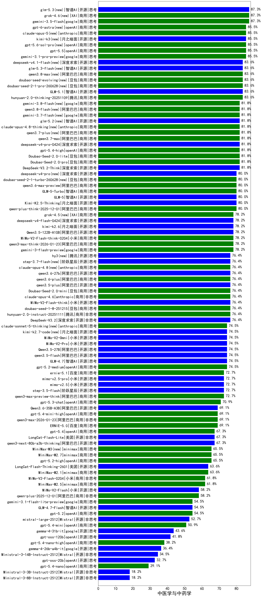

|类别|机构|大模型|【中医学与中药学】准确率|平均耗时|平均消耗token|花费/千次（元）|排名（准确率）|
|---|---|-----|-------------------|-------|-----------|-----------|-----------|
|商用|google|gemini-3.1-pro-preview(new)|85.5%|42s|1710|141.4|1|
|商用|百度|ERNIE-4.5-Turbo-32K|84.5%|22s|557|1.7|2|
|商用|腾讯|hunyuan-2.0-thinking-20251109|83.6%|14s|961|3.7|3|
|商用|豆包|doubao-seed-1-6-251015|81.8%|26s|794|5.7|4|
|开源|深度求索|DeepSeek-V3.2-Think(new)|81.8%|85s|1106|3.3|5|
|开源|阿里巴巴|qwen3-235b-a22b-thinking-2507|81.8%|97s|2674|52.3|6|
|商用|腾讯|hunyuan-t1-20250711|81.8%|28s|1693|6.5|7|
|商用|豆包|Doubao-Seed-2.0-pro(new)|81.8%|250s|1135|16.8|8|
|商用|豆包|Doubao-Seed-2.0-lite(new)|81.8%|208s|971|3.2|9|
|商用|百度|ERNIE-X1-Turbo-32K|80.5%|89s|1844|7.2|10|
|开源|智谱AI|GLM-5(new)|80.0%|68s|2155|37.9|11|
|商用|豆包|doubao-seed-1-6-lite-251015|80.0%|57s|793|1.7|12|
|开源|月之暗面|Kimi-K2.5-Thinking(new)|80.0%|341s|1672|34.1|13|
|商用|豆包|doubao-seed-1-6-thinking-250715|80.0%|24s|1505|11.6|14|
|商用|阿里巴巴|qwen-plus-think-2025-12-01(new)|80.0%|66s|2869|22.5|15|
|商用|小米|MiMo-V2-Flash-think-0204(new)|78.2%|523s|1939|4.0|16|
|商用|google|gemini-3-pro-preview(new)|78.2%|51s|1879|155.8|17|
|商用|阿里巴巴|qwen3-max-think-2026-01-23(new)|78.2%|213s|2938|28.9|18|
|商用|google|gemini-3-flash-preview(new)|78.2%|66s|1218|24.9|19|
|商用|豆包|doubao-seed-1-6-250615|77.3%|128s|506|3.4|20|
|商用|豆包|doubao-seed-1-8-251215(new)|76.4%|30s|689|4.8|21|
|开源|深度求索|DeepSeek-V3.2(new)|76.4%|86s|386|1.1|22|
|开源|深度求索|DeepSeek-R1-0528|76.4%|227s|1772|27.6|23|
|开源|小米|MiMo-V2-Flash-think(new)|76.4%|36s|2111|0.0|24|
|商用|anthropic|claude-opus-4.6(new)|76.4%|17s|573|88.2|25|
|商用|豆包|Doubao-Seed-2.0-mini(new)|76.4%|399s|2383|4.6|26|
|开源|阿里巴巴|qwen3.5-plus(new)|76.4%|42s|3270|15.4|27|
|商用|腾讯|hunyuan-2.0-instruct-20251111|76.4%|4s|384|0.6|28|
|开源|月之暗面|kimi-k2-0711-preview|75.5%|22s|402|5.7|29|
|开源|智谱AI|GLM-4.7(new)|74.5%|70s|2260|31.0|30|
|商用|openAI|gpt-5.2-medium(new)|74.5%|11s|491|42.6|31|
|商用|google|gemini-2.5-pro|74.5%|42s|2498|177.2|32|
|商用|阿里巴巴|qwen-plus-think-2025-07-28|74.5%|/|2872|22.5|33|
|开源|minimax|MiniMax-M1|74.5%|183s|3032|21.1|34|
|开源|深度求索|DeepSeek-V3.1|74.5%|15s|311|3.3|35|
|开源|百度|ERNIE-4.5-300B-A47B|74.1%|25s|321|2.2|36|
|开源|深度求索|DeepSeek-V3.1-Think|72.7%|54s|1057|12.2|37|
|开源|阶跃星辰|step-3.5-flash(new)|72.7%|20s|1920|3.9|38|
|商用|阿里巴巴|qwen3-max-preview-think(new)|72.7%|161s|2546|59.9|39|
|开源|深度求索|DeepSeek-V3.2-Exp-Think|72.7%|281s|1167|3.4|40|
|商用|anthropic|claude-opus-4.5(new)|72.7%|13s|606|95.7|41|
|商用|豆包|Doubao-1.5-lite-32k-250115|72.3%|2s|193|0.1|42|
|商用|百度|ERNIE-X1.1-Preview|70.9%|136s|1165|4.5|43|
|商用|豆包|doubao-seed-1-6-flash-thinking-250615|69.5%|7s|565|0.7|44|
|商用|豆包|doubao-seed-1-6-flash-250615|69.1%|4s|321|0.4|45|
|商用|阿里巴巴|qwen3-max-preview|69.1%|11s|463|9.9|46|
|商用|百度|ERNIE-5.0(new)|69.1%|150s|1925|45.3|47|
|商用|阿里巴巴|qwen3-max-2026-01-23(new)|69.1%|35s|410|3.6|48|
|商用|腾讯|hunyuan-turbos-20250926|69.1%|13s|577|1.0|49|
|开源|阿里巴巴|Qwen3-32B|67.7%|34s|1307|5.0|50|
|开源|深度求索|DeepSeek-V3.2-Exp|67.3%|267s|342|1.0|51|
|开源|美团|LongCat-Flash-Lite(new)|67.3%|263s|455|0.0|52|
|开源|阿里巴巴|qwen3-next-80b-a3b-thinking|67.3%|124s|3833|15.1|53|
|商用|百度|ERNIE-5.0-Thinking-Preview|67.3%|224s|1871|44.0|54|
|商用|科大讯飞|xunfei-spark-x1-0725|67.3%|/|814|9.8|55|
|开源|阿里巴巴|qwen3-235b-a22b-instruct-2507|67.3%|12s|483|3.5|56|
|商用|anthropic|claude-sonnet-4.5-thinking|67.3%|24s|1548|158.4|57|
|商用|XAI|grok-4-0709|66.4%|199s|1516|159.1|58|
|商用|阿里巴巴|qwen3-max-2025-09-23|65.5%|264s|438|9.3|59|
|开源|阶跃星辰|step-3|65.5%|106s|2078|8.1|60|
|开源|豆包|Seed-OSS-36B-Instruct|65.5%|106s|1959|7.7|61|
|商用|openAI|gpt-5.2-high(new)|65.5%|15s|646|58.0|62|
|商用|阿里巴巴|qwen-plus-2025-07-28|65.5%|14s|504|0.9|63|
|开源|阿里巴巴|Qwen3-30B-A3B-Thinking-2507|64.5%|65s|2680|7.4|64|
|商用|阿里巴巴|qwen-long-2025-01-25|64.1%|67s|300|0.5|65|
|开源|月之暗面|kimi-k2-0905|63.6%|49s|298|3.8|66|
|商用|minimax|MiniMax-M2.1(new)|63.6%|73s|1842|14.9|67|
|商用|anthropic|claude-4-sonnet|63.6%|43s|498|45.9|68|
|开源|阿里巴巴|Qwen3-14B|62.7%|37s|1595|3.1|69|
|开源|百度|ERNIE-4.5-21B-A3B|62.7%|47s|314|0.0|70|
|商用|minimax|MiniMax-M2.5(new)|61.8%|31s|1443|11.5|71|
|商用|anthropic|claude-sonnet-4.5(new)|61.8%|10s|582|55.8|72|
|开源|智谱AI|GLM-4.5-Air|61.8%|31s|1547|9.0|73|
|开源|智谱AI|GLM-4.6|61.8%|52s|2371|32.5|74|
|商用|小米|MiMo-V2-Flash-0204(new)|61.8%|204s|476|0.9|75|
|开源|阿里巴巴|qwen3-next-80b-a3b-instruct|61.8%|9s|544|2.0|76|
|商用|openAI|gpt-5.1-medium|61.8%|164s|725|47.1|77|
|开源|腾讯|Hunyuan-A13B-Instruct|60.5%|58s|1404|5.4|78|
|开源|meta|Llama-4-Maverick-17B-128E-Instruct-FP8|60.5%|8s|560|2.2|79|
|开源|minimax|MiniMax-Text-01|60.5%|13s|895|7.2|80|
|开源|智谱AI|GLM-4.5-nothink|60.0%|26s|782|10.2|81|
|开源|智谱AI|GLM-4.5|60.0%|43s|1588|21.6|82|
|商用|阿里巴巴|qwen-flash-think-2025-07-28|60.0%|24s|2587|3.8|83|
|开源|美团|LongCat-Flash-Thinking-2601(new)|60.0%|358s|3529|0.0|84|
|商用|anthropic|claude-4-sonnet-thinking|59.1%|49s|1096|111.0|85|
|商用|阿里巴巴|qwen-plus-2025-12-01(new)|58.2%|26s|932|1.8|86|
|开源|小米|MiMo-V2-Flash(new)|58.2%|87s|424|0.0|87|
|商用|openAI|gpt-5.1-high|58.2%|78s|1990|136.9|88|
|开源|月之暗面|Kimi-K2-Thinking|58.2%|190s|2986|47.1|89|
|商用|智谱AI|GLM-4.5-Flash|58.2%|29s|1532|0.0|90|
|商用|百川智能|Baichuan4-Turbo|57.7%|/|/|/|91|
|开源|阿里巴巴|Qwen3-8B|57.3%|213s|5891|0.0|92|
|开源|阿里巴巴|Qwen3-30B-A3B-Instruct-2507|56.4%|4s|523|1.4|93|
|商用|阿里巴巴|qwen-turbo-think-2025-07-15|56.4%|/|2439|7.1|94|
|商用|google|gemini-2.5-flash|54.5%|13s|2044|36.1|95|
|开源|智谱AI|GLM-4.7-Flash(new)|54.5%|1524s|6036|0.0|96|
|商用|openAI|gpt-5-2025-08-07|54.5%|46s|268|15.3|97|
|开源|minimax|MiniMax-M2|54.5%|34s|1907|15.4|98|
|开源|腾讯|Hunyuan-A13B-Instruct-nothink|54.5%|55s|377|1.3|99|
|商用|openAI|gpt-5.2(new)|54.5%|4s|161|9.9|100|
|开源|智谱AI|GLM-4.5-Air-nothink|54.5%|18s|1051|6.0|101|
|开源|深度求索|DeepSeek-R1-0528-Qwen3-8B|53.6%|264s|1689|0.0|102|
|商用|360|360zhinao2-o1|52.7%|/|/|/|103|
|开源|Mistral|mistral-large-2512(new)|52.7%|14s|497|4.8|104|
|商用|百川智能|Baichuan4-Air|50.9%|/|/|/|105|
|开源|阿里巴巴|Qwen3-14B-nothink|50.9%|15s|562|1.0|106|
|商用|阿里巴巴|qwen-turbo-2025-07-15|50.9%|8s|370|0.2|107|
|开源|阿里巴巴|Qwen3-4B|49.5%|23s|1821|5.3|108|
|商用|Mistral|mistral-medium-2508|49.1%|90s|459|5.8|109|
|商用|智谱AI|GLM-4.5-Flash-nothink|49.1%|20s|1055|0.0|110|
|商用|openAI|gpt-5.1|49.1%|229s|155|6.6|111|
|开源|阿里巴巴|Qwen3-32B-nothink|49.1%|51s|498|1.8|112|
|商用|XAI|grok-3-mini|48.2%|224s|1047|3.7|113|
|商用|阿里巴巴|qwen-flash-2025-07-28|47.3%|7s|517|0.7|114|
|商用|anthropic|claude-haiku-4.5-thinking|47.3%|42s|2788|97.3|115|
|开源|阿里巴巴|Qwen3-8B-nothink|47.3%|60s|504|0.0|116|
|商用|百度|ERNIE-Lite-8K|46.8%|/|/|/|117|
|开源|meta|Llama-4-Scout-17B-16E-Instruct|45.9%|10s|539|1.1|118|
|开源|阿里巴巴|Qwen3-4B-nothink|45.5%|18s|466|1.2|119|
|开源|智谱AI|GLM-4-9B-0414|44.5%|11s|476|0.0|120|
|商用|XAI|grok-4-1-fast-reasoning|43.6%|29s|1384|4.5|121|
|商用|google|gemini-2.5-flash-lite|43.6%|3s|471|1.2|122|
|商用|openAI|o4-mini|41.8%|40s|1410|43.3|123|
|开源|openAI|gpt-oss-120b|41.8%|28s|681|1.9|124|
|商用|anthropic|claude-haiku-4.5|41.8%|21s|566|17.6|125|
|开源|阿里巴巴|Qwen3-1.7B|39.1%|20s|1895|5.5|126|
|开源|Mistral|Ministral-3-14B-Instruct-2512(new)|34.5%|8s|488|0.7|127|
|商用|openAI|gpt-5-nano-high|34.5%|633s|5689|16.3|128|
|开源|Mistral|Magistral-Small-2507|32.7%|190s|5277|56.8|129|
|开源|阿里巴巴|Qwen3-0.6B-nothink|32.7%|11s|228|0.5|130|
|商用|XAI|grok-4-1-fast-non-reasoning|32.7%|46s|600|1.6|131|
|开源|openAI|gpt-oss-20b|32.7%|58s|1809|2.0|132|
|开源|Mistral|Mistral-Small-3.2-24B-Instruct-2506|32.7%|180s|433|0.8|133|
|商用|openAI|gpt-5-mini-2025-08-07|32.7%|60s|1243|17.1|134|
|商用|openAI|gpt-5-mini-high|30.9%|434s|3255|46.3|135|
|商用|openAI|gpt-5-nano-2025-08-07|30.9%|55s|2599|7.4|136|
|开源|google|gemma-3-27b-it|30.0%|/|/|/|137|
|开源|阿里巴巴|Qwen3-0.6B|25.4%|8s|1090|3.1|138|
|开源|google|gemma-3-12b-it|25.0%|/|/|/|139|
|开源|阿里巴巴|Qwen3-1.7B-nothink|23.6%|12s|451|1.2|140|
|开源|google|gemma-3-4b-it|23.2%|/|/|/|141|
|开源|百度|ERNIE-4.5-0.3B|19.6%|51s|374|0.0|142|
|开源|Mistral|Ministral-3-3B-Instruct-2512(new)|18.2%|6s|529|0.4|143|
|开源|Mistral|Ministral-3-8B-Instruct-2512(new)|18.2%|8s|474|0.5|144|

