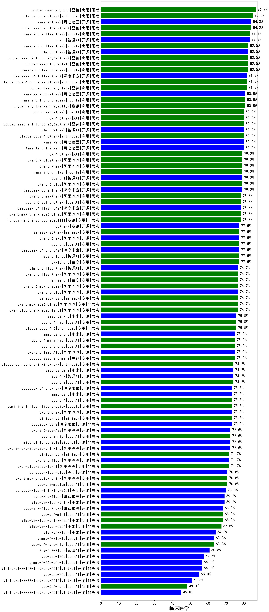

|类别|机构|大模型|【临床医学】准确率|平均耗时|平均消耗token|花费/千次（元）|排名（准确率）|
|---|---|-----|-------------------|-------|-----------|-----------|-----------|
|商用|豆包|Doubao-Seed-2.0-pro(new)|86.7%|243s|1027|15.1|1|
|商用|百度|ERNIE-4.5-Turbo-32K(new)|84.4%|20s|513|1.5|2|
|开源|智谱AI|GLM-5(new)|83.3%|118s|2043|35.9|3|
|商用|google|gemini-3-flash-preview(new)|82.5%|60s|1290|26.3|4|
|商用|豆包|doubao-seed-1-6-251015(new)|82.5%|25s|704|5.0|5|
|商用|豆包|doubao-seed-1-8-251215(new)|82.5%|29s|699|4.8|6|
|商用|豆包|Doubao-Seed-2.0-lite(new)|81.7%|199s|906|2.9|7|
|商用|腾讯|hunyuan-2.0-thinking-20251109(new)|80.8%|12s|872|3.3|8|
|商用|google|gemini-3.1-pro-preview(new)|80.8%|35s|1476|121.2|9|
|开源|月之暗面|Kimi-K2.5-Thinking(new)|80.0%|364s|1941|39.7|10|
|开源|月之暗面|kimi-k2.6(new)|80.0%|109s|2184|57.7|11|
|开源|深度求索|DeepSeek-V3.2-Think(new)|79.2%|119s|1167|3.4|12|
|商用|阿里巴巴|qwen3.6-plus(new)|79.2%|32s|1551|17.9|13|
|开源|智谱AI|GLM-5.1(new)|79.2%|156s|1507|35.0|14|
|开源|阿里巴巴|qwen3-235b-a22b-thinking-2507(new)|79.2%|110s|2445|47.7|15|
|商用|腾讯|hunyuan-2.0-instruct-20251111(new)|78.3%|7s|404|0.7|16|
|商用|阿里巴巴|qwen3-max-think-2026-01-23(new)|78.3%|173s|2970|29.2|17|
|商用|百度|ERNIE-X1.1-Preview(new)|78.3%|124s|926|3.5|18|
|商用|百度|ERNIE-X1-Turbo-32K(new)|78.1%|118s|2005|7.9|19|
|开源|阿里巴巴|qwen3-235b-a22b-instruct-2507(new)|77.5%|11s|477|3.4|20|
|商用|腾讯|hunyuan-turbos-20250926(new)|77.5%|14s|595|1.1|21|
|商用|百度|ERNIE-5.0(new)|77.5%|143s|1995|46.9|22|
|商用|智谱AI|GLM-5-Turbo(new)|77.5%|41s|1488|31.7|23|
|商用|阿里巴巴|qwen-plus-think-2025-12-01(new)|76.7%|58s|2420|18.9|24|
|开源|阿里巴巴|qwen3.5-plus(new)|76.7%|35s|2786|13.1|25|
|开源|深度求索|DeepSeek-V3.1(new)|76.7%|17s|322|3.4|26|
|商用|minimax|MiniMax-M2.5(new)|76.7%|26s|1362|10.9|27|
|商用|阿里巴巴|qwen3.6-max-preview(new)|76.7%|50s|1561|81.3|28|
|商用|阿里巴巴|qwen3-max-2026-01-23(new)|76.7%|44s|522|4.7|29|
|商用|阿里巴巴|qwen3-max-preview(new)|75.8%|9s|450|9.6|30|
|商用|腾讯|hunyuan-t1-20250711(new)|75.8%|33s|1950|7.5|31|
|商用|openAI|gpt-5.4-high(new)|75.8%|14s|624|58.8|32|
|商用|anthropic|claude-opus-4.6(new)|75.8%|15s|611|93.5|33|
|商用|小米|MiMo-V2-Pro(new)|75.8%|212s|1058|17.9|34|
|商用|小米|mimo-v2.5-pro(new)|75.0%|23s|1224|21.3|35|
|商用|豆包|Doubao-Seed-2.0-mini(new)|75.0%|391s|2407|4.6|36|
|开源|阿里巴巴|Qwen3.5-122B-A10B(new)|75.0%|253s|2943|18.5|37|
|商用|openAI|gpt-5.3-chat(new)|75.0%|16s|372|29.8|38|
|商用|openAI|gpt-5.4-mini-high(new)|75.0%|35s|941|27.6|39|
|商用|小米|MiMo-V2-Omni(new)|74.2%|139s|1188|13.1|40|
|开源|智谱AI|GLM-4.7(new)|74.2%|63s|2228|30.5|41|
|商用|anthropic|claude-opus-4.5(new)|74.2%|14s|651|102.2|42|
|商用|openAI|gpt-5.2(new)|74.2%|5s|198|12.9|43|
|开源|月之暗面|Kimi-K2-Thinking(new)|74.2%|135s|2059|32.2|44|
|商用|google|gemini-2.5-pro(new)|73.5%|34s|2266|160.0|45|
|商用|minimax|MiniMax-M2.1(new)|73.3%|76s|1214|9.6|46|
|商用|小米|mimo-v2.5(new)|73.3%|22s|1273|14.4|47|
|商用|阿里巴巴|qwen3-max-2025-09-23(new)|73.3%|178s|478|10.2|48|
|商用|openAI|gpt-5.4(new)|73.3%|7s|262|20.7|49|
|商用|openAI|gpt-5.1-high(new)|73.3%|96s|1011|66.9|50|
|商用|google|gemini-3.1-flash-lite-preview(new)|73.3%|18s|356|3.2|51|
|开源|阿里巴巴|Qwen3.5-27B(new)|73.3%|279s|2978|14.0|52|
|商用|anthropic|claude-sonnet-4.5-thinking(new)|73.3%|23s|1584|161.4|53|
|开源|深度求索|DeepSeek-V3.2(new)|73.3%|45s|322|0.9|54|
|开源|月之暗面|kimi-k2-0905(new)|73.3%|84s|359|4.7|55|
|商用|豆包|doubao-seed-1-6-lite-251015(new)|73.3%|62s|817|1.8|56|
|开源|阿里巴巴|qwen3-next-80b-a3b-thinking(new)|72.5%|98s|3435|13.5|57|
|商用|openAI|gpt-5.2-high(new)|72.5%|10s|448|37.7|58|
|开源|豆包|Seed-OSS-36B-Instruct(new)|72.5%|111s|2013|7.9|59|
|商用|anthropic|claude-sonnet-4.5(new)|72.5%|11s|579|54.6|60|
|开源|Mistral|mistral-large-2512(new)|72.5%|12s|521|4.9|61|
|开源|阿里巴巴|Qwen3.6-35B-A3B(new)|72.5%|84s|1780|18.6|62|
|开源|深度求索|DeepSeek-R1-0528(new)|72.3%|224s|1803|28.1|63|
|开源|阿里巴巴|qwen3.5-flash(new)|71.7%|271s|3134|6.1|64|
|商用|阿里巴巴|qwen-plus-2025-12-01(new)|71.7%|21s|801|1.5|65|
|开源|阿里巴巴|qwen3-next-80b-a3b-instruct(new)|71.7%|8s|524|1.9|66|
|开源|深度求索|DeepSeek-V3.1-Think(new)|71.7%|50s|966|11.1|67|
|商用|minimax|MiniMax-M2.7(new)|71.7%|46s|1836|14.8|68|
|开源|阿里巴巴|Qwen3-14B(new)|71.2%|40s|1507|2.9|69|
|开源|阿里巴巴|Qwen3-32B(new)|71.2%|42s|1517|5.9|70|
|商用|openAI|gpt-5-2025-08-07(new)|70.8%|26s|289|16.4|71|
|开源|智谱AI|GLM-4.5-Air(new)|70.8%|32s|1570|9.1|72|
|商用|阿里巴巴|qwen3-max-preview-think(new)|70.8%|169s|2358|55.3|73|
|开源|美团|LongCat-Flash-Lite(new)|70.8%|278s|516|0.0|74|
|商用|openAI|gpt-5.2-medium(new)|70.8%|7s|333|26.3|75|
|商用|openAI|gpt-5.1-medium(new)|70.0%|142s|453|27.3|76|
|开源|美团|LongCat-Flash-Thinking-2601(new)|70.0%|161s|2143|0.0|77|
|开源|小米|MiMo-V2-Flash-think(new)|69.2%|102s|2046|0.0|78|
|开源|阶跃星辰|step-3.5-flash(new)|69.2%|21s|1800|3.7|79|
|商用|XAI|grok-4-1-fast-reasoning(new)|69.2%|62s|1244|3.9|80|
|商用|openAI|gpt-5.4-mini(new)|68.3%|32s|212|4.6|81|
|商用|智谱AI|GLM-4.5-Flash(new)|68.3%|34s|1520|0.0|82|
|商用|google|gemini-2.5-flash(new)|68.3%|10s|1739|30.4|83|
|商用|小米|MiMo-V2-Flash-think-0204(new)|68.3%|704s|2008|4.1|84|
|商用|anthropic|claude-4-sonnet(new)|67.5%|43s|549|50.1|85|
|开源|阿里巴巴|Qwen3-30B-A3B-Thinking-2507(new)|67.5%|69s|2816|7.7|86|
|商用|小米|MiMo-V2-Flash-0204(new)|67.5%|201s|510|0.9|87|
|商用|百度|ERNIE-5.0-Thinking-Preview(new)|67.5%|259s|1879|44.1|88|
|商用|openAI|gpt-5.1(new)|67.5%|176s|199|9.3|89|
|商用|百川智能|Baichuan4-Turbo(new)|67.3%|/|/|/|90|
|商用|阿里巴巴|qwen-turbo-2025-07-15(new)|66.7%|7s|344|0.2|91|
|商用|阿里巴巴|qwen-turbo-think-2025-07-15(new)|66.7%|/|2376|6.9|92|
|商用|anthropic|claude-4-sonnet-thinking(new)|66.2%|36s|554|51.9|93|
|开源|阿里巴巴|Qwen3-32B-nothink(new)|65.8%|65s|497|1.8|94|
|商用|anthropic|claude-haiku-4.5-thinking(new)|64.2%|45s|2432|84.1|95|
|开源|阿里巴巴|Qwen3-30B-A3B-Instruct-2507(new)|64.2%|5s|533|1.4|96|
|开源|小米|MiMo-V2-Flash(new)|64.2%|67s|422|0.0|97|
|商用|阿里巴巴|qwen-flash-think-2025-07-28(new)|63.3%|27s|2793|4.1|98|
|开源|google|gemma-4-31b-it(new)|63.3%|69s|513|1.3|99|
|商用|openAI|gpt-5.4-nano-high(new)|63.3%|26s|505|3.8|100|
|开源|智谱AI|GLM-4.5-Air-nothink(new)|62.5%|15s|909|5.1|101|
|开源|阿里巴巴|Qwen3-14B-nothink(new)|62.5%|13s|523|0.9|102|
|开源|meta|Llama-4-Scout-17B-16E-Instruct(new)|62.5%|10s|526|1.0|103|
|商用|openAI|gpt-5-mini-2025-08-07(new)|61.7%|60s|813|10.8|104|
|商用|阿里巴巴|qwen-flash-2025-07-28(new)|61.7%|7s|500|0.7|105|
|开源|阿里巴巴|Qwen3-4B(new)|61.2%|29s|1852|5.4|106|
|开源|阿里巴巴|Qwen3-8B(new)|61.0%|323s|8866|0.0|107|
|商用|openAI|gpt-5-mini-high(new)|60.8%|615s|2001|28.0|108|
|商用|智谱AI|GLM-4.5-Flash-nothink(new)|60.8%|19s|943|0.0|109|
|开源|智谱AI|GLM-4.7-Flash(new)|60.8%|927s|3724|0.0|110|
|商用|openAI|gpt-5-nano-2025-08-07(new)|60.0%|61s|1717|4.8|111|
|商用|openAI|gpt-5-nano-high(new)|59.2%|552s|4197|12.0|112|
|商用|anthropic|claude-haiku-4.5(new)|59.2%|17s|602|18.6|113|
|商用|openAI|o4-mini(new)|59.2%|32s|819|24.2|114|
|开源|openAI|gpt-oss-120b(new)|57.5%|34s|646|1.8|115|
|开源|Mistral|Ministral-3-14B-Instruct-2512(new)|56.7%|8s|560|0.8|116|
|开源|google|gemma-4-26b-a4b-it(new)|56.7%|54s|556|1.4|117|
|开源|openAI|gpt-oss-20b(new)|55.0%|36s|933|1.0|118|
|开源|阿里巴巴|Qwen3-8B-nothink(new)|54.2%|73s|494|0.0|119|
|开源|智谱AI|GLM-4-9B-0414(new)|53.8%|10s|426|0.0|120|
|商用|google|gemini-2.5-flash-lite(new)|51.7%|7s|574|1.5|121|
|开源|Mistral|Ministral-3-8B-Instruct-2512(new)|50.8%|9s|615|0.7|122|
|商用|XAI|grok-4-1-fast-non-reasoning(new)|50.8%|56s|619|1.7|123|
|开源|阿里巴巴|Qwen3-4B-nothink(new)|50.0%|15s|419|1.1|124|
|商用|openAI|gpt-5.4-nano(new)|48.3%|42s|225|1.4|125|
|开源|Mistral|Ministral-3-3B-Instruct-2512(new)|45.0%|6s|590|0.4|126|

