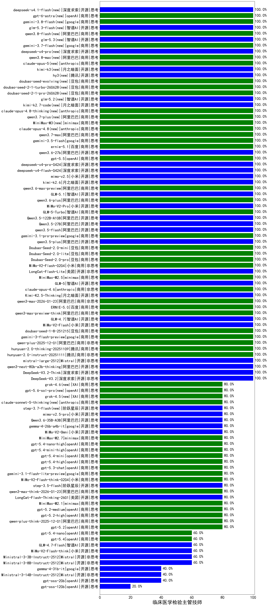

|类别|机构|大模型|【临床医学检验主管技师】准确率|平均耗时|平均消耗token|花费/千次（元）|排名（准确率）|
|---|---|-----|-------------------|-------|-----------|-----------|-----------|
|商用|阿里巴巴|qwen-flash-think-2025-07-28|100.0%|23s|2270|3.3|1|
|开源|深度求索|DeepSeek-V3.1-Think|100.0%|40s|767|8.6|2|
|商用|豆包|doubao-seed-1-6-lite-251015|100.0%|32s|835|1.8|3|
|商用|豆包|doubao-seed-1-6-251015|100.0%|10s|853|6.1|4|
|开源|智谱AI|GLM-4.6|100.0%|51s|2193|29.9|5|
|商用|腾讯|hunyuan-turbos-20250926|100.0%|17s|699|1.3|6|
|开源|豆包|Seed-OSS-36B-Instruct|100.0%|115s|1346|5.2|7|
|商用|阿里巴巴|qwen3-max-preview|100.0%|14s|660|14.3|8|
|商用|阿里巴巴|qwen-turbo-think-2025-07-15|100.0%|/|2211|6.4|9|
|商用|阿里巴巴|qwen-plus-2025-07-28|100.0%|19s|615|1.1|10|
|开源|深度求索|DeepSeek-V3.1|100.0%|20s|407|4.3|11|
|商用|google|gemini-3-pro-preview(new)|100.0%|42s|1803|147.8|12|
|商用|智谱AI|GLM-4.5-Flash-nothink|100.0%|22s|987|0.0|13|
|开源|智谱AI|GLM-4.5-Air-nothink|100.0%|14s|1101|6.2|14|
|开源|智谱AI|GLM-4.5-nothink|100.0%|32s|1029|13.6|15|
|开源|阶跃星辰|step-3|100.0%|95s|1919|7.5|16|
|开源|阿里巴巴|Qwen3-30B-A3B-Thinking-2507|100.0%|66s|2668|7.3|17|
|开源|智谱AI|GLM-4.5|100.0%|39s|2202|30.0|18|
|开源|智谱AI|GLM-4.5-Air|100.0%|31s|1642|9.5|19|
|开源|阿里巴巴|Qwen3-32B-nothink|100.0%|33s|625|2.2|20|
|开源|月之暗面|Kimi-K2-Thinking|100.0%|102s|1926|30.0|21|
|商用|百度|ERNIE-X1.1-Preview|100.0%|120s|457|1.6|22|
|商用|科大讯飞|xunfei-spark-x1-0725|100.0%|/|978|11.7|23|
|商用|google|gemini-3-flash-preview(new)|100.0%|22s|1210|24.3|24|
|商用|anthropic|claude-opus-4.6(new)|100.0%|12s|775|118.8|25|
|开源|月之暗面|Kimi-K2.5-Thinking(new)|100.0%|480s|3048|62.8|26|
|商用|阿里巴巴|qwen3-max-2026-01-23(new)|100.0%|17s|677|6.1|27|
|商用|百度|ERNIE-5.0(new)|100.0%|141s|2160|50.7|28|
|商用|阿里巴巴|qwen3-max-preview-think(new)|100.0%|215s|2433|56.8|29|
|开源|智谱AI|GLM-4.7(new)|100.0%|41s|1734|23.5|30|
|开源|小米|MiMo-V2-Flash(new)|100.0%|24s|503|0.0|31|
|商用|豆包|doubao-seed-1-8-251215(new)|100.0%|31s|775|5.4|32|
|商用|阿里巴巴|qwen-plus-2025-12-01(new)|100.0%|31s|1174|2.2|33|
|商用|百度|ERNIE-5.0-Thinking-Preview|100.0%|163s|1700|39.6|34|
|商用|腾讯|hunyuan-2.0-thinking-20251109|100.0%|13s|728|2.7|35|
|商用|腾讯|hunyuan-2.0-instruct-20251111|100.0%|8s|465|0.8|36|
|开源|Mistral|mistral-large-2512(new)|100.0%|16s|600|5.6|37|
|开源|阿里巴巴|qwen3-next-80b-a3b-thinking|100.0%|69s|2603|10.2|38|
|开源|深度求索|DeepSeek-V3.2-Think(new)|100.0%|47s|1414|4.2|39|
|开源|深度求索|DeepSeek-V3.2(new)|100.0%|53s|446|1.3|40|
|商用|阿里巴巴|qwen3-max-2025-09-23|100.0%|431s|612|13.2|41|
|商用|anthropic|claude-opus-4.5(new)|100.0%|19s|767|119.5|42|
|开源|阿里巴巴|Qwen3-14B-nothink|100.0%|23s|614|1.1|43|
|开源|智谱AI|GLM-5(new)|100.0%|353s|2247|39.4|44|
|商用|豆包|doubao-seed-1-6-thinking-250715|100.0%|40s|1397|10.6|45|
|商用|阿里巴巴|qwen-turbo-2025-07-15|100.0%|8s|472|0.3|46|
|商用|百度|ERNIE-4.5-Turbo-32K|100.0%|23s|574|1.7|47|
|开源|阿里巴巴|qwen3-235b-a22b-instruct-2507|100.0%|15s|628|4.5|48|
|开源|月之暗面|kimi-k2-0711-preview|100.0%|45s|757|11.2|49|
|商用|腾讯|hunyuan-t1-20250711|100.0%|24s|1429|5.4|50|
|商用|豆包|doubao-seed-1-6-250615|95.0%|128s|519|3.4|51|
|开源|百度|ERNIE-4.5-300B-A47B|95.0%|39s|322|2.1|52|
|商用|google|gemini-2.5-pro|95.0%|30s|2435|171.8|53|
|开源|阿里巴巴|Qwen3-32B|95.0%|24s|742|2.7|54|
|开源|meta|Llama-4-Maverick-17B-128E-Instruct-FP8|90.0%|13s|574|2.2|55|
|商用|百度|ERNIE-X1-Turbo-32K|90.0%|90s|1671|6.5|56|
|商用|anthropic|claude-4-sonnet|90.0%|47s|680|61.5|57|
|商用|anthropic|claude-4-sonnet-thinking|90.0%|57s|644|59.6|58|
|商用|豆包|doubao-seed-1-6-flash-250615|90.0%|4s|361|0.4|59|
|商用|XAI|grok-4-0709|90.0%|88s|1967|206.1|60|
|开源|minimax|MiniMax-M1|90.0%|404s|4936|36.2|61|
|商用|豆包|doubao-seed-1-6-flash-thinking-250615|90.0%|7s|660|0.8|62|
|商用|百川智能|Baichuan4-Turbo|90.0%|/|/|/|63|
|开源|阿里巴巴|Qwen3-14B|90.0%|32s|1123|2.1|64|
|商用|阿里巴巴|qwen-long-2025-01-25|85.0%|109s|455|0.8|65|
|商用|google|gemini-2.5-flash|85.0%|11s|1940|34.0|66|
|开源|百度|ERNIE-4.5-21B-A3B|85.0%|49s|344|0.0|67|
|商用|XAI|grok-4-1-fast-reasoning|80.0%|88s|1577|5.1|68|
|商用|anthropic|claude-sonnet-4.5(new)|80.0%|15s|761|72.3|69|
|商用|anthropic|claude-haiku-4.5|80.0%|12s|719|22.2|70|
|开源|月之暗面|kimi-k2-0905|80.0%|7s|578|8.1|71|
|商用|openAI|gpt-5.1-high|80.0%|141s|705|44.2|72|
|商用|minimax|MiniMax-M2.1(new)|80.0%|130s|1591|12.7|73|
|商用|anthropic|claude-sonnet-4.5-thinking|80.0%|32s|2250|231.7|74|
|开源|阶跃星辰|step-3.5-flash(new)|80.0%|26s|2546|5.2|75|
|开源|meta|Llama-4-Scout-17B-16E-Instruct|80.0%|15s|625|1.2|76|
|商用|阿里巴巴|qwen3-max-think-2026-01-23(new)|80.0%|128s|3463|34.0|77|
|商用|openAI|gpt-5-mini-high|80.0%|521s|1722|23.8|78|
|开源|阿里巴巴|Qwen3-4B|80.0%|16s|1280|3.6|79|
|商用|openAI|gpt-5.1|80.0%|317s|249|11.8|80|
|商用|openAI|gpt-5.2(new)|80.0%|6s|253|16.9|81|
|商用|阿里巴巴|qwen-plus-think-2025-12-01(new)|80.0%|62s|2579|20.0|82|
|商用|openAI|gpt-5.2-high(new)|80.0%|8s|380|29.6|83|
|商用|openAI|gpt-5.2-medium(new)|80.0%|9s|364|27.9|84|
|商用|豆包|Doubao-1.5-lite-32k-250115|80.0%|6s|210|0.1|85|
|开源|美团|LongCat-Flash-Thinking-2601(new)|80.0%|294s|3540|0.0|86|
|开源|深度求索|DeepSeek-R1-0528|80.0%|259s|2289|35.7|87|
|开源|阿里巴巴|qwen3-235b-a22b-thinking-2507|80.0%|54s|2211|42.7|88|
|商用|openAI|gpt-5.1-medium|80.0%|190s|433|24.9|89|
|开源|Mistral|Magistral-Small-2507|80.0%|181s|5661|60.8|90|
|商用|XAI|grok-3-mini|80.0%|499s|1268|4.5|91|
|开源|minimax|MiniMax-M2|80.0%|20s|1416|11.2|92|
|开源|阿里巴巴|Qwen3-30B-A3B-Instruct-2507|80.0%|8s|850|2.4|93|
|商用|阿里巴巴|qwen-flash-2025-07-28|80.0%|11s|741|1.0|94|
|商用|智谱AI|GLM-4.5-Flash|80.0%|28s|1722|0.0|95|
|开源|腾讯|Hunyuan-A13B-Instruct|80.0%|45s|1157|4.4|96|
|商用|openAI|gpt-5-mini-2025-08-07|80.0%|40s|866|11.4|97|
|商用|Mistral|mistral-medium-2508|80.0%|176s|714|9.1|98|
|商用|openAI|gpt-5-2025-08-07|80.0%|15s|317|17.4|99|
|开源|Mistral|Mistral-Small-3.2-24B-Instruct-2506|80.0%|21s|677|1.3|100|
|开源|阿里巴巴|Qwen3-8B-nothink|80.0%|166s|657|0.0|101|
|开源|阿里巴巴|Qwen3-4B-nothink|80.0%|23s|623|1.6|102|
|开源|阿里巴巴|qwen3-next-80b-a3b-instruct|80.0%|8s|679|2.5|103|
|开源|深度求索|DeepSeek-V3.2-Exp|80.0%|138s|386|1.1|104|
|开源|阿里巴巴|Qwen3-1.7B-nothink|80.0%|17s|596|1.6|105|
|开源|深度求索|DeepSeek-V3.2-Exp-Think|80.0%|138s|972|2.8|106|
|开源|阿里巴巴|Qwen3-8B|75.0%|600s|17663|0.0|107|
|商用|360|360zhinao2-o1|70.0%|/|/|/|108|
|开源|minimax|MiniMax-Text-01|70.0%|10s|906|7.3|109|
|商用|openAI|o4-mini|70.0%|27s|799|23.0|110|
|开源|google|gemma-3-27b-it|65.0%|/|/|/|111|
|开源|腾讯|Hunyuan-A13B-Instruct-nothink|60.0%|15s|462|1.6|112|
|开源|智谱AI|GLM-4.7-Flash(new)|60.0%|417s|2680|0.0|113|
|开源|小米|MiMo-V2-Flash-think(new)|60.0%|32s|2751|0.0|114|
|开源|Mistral|Ministral-3-3B-Instruct-2512(new)|60.0%|14s|789|0.6|115|
|开源|智谱AI|GLM-4-9B-0414|60.0%|13s|464|0.0|116|
|商用|anthropic|claude-haiku-4.5-thinking|60.0%|27s|3647|127.5|117|
|商用|XAI|grok-4-1-fast-non-reasoning|60.0%|91s|727|2.1|118|
|开源|Mistral|Ministral-3-8B-Instruct-2512(new)|60.0%|4s|623|0.7|119|
|商用|阿里巴巴|qwen-plus-think-2025-07-28|60.0%|/|3061|23.9|120|
|商用|google|gemini-2.5-flash-lite|60.0%|3s|638|1.7|121|
|商用|百川智能|Baichuan4-Air|55.0%|/|/|/|122|
|开源|深度求索|DeepSeek-R1-0528-Qwen3-8B|55.0%|258s|2047|0.0|123|
|开源|阿里巴巴|Qwen3-1.7B|50.0%|35s|3537|10.4|124|
|商用|百度|ERNIE-Lite-8K|50.0%|/|/|/|125|
|开源|google|gemma-3-12b-it|45.0%|/|/|/|126|
|开源|Mistral|Ministral-3-14B-Instruct-2512(new)|40.0%|6s|695|1.0|127|
|开源|openAI|gpt-oss-20b|40.0%|8s|1084|1.1|128|
|商用|openAI|gpt-5-nano-2025-08-07|40.0%|131s|1855|5.1|129|
|商用|openAI|gpt-5-nano-high|40.0%|109s|3678|10.4|130|
|开源|阿里巴巴|Qwen3-0.6B|30.0%|11s|1163|3.2|131|
|开源|google|gemma-3-4b-it|30.0%|/|/|/|132|
|开源|百度|ERNIE-4.5-0.3B|20.0%|60s|417|0.0|133|
|开源|openAI|gpt-oss-120b|20.0%|202s|809|2.3|134|
|开源|阿里巴巴|Qwen3-0.6B-nothink|20.0%|4s|328|0.7|135|

