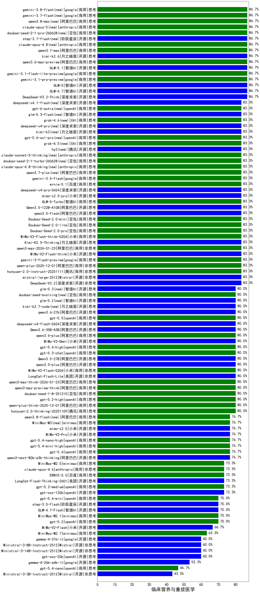

|类别|机构|大模型|【临床营养与重症医学】准确率|平均耗时|平均消耗token|花费/千次（元）|排名（准确率）|
|---|---|-----|-------------------|-------|-----------|-----------|-----------|
|商用|百度|ERNIE-4.5-Turbo-32K|90.8%|24s|545|1.6|1|
|开源|深度求索|DeepSeek-V3.2-Think(new)|86.7%|134s|1209|3.6|2|
|开源|深度求索|DeepSeek-V3.2-Exp|86.7%|334s|414|1.2|3|
|开源|深度求索|DeepSeek-V3.2-Exp-Think|86.7%|133s|983|2.9|4|
|开源|智谱AI|GLM-4.5|86.7%|76s|1886|25.6|5|
|商用|腾讯|hunyuan-turbos-20250926|86.7%|16s|672|1.2|6|
|开源|智谱AI|GLM-4.7(new)|86.7%|80s|2552|34.9|7|
|开源|月之暗面|kimi-k2-0905|86.7%|87s|407|5.4|8|
|开源|百度|ERNIE-4.5-300B-A47B|85.0%|22s|323|2.1|9|
|开源|阿里巴巴|qwen3-235b-a22b-instruct-2507|83.3%|13s|564|4.0|10|
|开源|深度求索|DeepSeek-V3.2(new)|83.3%|38s|422|1.2|11|
|商用|阿里巴巴|qwen3-max-2025-09-23|83.3%|195s|632|13.7|12|
|商用|anthropic|claude-opus-4.5(new)|83.3%|14s|751|116.9|13|
|商用|腾讯|hunyuan-t1-20250711|83.3%|29s|1686|6.4|14|
|商用|google|gemini-3-pro-preview(new)|83.3%|54s|2030|167.3|15|
|商用|豆包|doubao-seed-1-6-thinking-250715|83.3%|20s|1139|8.6|16|
|商用|anthropic|claude-sonnet-4.5(new)|83.3%|13s|630|58.3|17|
|开源|Mistral|mistral-large-2512(new)|83.3%|13s|582|5.4|18|
|开源|智谱AI|GLM-4.6|83.3%|67s|2250|30.6|19|
|开源|智谱AI|GLM-4.5-nothink|83.3%|28s|900|11.7|20|
|商用|阿里巴巴|qwen3-max-preview|83.3%|11s|508|10.7|21|
|商用|阿里巴巴|qwen-plus-2025-07-28|83.3%|15s|554|1.0|22|
|商用|豆包|doubao-seed-1-6-250615|83.3%|63s|526|3.5|23|
|开源|深度求索|DeepSeek-V3.1-Think|83.3%|47s|917|10.4|24|
|开源|小米|MiMo-V2-Flash-think(new)|83.3%|73s|2121|0.0|25|
|开源|月之暗面|Kimi-K2.5-Thinking(new)|83.3%|357s|1766|35.8|26|
|商用|腾讯|hunyuan-2.0-instruct-20251111|83.3%|13s|466|0.8|27|
|商用|google|gemini-3-flash-preview(new)|83.3%|26s|1166|23.4|28|
|商用|阿里巴巴|qwen-plus-2025-12-01(new)|83.3%|23s|924|1.7|29|
|商用|阿里巴巴|qwen3-max-2026-01-23(new)|83.3%|65s|531|4.7|30|
|商用|百川智能|Baichuan4-Turbo|80.8%|/|/|/|31|
|商用|豆包|Doubao-1.5-lite-32k-250115|80.8%|4s|196|0.1|32|
|商用|阿里巴巴|qwen-long-2025-01-25|80.0%|97s|429|0.7|33|
|商用|openAI|gpt-5.2-high(new)|80.0%|9s|419|33.2|34|
|商用|豆包|doubao-seed-1-8-251215(new)|80.0%|26s|718|4.9|35|
|商用|阿里巴巴|qwen3-max-preview-think(new)|80.0%|134s|2117|49.3|36|
|开源|阿里巴巴|qwen3-235b-a22b-thinking-2507|80.0%|141s|2470|47.9|37|
|商用|anthropic|claude-sonnet-4.5-thinking|80.0%|28s|1986|203.1|38|
|商用|阿里巴巴|qwen-turbo-2025-07-15|80.0%|8s|445|0.2|39|
|开源|阶跃星辰|step-3|80.0%|102s|1897|7.4|40|
|开源|阿里巴巴|Qwen3-14B-nothink|80.0%|16s|616|1.1|41|
|商用|阿里巴巴|qwen-plus-think-2025-12-01(new)|80.0%|54s|2291|17.7|42|
|商用|腾讯|hunyuan-2.0-thinking-20251109|80.0%|17s|851|3.2|43|
|商用|阿里巴巴|qwen3-max-think-2026-01-23(new)|80.0%|138s|2716|26.5|44|
|开源|深度求索|DeepSeek-V3.1|80.0%|22s|386|4.1|45|
|商用|阿里巴巴|qwen-plus-think-2025-07-28|80.0%|/|2785|21.7|46|
|商用|百度|ERNIE-X1-Turbo-32K|80.0%|101s|1975|7.7|47|
|商用|豆包|doubao-seed-1-6-flash-thinking-250615|80.0%|6s|548|0.7|48|
|商用|豆包|doubao-seed-1-6-251015|80.0%|40s|722|5.0|49|
|开源|阿里巴巴|Qwen3-14B|79.2%|28s|1144|2.2|50|
|开源|minimax|MiniMax-M1|79.2%|196s|2853|19.5|51|
|商用|豆包|doubao-seed-1-6-flash-250615|79.2%|4s|324|0.4|52|
|开源|阿里巴巴|Qwen3-32B|78.3%|36s|1228|4.7|53|
|开源|月之暗面|kimi-k2-0711-preview|78.3%|36s|627|9.2|54|
|商用|google|gemini-2.5-pro|78.3%|27s|2235|157.2|55|
|商用|anthropic|claude-4-sonnet|78.3%|42s|603|54.3|56|
|开源|meta|Llama-4-Maverick-17B-128E-Instruct-FP8|77.5%|8s|516|2.0|57|
|开源|深度求索|DeepSeek-R1-0528|77.5%|230s|1819|28.3|58|
|开源|月之暗面|Kimi-K2-Thinking|76.7%|226s|3866|61.0|59|
|商用|openAI|gpt-5.1-medium|76.7%|139s|535|32.0|60|
|开源|美团|LongCat-Flash-Thinking-2601(new)|76.7%|334s|2366|0.0|61|
|商用|百度|ERNIE-X1.1-Preview|76.7%|131s|904|3.4|62|
|开源|阿里巴巴|qwen3-next-80b-a3b-thinking|76.7%|144s|3468|13.6|63|
|商用|阿里巴巴|qwen-flash-think-2025-07-28|76.7%|23s|2488|3.6|64|
|商用|openAI|gpt-5-2025-08-07|76.7%|38s|301|16.1|65|
|开源|百度|ERNIE-4.5-21B-A3B|75.8%|38s|311|0.0|66|
|商用|google|gemini-2.5-flash|75.8%|10s|1694|29.5|67|
|商用|XAI|grok-4-0709|75.0%|339s|1446|149.7|68|
|商用|anthropic|claude-4-sonnet-thinking|75.0%|50s|1229|122.4|69|
|开源|minimax|MiniMax-Text-01|74.2%|13s|923|7.4|70|
|开源|meta|Llama-4-Scout-17B-16E-Instruct|74.2%|9s|545|1.1|71|
|商用|anthropic|claude-opus-4.6(new)|73.3%|16s|660|98.9|72|
|商用|百度|ERNIE-5.0-Thinking-Preview|73.3%|204s|1646|38.3|73|
|开源|minimax|MiniMax-M2|73.3%|47s|1666|13.3|74|
|商用|豆包|doubao-seed-1-6-lite-251015|73.3%|32s|946|2.1|75|
|开源|阿里巴巴|Qwen3-30B-A3B-Instruct-2507|73.3%|5s|627|1.7|76|
|开源|阿里巴巴|Qwen3-30B-A3B-Thinking-2507|73.3%|63s|2693|7.4|77|
|开源|阿里巴巴|qwen3-next-80b-a3b-instruct|73.3%|11s|624|2.2|78|
|商用|阿里巴巴|qwen-turbo-think-2025-07-15|73.3%|/|2573|7.5|79|
|商用|XAI|grok-4-1-fast-reasoning|73.3%|43s|1699|5.5|80|
|开源|openAI|gpt-oss-120b|73.3%|5s|677|1.8|81|
|商用|openAI|gpt-5.2-medium(new)|73.3%|7s|353|26.7|82|
|商用|百度|ERNIE-5.0(new)|73.3%|211s|3827|90.6|83|
|商用|阿里巴巴|qwen-flash-2025-07-28|73.3%|10s|774|1.0|84|
|商用|openAI|gpt-5.1-high|73.3%|102s|927|59.8|85|
|开源|腾讯|Hunyuan-A13B-Instruct|72.5%|67s|1027|3.9|86|
|开源|深度求索|DeepSeek-R1-0528-Qwen3-8B|71.7%|230s|1705|0.0|87|
|商用|openAI|o4-mini|71.7%|32s|817|23.7|88|
|商用|360|360zhinao2-o1|71.7%|/|/|/|89|
|商用|XAI|grok-3-mini|71.7%|168s|1120|3.9|90|
|商用|智谱AI|GLM-4.5-Flash-nothink|70.0%|22s|973|0.0|91|
|开源|阿里巴巴|Qwen3-32B-nothink|70.0%|43s|617|2.2|92|
|商用|openAI|gpt-5.2(new)|70.0%|6s|254|16.8|93|
|开源|智谱AI|GLM-4.5-Air-nothink|70.0%|13s|943|5.2|94|
|开源|豆包|Seed-OSS-36B-Instruct|70.0%|93s|1622|6.3|95|
|开源|智谱AI|GLM-4.5-Air|70.0%|37s|1834|10.6|96|
|商用|智谱AI|GLM-4.5-Flash|70.0%|33s|1806|0.0|97|
|开源|阿里巴巴|Qwen3-8B-nothink|70.0%|28s|578|0.0|98|
|商用|科大讯飞|xunfei-spark-x1-0725|70.0%|/|1139|13.7|99|
|商用|minimax|MiniMax-M2.1(new)|70.0%|104s|1545|12.3|100|
|开源|智谱AI|GLM-4.7-Flash(new)|70.0%|1040s|6565|0.0|101|
|开源|阶跃星辰|step-3.5-flash(new)|70.0%|19s|1932|3.9|102|
|开源|阿里巴巴|Qwen3-4B|68.3%|20s|1344|3.8|103|
|开源|小米|MiMo-V2-Flash(new)|66.7%|69s|531|0.0|104|
|商用|anthropic|claude-haiku-4.5-thinking|66.7%|43s|2772|95.8|105|
|商用|openAI|gpt-5.1|66.7%|158s|263|12.6|106|
|商用|google|gemini-2.5-flash-lite|66.7%|3s|567|1.5|107|
|开源|阿里巴巴|Qwen3-8B|65.8%|543s|9187|0.0|108|
|开源|智谱AI|GLM-4-9B-0414|64.2%|12s|462|0.0|109|
|商用|Mistral|mistral-medium-2508|63.3%|20s|574|7.0|110|
|开源|Mistral|Mistral-Small-3.2-24B-Instruct-2506|63.3%|235s|559|1.1|111|
|商用|anthropic|claude-haiku-4.5|63.3%|17s|657|20.0|112|
|商用|openAI|gpt-5-mini-2025-08-07|63.3%|49s|955|12.6|113|
|商用|openAI|gpt-5-nano-high|63.3%|469s|4595|13.1|114|
|商用|openAI|gpt-5-mini-high|63.3%|414s|1940|26.9|115|
|商用|openAI|gpt-5-nano-2025-08-07|63.3%|46s|1635|4.5|116|
|开源|Mistral|Ministral-3-14B-Instruct-2512(new)|60.0%|7s|577|0.8|117|
|开源|Mistral|Ministral-3-8B-Instruct-2512(new)|60.0%|10s|683|0.7|118|
|开源|openAI|gpt-oss-20b|60.0%|18s|1119|1.2|119|
|商用|XAI|grok-4-1-fast-non-reasoning|60.0%|72s|667|1.8|120|
|商用|百川智能|Baichuan4-Air|57.5%|/|/|/|121|
|开源|阿里巴巴|Qwen3-4B-nothink|56.7%|19s|531|1.4|122|
|开源|腾讯|Hunyuan-A13B-Instruct-nothink|56.7%|89s|413|1.4|123|
|开源|google|gemma-3-27b-it|53.3%|/|/|/|124|
|开源|阿里巴巴|Qwen3-1.7B|53.3%|19s|1732|5.0|125|
|开源|Mistral|Magistral-Small-2507|50.0%|76s|5659|60.7|126|
|商用|百度|ERNIE-Lite-8K|48.3%|/|/|/|127|
|开源|google|gemma-3-12b-it|48.3%|/|/|/|128|
|开源|阿里巴巴|Qwen3-0.6B|45.0%|7s|1149|3.2|129|
|开源|Mistral|Ministral-3-3B-Instruct-2512(new)|43.3%|9s|694|0.5|130|
|开源|阿里巴巴|Qwen3-1.7B-nothink|40.0%|14s|540|1.4|131|
|开源|google|gemma-3-4b-it|35.0%|/|/|/|132|
|开源|阿里巴巴|Qwen3-0.6B-nothink|26.7%|11s|274|0.6|133|
|开源|百度|ERNIE-4.5-0.3B|23.3%|27s|383|0.0|134|

