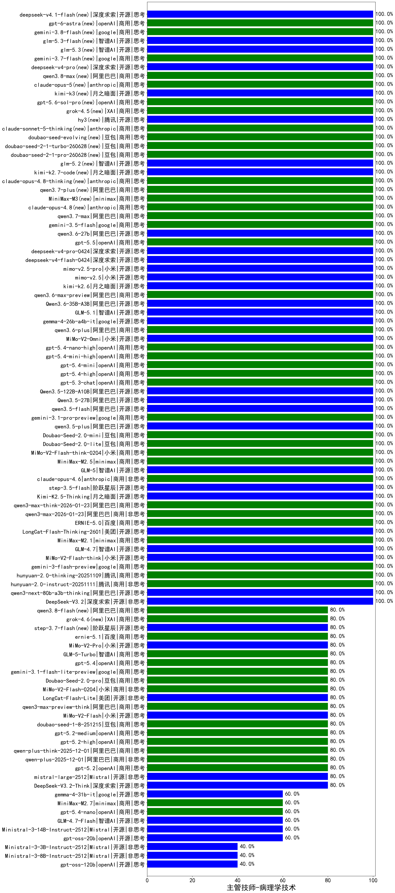

|类别|机构|大模型|【主管技师-病理学技术】准确率|平均耗时|平均消耗token|花费/千次（元）|排名（准确率）|
|---|---|-----|-------------------|-------|-----------|-----------|-----------|
|商用|阿里巴巴|qwen-flash-think-2025-07-28|100.0%|20s|2076|3.0|1|
|商用|openAI|gpt-5.1-high|100.0%|156s|1010|67.1|2|
|商用|anthropic|claude-haiku-4.5-thinking|100.0%|34s|1543|52.1|3|
|商用|openAI|gpt-5.1|100.0%|98s|179|8.1|4|
|商用|豆包|doubao-seed-1-6-lite-251015|100.0%|30s|717|1.5|5|
|商用|豆包|doubao-seed-1-6-251015|100.0%|6s|641|4.5|6|
|开源|智谱AI|GLM-4.6|100.0%|65s|2075|28.4|7|
|商用|腾讯|hunyuan-turbos-20250926|100.0%|13s|539|1.0|8|
|开源|深度求索|DeepSeek-V3.2-Exp-Think|100.0%|463s|734|2.1|9|
|开源|深度求索|DeepSeek-V3.2-Exp|100.0%|20s|280|0.8|10|
|开源|阿里巴巴|qwen3-next-80b-a3b-instruct|100.0%|11s|491|1.8|11|
|开源|豆包|Seed-OSS-36B-Instruct|100.0%|78s|1645|6.4|12|
|开源|深度求索|DeepSeek-V3.1|100.0%|15s|227|2.3|13|
|商用|百川智能|Baichuan4-Air|100.0%|/|/|/|14|
|商用|openAI|gpt-5-2025-08-07|100.0%|18s|316|18.5|15|
|商用|智谱AI|GLM-4.5-Flash-nothink|100.0%|16s|814|0.0|16|
|开源|阶跃星辰|step-3|100.0%|71s|1382|5.4|17|
|开源|阿里巴巴|Qwen3-32B-nothink|100.0%|21s|470|1.7|18|
|开源|阿里巴巴|Qwen3-14B-nothink|100.0%|12s|536|1.0|19|
|商用|google|gemini-3-pro-preview(new)|100.0%|10s|1176|96.0|20|
|商用|anthropic|claude-sonnet-4.5(new)|100.0%|8s|552|52.3|21|
|商用|豆包|doubao-seed-1-6-thinking-250715|100.0%|18s|813|6.1|22|
|商用|百度|ERNIE-X1.1-Preview|100.0%|121s|860|3.3|23|
|商用|anthropic|claude-opus-4.6(new)|100.0%|21s|557|85.1|24|
|开源|阶跃星辰|step-3.5-flash(new)|100.0%|14s|2005|4.1|25|
|开源|月之暗面|Kimi-K2.5-Thinking(new)|100.0%|381s|1874|38.4|26|
|商用|阿里巴巴|qwen3-max-think-2026-01-23(new)|100.0%|290s|2130|20.8|27|
|商用|阿里巴巴|qwen3-max-2026-01-23(new)|100.0%|10s|394|3.5|28|
|商用|百度|ERNIE-5.0(new)|100.0%|61s|1031|23.9|29|
|开源|美团|LongCat-Flash-Thinking-2601(new)|100.0%|62s|1739|0.0|30|
|商用|minimax|MiniMax-M2.1(new)|100.0%|79s|1005|7.9|31|
|开源|智谱AI|GLM-4.7(new)|100.0%|29s|1304|17.6|32|
|开源|小米|MiMo-V2-Flash-think(new)|100.0%|19s|1588|0.0|33|
|商用|google|gemini-3-flash-preview(new)|100.0%|79s|806|16.1|34|
|商用|腾讯|hunyuan-2.0-thinking-20251109|100.0%|6s|586|2.2|35|
|商用|腾讯|hunyuan-2.0-instruct-20251111|100.0%|3s|329|0.5|36|
|开源|阿里巴巴|qwen3-next-80b-a3b-thinking|100.0%|156s|3057|12.0|37|
|开源|深度求索|DeepSeek-V3.2(new)|100.0%|50s|339|1.0|38|
|商用|anthropic|claude-opus-4.5(new)|100.0%|24s|577|90.2|39|
|商用|百度|ERNIE-5.0-Thinking-Preview|100.0%|105s|1566|36.7|40|
|商用|科大讯飞|xunfei-spark-x1-0725|100.0%|/|975|11.7|41|
|开源|智谱AI|GLM-5(new)|100.0%|84s|1297|22.5|42|
|商用|anthropic|claude-4-sonnet|100.0%|43s|533|48.3|43|
|商用|腾讯|hunyuan-t1-20250711|100.0%|26s|1452|5.5|44|
|商用|豆包|doubao-seed-1-6-250615|100.0%|145s|476|3.1|45|
|商用|豆包|doubao-seed-1-6-flash-thinking-250615|100.0%|5s|555|0.7|46|
|商用|豆包|doubao-seed-1-6-flash-250615|100.0%|2s|282|0.3|47|
|商用|anthropic|claude-4-sonnet-thinking|100.0%|8s|530|49.9|48|
|开源|深度求索|DeepSeek-R1-0528|100.0%|218s|1520|23.5|49|
|商用|百度|ERNIE-4.5-Turbo-32K|100.0%|22s|528|1.6|50|
|商用|豆包|Doubao-1.5-lite-32k-250115|100.0%|2s|167|0.1|51|
|开源|腾讯|Hunyuan-A13B-Instruct|95.0%|53s|973|3.7|52|
|开源|阿里巴巴|Qwen3-8B|95.0%|600s|18084|0.0|53|
|开源|阿里巴巴|Qwen3-32B|95.0%|10s|483|1.7|54|
|商用|google|gemini-2.5-flash|95.0%|9s|1625|28.3|55|
|商用|百度|ERNIE-X1-Turbo-32K|95.0%|51s|1155|4.4|56|
|开源|百度|ERNIE-4.5-300B-A47B|95.0%|22s|298|2.0|57|
|商用|google|gemini-2.5-pro|95.0%|24s|1886|132.3|58|
|商用|百川智能|Baichuan4-Turbo|92.9%|/|/|/|59|
|开源|百度|ERNIE-4.5-21B-A3B|90.0%|60s|281|0.0|60|
|商用|XAI|grok-4-0709|90.0%|247s|907|92.0|61|
|开源|阿里巴巴|Qwen3-14B|90.0%|26s|1708|3.3|62|
|商用|XAI|grok-3-mini|90.0%|246s|1059|3.7|63|
|开源|meta|Llama-4-Scout-17B-16E-Instruct|90.0%|14s|467|0.9|64|
|开源|月之暗面|kimi-k2-0711-preview|90.0%|29s|501|7.3|65|
|开源|阿里巴巴|Qwen3-30B-A3B-Thinking-2507|90.0%|55s|2228|6.1|66|
|开源|meta|Llama-4-Maverick-17B-128E-Instruct-FP8|90.0%|7s|484|1.9|67|
|商用|阿里巴巴|qwen-long-2025-01-25|85.7%|5s|293|0.5|68|
|开源|minimax|MiniMax-M1|85.0%|275s|3778|27.1|69|
|商用|阿里巴巴|qwen-flash-2025-07-28|80.0%|7s|409|0.5|70|
|开源|阿里巴巴|Qwen3-30B-A3B-Instruct-2507|80.0%|4s|414|1.1|71|
|开源|智谱AI|GLM-4.5|80.0%|58s|1405|19.0|72|
|开源|智谱AI|GLM-4.5-Air|80.0%|29s|1332|7.7|73|
|商用|anthropic|claude-sonnet-4.5-thinking|80.0%|17s|1194|119.7|74|
|开源|深度求索|DeepSeek-V3.1-Think|80.0%|34s|645|7.3|75|
|商用|阿里巴巴|qwen3-max-2025-09-23|80.0%|205s|399|8.4|76|
|商用|openAI|gpt-5-nano-high|80.0%|154s|5543|15.9|77|
|开源|深度求索|DeepSeek-V3.2-Think(new)|80.0%|111s|747|2.2|78|
|商用|智谱AI|GLM-4.5-Flash|80.0%|22s|1248|0.0|79|
|开源|Mistral|mistral-large-2512(new)|80.0%|11s|480|4.6|80|
|商用|openAI|gpt-5.2(new)|80.0%|5s|198|13.2|81|
|商用|阿里巴巴|qwen-plus-2025-12-01(new)|80.0%|19s|734|1.4|82|
|商用|阿里巴巴|qwen-plus-think-2025-12-01(new)|80.0%|53s|2198|17.1|83|
|商用|openAI|gpt-5.2-high(new)|80.0%|13s|569|50.0|84|
|商用|openAI|gpt-5.2-medium(new)|80.0%|7s|388|32.0|85|
|商用|豆包|doubao-seed-1-8-251215(new)|80.0%|21s|524|3.5|86|
|开源|小米|MiMo-V2-Flash(new)|80.0%|13s|409|0.0|87|
|商用|阿里巴巴|qwen3-max-preview-think(new)|80.0%|209s|2135|50.0|88|
|开源|google|gemma-3-27b-it|80.0%|/|/|/|89|
|商用|阿里巴巴|qwen-turbo-2025-07-15|80.0%|11s|320|0.2|90|
|开源|阿里巴巴|qwen3-235b-a22b-thinking-2507|80.0%|123s|2065|40.1|91|
|开源|月之暗面|kimi-k2-0905|80.0%|116s|303|3.9|92|
|开源|阿里巴巴|qwen3-235b-a22b-instruct-2507|80.0%|8s|404|2.8|93|
|商用|阿里巴巴|qwen-plus-2025-07-28|80.0%|10s|379|0.7|94|
|开源|月之暗面|Kimi-K2-Thinking|80.0%|66s|1106|17.0|95|
|商用|openAI|gpt-5-mini-2025-08-07|80.0%|77s|1076|14.6|96|
|商用|openAI|gpt-5-nano-2025-08-07|80.0%|34s|2680|7.6|97|
|商用|阿里巴巴|qwen3-max-preview|80.0%|9s|388|8.2|98|
|开源|智谱AI|GLM-4.5-nothink|80.0%|24s|631|8.1|99|
|开源|minimax|MiniMax-M2|80.0%|32s|1975|16.0|100|
|商用|阿里巴巴|qwen-turbo-think-2025-07-15|80.0%|/|2062|6.0|101|
|商用|openAI|gpt-5.1-medium|80.0%|182s|581|36.6|102|
|商用|阿里巴巴|qwen-plus-think-2025-07-28|80.0%|/|2509|19.6|103|
|商用|XAI|grok-4-1-fast-reasoning|80.0%|95s|1842|6.1|104|
|商用|360|360zhinao2-o1|78.6%|/|/|/|105|
|开源|智谱AI|GLM-4-9B-0414|75.0%|8s|438|0.0|106|
|开源|深度求索|DeepSeek-R1-0528-Qwen3-8B|75.0%|275s|1322|0.0|107|
|开源|minimax|MiniMax-Text-01|71.4%|24s|893|7.2|108|
|商用|openAI|o4-mini|70.0%|35s|868|25.6|109|
|开源|阿里巴巴|Qwen3-4B|70.0%|22s|2097|6.1|110|
|商用|百度|ERNIE-Lite-8K|70.0%|/|/|/|111|
|开源|google|gemma-3-12b-it|65.0%|/|/|/|112|
|开源|Mistral|Magistral-Small-2507|60.0%|71s|6889|74.3|113|
|开源|Mistral|Ministral-3-14B-Instruct-2512(new)|60.0%|12s|520|0.7|114|
|开源|阿里巴巴|Qwen3-8B-nothink|60.0%|18s|423|0.0|115|
|开源|智谱AI|GLM-4.7-Flash(new)|60.0%|1940s|1705|0.0|116|
|开源|openAI|gpt-oss-20b|60.0%|278s|1246|1.3|117|
|开源|智谱AI|GLM-4.5-Air-nothink|60.0%|13s|862|4.9|118|
|商用|openAI|gpt-5-mini-high|60.0%|986s|2315|32.6|119|
|开源|腾讯|Hunyuan-A13B-Instruct-nothink|60.0%|12s|310|1.1|120|
|商用|anthropic|claude-haiku-4.5|60.0%|27s|545|16.8|121|
|商用|google|gemini-2.5-flash-lite|60.0%|2s|386|1.0|122|
|开源|阿里巴巴|Qwen3-1.7B|55.0%|24s|2578|7.5|123|
|开源|阿里巴巴|Qwen3-0.6B|55.0%|10s|730|2.0|124|
|开源|google|gemma-3-4b-it|45.0%|/|/|/|125|
|商用|Mistral|mistral-medium-2508|40.0%|15s|489|6.2|126|
|商用|XAI|grok-4-1-fast-non-reasoning|40.0%|4s|533|1.4|127|
|开源|Mistral|Mistral-Small-3.2-24B-Instruct-2506|40.0%|117s|366|0.7|128|
|开源|阿里巴巴|Qwen3-1.7B-nothink|40.0%|6s|445|1.1|129|
|开源|Mistral|Ministral-3-3B-Instruct-2512(new)|40.0%|9s|567|0.4|130|
|开源|Mistral|Ministral-3-8B-Instruct-2512(new)|40.0%|10s|466|0.5|131|
|开源|openAI|gpt-oss-120b|40.0%|6s|798|2.3|132|
|开源|百度|ERNIE-4.5-0.3B|25.0%|63s|380|0.0|133|
|开源|阿里巴巴|Qwen3-0.6B-nothink|20.0%|12s|215|0.5|134|
|开源|阿里巴巴|Qwen3-4B-nothink|20.0%|12s|410|1.0|135|

