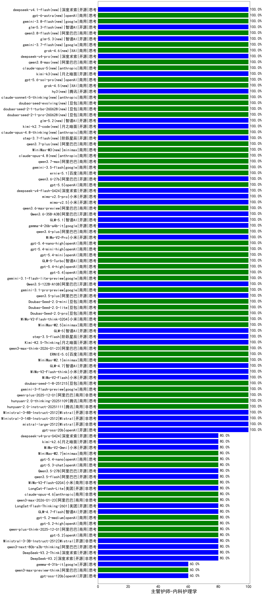

|类别|机构|大模型|【主管护师-内科护理学】准确率|平均耗时|平均消耗token|花费/千次（元）|排名（准确率）|
|---|---|-----|-------------------|-------|-----------|-----------|-----------|
|商用|小米|mimo-v2.5-pro(new)|100.0%|28s|1516|26.5|1|
|商用|阿里巴巴|qwen3-max-2025-09-23(new)|100.0%|24s|776|16.1|2|
|开源|openAI|gpt-oss-20b(new)|100.0%|9s|1592|1.7|3|
|商用|minimax|MiniMax-M2.5(new)|100.0%|52s|2804|22.6|4|
|开源|智谱AI|GLM-5(new)|100.0%|69s|1817|31.0|5|
|开源|阶跃星辰|step-3.5-flash(new)|100.0%|42s|1281|2.5|6|
|商用|阿里巴巴|qwen-flash-2025-07-28(new)|100.0%|10s|808|1.0|7|
|开源|月之暗面|Kimi-K2.5-Thinking(new)|100.0%|267s|2271|45.7|8|
|商用|阿里巴巴|qwen3-max-think-2026-01-23(new)|100.0%|136s|3658|35.5|9|
|商用|百度|ERNIE-5.0(new)|100.0%|157s|1690|38.4|10|
|商用|minimax|MiniMax-M2.1(new)|100.0%|92s|2263|18.1|11|
|开源|智谱AI|GLM-4.7(new)|100.0%|51s|1888|25.1|12|
|开源|小米|MiMo-V2-Flash-think(new)|100.0%|36s|2545|0.0|13|
|开源|豆包|Seed-OSS-36B-Instruct(new)|100.0%|38s|1288|4.8|14|
|开源|小米|MiMo-V2-Flash(new)|100.0%|17s|614|0.0|15|
|商用|豆包|doubao-seed-1-8-251215(new)|100.0%|33s|889|5.9|16|
|商用|豆包|doubao-seed-1-6-251015(new)|100.0%|16s|855|5.7|17|
|商用|豆包|doubao-seed-1-6-lite-251015(new)|100.0%|19s|901|1.8|18|
|商用|google|gemini-3-flash-preview(new)|100.0%|115s|1343|26.1|19|
|商用|阿里巴巴|qwen-plus-2025-12-01(new)|100.0%|26s|1132|2.1|20|
|商用|腾讯|hunyuan-2.0-thinking-20251109(new)|100.0%|14s|673|2.4|21|
|商用|anthropic|claude-haiku-4.5(new)|100.0%|10s|810|23.3|22|
|商用|腾讯|hunyuan-2.0-instruct-20251111(new)|100.0%|8s|572|1.0|23|
|开源|Mistral|Ministral-3-8B-Instruct-2512(new)|100.0%|16s|814|0.9|24|
|开源|Mistral|Ministral-3-14B-Instruct-2512(new)|100.0%|12s|767|1.1|25|
|开源|月之暗面|kimi-k2-0905(new)|100.0%|13s|612|8.1|26|
|开源|Mistral|mistral-large-2512(new)|100.0%|16s|737|6.6|27|
|商用|小米|MiMo-V2-Flash-think-0204(new)|100.0%|1157s|2524|5.1|28|
|商用|智谱AI|GLM-4.5-Flash-nothink(new)|100.0%|20s|1028|0.0|29|
|商用|豆包|Doubao-Seed-2.0-pro(new)|100.0%|179s|879|11.9|30|
|商用|智谱AI|GLM-5-Turbo(new)|100.0%|62s|1556|32.2|31|
|商用|小米|mimo-v2.5(new)|100.0%|21s|1391|15.2|32|
|商用|阿里巴巴|qwen3.6-max-preview(new)|100.0%|54s|1879|95.6|33|
|开源|阿里巴巴|Qwen3.6-35B-A3B(new)|100.0%|112s|2329|24.0|34|
|开源|智谱AI|GLM-5.1(new)|100.0%|164s|1283|28.6|35|
|开源|google|gemma-4-26b-a4b-it(new)|100.0%|18s|745|1.8|36|
|商用|阿里巴巴|qwen3.6-plus(new)|100.0%|49s|1997|22.7|37|
|商用|小米|MiMo-V2-Pro(new)|100.0%|22s|1461|25.4|38|
|商用|openAI|gpt-5.4-nano-high(new)|100.0%|39s|769|5.6|39|
|商用|openAI|gpt-5.4-mini-high(new)|100.0%|7s|983|27.0|40|
|商用|豆包|Doubao-Seed-2.0-lite(new)|100.0%|215s|1001|3.1|41|
|商用|openAI|gpt-5.4-mini(new)|100.0%|169s|395|8.5|42|
|商用|openAI|gpt-5.4-high(new)|100.0%|14s|814|72.4|43|
|开源|阿里巴巴|qwen3-235b-a22b-instruct-2507(new)|100.0%|18s|765|5.3|44|
|商用|openAI|gpt-5.4(new)|100.0%|7s|455|34.7|45|
|开源|阿里巴巴|Qwen3-4B-nothink(new)|100.0%|24s|630|1.5|46|
|商用|google|gemini-3.1-flash-lite-preview(new)|100.0%|4s|540|4.5|47|
|开源|阿里巴巴|Qwen3.5-122B-A10B(new)|100.0%|229s|3145|19.4|48|
|商用|google|gemini-3.1-pro-preview(new)|100.0%|43s|1665|132.1|49|
|开源|阿里巴巴|qwen3.5-plus(new)|100.0%|45s|3326|15.4|50|
|商用|豆包|Doubao-Seed-2.0-mini(new)|100.0%|99s|2126|3.9|51|
|开源|阿里巴巴|Qwen3-30B-A3B-Instruct-2507(new)|100.0%|6s|789|2.1|52|
|商用|anthropic|claude-sonnet-4.5(new)|100.0%|10s|793|69.3|53|
|开源|阿里巴巴|Qwen3-32B(new)|95.0%|39s|1647|6.3|54|
|商用|百度|ERNIE-X1-Turbo-32K(new)|90.0%|87s|1588|6.1|55|
|商用|百度|ERNIE-4.5-Turbo-32K(new)|90.0%|22s|532|1.5|56|
|商用|百川智能|Baichuan4-Turbo(new)|85.0%|/|/|/|57|
|开源|阿里巴巴|Qwen3-14B(new)|85.0%|33s|1902|3.7|58|
|商用|google|gemini-2.5-flash(new)|85.0%|11s|2001|34.7|59|
|商用|google|gemini-2.5-pro(new)|85.0%|32s|2423|169.3|60|
|商用|百度|ERNIE-X1.1-Preview(new)|80.0%|79s|693|2.4|61|
|开源|阿里巴巴|Qwen3-14B-nothink(new)|80.0%|13s|706|1.2|62|
|商用|阿里巴巴|qwen-flash-think-2025-07-28(new)|80.0%|25s|2534|3.6|63|
|商用|openAI|gpt-5-mini-2025-08-07(new)|80.0%|38s|1096|14.0|64|
|开源|美团|LongCat-Flash-Lite(new)|80.0%|375s|647|0.0|65|
|商用|小米|MiMo-V2-Flash-0204(new)|80.0%|80s|778|1.4|66|
|开源|智谱AI|GLM-4.5-Air-nothink(new)|80.0%|13s|1045|5.6|67|
|开源|阿里巴巴|Qwen3-30B-A3B-Thinking-2507(new)|80.0%|74s|2783|7.5|68|
|开源|智谱AI|GLM-4.5-Air(new)|80.0%|37s|1867|10.6|69|
|商用|智谱AI|GLM-4.5-Flash(new)|80.0%|32s|1729|0.0|70|
|开源|阿里巴巴|Qwen3-32B-nothink(new)|80.0%|23s|726|2.5|71|
|开源|阿里巴巴|qwen3.5-flash(new)|80.0%|191s|2874|5.5|72|
|开源|阿里巴巴|Qwen3.5-27B(new)|80.0%|353s|2998|13.8|73|
|开源|阿里巴巴|qwen3-235b-a22b-thinking-2507(new)|80.0%|63s|3031|58.1|74|
|商用|openAI|gpt-5.3-chat(new)|80.0%|8s|520|38.1|75|
|商用|阿里巴巴|qwen3-max-2026-01-23(new)|80.0%|107s|764|6.6|76|
|商用|阿里巴巴|qwen-turbo-2025-07-15(new)|80.0%|12s|573|0.3|77|
|商用|腾讯|hunyuan-t1-20250711(new)|80.0%|29s|1868|7.0|78|
|商用|openAI|gpt-5.4-nano(new)|80.0%|16s|384|2.3|79|
|商用|anthropic|claude-4-sonnet-thinking(new)|80.0%|54s|730|62.4|80|
|商用|minimax|MiniMax-M2.7(new)|80.0%|54s|2010|15.9|81|
|商用|anthropic|claude-4-sonnet(new)|80.0%|41s|785|68.4|82|
|商用|小米|MiMo-V2-Omni(new)|80.0%|678s|2024|24.1|83|
|开源|深度求索|DeepSeek-R1-0528(new)|80.0%|227s|1743|27.0|84|
|商用|openAI|o4-mini(new)|80.0%|44s|1027|29.5|85|
|开源|月之暗面|kimi-k2.6(new)|80.0%|161s|2432|63.3|86|
|开源|深度求索|DeepSeek-V3.1(new)|80.0%|23s|517|5.3|87|
|商用|anthropic|claude-opus-4.6(new)|80.0%|12s|846|120.7|88|
|开源|深度求索|DeepSeek-V3.1-Think(new)|80.0%|56s|1155|12.9|89|
|商用|openAI|gpt-5.2-high(new)|80.0%|11s|604|47.0|90|
|商用|anthropic|claude-opus-4.5(new)|80.0%|21s|852|123.8|91|
|商用|anthropic|claude-sonnet-4.5-thinking(new)|80.0%|26s|1896|186.7|92|
|开源|meta|Llama-4-Scout-17B-16E-Instruct(new)|80.0%|13s|742|1.4|93|
|开源|深度求索|DeepSeek-V3.2-Think(new)|80.0%|192s|1522|4.4|94|
|开源|阿里巴巴|qwen3-next-80b-a3b-thinking(new)|80.0%|181s|3664|14.2|95|
|商用|openAI|gpt-5.1-high(new)|80.0%|138s|1690|110.7|96|
|商用|XAI|grok-4-1-fast-reasoning(new)|80.0%|13s|1439|4.5|97|
|开源|Mistral|Ministral-3-3B-Instruct-2512(new)|80.0%|14s|814|0.6|98|
|商用|anthropic|claude-haiku-4.5-thinking(new)|80.0%|45s|4604|159.9|99|
|商用|openAI|gpt-5.1-medium(new)|80.0%|160s|598|33.1|100|
|开源|美团|LongCat-Flash-Thinking-2601(new)|80.0%|318s|3961|0.0|101|
|商用|阿里巴巴|qwen-plus-think-2025-12-01(new)|80.0%|63s|2997|23.0|102|
|商用|openAI|gpt-5.2(new)|80.0%|11s|317|18.5|103|
|商用|openAI|gpt-5.2-medium(new)|80.0%|13s|558|42.4|104|
|商用|阿里巴巴|qwen3-max-preview(new)|80.0%|15s|681|13.9|105|
|开源|智谱AI|GLM-4.7-Flash(new)|80.0%|336s|2426|0.0|106|
|开源|月之暗面|Kimi-K2-Thinking(new)|80.0%|155s|2761|42.8|107|
|商用|google|gemini-2.5-flash-lite(new)|80.0%|3s|668|1.6|108|
|商用|阿里巴巴|qwen-turbo-think-2025-07-15(new)|80.0%|/|1923|5.4|109|
|开源|深度求索|DeepSeek-V3.2(new)|80.0%|51s|519|1.4|110|
|开源|阿里巴巴|qwen3-next-80b-a3b-instruct(new)|80.0%|9s|752|2.6|111|
|商用|腾讯|hunyuan-turbos-20250926(new)|80.0%|24s|965|1.7|112|
|开源|阿里巴巴|Qwen3-4B(new)|75.0%|17s|1664|4.8|113|
|开源|阿里巴巴|Qwen3-8B(new)|75.0%|99s|2899|0.0|114|
|开源|智谱AI|GLM-4-9B-0414(new)|70.0%|13s|442|0|115|
|开源|openAI|gpt-oss-120b(new)|60.0%|4s|872|2.3|116|
|商用|XAI|grok-4-1-fast-non-reasoning(new)|60.0%|80s|710|1.9|117|
|商用|openAI|gpt-5.1(new)|60.0%|321s|353|15.7|118|
|商用|openAI|gpt-5-2025-08-07(new)|60.0%|73s|479|25.6|119|
|开源|阿里巴巴|Qwen3-8B-nothink(new)|60.0%|27s|665|0.0|120|
|商用|openAI|gpt-5-nano-high(new)|60.0%|129s|5786|16.4|121|
|开源|google|gemma-4-31b-it(new)|60.0%|109s|647|1.5|122|
|商用|openAI|gpt-5-mini-high(new)|60.0%|95s|2206|30.1|123|
|商用|百度|ERNIE-5.0-Thinking-Preview(new)|60.0%|360s|2536|58.7|124|
|商用|openAI|gpt-5-nano-2025-08-07(new)|60.0%|123s|2455|6.7|125|
|商用|阿里巴巴|qwen3-max-preview-think(new)|60.0%|106s|3053|70.8|126|

