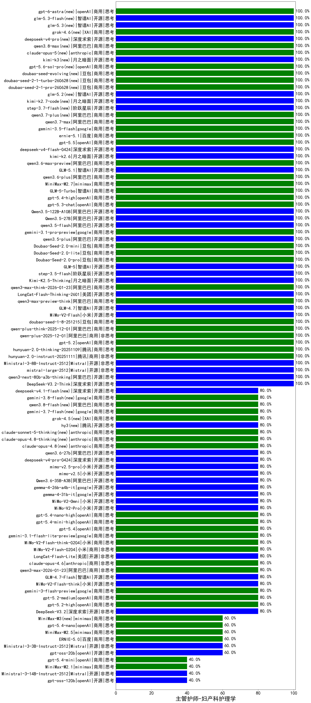

|类别|机构|大模型|【主管护师-妇产科护理学】准确率|平均耗时|平均消耗token|花费/千次（元）|排名（准确率）|
|---|---|-----|-------------------|-------|-----------|-----------|-----------|
|商用|阿里巴巴|qwen-long-2025-01-25|100.0%|116s|418|0.7|1|
|商用|anthropic|claude-sonnet-4.5(new)|100.0%|12s|692|62.5|2|
|开源|智谱AI|GLM-4.5|100.0%|42s|1820|24.5|3|
|开源|智谱AI|GLM-4.5-Air|100.0%|27s|1548|8.8|4|
|商用|anthropic|claude-haiku-4.5-thinking|100.0%|17s|2238|75.6|5|
|商用|google|gemini-3-pro-preview(new)|100.0%|84s|3249|270.1|6|
|开源|月之暗面|kimi-k2-0905|100.0%|113s|405|5.2|7|
|商用|openAI|gpt-5.1-high|100.0%|14s|841|52.6|8|
|商用|科大讯飞|xunfei-spark-x1-0725|100.0%|/|837|10.0|9|
|开源|Mistral|mistral-large-2512(new)|100.0%|14s|583|5.3|10|
|开源|阿里巴巴|qwen3-235b-a22b-thinking-2507|100.0%|132s|2083|40.0|11|
|开源|阿里巴巴|qwen3-235b-a22b-instruct-2507|100.0%|13s|588|4.1|12|
|商用|百度|ERNIE-5.0-Thinking-Preview|100.0%|292s|1892|44.0|13|
|商用|腾讯|hunyuan-t1-20250711|100.0%|21s|1268|4.7|14|
|商用|阿里巴巴|qwen-turbo-think-2025-07-15|100.0%|/|2420|7.0|15|
|开源|深度求索|DeepSeek-V3.2-Think(new)|100.0%|42s|1248|3.7|16|
|开源|阿里巴巴|Qwen3-30B-A3B-Instruct-2507|100.0%|6s|614|1.6|17|
|商用|anthropic|claude-haiku-4.5|100.0%|10s|700|20.7|18|
|商用|openAI|gpt-5.1-medium|100.0%|207s|659|39.7|19|
|开源|月之暗面|Kimi-K2-Thinking|100.0%|148s|2606|40.7|20|
|商用|智谱AI|GLM-4.5-Flash-nothink|100.0%|19s|945|0.0|21|
|商用|豆包|doubao-seed-1-6-lite-251015|100.0%|25s|766|1.6|22|
|商用|豆包|doubao-seed-1-6-251015|100.0%|17s|818|5.7|23|
|商用|openAI|gpt-5-2025-08-07|100.0%|17s|465|26.9|24|
|开源|智谱AI|GLM-4.6|100.0%|48s|2267|30.8|25|
|商用|腾讯|hunyuan-turbos-20250926|100.0%|15s|649|1.1|26|
|商用|阿里巴巴|qwen-flash-2025-07-28|100.0%|11s|654|0.9|27|
|开源|深度求索|DeepSeek-V3.1|100.0%|20s|411|4.3|28|
|开源|深度求索|DeepSeek-V3.1-Think|100.0%|88s|1661|19.2|29|
|开源|深度求索|DeepSeek-V3.2-Exp|100.0%|19s|403|1.1|30|
|开源|阿里巴巴|qwen3-next-80b-a3b-instruct|100.0%|15s|687|2.5|31|
|商用|阿里巴巴|qwen3-max-preview|100.0%|10s|508|10.5|32|
|商用|阿里巴巴|qwen-plus-2025-07-28|100.0%|15s|553|1.0|33|
|开源|阿里巴巴|qwen3-next-80b-a3b-thinking|100.0%|156s|3658|14.3|34|
|商用|阿里巴巴|qwen3-max-2025-09-23|100.0%|593s|629|13.4|35|
|商用|阿里巴巴|qwen-plus-think-2025-07-28|100.0%|/|3065|23.8|36|
|商用|阿里巴巴|qwen3-max-think-2026-01-23(new)|100.0%|151s|3659|35.9|37|
|开源|智谱AI|GLM-4.7(new)|100.0%|57s|2399|32.6|38|
|商用|阿里巴巴|qwen-plus-think-2025-12-01(new)|100.0%|39s|1930|14.8|39|
|商用|阿里巴巴|qwen-plus-2025-12-01(new)|100.0%|25s|855|1.6|40|
|商用|openAI|gpt-5.2(new)|100.0%|4s|258|15.8|41|
|商用|腾讯|hunyuan-2.0-thinking-20251109|100.0%|5s|611|2.2|42|
|商用|豆包|doubao-seed-1-8-251215(new)|100.0%|25s|868|6.0|43|
|开源|美团|LongCat-Flash-Thinking-2601(new)|100.0%|633s|3072|0.0|44|
|商用|阿里巴巴|qwen3-max-preview-think(new)|100.0%|227s|2940|68.8|45|
|开源|月之暗面|Kimi-K2.5-Thinking(new)|100.0%|306s|1374|27.4|46|
|商用|腾讯|hunyuan-2.0-instruct-20251111|100.0%|9s|448|0.7|47|
|开源|阶跃星辰|step-3.5-flash(new)|100.0%|28s|2444|5.0|48|
|开源|Mistral|Ministral-3-8B-Instruct-2512(new)|100.0%|11s|580|0.6|49|
|开源|小米|MiMo-V2-Flash(new)|100.0%|30s|534|0.0|50|
|开源|百度|ERNIE-4.5-21B-A3B|95.0%|50s|293|0.0|51|
|开源|百度|ERNIE-4.5-300B-A47B|95.0%|19s|296|1.9|52|
|商用|豆包|Doubao-1.5-lite-32k-250115|93.3%|10s|219|0.1|53|
|商用|百度|ERNIE-4.5-Turbo-32K|90.0%|22s|532|1.5|54|
|开源|阿里巴巴|Qwen3-14B|90.0%|14s|682|1.2|55|
|商用|百川智能|Baichuan4-Turbo|86.7%|/|/|/|56|
|开源|阿里巴巴|Qwen3-32B|85.0%|38s|1645|6.3|57|
|开源|腾讯|Hunyuan-A13B-Instruct|85.0%|49s|821|3.1|58|
|开源|深度求索|DeepSeek-R1-0528|85.0%|229s|1755|27.2|59|
|商用|豆包|doubao-seed-1-6-250615|85.0%|160s|438|2.7|60|
|商用|豆包|doubao-seed-1-6-flash-250615|85.0%|4s|363|0.4|61|
|商用|豆包|doubao-seed-1-6-flash-thinking-250615|85.0%|6s|596|0.7|62|
|商用|google|gemini-3-flash-preview(new)|80.0%|13s|1511|30.5|63|
|商用|阿里巴巴|qwen3-max-2026-01-23(new)|80.0%|16s|666|6.0|64|
|开源|深度求索|DeepSeek-V3.2(new)|80.0%|32s|447|1.3|65|
|商用|anthropic|claude-opus-4.5(new)|80.0%|13s|799|121.5|66|
|开源|豆包|Seed-OSS-36B-Instruct|80.0%|92s|2090|8.1|67|
|商用|百度|ERNIE-X1.1-Preview|80.0%|113s|1175|4.5|68|
|开源|深度求索|DeepSeek-V3.2-Exp-Think|80.0%|61s|1367|4.0|69|
|开源|minimax|MiniMax-M2|80.0%|75s|3373|27.6|70|
|开源|智谱AI|GLM-4.7-Flash(new)|80.0%|672s|3959|0.0|71|
|商用|anthropic|claude-sonnet-4.5-thinking|80.0%|43s|2799|289.2|72|
|商用|XAI|grok-4-1-fast-reasoning|80.0%|89s|1473|4.7|73|
|开源|小米|MiMo-V2-Flash-think(new)|80.0%|383s|2412|0.0|74|
|商用|openAI|gpt-5.2-high(new)|80.0%|10s|473|37.1|75|
|商用|openAI|gpt-5.2-medium(new)|80.0%|10s|434|33.3|76|
|商用|anthropic|claude-opus-4.6(new)|80.0%|13s|783|116.5|77|
|商用|google|gemini-2.5-pro|80.0%|47s|2252|157.8|78|
|开源|阶跃星辰|step-3|80.0%|115s|2261|8.8|79|
|开源|月之暗面|kimi-k2-0711-preview|80.0%|38s|646|9.4|80|
|商用|阿里巴巴|qwen-turbo-2025-07-15|80.0%|8s|462|0.2|81|
|商用|豆包|doubao-seed-1-6-thinking-250715|80.0%|50s|1468|11.1|82|
|开源|minimax|MiniMax-M1|80.0%|288s|4796|35.0|83|
|商用|anthropic|claude-4-sonnet-thinking|80.0%|53s|662|59.2|84|
|开源|阿里巴巴|Qwen3-4B-nothink|80.0%|26s|464|1.1|85|
|开源|阿里巴巴|Qwen3-8B-nothink|80.0%|161s|572|0.0|86|
|商用|百度|ERNIE-X1-Turbo-32K|80.0%|72s|1683|6.5|87|
|开源|阿里巴巴|Qwen3-32B-nothink|80.0%|26s|576|2.0|88|
|商用|智谱AI|GLM-4.5-Flash|80.0%|23s|1448|0.0|89|
|开源|Mistral|Magistral-Small-2507|80.0%|763s|7555|81.2|90|
|商用|google|gemini-2.5-flash|75.0%|9s|1691|29.3|91|
|开源|智谱AI|GLM-4-9B-0414|75.0%|11s|435|0.0|92|
|开源|meta|Llama-4-Maverick-17B-128E-Instruct-FP8|75.0%|7s|527|2.0|93|
|开源|minimax|MiniMax-Text-01|73.3%|18s|934|7.5|94|
|商用|360|360zhinao2-o1|73.3%|/|/|/|95|
|开源|阿里巴巴|Qwen3-30B-A3B-Thinking-2507|70.0%|82s|3141|8.6|96|
|商用|XAI|grok-4-0709|70.0%|312s|1810|188.7|97|
|开源|meta|Llama-4-Scout-17B-16E-Instruct|65.0%|10s|620|1.2|98|
|开源|阿里巴巴|Qwen3-8B|65.0%|606s|18444|0.0|99|
|开源|google|gemma-3-12b-it|60.0%|/|/|/|100|
|商用|百度|ERNIE-5.0(new)|60.0%|220s|2581|60.6|101|
|开源|Mistral|Ministral-3-3B-Instruct-2512(new)|60.0%|12s|629|0.4|102|
|商用|anthropic|claude-4-sonnet|60.0%|41s|597|52.4|103|
|开源|阿里巴巴|Qwen3-4B|60.0%|22s|1996|5.8|104|
|商用|XAI|grok-3-mini|60.0%|222s|1325|4.7|105|
|开源|阿里巴巴|Qwen3-1.7B|60.0%|13s|1304|3.7|106|
|开源|Mistral|Mistral-Small-3.2-24B-Instruct-2506|60.0%|621s|731|1.4|107|
|开源|智谱AI|GLM-4.5-nothink|60.0%|24s|747|9.5|108|
|开源|阿里巴巴|Qwen3-14B-nothink|60.0%|26s|638|1.1|109|
|开源|openAI|gpt-oss-20b|60.0%|74s|958|1.0|110|
|开源|智谱AI|GLM-4.5-Air-nothink|60.0%|30s|1169|6.5|111|
|商用|openAI|gpt-5.1|60.0%|83s|279|12.8|112|
|商用|XAI|grok-4-1-fast-non-reasoning|60.0%|5s|687|1.9|113|
|商用|阿里巴巴|qwen-flash-think-2025-07-28|60.0%|35s|3643|5.3|114|
|开源|深度求索|DeepSeek-R1-0528-Qwen3-8B|55.0%|266s|1601|0.0|115|
|开源|google|gemma-3-27b-it|55.0%|/|/|/|116|
|开源|阿里巴巴|Qwen3-0.6B|50.0%|6s|1318|3.7|117|
|开源|阿里巴巴|Qwen3-1.7B-nothink|40.0%|18s|528|1.3|118|
|商用|Mistral|mistral-medium-2508|40.0%|44s|661|8.0|119|
|商用|百度|ERNIE-Lite-8K|40.0%|/|/|/|120|
|商用|google|gemini-2.5-flash-lite|40.0%|2s|550|1.4|121|
|商用|百川智能|Baichuan4-Air|40.0%|/|/|/|122|
|开源|google|gemma-3-4b-it|40.0%|/|/|/|123|
|商用|openAI|gpt-5-nano-2025-08-07|40.0%|102s|1979|5.4|124|
|商用|minimax|MiniMax-M2.1(new)|40.0%|99s|1533|12.1|125|
|开源|Mistral|Ministral-3-14B-Instruct-2512(new)|40.0%|14s|689|1.0|126|
|开源|openAI|gpt-oss-120b|40.0%|4s|809|2.2|127|
|商用|openAI|gpt-5-mini-high|40.0%|725s|3220|45.2|128|
|开源|腾讯|Hunyuan-A13B-Instruct-nothink|40.0%|19s|427|1.4|129|
|商用|openAI|gpt-5-nano-high|40.0%|147s|5162|14.7|130|
|开源|百度|ERNIE-4.5-0.3B|30.0%|60s|390|0.0|131|
|商用|openAI|o4-mini|30.0%|34s|1011|29.8|132|
|商用|openAI|gpt-5-mini-2025-08-07|20.0%|77s|1060|13.9|133|
|开源|阿里巴巴|Qwen3-0.6B-nothink|20.0%|5s|295|0.6|134|

