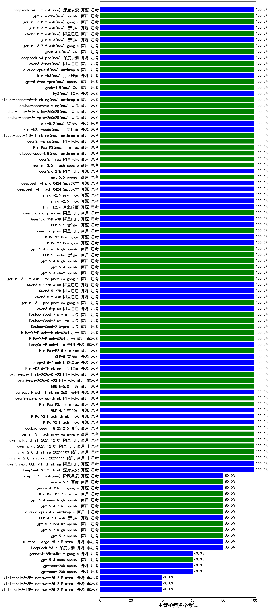

|类别|机构|大模型|【主管护师资格考试】准确率|平均耗时|平均消耗token|花费/千次（元）|排名（准确率）|
|---|---|-----|-------------------|-------|-----------|-----------|-----------|
|开源|智谱AI|GLM-5.1(new)|100.0%|112s|1144|26.2|1|
|开源|深度求索|DeepSeek-V3.1-Think|100.0%|41s|806|9.1|2|
|开源|阿里巴巴|qwen3-next-80b-a3b-instruct|100.0%|12s|530|1.9|3|
|开源|豆包|Seed-OSS-36B-Instruct|100.0%|105s|1893|7.4|4|
|商用|阿里巴巴|qwen3-max-preview|100.0%|9s|474|9.9|5|
|开源|小米|MiMo-V2-Flash-think|100.0%|23s|1854|0.0|6|
|商用|阿里巴巴|qwen-plus-think-2025-07-28|100.0%|/|1896|14.6|7|
|商用|阿里巴巴|qwen-plus-2025-07-28|100.0%|14s|536|1.0|8|
|开源|智谱AI|GLM-4.7|100.0%|41s|1807|24.5|9|
|商用|minimax|MiniMax-M2.1|100.0%|90s|1648|13.2|10|
|商用|阿里巴巴|qwen3-max-preview-think|100.0%|182s|1538|35.5|11|
|开源|深度求索|DeepSeek-V3.1|100.0%|16s|326|3.4|12|
|开源|深度求索|DeepSeek-V3.2-Exp-Think|100.0%|122s|775|2.3|13|
|商用|阿里巴巴|qwen-flash-think-2025-07-28|100.0%|28s|3030|4.4|14|
|商用|阿里巴巴|qwen-flash-2025-07-28|100.0%|7s|539|0.7|15|
|开源|美团|LongCat-Flash-Thinking-2601|100.0%|165s|1654|0.0|16|
|商用|openAI|gpt-5-2025-08-07|100.0%|15s|297|16.1|17|
|商用|百度|ERNIE-5.0|100.0%|153s|1626|37.9|18|
|商用|阿里巴巴|qwen3-max-2026-01-23|100.0%|102s|489|4.3|19|
|商用|阿里巴巴|qwen3-max-think-2026-01-23|100.0%|82s|2400|23.4|20|
|开源|月之暗面|Kimi-K2.5-Thinking|100.0%|235s|1202|24.0|21|
|开源|阶跃星辰|step-3.5-flash|100.0%|13s|1109|2.2|22|
|开源|深度求索|DeepSeek-V3.2-Exp|100.0%|121s|420|1.2|23|
|商用|腾讯|hunyuan-turbos-20250926|100.0%|14s|580|1.0|24|
|开源|阿里巴巴|Qwen3-30B-A3B-Instruct-2507|100.0%|4s|516|1.4|25|
|商用|openAI|gpt-5.1-high|100.0%|16s|745|47.3|26|
|开源|深度求索|DeepSeek-V3.2-Think|100.0%|184s|611|1.8|27|
|商用|腾讯|hunyuan-2.0-thinking-20251109|100.0%|8s|597|2.2|28|
|商用|阿里巴巴|qwen-plus-2025-12-01|100.0%|19s|764|1.4|29|
|商用|阿里巴巴|qwen3-max-2025-09-23|100.0%|177s|490|10.3|30|
|商用|anthropic|claude-opus-4.5|100.0%|12s|779|122.6|31|
|商用|百度|ERNIE-5.0-Thinking-Preview|100.0%|137s|1561|36.4|32|
|商用|阿里巴巴|qwen-plus-think-2025-12-01|100.0%|63s|2542|19.8|33|
|商用|anthropic|claude-sonnet-4.5-thinking|100.0%|23s|1564|157.8|34|
|商用|anthropic|claude-sonnet-4.5(new)|100.0%|13s|727|69.2|35|
|开源|月之暗面|kimi-k2-0905|100.0%|98s|380|5.0|36|
|开源|智谱AI|GLM-4.6|100.0%|43s|2062|28.1|37|
|商用|google|gemini-3-pro-preview|100.0%|73s|1606|131.4|38|
|商用|google|gemini-3-flash-preview|100.0%|105s|1058|21.2|39|
|商用|豆包|doubao-seed-1-8-251215|100.0%|23s|656|4.4|40|
|商用|openAI|gpt-5.1-medium|100.0%|177s|375|21.0|41|
|商用|openAI|gpt-5.1|100.0%|121s|249|12.0|42|
|开源|月之暗面|Kimi-K2-Thinking|100.0%|94s|1417|21.8|43|
|开源|小米|MiMo-V2-Flash|100.0%|252s|429|0.0|44|
|商用|豆包|doubao-seed-1-6-lite-251015|100.0%|199s|815|1.7|45|
|商用|豆包|doubao-seed-1-6-251015|100.0%|10s|740|5.2|46|
|商用|腾讯|hunyuan-2.0-instruct-20251111|100.0%|7s|387|0.6|47|
|开源|阶跃星辰|step-3|100.0%|106s|2104|8.2|48|
|开源|阿里巴巴|qwen3-next-80b-a3b-thinking|100.0%|143s|2662|10.4|49|
|开源|智谱AI|GLM-4.5|100.0%|37s|1674|22.6|50|
|商用|openAI|gpt-5.4-high(new)|100.0%|25s|440|38.2|51|
|商用|豆包|Doubao-Seed-2.0-mini(new)|100.0%|259s|1150|2.1|52|
|开源|阿里巴巴|qwen3.5-plus(new)|100.0%|24s|1626|7.5|53|
|开源|百度|ERNIE-4.5-300B-A47B|100.0%|26s|321|2.1|54|
|商用|google|gemini-3.1-pro-preview(new)|100.0%|41s|1343|109.0|55|
|开源|阿里巴巴|qwen3.5-flash(new)|100.0%|281s|2051|4.0|56|
|商用|小米|MiMo-V2-Pro(new)|100.0%|231s|1245|21.7|57|
|商用|小米|MiMo-V2-Omni(new)|100.0%|510s|1157|12.6|58|
|开源|阿里巴巴|Qwen3.5-27B(new)|100.0%|300s|2360|11.0|59|
|开源|阿里巴巴|Qwen3.5-122B-A10B(new)|100.0%|115s|1851|11.4|60|
|商用|google|gemini-3.1-flash-lite-preview(new)|100.0%|3s|364|3.2|61|
|商用|openAI|gpt-5.3-chat(new)|100.0%|51s|360|27.5|62|
|商用|openAI|gpt-5.4-mini-high(new)|100.0%|21s|674|18.8|63|
|商用|智谱AI|GLM-5-Turbo(new)|100.0%|27s|1362|28.7|64|
|商用|豆包|Doubao-Seed-2.0-pro(new)|100.0%|230s|1071|15.7|65|
|商用|豆包|Doubao-Seed-2.0-lite(new)|100.0%|178s|791|2.5|66|
|商用|腾讯|hunyuan-t1-20250711|100.0%|17s|1101|4.1|67|
|商用|小米|MiMo-V2-Flash-0204(new)|100.0%|309s|510|0.9|68|
|开源|智谱AI|GLM-4.5-Air|100.0%|31s|1566|9.0|69|
|商用|智谱AI|GLM-4.5-Flash|100.0%|23s|1548|0.0|70|
|开源|智谱AI|GLM-5(new)|100.0%|72s|1512|26.2|71|
|商用|minimax|MiniMax-M2.5(new)|100.0%|30s|1148|9.0|72|
|开源|阿里巴巴|Qwen3-8B-nothink|100.0%|24s|560|0.0|73|
|商用|阿里巴巴|qwen-turbo-2025-07-15|100.0%|10s|400|0.2|74|
|开源|美团|LongCat-Flash-Lite(new)|100.0%|364s|544|0.0|75|
|商用|阿里巴巴|qwen3.6-plus(new)|100.0%|27s|1668|19.2|76|
|开源|阿里巴巴|Qwen3-0.6B-nothink|100.0%|23s|255|0.5|77|
|商用|科大讯飞|xunfei-spark-x1-0725|100.0%|/|822|9.9|78|
|开源|阿里巴巴|qwen3-235b-a22b-thinking-2507|100.0%|51s|2201|42.6|79|
|开源|阿里巴巴|qwen3-235b-a22b-instruct-2507|100.0%|13s|535|3.8|80|
|商用|小米|MiMo-V2-Flash-think-0204(new)|100.0%|268s|1577|3.2|81|
|商用|openAI|gpt-5.4(new)|100.0%|9s|347|28.4|82|
|商用|豆包|doubao-seed-1-6-flash-thinking-250615|95.0%|6s|612|0.8|83|
|商用|百度|ERNIE-X1-Turbo-32K|95.0%|107s|2396|9.4|84|
|商用|百度|ERNIE-4.5-Turbo-32K|95.0%|21s|534|1.6|85|
|开源|深度求索|DeepSeek-R1-0528|95.0%|233s|1841|28.6|86|
|商用|豆包|doubao-seed-1-6-250615|90.0%|123s|498|3.2|87|
|商用|豆包|doubao-seed-1-6-flash-250615|90.0%|4s|314|0.4|88|
|开源|阿里巴巴|Qwen3-32B|85.0%|30s|909|3.4|89|
|商用|google|gemini-2.5-pro|85.0%|29s|2466|173.9|90|
|商用|openAI|gpt-5.2-high|80.0%|11s|468|38.6|91|
|商用|openAI|gpt-5.4-mini(new)|80.0%|22s|263|5.9|92|
|商用|openAI|gpt-5.2-medium|80.0%|13s|448|36.6|93|
|商用|openAI|gpt-5.4-nano-high(new)|80.0%|62s|482|3.6|94|
|商用|minimax|MiniMax-M2.7(new)|80.0%|36s|1467|11.7|95|
|商用|openAI|gpt-5.2|80.0%|4s|210|13.0|96|
|开源|智谱AI|GLM-4.7-Flash|80.0%|324s|1707|0.0|97|
|开源|google|gemma-4-31b-it(new)|80.0%|86s|541|1.4|98|
|商用|anthropic|claude-opus-4.6|80.0%|11s|673|102.0|99|
|开源|minimax|MiniMax-M2|80.0%|21s|1367|10.8|100|
|商用|智谱AI|GLM-4.5-Flash-nothink|80.0%|17s|842|0.0|101|
|商用|anthropic|claude-4-sonnet-thinking|80.0%|71s|620|57.6|102|
|开源|阿里巴巴|Qwen3-30B-A3B-Thinking-2507|80.0%|90s|2713|7.4|103|
|开源|智谱AI|GLM-4.5-nothink|80.0%|20s|591|7.4|104|
|开源|智谱AI|GLM-4.5-Air-nothink|80.0%|14s|924|5.1|105|
|开源|腾讯|Hunyuan-A13B-Instruct-nothink|80.0%|15s|393|1.3|106|
|商用|XAI|grok-4-0709|80.0%|421s|1199|123.4|107|
|商用|google|gemini-2.5-flash|80.0%|14s|2015|35.3|108|
|商用|google|gemini-2.5-flash-lite|80.0%|6s|679|1.8|109|
|商用|Mistral|mistral-medium-2508|80.0%|711s|589|7.3|110|
|开源|阿里巴巴|Qwen3-14B-nothink|80.0%|15s|727|1.3|111|
|开源|meta|Llama-4-Maverick-17B-128E-Instruct-FP8|80.0%|10s|531|2.1|112|
|商用|anthropic|claude-haiku-4.5-thinking|80.0%|32s|2776|96.1|113|
|商用|XAI|grok-4-1-fast-reasoning|80.0%|9s|988|3.0|114|
|商用|XAI|grok-4-1-fast-non-reasoning|80.0%|88s|745|2.1|115|
|商用|百度|ERNIE-X1.1-Preview|80.0%|118s|565|2.1|116|
|商用|openAI|gpt-5-mini-high|80.0%|976s|2135|29.8|117|
|开源|深度求索|DeepSeek-V3.2|80.0%|19s|332|0.9|118|
|开源|Mistral|mistral-large-2512|80.0%|17s|619|5.8|119|
|开源|阿里巴巴|Qwen3-14B|80.0%|23s|1047|2.0|120|
|开源|腾讯|Hunyuan-A13B-Instruct|75.0%|53s|945|3.6|121|
|开源|百度|ERNIE-4.5-21B-A3B|75.0%|62s|290|0.0|122|
|商用|百川智能|Baichuan4-Turbo|70.0%|/|/|/|123|
|商用|XAI|grok-3-mini|70.0%|140s|1152|4.1|124|
|商用|anthropic|claude-4-sonnet|70.0%|43s|604|55.0|125|
|开源|阿里巴巴|Qwen3-8B|70.0%|601s|15032|0.0|126|
|开源|阿里巴巴|Qwen3-4B|65.0%|25s|1957|5.7|127|
|开源|阿里巴巴|Qwen3-32B-nothink|60.0%|149s|605|2.2|128|
|开源|openAI|gpt-oss-120b|60.0%|198s|649|1.7|129|
|开源|openAI|gpt-oss-20b|60.0%|10s|1394|1.5|130|
|商用|openAI|gpt-5-nano-2025-08-07|60.0%|77s|1434|3.9|131|
|开源|Mistral|Mistral-Small-3.2-24B-Instruct-2506|60.0%|17s|663|1.3|132|
|商用|阿里巴巴|qwen-turbo-think-2025-07-15|60.0%|/|1991|5.8|133|
|商用|anthropic|claude-haiku-4.5|60.0%|15s|712|22.1|134|
|商用|openAI|gpt-5-nano-high|60.0%|83s|3569|10.1|135|
|开源|深度求索|DeepSeek-R1-0528-Qwen3-8B|60.0%|345s|1607|0.0|136|
|商用|openAI|gpt-5.4-nano(new)|60.0%|8s|235|1.4|137|
|开源|google|gemma-4-26b-a4b-it(new)|60.0%|63s|738|1.9|138|
|商用|百川智能|Baichuan4-Air|60.0%|/|/|/|139|
|开源|meta|Llama-4-Scout-17B-16E-Instruct|50.0%|11s|646|1.3|140|
|开源|google|gemma-3-12b-it|50.0%|/|/|/|141|
|商用|openAI|o4-mini|50.0%|35s|792|23.1|142|
|开源|智谱AI|GLM-4-9B-0414|45.0%|9s|425|0.0|143|
|开源|Mistral|Ministral-3-14B-Instruct-2512|40.0%|6s|585|0.8|144|
|开源|阿里巴巴|Qwen3-1.7B-nothink|40.0%|14s|600|1.6|145|
|开源|Mistral|Ministral-3-8B-Instruct-2512|40.0%|3s|613|0.7|146|
|商用|openAI|gpt-5-mini-2025-08-07|40.0%|24s|1043|14.0|147|
|开源|Mistral|Ministral-3-3B-Instruct-2512|40.0%|2s|624|0.4|148|
|开源|阿里巴巴|Qwen3-4B-nothink|40.0%|17s|520|1.3|149|
|开源|阿里巴巴|Qwen3-1.7B|35.0%|23s|2663|7.8|150|
|开源|阿里巴巴|Qwen3-0.6B|30.0%|15s|1322|3.8|151|
|开源|google|gemma-3-4b-it|30.0%|/|/|/|152|
|开源|google|gemma-3-27b-it|25.0%|/|/|/|153|
|开源|百度|ERNIE-4.5-0.3B|15.0%|54s|379|0.0|154|

