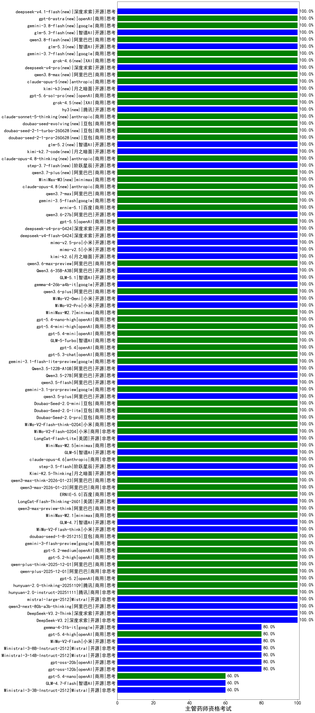

|类别|机构|大模型|【主管药师资格考试】准确率|平均耗时|平均消耗token|花费/千次（元）|排名（准确率）|
|---|---|-----|-------------------|-------|-----------|-----------|-----------|
|商用|阿里巴巴|qwen-plus-think-2025-07-28|100.0%|/|2759|21.6|1|
|商用|腾讯|hunyuan-2.0-instruct-20251111|100.0%|10s|382|0.6|2|
|开源|阿里巴巴|qwen3-next-80b-a3b-thinking|100.0%|71s|3070|12.1|3|
|开源|深度求索|DeepSeek-V3.2-Think(new)|100.0%|189s|1269|3.8|4|
|开源|深度求索|DeepSeek-V3.2(new)|100.0%|13s|373|1.1|5|
|商用|openAI|gpt-5-nano-high|100.0%|561s|3851|11.0|6|
|商用|openAI|gpt-5-mini-high|100.0%|932s|1615|22.5|7|
|商用|阿里巴巴|qwen3-max-2025-09-23|100.0%|166s|378|7.9|8|
|商用|anthropic|claude-opus-4.5(new)|100.0%|19s|616|97.4|9|
|商用|百度|ERNIE-5.0-Thinking-Preview|100.0%|208s|1515|35.4|10|
|商用|百度|ERNIE-X1.1-Preview|100.0%|106s|489|1.8|11|
|商用|anthropic|claude-sonnet-4.5-thinking|100.0%|27s|1798|185.5|12|
|商用|anthropic|claude-sonnet-4.5(new)|100.0%|9s|564|53.9|13|
|商用|openAI|gpt-5.1-high|100.0%|168s|744|48.2|14|
|开源|月之暗面|kimi-k2-0905|100.0%|95s|250|3.0|15|
|商用|google|gemini-3-pro-preview(new)|100.0%|55s|1592|131.1|16|
|商用|anthropic|claude-haiku-4.5-thinking|100.0%|37s|2761|96.3|17|
|商用|openAI|gpt-5.1-medium|100.0%|174s|340|19.5|18|
|开源|月之暗面|Kimi-K2-Thinking|100.0%|67s|1011|15.5|19|
|商用|豆包|doubao-seed-1-6-lite-251015|100.0%|15s|599|1.3|20|
|商用|豆包|doubao-seed-1-6-251015|100.0%|16s|695|4.9|21|
|开源|智谱AI|GLM-4.6|100.0%|36s|2039|27.9|22|
|商用|腾讯|hunyuan-turbos-20250926|100.0%|12s|514|0.9|23|
|开源|深度求索|DeepSeek-V3.2-Exp-Think|100.0%|151s|1015|3.0|24|
|开源|深度求索|DeepSeek-V3.2-Exp|100.0%|112s|280|0.8|25|
|开源|阿里巴巴|qwen3-next-80b-a3b-instruct|100.0%|6s|497|1.8|26|
|开源|豆包|Seed-OSS-36B-Instruct|100.0%|93s|1725|6.7|27|
|商用|阿里巴巴|qwen3-max-preview|100.0%|9s|365|7.6|28|
|商用|阿里巴巴|qwen-turbo-think-2025-07-15|100.0%|/|1957|5.7|29|
|商用|阿里巴巴|qwen-plus-2025-07-28|100.0%|10s|433|0.8|30|
|开源|Mistral|Mistral-Small-3.2-24B-Instruct-2506|100.0%|67s|434|0.8|31|
|开源|Mistral|mistral-large-2512(new)|100.0%|11s|475|4.5|32|
|商用|腾讯|hunyuan-2.0-thinking-20251109|100.0%|9s|685|2.6|33|
|开源|深度求索|DeepSeek-V3.1|100.0%|17s|330|3.5|34|
|商用|openAI|gpt-5.2(new)|100.0%|3s|155|9.0|35|
|开源|阿里巴巴|Qwen3.5-27B(new)|100.0%|296s|1932|9.0|36|
|开源|阿里巴巴|qwen3.5-flash(new)|100.0%|95s|2309|4.5|37|
|商用|google|gemini-3.1-pro-preview(new)|100.0%|69s|1210|98.5|38|
|开源|阿里巴巴|qwen3.5-plus(new)|100.0%|27s|2281|10.7|39|
|商用|豆包|Doubao-Seed-2.0-mini(new)|100.0%|268s|1205|2.2|40|
|商用|豆包|Doubao-Seed-2.0-lite(new)|100.0%|142s|679|2.1|41|
|商用|豆包|Doubao-Seed-2.0-pro(new)|100.0%|150s|713|10.1|42|
|商用|小米|MiMo-V2-Flash-think-0204(new)|100.0%|200s|2352|4.8|43|
|商用|小米|MiMo-V2-Flash-0204(new)|100.0%|237s|552|1.0|44|
|开源|美团|LongCat-Flash-Lite(new)|100.0%|496s|543|0.0|45|
|商用|minimax|MiniMax-M2.5(new)|100.0%|32s|1399|11.2|46|
|开源|智谱AI|GLM-5(new)|100.0%|56s|2124|37.4|47|
|商用|anthropic|claude-opus-4.6(new)|100.0%|11s|557|85.5|48|
|开源|阶跃星辰|step-3.5-flash(new)|100.0%|20s|1815|3.7|49|
|开源|月之暗面|Kimi-K2.5-Thinking(new)|100.0%|243s|1127|22.7|50|
|商用|阿里巴巴|qwen3-max-think-2026-01-23(new)|100.0%|99s|2095|20.4|51|
|商用|阿里巴巴|qwen3-max-2026-01-23(new)|100.0%|141s|401|3.5|52|
|商用|百度|ERNIE-5.0(new)|100.0%|160s|1596|37.4|53|
|开源|美团|LongCat-Flash-Thinking-2601(new)|100.0%|327s|2710|0.0|54|
|商用|阿里巴巴|qwen3-max-preview-think(new)|100.0%|213s|2145|50.2|55|
|商用|minimax|MiniMax-M2.1(new)|100.0%|82s|1161|9.2|56|
|开源|智谱AI|GLM-4.7(new)|100.0%|61s|2849|39.2|57|
|开源|小米|MiMo-V2-Flash-think(new)|100.0%|22s|2213|0.0|58|
|商用|豆包|doubao-seed-1-8-251215(new)|100.0%|18s|507|3.3|59|
|商用|google|gemini-3-flash-preview(new)|100.0%|102s|1328|27.2|60|
|商用|openAI|gpt-5.2-medium(new)|100.0%|5s|223|15.8|61|
|商用|openAI|gpt-5.2-high(new)|100.0%|8s|293|22.7|62|
|商用|阿里巴巴|qwen-plus-think-2025-12-01(new)|100.0%|45s|2238|17.4|63|
|商用|阿里巴巴|qwen-plus-2025-12-01(new)|100.0%|20s|693|1.3|64|
|开源|深度求索|DeepSeek-V3.1-Think|100.0%|59s|1134|13.2|65|
|开源|阿里巴巴|Qwen3.5-122B-A10B(new)|100.0%|324s|2384|14.9|66|
|开源|阿里巴巴|Qwen3-32B-nothink|100.0%|139s|468|1.7|67|
|开源|智谱AI|GLM-4.5-nothink|100.0%|22s|714|9.3|68|
|商用|百度|ERNIE-4.5-Turbo-32K|100.0%|22s|542|1.6|69|
|商用|智谱AI|GLM-4.5-Flash|100.0%|24s|1133|0.0|70|
|商用|anthropic|claude-4-sonnet-thinking|100.0%|8s|512|48.2|71|
|开源|智谱AI|GLM-4.5-Air|100.0%|24s|1271|7.3|72|
|商用|豆包|doubao-seed-1-6-flash-250615|100.0%|3s|298|0.4|73|
|开源|智谱AI|GLM-4.5|100.0%|113s|2245|30.8|74|
|开源|阿里巴巴|Qwen3-30B-A3B-Instruct-2507|100.0%|9s|893|2.5|75|
|商用|阿里巴巴|qwen-flash-2025-07-28|100.0%|11s|579|0.8|76|
|开源|阶跃星辰|step-3|100.0%|99s|1930|7.6|77|
|开源|百度|ERNIE-4.5-300B-A47B|100.0%|25s|319|2.1|78|
|商用|科大讯飞|xunfei-spark-x1-0725|100.0%|/|1357|16.3|79|
|商用|豆包|doubao-seed-1-6-flash-thinking-250615|100.0%|6s|564|0.7|80|
|商用|豆包|doubao-seed-1-6-thinking-250715|100.0%|17s|813|6.1|81|
|商用|openAI|gpt-5-2025-08-07|100.0%|27s|193|9.7|82|
|开源|阿里巴巴|qwen3-235b-a22b-instruct-2507|100.0%|10s|418|2.9|83|
|开源|腾讯|Hunyuan-A13B-Instruct-nothink|100.0%|16s|337|1.2|84|
|商用|openAI|gpt-5-nano-2025-08-07|100.0%|122s|1777|5.0|85|
|商用|阿里巴巴|qwen-turbo-2025-07-15|100.0%|5s|301|0.2|86|
|商用|腾讯|hunyuan-t1-20250711|100.0%|17s|986|3.7|87|
|开源|阿里巴巴|Qwen3-14B-nothink|100.0%|15s|576|1.0|88|
|商用|豆包|doubao-seed-1-6-250615|95.0%|141s|427|2.7|89|
|开源|深度求索|DeepSeek-R1-0528|95.0%|229s|1668|26.0|90|
|商用|百度|ERNIE-X1-Turbo-32K|95.0%|89s|1550|6.0|91|
|开源|腾讯|Hunyuan-A13B-Instruct|95.0%|108s|2278|8.9|92|
|开源|阿里巴巴|Qwen3-14B|95.0%|31s|1967|3.8|93|
|开源|阿里巴巴|Qwen3-32B|95.0%|24s|771|2.9|94|
|开源|meta|Llama-4-Maverick-17B-128E-Instruct-FP8|95.0%|7s|505|2.0|95|
|商用|豆包|Doubao-1.5-lite-32k-250115|95.0%|4s|192|0.1|96|
|开源|minimax|MiniMax-Text-01|95.0%|9s|879|7.0|97|
|商用|anthropic|claude-4-sonnet|90.0%|42s|469|41.1|98|
|商用|google|gemini-2.5-pro|90.0%|20s|1829|128.3|99|
|商用|openAI|o4-mini|90.0%|25s|606|17.3|100|
|开源|minimax|MiniMax-M1|90.0%|187s|2918|20.2|101|
|商用|XAI|grok-4-0709|90.0%|214s|1036|106.0|102|
|开源|meta|Llama-4-Scout-17B-16E-Instruct|90.0%|8s|477|0.9|103|
|开源|月之暗面|kimi-k2-0711-preview|90.0%|25s|457|6.5|104|
|商用|google|gemini-2.5-flash|85.0%|8s|1364|23.6|105|
|开源|深度求索|DeepSeek-R1-0528-Qwen3-8B|85.0%|284s|1502|0.0|106|
|商用|百川智能|Baichuan4-Turbo|85.0%|/|/|/|107|
|开源|小米|MiMo-V2-Flash(new)|80.0%|131s|365|0.0|108|
|开源|阿里巴巴|Qwen3-4B|80.0%|27s|1298|3.7|109|
|开源|阿里巴巴|Qwen3-8B|80.0%|21s|957|0.0|110|
|商用|阿里巴巴|qwen-flash-think-2025-07-28|80.0%|28s|2558|3.7|111|
|商用|XAI|grok-3-mini|80.0%|230s|981|3.4|112|
|商用|XAI|grok-4-1-fast-non-reasoning|80.0%|91s|620|1.7|113|
|商用|openAI|gpt-5-mini-2025-08-07|80.0%|29s|777|10.3|114|
|开源|openAI|gpt-oss-120b|80.0%|6s|475|1.2|115|
|开源|minimax|MiniMax-M2|80.0%|55s|2058|16.7|116|
|商用|openAI|gpt-5.1|80.0%|153s|151|6.2|117|
|商用|anthropic|claude-haiku-4.5|80.0%|13s|596|18.7|118|
|商用|XAI|grok-4-1-fast-reasoning|80.0%|19s|1823|6.0|119|
|开源|openAI|gpt-oss-20b|80.0%|10s|1201|1.3|120|
|商用|智谱AI|GLM-4.5-Flash-nothink|80.0%|17s|824|0.0|121|
|开源|智谱AI|GLM-4.5-Air-nothink|80.0%|21s|889|5.0|122|
|开源|阿里巴巴|Qwen3-4B-nothink|80.0%|9s|369|0.9|123|
|开源|阿里巴巴|Qwen3-1.7B-nothink|80.0%|12s|418|1.1|124|
|开源|阿里巴巴|qwen3-235b-a22b-thinking-2507|80.0%|154s|2601|50.8|125|
|开源|Mistral|Ministral-3-14B-Instruct-2512(new)|80.0%|13s|405|0.6|126|
|开源|Mistral|Ministral-3-8B-Instruct-2512(new)|80.0%|16s|441|0.5|127|
|商用|google|gemini-2.5-flash-lite|80.0%|5s|787|2.1|128|
|开源|智谱AI|GLM-4-9B-0414|75.0%|12s|440|0.0|129|
|开源|阿里巴巴|Qwen3-30B-A3B-Thinking-2507|70.0%|60s|2410|6.6|130|
|商用|百川智能|Baichuan4-Air|70.0%|/|/|/|131|
|开源|google|gemma-3-27b-it|65.0%|/|/|/|132|
|开源|阿里巴巴|Qwen3-0.6B|65.0%|12s|1271|3.6|133|
|开源|阿里巴巴|Qwen3-1.7B|65.0%|37s|3514|10.4|134|
|开源|百度|ERNIE-4.5-21B-A3B|65.0%|7s|329|0.0|135|
|开源|智谱AI|GLM-4.7-Flash(new)|60.0%|1336s|4297|0.0|136|
|开源|阿里巴巴|Qwen3-8B-nothink|60.0%|26s|578|0.0|137|
|商用|Mistral|mistral-medium-2508|60.0%|20s|415|5.1|138|
|商用|百度|ERNIE-Lite-8K|60.0%|/|/|/|139|
|开源|Mistral|Ministral-3-3B-Instruct-2512(new)|60.0%|3s|592|0.4|140|
|开源|google|gemma-3-12b-it|50.0%|/|/|/|141|
|开源|阿里巴巴|Qwen3-0.6B-nothink|40.0%|9s|187|0.4|142|
|开源|google|gemma-3-4b-it|30.0%|/|/|/|143|
|开源|百度|ERNIE-4.5-0.3B|30.0%|7s|375|0.0|144|

