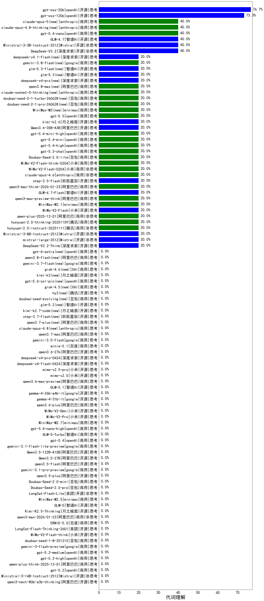

|类别|机构|大模型|【代词理解】准确率|平均耗时|平均消耗token|花费/千次（元）|排名（准确率）|
|---|---|-----|-------------------|-------|-----------|-----------|-----------|
|商用|openAI|gpt-5-2025-08-07(new)|76.7%|244s|271|14.8|1|
|开源|openAI|gpt-oss-20b(new)|76.7%|229s|658|0.6|2|
|商用|阿里巴巴|qwen3-max-preview(new)|73.3%|290s|278|5.4|3|
|商用|openAI|gpt-5-nano-2025-08-07(new)|73.3%|32s|1282|3.5|4|
|开源|openAI|gpt-oss-120b(new)|73.3%|295s|438|1.1|5|
|开源|智谱AI|GLM-4.5-Air(new)|73.3%|288s|1292|7.4|6|
|商用|豆包|doubao-seed-1-6-251015(new)|70.0%|37s|354|2.1|7|
|商用|腾讯|hunyuan-t1-20250711(new)|70.0%|18s|432|1.4|8|
|商用|阿里巴巴|qwen-turbo-think-2025-07-15(new)|70.0%|923s|923|2.6|9|
|商用|openAI|gpt-5-mini-2025-08-07(new)|70.0%|256s|620|8.0|10|
|商用|豆包|doubao-seed-1-6-lite-251015(new)|70.0%|14s|307|0.5|11|
|开源|豆包|Seed-OSS-36B-Instruct(new)|70.0%|310s|540|2.0|12|
|开源|阿里巴巴|Qwen3-30B-A3B-Thinking-2507(new)|70.0%|46s|1100|2.9|13|
|商用|智谱AI|GLM-4.5-Flash(new)|70.0%|38s|1275|0.0|14|
|开源|阿里巴巴|qwen3-235b-a22b-thinking-2507(new)|66.7%|329s|1462|22.9|15|
|开源|阿里巴巴|qwen3-next-80b-a3b-instruct(new)|66.7%|286s|355|1.2|16|
|开源|阿里巴巴|Qwen3-14B-nothink(new)|66.7%|15s|238|0.4|17|
|商用|阿里巴巴|qwen-flash-think-2025-07-28(new)|66.7%|294s|1101|1.6|18|
|开源|阿里巴巴|Qwen3-30B-A3B-Instruct-2507(new)|63.3%|312s|276|0.7|19|
|开源|阿里巴巴|Qwen3-32B-nothink(new)|63.3%|348s|237|0.7|20|
|开源|阿里巴巴|Qwen3-4B-nothink(new)|63.3%|341s|251|0.6|21|
|开源|深度求索|DeepSeek-V3.1-Think(new)|63.3%|22s|448|4.9|22|
|开源|阿里巴巴|qwen3-235b-a22b-instruct-2507(new)|63.3%|13s|254|1.6|23|
|开源|深度求索|DeepSeek-R1-0528(new)|63.2%|80s|991|15.1|24|
|开源|阿里巴巴|Qwen3-8B(new)|63.2%|36s|716|0.0|25|
|商用|腾讯|hunyuan-turbos-20250926(new)|60.0%|5s|274|0.4|26|
|开源|阿里巴巴|Qwen3-4B(new)|60.0%|71s|487|1.3|27|
|商用|openAI|gpt-5.1-medium(new)|60.0%|80s|463|27.3|28|
|开源|深度求索|DeepSeek-V3.1(new)|60.0%|10s|176|1.6|29|
|商用|阿里巴巴|qwen-flash-2025-07-28(new)|60.0%|312s|262|0.3|30|
|商用|阿里巴巴|qwen-turbo-2025-07-15(new)|56.7%|15s|233|0.1|31|
|商用|google|gemini-2.5-pro(new)|56.7%|251s|1247|86.0|32|
|商用|google|gemini-2.5-flash(new)|56.7%|204s|898|15.2|33|
|开源|智谱AI|GLM-4.5-Air-nothink(new)|53.3%|284s|397|2.0|34|
|商用|anthropic|claude-4-sonnet(new)|50.0%|44s|311|24.4|35|
|商用|openAI|o4-mini(new)|50.0%|19s|413|11.4|36|
|开源|meta|Llama-4-Scout-17B-16E-Instruct(new)|50.0%|10s|322|0.6|37|
|开源|智谱AI|GLM-4-9B-0414(new)|50.0%|5s|147|0|38|
|商用|百川智能|Baichuan4-Turbo(new)|46.7%|/|/|/|39|
|商用|智谱AI|GLM-4.5-Flash-nothink(new)|43.3%|12s|402|0.0|40|
|商用|google|gemini-2.5-flash-lite(new)|40.0%|216s|181|0.4|41|
|商用|openAI|gpt-5.4-nano(new)|40.0%|8s|165|0.8|42|
|开源|深度求索|DeepSeek-V3.2(new)|40.0%|99s|248|0.7|43|
|开源|智谱AI|GLM-4.7(new)|40.0%|97s|2545|34.8|44|
|商用|anthropic|claude-sonnet-4.5(new)|40.0%|10s|346|27.0|45|
|商用|anthropic|claude-haiku-4.5-thinking(new)|40.0%|34s|1218|39.4|46|
|商用|anthropic|claude-haiku-4.5(new)|40.0%|10s|458|12.7|47|
|开源|Mistral|Ministral-3-3B-Instruct-2512(new)|40.0%|5s|219|0.2|48|
|商用|openAI|gpt-5.1(new)|40.0%|245s|160|5.8|49|
|商用|豆包|Doubao-Seed-2.0-lite(new)|20.0%|183s|860|2.7|50|
|商用|腾讯|hunyuan-2.0-instruct-20251111(new)|20.0%|2s|283|0.4|51|
|商用|腾讯|hunyuan-2.0-thinking-20251109(new)|20.0%|12s|934|3.5|52|
|商用|阿里巴巴|qwen-plus-2025-12-01(new)|20.0%|15s|675|1.3|53|
|商用|openAI|gpt-5.3-chat(new)|20.0%|11s|307|22.4|54|
|开源|阿里巴巴|Qwen3.6-35B-A3B(new)|20.0%|94s|1291|13.2|55|
|开源|小米|MiMo-V2-Flash(new)|20.0%|4s|175|0.0|56|
|商用|openAI|gpt-5.4-high(new)|20.0%|7s|403|34.5|57|
|商用|minimax|MiniMax-M2.1(new)|20.0%|60s|879|6.7|58|
|商用|阿里巴巴|qwen3-max-preview-think(new)|20.0%|188s|1830|42.5|59|
|开源|智谱AI|GLM-4.7-Flash(new)|20.0%|1070s|1820|0.0|60|
|商用|阿里巴巴|qwen3-max-think-2026-01-23(new)|20.0%|82s|2656|26.0|61|
|商用|openAI|gpt-5.4-mini(new)|20.0%|11s|146|2.3|62|
|开源|阶跃星辰|step-3.5-flash(new)|20.0%|12s|1036|2.1|63|
|开源|Mistral|Ministral-3-8B-Instruct-2512(new)|20.0%|1s|156|0.2|64|
|商用|小米|MiMo-V2-Flash-0204(new)|20.0%|73s|250|0.4|65|
|商用|小米|MiMo-V2-Flash-think-0204(new)|20.0%|740s|1200|2.4|66|
|商用|openAI|gpt-5.4-mini-high(new)|20.0%|8s|706|19.9|67|
|商用|anthropic|claude-opus-4.6(new)|20.0%|6s|288|33.3|68|
|商用|openAI|gpt-5-nano-high(new)|20.0%|687s|4648|13.3|69|
|开源|月之暗面|kimi-k2.6(new)|20.0%|47s|1090|28.0|70|
|开源|阿里巴巴|Qwen3-14B(new)|20.0%|168s|915|1.7|71|
|开源|Mistral|mistral-large-2512(new)|20.0%|3s|151|0.9|72|
|商用|XAI|grok-4-1-fast-non-reasoning(new)|20.0%|83s|434|1.0|73|
|开源|月之暗面|kimi-k2-0905(new)|20.0%|58s|122|0.9|74|
|商用|openAI|gpt-5.1-high(new)|20.0%|29s|961|62.7|75|
|商用|百度|ERNIE-5.0-Thinking-Preview(new)|20.0%|185s|423|9.0|76|
|商用|百度|ERNIE-X1.1-Preview(new)|20.0%|94s|495|1.8|77|
|开源|阿里巴巴|Qwen3-32B(new)|20.0%|127s|768|2.9|78|
|开源|深度求索|DeepSeek-V3.2-Think(new)|20.0%|23s|685|2.0|79|
|商用|阿里巴巴|qwen3.6-plus(new)|0.0%|31s|1200|13.6|80|
|商用|openAI|gpt-5.4(new)|0.0%|8s|165|9.5|81|
|开源|阿里巴巴|qwen3.5-flash(new)|0.0%|324s|2268|4.4|82|
|开源|阿里巴巴|Qwen3.5-27B(new)|0.0%|111s|1912|8.9|83|
|商用|阿里巴巴|qwen3.6-max-preview(new)|0.0%|32s|1126|57.3|84|
|开源|阿里巴巴|Qwen3.5-122B-A10B(new)|0.0%|258s|1970|12.2|85|
|商用|google|gemini-3.1-flash-lite-preview(new)|0.0%|1s|165|1.1|86|
|开源|阿里巴巴|Qwen3-8B-nothink(new)|0.0%|11s|260|0.0|87|
|开源|智谱AI|GLM-5.1(new)|0.0%|72s|564|12.2|88|
|商用|anthropic|claude-4-sonnet-thinking(new)|0.0%|35s|408|33.8|89|
|商用|小米|MiMo-V2-Omni(new)|0.0%|329s|995|10.4|90|
|商用|智谱AI|GLM-5-Turbo(new)|0.0%|27s|530|10.4|91|
|商用|百度|ERNIE-X1-Turbo-32K(new)|0.0%|327s|443|1.6|92|
|商用|百度|ERNIE-4.5-Turbo-32K(new)|0.0%|3s|130|0.3|93|
|开源|阿里巴巴|qwen3.5-plus(new)|0.0%|22s|1603|7.4|94|
|开源|google|gemma-4-26b-a4b-it(new)|0.0%|21s|232|0.5|95|
|开源|google|gemma-4-31b-it(new)|0.0%|7s|189|0.4|96|
|商用|openAI|gpt-5.4-nano-high(new)|0.0%|31s|237|1.4|97|
|商用|minimax|MiniMax-M2.7(new)|0.0%|20s|623|4.6|98|
|商用|小米|MiMo-V2-Pro(new)|0.0%|167s|757|11.5|99|
|商用|google|gemini-3.1-pro-preview(new)|0.0%|28s|635|48.7|100|
|开源|Mistral|Ministral-3-14B-Instruct-2512(new)|0.0%|11s|229|0.3|101|
|商用|豆包|Doubao-Seed-2.0-mini(new)|0.0%|259s|1164|2.1|102|
|商用|阿里巴巴|qwen3-max-2025-09-23(new)|0.0%|214s|258|4.8|103|
|开源|阿里巴巴|qwen3-next-80b-a3b-thinking(new)|0.0%|151s|2544|9.9|104|
|商用|openAI|gpt-5.2(new)|0.0%|6s|125|4.6|105|
|商用|阿里巴巴|qwen-plus-think-2025-12-01(new)|0.0%|29s|1443|11.0|106|
|商用|openAI|gpt-5.2-high(new)|0.0%|6s|192|11.4|107|
|商用|openAI|gpt-5.2-medium(new)|0.0%|5s|181|10.2|108|
|商用|google|gemini-3-flash-preview(new)|0.0%|82s|581|11.0|109|
|商用|豆包|doubao-seed-1-8-251215(new)|0.0%|12s|284|1.4|110|
|商用|openAI|gpt-5-mini-high(new)|0.0%|913s|1936|26.9|111|
|开源|小米|MiMo-V2-Flash-think(new)|0.0%|10s|1138|0.0|112|
|商用|anthropic|claude-opus-4.5(new)|0.0%|19s|465|65.4|113|
|开源|月之暗面|Kimi-K2-Thinking(new)|0.0%|41s|758|11.3|114|
|开源|美团|LongCat-Flash-Thinking-2601(new)|0.0%|104s|804|0.0|115|
|商用|百度|ERNIE-5.0(new)|0.0%|180s|1806|42.2|116|
|商用|阿里巴巴|qwen3-max-2026-01-23(new)|0.0%|31s|254|2.0|117|
|商用|anthropic|claude-sonnet-4.5-thinking(new)|0.0%|13s|934|88.4|118|
|开源|月之暗面|Kimi-K2.5-Thinking(new)|0.0%|123s|559|10.6|119|
|开源|智谱AI|GLM-5(new)|0.0%|34s|1075|18.3|120|
|商用|minimax|MiniMax-M2.5(new)|0.0%|17s|685|5.1|121|
|开源|美团|LongCat-Flash-Lite(new)|0.0%|14s|113|0.0|122|
|商用|豆包|Doubao-Seed-2.0-pro(new)|0.0%|133s|735|10.2|123|
|商用|XAI|grok-4-1-fast-reasoning(new)|0.0%|87s|668|1.9|124|

