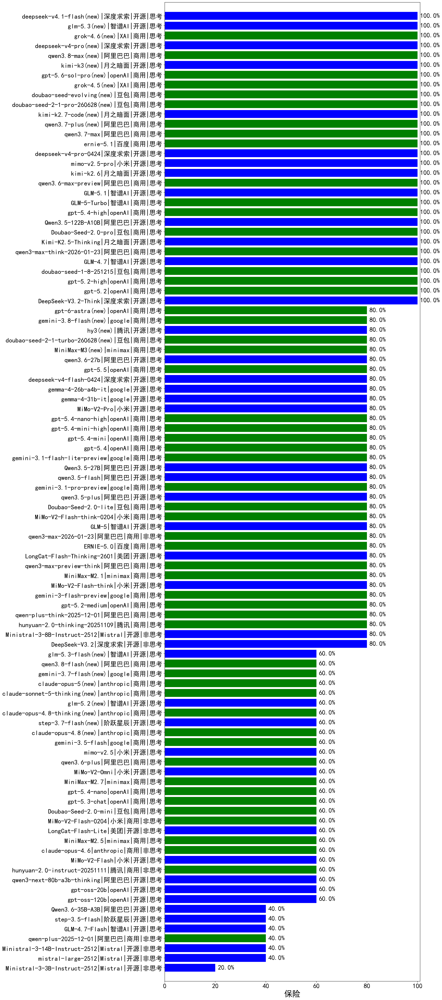

|类别|机构|大模型|【保险】准确率|平均耗时|平均消耗token|花费/千次（元）|排名（准确率）|
|---|---|-----|-------------------|-------|-----------|-----------|-----------|
|商用|阿里巴巴|qwen3.7-max|100.0%|23s|1042|35.2|1|
|商用|openAI|gpt-5.6-sol-pro(new)|100.0%|54s|5076|487.9|2|
|开源|阿里巴巴|Qwen3.5-122B-A10B|100.0%|369s|3317|20.7|3|
|开源|智谱AI|GLM-4.7|100.0%|61s|2842|38.8|4|
|商用|豆包|doubao-seed-2-1-pro-260628(new)|100.0%|477s|9787|290.3|5|
|商用|豆包|Doubao-Seed-2.0-pro|100.0%|263s|1162|16.8|6|
|开源|小米|mimo-v2.5-pro|100.0%|28s|1747|31.9|7|
|开源|月之暗面|kimi-k2.7-code(new)|100.0%|69s|2503|65.8|8|
|开源|深度求索|deepseek-v4-pro-0424|100.0%|47s|1299|30.2|9|
|开源|深度求索|DeepSeek-V3.2-Think|100.0%|157s|1523|4.5|10|
|商用|阿里巴巴|qwen3.7-plus(new)|100.0%|27s|1413|10.7|11|
|开源|月之暗面|Kimi-K2.5-Thinking|100.0%|496s|2466|50.3|12|
|商用|阿里巴巴|qwen3-max-think-2026-01-23|100.0%|387s|4692|46.2|13|
|商用|openAI|gpt-5.2|100.0%|8s|228|13.2|14|
|商用|openAI|gpt-5.2-high|100.0%|37s|1256|115.5|15|
|商用|百度|ernie-5.1|100.0%|54s|1044|17.5|16|
|商用|豆包|doubao-seed-1-8-251215|100.0%|31s|840|5.7|17|
|商用|XAI|grok-4.5(new)|100.0%|58s|1765|65.9|18|
|商用|豆包|doubao-seed-evolving(new)|100.0%|237s|7808|231.0|19|
|商用|openAI|gpt-5.4-high|100.0%|18s|1061|102.0|20|
|商用|阿里巴巴|qwen3.8-max(new)|100.0%|18s|904|29.3|21|
|开源|智谱AI|glm-5.3(new)|100.0%|103s|4144|114.1|22|
|开源|月之暗面|kimi-k3(new)|100.0%|52s|1070|93.9|23|
|商用|XAI|grok-4.6(new)|100.0%|37s|1885|70.9|24|
|商用|智谱AI|GLM-5-Turbo|100.0%|40s|1676|35.4|25|
|开源|深度求索|deepseek-v4-pro(new)|100.0%|78s|2276|58.5|26|
|商用|阿里巴巴|qwen3.6-max-preview|100.0%|61s|1998|103.6|27|
|开源|深度求索|DeepSeek-V3.1-Think|100.0%|50s|1020|11.6|28|
|开源|智谱AI|GLM-5.1|100.0%|170s|1365|31.2|29|
|开源|月之暗面|kimi-k2.6|100.0%|91s|1693|44.0|30|
|商用|百度|ERNIE-5.0|80.0%|287s|3230|76.1|31|
|开源|阿里巴巴|qwen3.6-27b|80.0%|30s|1898|32.7|32|
|开源|美团|LongCat-Flash-Thinking-2601|80.0%|349s|4589|0.0|33|
|商用|openAI|gpt-5.4-nano-high|80.0%|13s|720|5.5|34|
|商用|阿里巴巴|qwen3-max-2026-01-23|80.0%|17s|589|5.1|35|
|商用|阿里巴巴|qwen3-max-preview-think|80.0%|237s|3112|72.9|36|
|开源|小米|MiMo-V2-Pro|80.0%|20s|1437|25.4|37|
|商用|openAI|gpt-5.4-mini-high|80.0%|27s|2811|85.7|38|
|商用|google|gemini-3.1-flash-lite-preview|80.0%|4s|441|3.8|39|
|商用|openAI|gpt-5.4-mini|80.0%|89s|256|5.2|40|
|商用|openAI|gpt-5.5|80.0%|34s|2064|414.5|41|
|开源|智谱AI|GLM-5|80.0%|91s|2969|52.2|42|
|开源|深度求索|deepseek-v4-flash-0424|80.0%|42s|1592|3.1|43|
|商用|小米|MiMo-V2-Flash-think-0204|80.0%|956s|2420|4.9|44|
|商用|豆包|Doubao-Seed-2.0-lite|80.0%|225s|1156|3.7|45|
|开源|阿里巴巴|qwen3.5-plus|80.0%|39s|3238|15.2|46|
|商用|openAI|gpt-5.4|80.0%|3s|268|18.6|47|
|商用|google|gemini-3.1-pro-preview|80.0%|30s|1814|147.7|48|
|开源|阿里巴巴|qwen3.5-flash|80.0%|411s|4150|8.1|49|
|开源|阿里巴巴|Qwen3.5-27B|80.0%|195s|3771|17.7|50|
|商用|minimax|MiniMax-M2.1|80.0%|225s|9048|75.3|51|
|商用|google|gemini-3.8-flash(new)|80.0%|11s|848|40.4|52|
|开源|小米|MiMo-V2-Flash-think|80.0%|29s|2880|0.0|53|
|商用|anthropic|claude-opus-4.5|80.0%|10s|652|95.4|54|
|商用|openAI|gpt-5-mini-2025-08-07|80.0%|38s|896|11.6|55|
|商用|阿里巴巴|qwen-flash-2025-07-28|80.0%|9s|756|1.0|56|
|开源|深度求索|DeepSeek-V3.1|80.0%|17s|294|2.9|57|
|商用|阿里巴巴|qwen3-max-preview|80.0%|11s|502|10.3|58|
|开源|阿里巴巴|qwen3-next-80b-a3b-instruct|80.0%|7s|544|1.9|59|
|商用|豆包|doubao-seed-1-6-lite-251015|80.0%|40s|1066|2.3|60|
|商用|openAI|gpt-5.1-medium|80.0%|202s|825|51.8|61|
|商用|anthropic|claude-haiku-4.5-thinking|80.0%|38s|3996|139.3|62|
|开源|腾讯|hy3(new)|80.0%|31s|249|0.7|63|
|开源|月之暗面|kimi-k2-0905|80.0%|63s|355|4.4|64|
|商用|豆包|doubao-seed-2-1-turbo-260628(new)|80.0%|302s|12235|181.9|65|
|商用|百度|ERNIE-5.0-Thinking-Preview|80.0%|279s|1828|42.5|66|
|开源|google|gemma-4-26b-a4b-it|80.0%|65s|570|1.4|67|
|商用|阿里巴巴|qwen3-max-2025-09-23|80.0%|24s|564|11.7|68|
|开源|google|gemma-4-31b-it|80.0%|94s|600|1.5|69|
|商用|google|gemini-3-flash-preview|80.0%|87s|1527|30.8|70|
|开源|深度求索|DeepSeek-V3.2|80.0%|23s|451|1.3|71|
|商用|openAI|gpt-5.2-medium|80.0%|9s|574|47.7|72|
|商用|阿里巴巴|qwen-plus-think-2025-12-01|80.0%|101s|4249|33.3|73|
|开源|Mistral|Ministral-3-8B-Instruct-2512|80.0%|10s|561|0.6|74|
|商用|minimax|MiniMax-M3(new)|80.0%|28s|782|10.0|75|
|商用|openAI|gpt-5-mini-high|80.0%|92s|2506|35.0|76|
|商用|腾讯|hunyuan-2.0-thinking-20251109|80.0%|14s|1099|4.2|77|
|开源|智谱AI|glm-5.3-flash(new)|60.0%|70s|2811|7.7|78|
|商用|阿里巴巴|qwen3.8-flash(new)|60.0%|119s|6530|17.4|79|
|商用|google|gemini-3.7-flash(new)|60.0%|7s|883|21.2|80|
|商用|anthropic|claude-opus-4.8(new)|60.0%|10s|649|93.4|81|
|商用|anthropic|claude-opus-5(new)|60.0%|17s|1008|156.2|82|
|开源|阶跃星辰|step-3.7-flash(new)|60.0%|186s|4674|37.2|83|
|商用|anthropic|claude-sonnet-5-thinking(new)|60.0%|19s|1364|87.5|84|
|商用|anthropic|claude-opus-4.8-thinking(new)|60.0%|25s|988|152.8|85|
|商用|google|gemini-3.5-flash|60.0%|10s|1842|111.0|86|
|开源|智谱AI|glm-5.2(new)|60.0%|77s|3254|89.2|87|
|开源|小米|mimo-v2.5|60.0%|24s|1659|19.4|88|
|开源|openAI|gpt-oss-120b|60.0%|7s|735|2.0|89|
|商用|阿里巴巴|qwen3.6-plus|60.0%|54s|2266|26.2|90|
|商用|豆包|doubao-seed-1-6-251015|60.0%|8s|865|6.0|91|
|商用|百度|ERNIE-X1.1-Preview|60.0%|144s|1231|4.7|92|
|商用|anthropic|claude-sonnet-4.5-thinking|60.0%|49s|3336|347.6|93|
|商用|openAI|gpt-5.1-high|60.0%|40s|1646|110.1|94|
|商用|XAI|grok-4-1-fast-reasoning|60.0%|94s|2341|7.8|95|
|商用|anthropic|claude-haiku-4.5|60.0%|13s|635|18.4|96|
|商用|openAI|gpt-5.1|60.0%|248s|310|15.3|97|
|商用|腾讯|hunyuan-turbos-20250926|60.0%|17s|721|1.3|98|
|开源|小米|MiMo-V2-Omni|60.0%|15s|1517|17.4|99|
|开源|豆包|Seed-OSS-36B-Instruct|60.0%|113s|2107|8.2|100|
|商用|阿里巴巴|qwen-turbo-think-2025-07-15|60.0%|/|2655|7.7|101|
|商用|google|gemini-2.5-flash-lite|60.0%|3s|508|1.3|102|
|商用|阿里巴巴|qwen-flash-think-2025-07-28|60.0%|42s|4386|6.4|103|
|商用|openAI|gpt-5-nano-2025-08-07|60.0%|135s|2134|5.9|104|
|商用|openAI|gpt-5-2025-08-07|60.0%|79s|479|28.2|105|
|商用|openAI|gpt-5-nano-high|60.0%|1024s|7192|20.6|106|
|开源|阿里巴巴|qwen3-next-80b-a3b-thinking|60.0%|84s|3397|13.3|107|
|商用|anthropic|claude-opus-4.6|60.0%|24s|661|95.3|108|
|开源|openAI|gpt-oss-20b|60.0%|12s|1117|1.2|109|
|商用|minimax|MiniMax-M2.7|60.0%|70s|2491|20.2|110|
|商用|openAI|gpt-5.4-nano|60.0%|11s|237|1.3|111|
|商用|openAI|gpt-5.3-chat|60.0%|69s|547|44.3|112|
|商用|豆包|Doubao-Seed-2.0-mini|60.0%|635s|3149|6.0|113|
|商用|小米|MiMo-V2-Flash-0204|60.0%|95s|492|0.9|114|
|开源|美团|LongCat-Flash-Lite|60.0%|406s|580|0.0|115|
|商用|minimax|MiniMax-M2.5|60.0%|65s|2621|21.3|116|
|开源|小米|MiMo-V2-Flash|60.0%|11s|461|0.0|117|
|商用|腾讯|hunyuan-2.0-instruct-20251111|60.0%|4s|335|0.5|118|
|开源|阶跃星辰|step-3.5-flash|40.0%|31s|2738|5.6|119|
|开源|Mistral|Ministral-3-14B-Instruct-2512|40.0%|10s|468|0.7|120|
|开源|月之暗面|Kimi-K2-Thinking|40.0%|907s|15863|252.8|121|
|开源|智谱AI|GLM-4.7-Flash|40.0%|1756s|15265|0.0|122|
|商用|anthropic|claude-sonnet-4.5|40.0%|8s|588|51.2|123|
|商用|阿里巴巴|qwen-plus-2025-12-01|40.0%|29s|1168|2.2|124|
|开源|阿里巴巴|Qwen3.6-35B-A3B|40.0%|429s|2089|21.7|125|
|开源|Mistral|mistral-large-2512|40.0%|12s|472|4.2|126|
|商用|XAI|grok-4-1-fast-non-reasoning|20.0%|5s|711|2.0|127|
|开源|Mistral|Ministral-3-3B-Instruct-2512|20.0%|8s|610|0.4|128|

