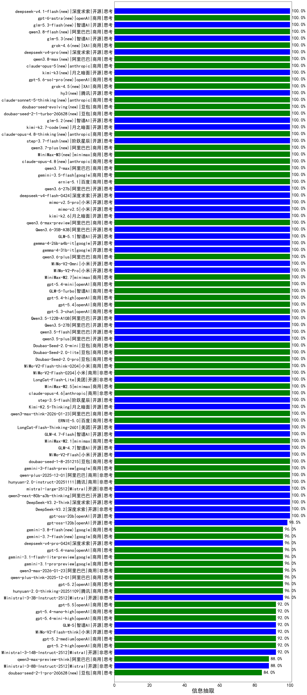

|类别|机构|大模型|【信息抽取】准确率|平均耗时|平均消耗token|花费/千次（元）|排名（准确率）|
|---|---|-----|-------------------|-------|-----------|-----------|-----------|
|商用|minimax|MiniMax-M2.7(new)|100.0%|15s|732|5.1|1|
|开源|深度求索|DeepSeek-V3.2-Exp-Think|100.0%|548s|688|2.0|2|
|商用|智谱AI|GLM-4.5-Flash-nothink|100.0%|5s|184|0.0|3|
|开源|智谱AI|GLM-4.5-Air-nothink|100.0%|2s|183|0.6|4|
|开源|智谱AI|GLM-4.5-nothink|100.0%|5s|214|1.9|5|
|开源|阶跃星辰|step-3|100.0%|55s|1104|4.2|6|
|开源|阿里巴巴|Qwen3-30B-A3B-Thinking-2507|100.0%|31s|1446|3.8|7|
|开源|阿里巴巴|Qwen3-30B-A3B-Instruct-2507|100.0%|1s|179|0.3|8|
|开源|Mistral|mistral-large-2512|100.0%|6s|394|2.6|9|
|商用|腾讯|hunyuan-2.0-instruct-20251111|100.0%|4s|287|0.4|10|
|商用|智谱AI|GLM-4.5-Flash|100.0%|16s|950|0.0|11|
|开源|阿里巴巴|Qwen3-32B-nothink|100.0%|9s|192|0.5|12|
|商用|阿里巴巴|qwen-plus-2025-12-01|100.0%|7s|366|0.6|13|
|商用|google|gemini-3-flash-preview|100.0%|49s|685|11.9|14|
|商用|豆包|doubao-seed-1-8-251215|100.0%|11s|542|2.9|15|
|开源|小米|MiMo-V2-Flash|100.0%|12s|317|0.0|16|
|开源|智谱AI|GLM-4.7|100.0%|29s|1467|19.0|17|
|开源|阿里巴巴|qwen3-next-80b-a3b-thinking|100.0%|56s|2719|10.4|18|
|开源|openAI|gpt-oss-20b|100.0%|4s|579|0.5|19|
|开源|深度求索|DeepSeek-V3.2-Think|100.0%|103s|737|2.1|20|
|商用|XAI|grok-4-1-fast-non-reasoning|100.0%|77s|459|1.0|21|
|开源|阿里巴巴|qwen3-next-80b-a3b-instruct|100.0%|9s|226|0.6|22|
|商用|豆包|doubao-seed-1-6-251015|100.0%|3s|417|2.4|23|
|开源|月之暗面|Kimi-K2-Thinking|100.0%|57s|579|7.7|24|
|商用|anthropic|claude-haiku-4.5|100.0%|6s|606|13.7|25|
|商用|阿里巴巴|qwen-plus-think-2025-07-28|100.0%|/|1375|10.3|26|
|商用|XAI|grok-4-1-fast-reasoning|100.0%|4s|716|1.9|27|
|商用|anthropic|claude-sonnet-4.5-thinking|100.0%|9s|880|69.7|28|
|商用|openAI|gpt-5-mini-2025-08-07|100.0%|125s|575|6.9|29|
|商用|openAI|gpt-5-mini-high|100.0%|685s|1582|20.7|30|
|开源|深度求索|DeepSeek-V3.1-Think|100.0%|28s|574|6.2|31|
|商用|openAI|gpt-5-nano-high|100.0%|76s|2550|6.9|32|
|商用|阿里巴巴|qwen-flash-think-2025-07-28|100.0%|16s|1435|2.0|33|
|商用|阿里巴巴|qwen-flash-2025-07-28|100.0%|4s|181|0.1|34|
|开源|深度求索|DeepSeek-V3.2|100.0%|5s|236|0.6|35|
|商用|minimax|MiniMax-M2.1|100.0%|11s|577|3.8|36|
|开源|阿里巴巴|qwen3-235b-a22b-thinking-2507|100.0%|27s|1459|27.4|37|
|开源|阿里巴巴|qwen3-235b-a22b-instruct-2507|100.0%|2s|176|0.8|38|
|开源|阿里巴巴|qwen3.5-flash(new)|100.0%|251s|1657|3.1|39|
|开源|深度求索|DeepSeek-R1-0528|100.0%|173s|1038|15.5|40|
|商用|openAI|o4-mini|100.0%|20s|715|17.9|41|
|商用|豆包|Doubao-Seed-2.0-lite(new)|100.0%|162s|882|2.6|42|
|商用|豆包|Doubao-Seed-2.0-mini(new)|100.0%|227s|1025|1.7|43|
|开源|阿里巴巴|qwen3.5-plus(new)|100.0%|34s|2324|10.6|44|
|开源|阿里巴巴|Qwen3-8B|100.0%|6s|657|0.0|45|
|开源|阿里巴巴|Qwen3.5-27B(new)|100.0%|122s|1899|8.5|46|
|商用|小米|MiMo-V2-Flash-think-0204(new)|100.0%|96s|1628|3.2|47|
|开源|阿里巴巴|Qwen3.5-122B-A10B(new)|100.0%|285s|1838|11.0|48|
|商用|openAI|gpt-5.3-chat(new)|100.0%|9s|291|13.1|49|
|商用|openAI|gpt-5.4(new)|100.0%|5s|312|17.0|50|
|商用|openAI|gpt-5.4-high(new)|100.0%|23s|535|40.4|51|
|商用|智谱AI|GLM-5-Turbo(new)|100.0%|42s|1130|22.5|52|
|商用|openAI|gpt-5.4-mini(new)|100.0%|3s|306|4.9|53|
|商用|豆包|Doubao-Seed-2.0-pro(new)|100.0%|195s|954|12.6|54|
|商用|小米|MiMo-V2-Flash-0204(new)|100.0%|46s|318|0.4|55|
|开源|智谱AI|GLM-4.7-Flash|100.0%|221s|1248|0.0|56|
|商用|阿里巴巴|qwen3-max-think-2026-01-23|100.0%|79s|2051|19.4|57|
|商用|阿里巴巴|qwen-turbo-2025-07-15|100.0%|5s|165|0.1|58|
|商用|腾讯|hunyuan-t1-20250711|100.0%|7s|445|1.4|59|
|开源|美团|LongCat-Flash-Thinking-2601|100.0%|383s|1690|0.0|60|
|商用|XAI|grok-3-mini|100.0%|174s|672|2.3|61|
|商用|XAI|grok-4-0709|100.0%|163s|587|55.3|62|
|商用|百度|ERNIE-5.0|100.0%|89s|820|17.5|63|
|开源|月之暗面|Kimi-K2.5-Thinking|100.0%|129s|709|12.7|64|
|商用|anthropic|claude-4-sonnet|100.0%|40s|597|37.9|65|
|开源|阶跃星辰|step-3.5-flash|100.0%|8s|740|1.4|66|
|商用|anthropic|claude-opus-4.6|100.0%|6s|504|50.4|67|
|商用|minimax|MiniMax-M2.5(new)|100.0%|14s|911|6.6|68|
|商用|豆包|doubao-seed-1-6-flash-thinking-250615|100.0%|3s|304|0.3|69|
|开源|美团|LongCat-Flash-Lite(new)|100.0%|87s|219|0.0|70|
|商用|anthropic|claude-4-sonnet-thinking|100.0%|5s|550|36.4|71|
|开源|深度求索|DeepSeek-V3.2-Exp|100.0%|469s|182|0.5|72|
|开源|智谱AI|GLM-4.6|99.3%|30s|1196|15.7|73|
|商用|阿里巴巴|qwen-plus-2025-07-28|99.3%|3s|187|0.3|74|
|商用|阿里巴巴|qwen-turbo-think-2025-07-15|99.3%|/|664|1.7|75|
|商用|openAI|gpt-5-2025-08-07|99.3%|20s|393|21.5|76|
|开源|智谱AI|GLM-4.5|99.3%|102s|1199|15.8|77|
|开源|腾讯|Hunyuan-A13B-Instruct|99.3%|39s|386|1.3|78|
|开源|百度|ERNIE-4.5-21B-A3B|99.3%|7s|155|0.0|79|
|商用|百度|ERNIE-4.5-Turbo-32K|99.3%|3s|138|0.2|80|
|商用|openAI|gpt-5-nano-2025-08-07|99.3%|68s|1030|2.7|81|
|商用|阿里巴巴|qwen3-max-preview|99.3%|2s|185|2.7|82|
|开源|豆包|Seed-OSS-36B-Instruct|99.3%|43s|475|1.6|83|
|商用|百度|ERNIE-X1-Turbo-32K|98.5%|33s|794|2.9|84|
|开源|百度|ERNIE-4.5-300B-A47B|98.5%|1s|149|0.6|85|
|开源|minimax|MiniMax-M2|98.5%|9s|665|4.8|86|
|商用|google|gemini-2.5-pro|98.5%|14s|1298|87.8|87|
|开源|智谱AI|GLM-4.5-Air|98.5%|23s|984|5.4|88|
|商用|豆包|doubao-seed-1-6-lite-251015|98.5%|6s|393|0.7|89|
|开源|openAI|gpt-oss-120b|98.5%|121s|424|1.0|90|
|商用|腾讯|hunyuan-turbos-20250926|98.5%|3s|220|0.3|91|
|开源|阿里巴巴|Qwen3-32B|97.8%|2s|186|0.4|92|
|开源|meta|Llama-4-Maverick-17B-128E-Instruct-FP8|97.8%|1s|273|0.7|93|
|开源|深度求索|DeepSeek-V3.1|97.8%|7s|179|1.4|94|
|开源|阿里巴巴|Qwen3-8B-nothink|97.8%|10s|195|0.0|95|
|商用|google|gemini-2.5-flash-lite|97.8%|0s|175|0.3|96|
|开源|Mistral|Mistral-Small-3.2-24B-Instruct-2506|97.8%|342s|236|0.3|97|
|商用|科大讯飞|xunfei-spark-x1-0725|97.0%|/|361|4.3|98|
|开源|阿里巴巴|Qwen3-14B|97.0%|7s|559|1.0|99|
|开源|阿里巴巴|Qwen3-1.7B|97.0%|4s|609|1.6|100|
|商用|Mistral|mistral-medium-2508|97.0%|13s|272|2.3|101|
|开源|阿里巴巴|Qwen3-14B-nothink|97.0%|7s|191|0.2|102|
|商用|google|gemini-2.5-flash|97.0%|4s|875|14.3|103|
|开源|深度求索|DeepSeek-R1-0528-Qwen3-8B|96.3%|280s|831|0.0|104|
|商用|openAI|gpt-5.4-nano(new)|96.0%|15s|316|1.4|105|
|商用|google|gemini-3.1-flash-lite-preview(new)|96.0%|2s|241|1.2|106|
|商用|google|gemini-3.1-pro-preview(new)|96.0%|16s|1126|85.0|107|
|商用|anthropic|claude-haiku-4.5-thinking|96.0%|7s|970|26.1|108|
|商用|google|gemini-3-pro-preview|96.0%|57s|1265|96.9|109|
|商用|阿里巴巴|qwen3-max-2025-09-23|96.0%|155s|248|3.3|110|
|商用|阿里巴巴|qwen3-max-2026-01-23|96.0%|56s|240|1.3|111|
|商用|openAI|gpt-5.1-high|96.0%|140s|509|24.9|112|
|开源|Mistral|Ministral-3-3B-Instruct-2512|96.0%|12s|460|0.3|113|
|商用|阿里巴巴|qwen-plus-think-2025-12-01|96.0%|45s|2183|16.4|114|
|商用|anthropic|claude-opus-4.5|96.0%|14s|444|40.6|115|
|商用|百度|ERNIE-5.0-Thinking-Preview|96.0%|261s|776|16.4|116|
|商用|腾讯|hunyuan-2.0-thinking-20251109|96.0%|11s|707|2.4|117|
|商用|openAI|gpt-5.2|96.0%|6s|325|16.7|118|
|开源|google|gemma-3-27b-it|95.6%|/|/|/|119|
|开源|google|gemma-3-12b-it|95.6%|/|/|/|120|
|开源|阿里巴巴|Qwen3-4B|95.6%|10s|180|0.3|121|
|商用|豆包|doubao-seed-1-6-flash-250615|95.6%|2s|147|0.1|122|
|开源|阿里巴巴|Qwen3-1.7B-nothink|95.6%|6s|212|0.4|123|
|开源|阿里巴巴|Qwen3-4B-nothink|95.6%|7s|190|0.3|124|
|商用|豆包|doubao-seed-1-6-250615|94.1%|14s|176|0.5|125|
|开源|腾讯|Hunyuan-A13B-Instruct-nothink|94.1%|3s|148|0.3|126|
|开源|智谱AI|GLM-4-9B-0414|94.1%|7s|167|0.0|127|
|商用|百川智能|Baichuan4-Turbo|93.3%|/|/|/|128|
|开源|阿里巴巴|Qwen3-0.6B-nothink|92.6%|8s|156|0.2|129|
|开源|meta|Llama-4-Scout-17B-16E-Instruct|92.6%|2s|272|0.4|130|
|开源|月之暗面|kimi-k2-0905|92.0%|35s|215|1.7|131|
|商用|openAI|gpt-5.1-medium|92.0%|50s|396|16.9|132|
|商用|openAI|gpt-5.4-nano-high(new)|92.0%|4s|379|2.0|133|
|商用|openAI|gpt-5.4-mini-high(new)|92.0%|81s|484|10.5|134|
|商用|openAI|gpt-5.1|92.0%|110s|331|12.3|135|
|商用|百度|ERNIE-X1.1-Preview|92.0%|84s|616|2.1|136|
|开源|Mistral|Ministral-3-14B-Instruct-2512|92.0%|11s|692|1.0|137|
|商用|anthropic|claude-sonnet-4.5(new)|92.0%|4s|515|32.5|138|
|开源|小米|MiMo-V2-Flash-think|92.0%|23s|1334|0.0|139|
|商用|openAI|gpt-5.2-medium|92.0%|4s|318|16.0|140|
|商用|openAI|gpt-5.2-high|92.0%|5s|323|16.4|141|
|开源|智谱AI|GLM-5(new)|92.0%|31s|1163|19.0|142|
|开源|google|gemma-3-4b-it|91.9%|/|/|/|143|
|商用|百川智能|Baichuan4-Air|91.9%|/|/|/|144|
|开源|Mistral|Ministral-3-8B-Instruct-2512|88.0%|13s|548|0.6|145|
|商用|阿里巴巴|qwen3-max-preview-think|88.0%|144s|1171|25.4|146|
|开源|阿里巴巴|Qwen3-0.6B|81.5%|1s|433|1.0|147|
|开源|百度|ERNIE-4.5-0.3B|80.7%|9s|152|0.0|148|

