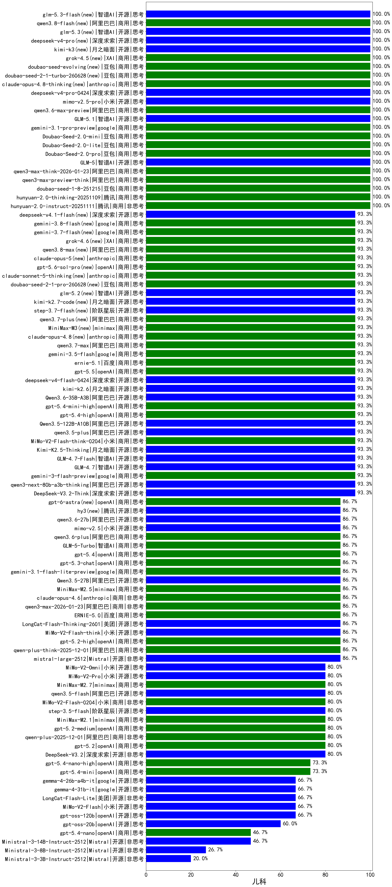

|类别|机构|大模型|【儿科】准确率|平均耗时|平均消耗token|花费/千次（元）|排名（准确率）|
|---|---|-----|-------------------|-------|-----------|-----------|-----------|
|商用|小米|mimo-v2.5-pro(new)|100.0%|22s|1392|24.7|1|
|商用|google|gemini-3.1-pro-preview(new)|100.0%|38s|1732|141.9|2|
|商用|腾讯|hunyuan-2.0-instruct-20251111(new)|100.0%|21s|541|0.9|3|
|商用|豆包|doubao-seed-1-8-251215(new)|100.0%|31s|830|5.8|4|
|商用|阿里巴巴|qwen3-max-preview-think(new)|100.0%|165s|2394|55.9|5|
|商用|阿里巴巴|qwen3-max-think-2026-01-23(new)|100.0%|119s|3140|30.8|6|
|商用|豆包|doubao-seed-1-6-251015(new)|100.0%|10s|732|5.1|7|
|商用|腾讯|hunyuan-turbos-20250926(new)|100.0%|18s|744|1.4|8|
|商用|阿里巴巴|qwen3-max-preview(new)|100.0%|14s|594|12.8|9|
|开源|智谱AI|GLM-5(new)|100.0%|89s|2286|40.1|10|
|商用|openAI|gpt-5-2025-08-07(new)|100.0%|18s|279|14.5|11|
|商用|豆包|Doubao-Seed-2.0-pro(new)|100.0%|213s|1006|14.6|12|
|商用|豆包|Doubao-Seed-2.0-lite(new)|100.0%|197s|881|2.8|13|
|商用|豆包|Doubao-Seed-2.0-mini(new)|100.0%|338s|2020|3.8|14|
|商用|腾讯|hunyuan-2.0-thinking-20251109(new)|100.0%|27s|824|3.1|15|
|商用|阿里巴巴|qwen3.6-max-preview(new)|100.0%|54s|1772|92.2|16|
|开源|智谱AI|GLM-5.1(new)|100.0%|165s|1594|36.9|17|
|商用|腾讯|hunyuan-t1-20250711(new)|93.3%|36s|2111|8.1|18|
|商用|小米|MiMo-V2-Flash-think-0204(new)|93.3%|918s|2256|4.6|19|
|开源|阿里巴巴|qwen3-next-80b-a3b-thinking(new)|93.3%|111s|3298|12.9|20|
|开源|深度求索|DeepSeek-V3.2-Think(new)|93.3%|76s|1161|3.4|21|
|商用|google|gemini-3-flash-preview(new)|93.3%|72s|1208|24.3|22|
|开源|月之暗面|kimi-k2.6(new)|93.3%|113s|2254|59.3|23|
|开源|智谱AI|GLM-4.7(new)|93.3%|59s|2552|34.9|24|
|商用|anthropic|claude-sonnet-4.5(new)|93.3%|13s|700|65.4|25|
|开源|智谱AI|GLM-4.7-Flash(new)|93.3%|1393s|6936|0.0|26|
|开源|阿里巴巴|Qwen3.6-35B-A3B(new)|93.3%|17s|2163|22.6|27|
|开源|月之暗面|Kimi-K2.5-Thinking(new)|93.3%|435s|2088|42.6|28|
|开源|月之暗面|Kimi-K2-Thinking(new)|93.3%|138s|2082|32.4|29|
|开源|豆包|Seed-OSS-36B-Instruct(new)|93.3%|62s|1413|5.5|30|
|开源|深度求索|DeepSeek-V3.1(new)|93.3%|17s|364|3.8|31|
|商用|openAI|gpt-5.4-mini-high(new)|93.3%|43s|1071|31.2|32|
|商用|openAI|gpt-5.4-high(new)|93.3%|17s|962|92.5|33|
|开源|阿里巴巴|qwen3.5-plus(new)|93.3%|44s|3707|17.5|34|
|开源|阿里巴巴|qwen3-235b-a22b-instruct-2507(new)|93.3%|16s|657|4.8|35|
|开源|阿里巴巴|Qwen3.5-122B-A10B(new)|93.3%|389s|4108|25.9|36|
|商用|百度|ERNIE-4.5-Turbo-32K(new)|90.0%|23s|584|1.7|37|
|开源|小米|MiMo-V2-Flash-think(new)|86.7%|106s|2303|0.0|38|
|商用|智谱AI|GLM-4.5-Flash(new)|86.7%|40s|2032|0.0|39|
|开源|阿里巴巴|Qwen3.5-27B(new)|86.7%|330s|3331|15.7|40|
|商用|百度|ERNIE-X1.1-Preview(new)|86.7%|84s|680|2.5|41|
|商用|阿里巴巴|qwen3-max-2025-09-23(new)|86.7%|292s|585|12.6|42|
|开源|美团|LongCat-Flash-Thinking-2601(new)|86.7%|204s|2585|0.0|43|
|商用|google|gemini-3.1-flash-lite-preview(new)|86.7%|13s|457|4.1|44|
|开源|月之暗面|kimi-k2-0905(new)|86.7%|73s|430|5.7|45|
|商用|openAI|gpt-5.3-chat(new)|86.7%|29s|501|40.8|46|
|开源|阿里巴巴|qwen3-235b-a22b-thinking-2507(new)|86.7%|127s|2640|51.3|47|
|开源|Mistral|mistral-large-2512(new)|86.7%|15s|647|6.1|48|
|商用|openAI|gpt-5.2-high(new)|86.7%|8s|547|45.9|49|
|商用|阿里巴巴|qwen-plus-think-2025-12-01(new)|86.7%|75s|2904|22.6|50|
|商用|小米|mimo-v2.5(new)|86.7%|21s|1471|17.0|51|
|商用|openAI|gpt-5.1-high(new)|86.7%|75s|965|62.5|52|
|商用|阿里巴巴|qwen3.6-plus(new)|86.7%|37s|1802|20.9|53|
|商用|百度|ERNIE-5.0(new)|86.7%|148s|2284|53.7|54|
|商用|阿里巴巴|qwen3-max-2026-01-23(new)|86.7%|104s|651|5.9|55|
|商用|智谱AI|GLM-5-Turbo(new)|86.7%|36s|1563|33.1|56|
|商用|豆包|doubao-seed-1-6-lite-251015(new)|86.7%|29s|807|1.7|57|
|商用|智谱AI|GLM-4.5-Flash-nothink(new)|86.7%|19s|1032|0.0|58|
|商用|openAI|gpt-5.4(new)|86.7%|6s|350|28.3|59|
|商用|minimax|MiniMax-M2.5(new)|86.7%|32s|1430|11.4|60|
|商用|阿里巴巴|qwen-flash-think-2025-07-28(new)|86.7%|30s|3093|4.5|61|
|商用|anthropic|claude-opus-4.6(new)|86.7%|21s|728|110.5|62|
|开源|深度求索|DeepSeek-V3.1-Think(new)|86.7%|58s|1126|12.9|63|
|开源|阿里巴巴|qwen3.5-flash(new)|80.0%|327s|4474|8.8|64|
|商用|openAI|gpt-5.2-medium(new)|80.0%|9s|423|33.6|65|
|商用|小米|MiMo-V2-Flash-0204(new)|80.0%|258s|643|1.2|66|
|开源|阶跃星辰|step-3.5-flash(new)|80.0%|21s|1979|4.0|67|
|商用|阿里巴巴|qwen-plus-2025-12-01(new)|80.0%|26s|977|1.9|68|
|商用|小米|MiMo-V2-Omni(new)|80.0%|155s|1520|17.7|69|
|商用|minimax|MiniMax-M2.7(new)|80.0%|42s|1627|13.0|70|
|商用|minimax|MiniMax-M2.1(new)|80.0%|115s|1862|15.0|71|
|商用|小米|MiMo-V2-Pro(new)|80.0%|83s|1203|20.7|72|
|开源|深度求索|DeepSeek-V3.2(new)|80.0%|39s|472|1.3|73|
|商用|openAI|gpt-5.2(new)|80.0%|7s|261|17.5|74|
|商用|anthropic|claude-haiku-4.5(new)|80.0%|12s|712|21.8|75|
|开源|阿里巴巴|Qwen3-32B(new)|80.0%|35s|1528|5.8|76|
|商用|百度|ERNIE-X1-Turbo-32K(new)|80.0%|93s|2179|8.5|77|
|商用|anthropic|claude-4-sonnet(new)|80.0%|46s|643|58.1|78|
|商用|阿里巴巴|qwen-turbo-2025-07-15(new)|80.0%|9s|470|0.3|79|
|开源|阿里巴巴|Qwen3-8B-nothink(new)|80.0%|76s|582|0.0|80|
|开源|阿里巴巴|Qwen3-30B-A3B-Instruct-2507(new)|80.0%|6s|693|1.9|81|
|商用|openAI|gpt-5-mini-2025-08-07(new)|80.0%|69s|1171|15.8|82|
|开源|阿里巴巴|qwen3-next-80b-a3b-instruct(new)|80.0%|13s|731|2.7|83|
|商用|openAI|gpt-5.1(new)|80.0%|150s|281|13.9|84|
|商用|openAI|gpt-5.1-medium(new)|80.0%|168s|537|32.0|85|
|开源|智谱AI|GLM-4.5-Air-nothink(new)|80.0%|14s|1033|5.8|86|
|商用|XAI|grok-4-1-fast-reasoning(new)|80.0%|42s|1555|5.0|87|
|商用|anthropic|claude-sonnet-4.5-thinking(new)|80.0%|32s|2189|224.8|88|
|商用|openAI|gpt-5-nano-high(new)|80.0%|518s|4692|13.4|89|
|商用|openAI|gpt-5-mini-high(new)|80.0%|923s|2305|32.2|90|
|开源|meta|Llama-4-Scout-17B-16E-Instruct(new)|80.0%|10s|595|1.2|91|
|商用|anthropic|claude-opus-4.5(new)|80.0%|13s|748|115.6|92|
|开源|阿里巴巴|Qwen3-14B(new)|76.7%|36s|1892|3.6|93|
|开源|阿里巴巴|Qwen3-30B-A3B-Thinking-2507(new)|76.7%|62s|2494|6.8|94|
|开源|深度求索|DeepSeek-R1-0528(new)|75.0%|241s|2180|33.8|95|
|商用|google|gemini-2.5-flash(new)|73.3%|12s|2114|36.8|96|
|商用|google|gemini-2.5-pro(new)|73.3%|42s|2595|182.2|97|
|商用|anthropic|claude-haiku-4.5-thinking(new)|73.3%|66s|3223|112.0|98|
|商用|openAI|gpt-5.4-mini(new)|73.3%|23s|316|7.4|99|
|开源|阿里巴巴|Qwen3-14B-nothink(new)|73.3%|13s|624|1.1|100|
|商用|阿里巴巴|qwen-flash-2025-07-28(new)|73.3%|21s|686|0.9|101|
|商用|百度|ERNIE-5.0-Thinking-Preview(new)|73.3%|298s|2057|48.2|102|
|商用|openAI|gpt-5.4-nano-high(new)|73.3%|90s|568|4.3|103|
|开源|阿里巴巴|Qwen3-8B(new)|71.7%|448s|11836|0.0|104|
|商用|百川智能|Baichuan4-Turbo(new)|71.7%|/|/|/|105|
|开源|小米|MiMo-V2-Flash(new)|66.7%|170s|561|0.0|106|
|开源|智谱AI|GLM-4.5-Air(new)|66.7%|35s|1713|9.9|107|
|开源|openAI|gpt-oss-120b(new)|66.7%|5s|715|1.9|108|
|商用|openAI|gpt-5-nano-2025-08-07(new)|66.7%|53s|1976|5.5|109|
|开源|美团|LongCat-Flash-Lite(new)|66.7%|283s|879|0.0|110|
|商用|阿里巴巴|qwen-turbo-think-2025-07-15(new)|66.7%|/|2923|8.5|111|
|开源|google|gemma-4-31b-it(new)|66.7%|76s|630|1.6|112|
|开源|google|gemma-4-26b-a4b-it(new)|66.7%|42s|667|1.7|113|
|商用|anthropic|claude-4-sonnet-thinking(new)|63.3%|51s|639|58.7|114|
|商用|openAI|o4-mini(new)|63.3%|26s|863|25.2|115|
|开源|智谱AI|GLM-4-9B-0414(new)|60.0%|9s|493|0.0|116|
|开源|openAI|gpt-oss-20b(new)|60.0%|168s|1289|1.4|117|
|商用|XAI|grok-4-1-fast-non-reasoning(new)|60.0%|62s|718|2.0|118|
|开源|阿里巴巴|Qwen3-32B-nothink(new)|60.0%|68s|659|2.4|119|
|开源|阿里巴巴|Qwen3-4B(new)|58.3%|22s|2072|5.9|120|
|开源|阿里巴巴|Qwen3-4B-nothink(new)|53.3%|17s|503|1.3|121|
|商用|google|gemini-2.5-flash-lite(new)|53.3%|3s|606|1.6|122|
|商用|openAI|gpt-5.4-nano(new)|46.7%|7s|239|1.4|123|
|开源|Mistral|Ministral-3-14B-Instruct-2512(new)|46.7%|7s|691|1.0|124|
|开源|Mistral|Ministral-3-8B-Instruct-2512(new)|26.7%|14s|677|0.7|125|
|开源|Mistral|Ministral-3-3B-Instruct-2512(new)|20.0%|6s|658|0.5|126|

