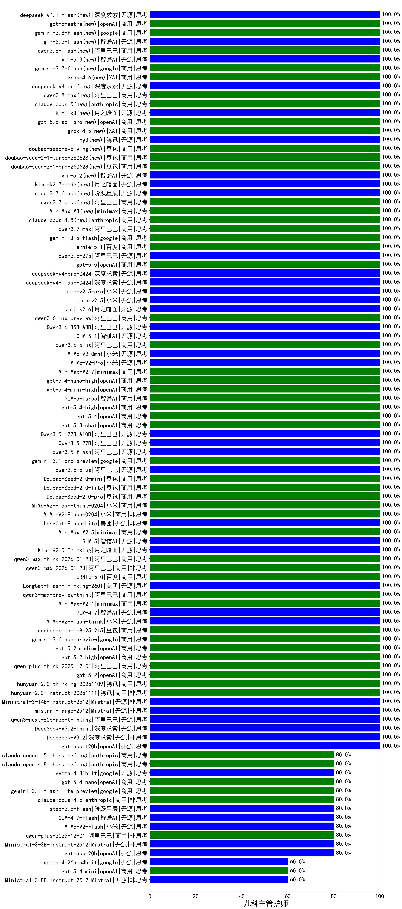

|类别|机构|大模型|【儿科主管护师】准确率|平均耗时|平均消耗token|花费/千次（元）|排名（准确率）|
|---|---|-----|-------------------|-------|-----------|-----------|-----------|
|商用|openAI|gpt-5-mini-high|100.0%|100s|1428|19.0|1|
|商用|openAI|gpt-5.2|100.0%|17s|275|15.9|2|
|商用|百度|ERNIE-5.0|100.0%|146s|1553|35.7|3|
|开源|美团|LongCat-Flash-Thinking-2601|100.0%|182s|1674|0.0|4|
|商用|阿里巴巴|qwen3-max-preview-think|100.0%|55s|2080|47.9|5|
|商用|minimax|MiniMax-M2.1|100.0%|23s|1118|8.6|6|
|开源|智谱AI|GLM-4.7|100.0%|43s|1869|25.1|7|
|开源|小米|MiMo-V2-Flash-think|100.0%|378s|1855|0.0|8|
|商用|豆包|doubao-seed-1-8-251215|100.0%|23s|586|3.7|9|
|商用|google|gemini-3-flash-preview|100.0%|106s|1010|19.6|10|
|商用|openAI|gpt-5.2-medium|100.0%|6s|349|23.3|11|
|商用|openAI|gpt-5.2-high|100.0%|12s|367|25.1|12|
|商用|阿里巴巴|qwen-plus-think-2025-12-01|100.0%|59s|2690|20.7|13|
|商用|腾讯|hunyuan-2.0-thinking-20251109|100.0%|11s|617|2.2|14|
|商用|openAI|gpt-5.1-high|100.0%|21s|495|27.0|15|
|商用|腾讯|hunyuan-2.0-instruct-20251111|100.0%|10s|387|0.6|16|
|开源|Mistral|Ministral-3-14B-Instruct-2512|100.0%|13s|662|0.9|17|
|开源|Mistral|mistral-large-2512|100.0%|12s|587|5.2|18|
|开源|阿里巴巴|qwen3-next-80b-a3b-thinking|100.0%|169s|3411|13.3|19|
|开源|深度求索|DeepSeek-V3.2-Think|100.0%|31s|687|2.0|20|
|开源|深度求索|DeepSeek-V3.2|100.0%|84s|429|1.2|21|
|商用|openAI|gpt-5-nano-high|100.0%|1014s|3459|9.7|22|
|开源|meta|Llama-4-Scout-17B-16E-Instruct|100.0%|8s|545|1.0|23|
|商用|阿里巴巴|qwen3-max-2025-09-23|100.0%|213s|563|11.5|24|
|商用|anthropic|claude-opus-4.5|100.0%|13s|800|118.8|25|
|商用|anthropic|claude-sonnet-4.5-thinking|100.0%|22s|1504|146.6|26|
|商用|阿里巴巴|qwen3-max-2026-01-23|100.0%|66s|557|4.7|27|
|商用|阿里巴巴|qwen3-max-think-2026-01-23|100.0%|293s|2259|21.7|28|
|开源|月之暗面|Kimi-K2.5-Thinking|100.0%|265s|1380|27.4|29|
|开源|智谱AI|GLM-5(new)|100.0%|63s|1655|28.4|30|
|开源|智谱AI|GLM-5.1(new)|100.0%|152s|1194|26.9|31|
|商用|阿里巴巴|qwen3.6-plus(new)|100.0%|48s|1540|17.4|32|
|商用|小米|MiMo-V2-Omni(new)|100.0%|447s|1146|12.1|33|
|商用|小米|MiMo-V2-Pro(new)|100.0%|537s|1204|20.3|34|
|商用|minimax|MiniMax-M2.7(new)|100.0%|23s|914|6.9|35|
|商用|openAI|gpt-5.4-nano-high(new)|100.0%|13s|442|2.9|36|
|商用|openAI|gpt-5.4-mini-high(new)|100.0%|11s|627|16.3|37|
|商用|智谱AI|GLM-5-Turbo(new)|100.0%|50s|1242|25.7|38|
|商用|openAI|gpt-5.4-high(new)|100.0%|7s|508|40.9|39|
|商用|openAI|gpt-5.4(new)|100.0%|23s|391|29.6|40|
|商用|openAI|gpt-5.3-chat(new)|100.0%|6s|395|27.5|41|
|开源|阿里巴巴|Qwen3.5-122B-A10B(new)|100.0%|154s|2068|12.7|42|
|开源|阿里巴巴|Qwen3.5-27B(new)|100.0%|283s|1888|8.6|43|
|开源|阿里巴巴|qwen3.5-flash(new)|100.0%|121s|1966|3.8|44|
|商用|google|gemini-3.1-pro-preview(new)|100.0%|24s|1212|95.5|45|
|开源|阿里巴巴|qwen3.5-plus(new)|100.0%|23s|1881|8.6|46|
|商用|豆包|Doubao-Seed-2.0-mini(new)|100.0%|248s|1112|2.0|47|
|商用|豆包|Doubao-Seed-2.0-lite(new)|100.0%|156s|759|2.3|48|
|商用|豆包|Doubao-Seed-2.0-pro(new)|100.0%|183s|785|10.8|49|
|商用|小米|MiMo-V2-Flash-think-0204(new)|100.0%|515s|1252|2.4|50|
|商用|小米|MiMo-V2-Flash-0204(new)|100.0%|431s|589|1.1|51|
|开源|美团|LongCat-Flash-Lite(new)|100.0%|381s|503|0.0|52|
|商用|minimax|MiniMax-M2.5(new)|100.0%|20s|1058|8.1|53|
|商用|anthropic|claude-sonnet-4.5(new)|100.0%|16s|732|65.1|54|
|开源|阿里巴巴|Qwen3.6-35B-A3B(new)|100.0%|11s|1435|14.6|55|
|开源|月之暗面|kimi-k2-0905|100.0%|86s|404|5.1|56|
|开源|阿里巴巴|Qwen3-30B-A3B-Instruct-2507|100.0%|5s|627|1.6|57|
|开源|深度求索|DeepSeek-V3.1|100.0%|18s|383|3.8|58|
|商用|阿里巴巴|qwen-flash-think-2025-07-28|100.0%|32s|3399|4.9|59|
|商用|阿里巴巴|qwen-flash-2025-07-28|100.0%|6s|609|0.8|60|
|商用|openAI|gpt-5-nano-2025-08-07|100.0%|26s|1653|4.5|61|
|商用|openAI|gpt-5-2025-08-07|100.0%|16s|473|26.4|62|
|开源|openAI|gpt-oss-120b|100.0%|8s|549|1.3|63|
|商用|智谱AI|GLM-4.5-Flash-nothink|100.0%|20s|948|0.0|64|
|开源|智谱AI|GLM-4.5-Air|100.0%|33s|1833|10.5|65|
|商用|阿里巴巴|qwen-turbo-think-2025-07-15|100.0%|/|1725|4.9|66|
|商用|智谱AI|GLM-4.5-Flash|100.0%|24s|1427|0.0|67|
|开源|阿里巴巴|Qwen3-8B-nothink|100.0%|156s|557|0.0|68|
|开源|阿里巴巴|qwen3-235b-a22b-thinking-2507|100.0%|36s|2655|51.1|69|
|开源|阿里巴巴|qwen3-235b-a22b-instruct-2507|100.0%|12s|575|3.9|70|
|商用|腾讯|hunyuan-t1-20250711|100.0%|22s|1328|4.9|71|
|商用|百度|ERNIE-4.5-Turbo-32K|100.0%|21s|503|1.5|72|
|开源|阿里巴巴|Qwen3-32B|100.0%|26s|799|2.9|73|
|开源|深度求索|DeepSeek-V3.1-Think|100.0%|41s|766|8.4|74|
|开源|智谱AI|GLM-4.5-Air-nothink|100.0%|11s|924|5.0|75|
|商用|anthropic|claude-haiku-4.5-thinking|100.0%|103s|1960|65.0|76|
|商用|阿里巴巴|qwen3-max-preview|100.0%|9s|523|10.6|77|
|开源|豆包|Seed-OSS-36B-Instruct|100.0%|62s|1158|4.4|78|
|开源|阿里巴巴|qwen3-next-80b-a3b-instruct|100.0%|7s|562|1.9|79|
|商用|openAI|gpt-5.1-medium|100.0%|149s|400|20.3|80|
|商用|openAI|gpt-5.1|100.0%|97s|269|10.9|81|
|商用|腾讯|hunyuan-turbos-20250926|100.0%|14s|638|1.1|82|
|商用|豆包|doubao-seed-1-6-251015|100.0%|16s|655|4.4|83|
|商用|豆包|doubao-seed-1-6-lite-251015|100.0%|190s|723|1.5|84|
|商用|百度|ERNIE-X1-Turbo-32K|90.0%|55s|1328|5.1|85|
|商用|google|gemini-2.5-pro|90.0%|46s|2114|148.0|86|
|开源|阿里巴巴|Qwen3-8B|90.0%|613s|17831|0.0|87|
|开源|阿里巴巴|Qwen3-4B|90.0%|7s|686|1.8|88|
|商用|google|gemini-2.5-flash|85.0%|10s|1492|25.7|89|
|商用|百川智能|Baichuan4-Turbo|85.0%|/|/|/|90|
|商用|百度|ERNIE-5.0-Thinking-Preview|80.0%|281s|1867|43.3|91|
|商用|anthropic|claude-4-sonnet|80.0%|46s|617|54.3|92|
|商用|阿里巴巴|qwen-turbo-2025-07-15|80.0%|7s|390|0.2|93|
|商用|anthropic|claude-4-sonnet-thinking|80.0%|38s|661|57.4|94|
|商用|openAI|gpt-5.4-nano(new)|80.0%|3s|313|1.8|95|
|商用|google|gemini-3.1-flash-lite-preview(new)|80.0%|16s|410|3.3|96|
|商用|openAI|o4-mini|80.0%|25s|764|21.9|97|
|开源|阿里巴巴|Qwen3-14B|80.0%|30s|1642|3.2|98|
|开源|google|gemma-4-31b-it(new)|80.0%|59s|581|1.4|99|
|商用|XAI|grok-4-1-fast-reasoning|80.0%|10s|1029|3.1|100|
|开源|深度求索|DeepSeek-R1-0528|80.0%|215s|1754|27.2|101|
|开源|阿里巴巴|Qwen3-4B-nothink|80.0%|13s|496|1.2|102|
|商用|anthropic|claude-haiku-4.5|80.0%|24s|739|21.6|103|
|商用|XAI|grok-4-1-fast-non-reasoning|80.0%|105s|758|2.1|104|
|开源|小米|MiMo-V2-Flash|80.0%|131s|452|0.0|105|
|开源|Mistral|Ministral-3-3B-Instruct-2512|80.0%|8s|678|0.5|106|
|商用|openAI|gpt-5-mini-2025-08-07|80.0%|132s|706|8.6|107|
|开源|智谱AI|GLM-4.7-Flash|80.0%|172s|1368|0.0|108|
|商用|阿里巴巴|qwen-plus-2025-12-01|80.0%|21s|889|1.6|109|
|开源|openAI|gpt-oss-20b|80.0%|6s|921|0.9|110|
|开源|阿里巴巴|Qwen3-30B-A3B-Thinking-2507|80.0%|98s|2875|7.9|111|
|开源|阶跃星辰|step-3.5-flash|80.0%|44s|1710|3.4|112|
|商用|anthropic|claude-opus-4.6|80.0%|12s|684|96.5|113|
|开源|月之暗面|Kimi-K2-Thinking|80.0%|151s|1160|17.5|114|
|开源|阿里巴巴|Qwen3-32B-nothink|80.0%|265s|612|2.1|115|
|开源|阿里巴巴|Qwen3-14B-nothink|80.0%|9s|583|1.0|116|
|开源|智谱AI|GLM-4-9B-0414|75.0%|10s|413|0|117|
|商用|openAI|gpt-5.4-mini(new)|60.0%|90s|350|7.6|118|
|开源|Mistral|Ministral-3-8B-Instruct-2512|60.0%|10s|556|0.6|119|
|商用|百度|ERNIE-X1.1-Preview|60.0%|89s|586|2.1|120|
|开源|google|gemma-4-26b-a4b-it(new)|60.0%|59s|588|1.4|121|
|商用|google|gemini-2.5-flash-lite|60.0%|52s|678|1.7|122|

