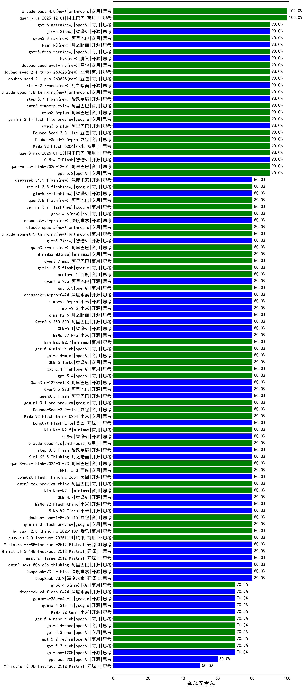

|类别|机构|大模型|【全科医学科】准确率|平均耗时|平均消耗token|花费/千次（元）|排名（准确率）|
|---|---|-----|-------------------|-------|-----------|-----------|-----------|
|商用|阿里巴巴|qwen-plus-2025-12-01|100.0%|29s|1048|2.0|1|
|商用|阿里巴巴|qwen3-max-preview|100.0%|11s|465|9.9|2|
|商用|anthropic|claude-opus-4.8(new)|100.0%|12s|587|88.8|3|
|商用|百度|ERNIE-4.5-Turbo-32K|95.0%|22s|555|1.6|4|
|商用|阿里巴巴|qwen3.6-plus|90.0%|29s|1468|17.0|5|
|商用|anthropic|claude-sonnet-4.5|90.0%|18s|642|61.0|6|
|商用|阿里巴巴|qwen3.6-max-preview|90.0%|49s|1611|84.1|7|
|商用|小米|MiMo-V2-Flash-0204|90.0%|84s|473|0.9|8|
|商用|anthropic|claude-opus-4.5|90.0%|14s|690|108.3|9|
|商用|百度|ERNIE-X1.1-Preview|90.0%|117s|672|2.5|10|
|商用|阿里巴巴|qwen3-max-2026-01-23|90.0%|52s|622|5.7|11|
|开源|阿里巴巴|qwen3.5-plus|90.0%|30s|2476|11.6|12|
|开源|豆包|Seed-OSS-36B-Instruct|90.0%|65s|1079|4.2|13|
|开源|智谱AI|GLM-4.7-Flash|90.0%|1159s|1810|0.0|14|
|商用|google|gemini-3.1-flash-lite-preview|90.0%|4s|408|3.7|15|
|商用|腾讯|hunyuan-turbos-20250926|90.0%|12s|534|0.9|16|
|开源|阿里巴巴|Qwen3-30B-A3B-Thinking-2507|90.0%|63s|2071|5.6|17|
|开源|阿里巴巴|qwen3-235b-a22b-instruct-2507|90.0%|12s|474|3.4|18|
|商用|阿里巴巴|qwen-turbo-2025-07-15|90.0%|6s|334|0.2|19|
|商用|豆包|Doubao-Seed-2.0-lite|90.0%|142s|728|2.3|20|
|开源|腾讯|hy3(new)|90.0%|6s|203|0.6|21|
|商用|阿里巴巴|qwen-plus-think-2025-12-01|90.0%|39s|1595|12.3|22|
|商用|豆包|doubao-seed-evolving(new)|90.0%|213s|4968|146.6|23|
|商用|豆包|doubao-seed-2-1-turbo-260628(new)|90.0%|91s|3376|49.4|24|
|商用|豆包|doubao-seed-2-1-pro-260628(new)|90.0%|200s|4591|135.3|25|
|开源|月之暗面|kimi-k2.7-code(new)|90.0%|23s|779|19.8|26|
|商用|anthropic|claude-4-sonnet|90.0%|44s|540|48.7|27|
|商用|anthropic|claude-opus-4.8-thinking(new)|90.0%|11s|639|97.9|28|
|开源|阶跃星辰|step-3.7-flash(new)|90.0%|16s|1440|11.2|29|
|商用|openAI|gpt-5.2|90.0%|5s|198|12.7|30|
|商用|豆包|Doubao-Seed-2.0-pro|90.0%|198s|863|12.5|31|
|商用|百度|ERNIE-X1-Turbo-32K|82.5%|150s|2006|7.8|32|
|商用|小米|MiMo-V2-Flash-think-0204|80.0%|497s|1469|3.0|33|
|开源|美团|LongCat-Flash-Lite|80.0%|180s|425|0.0|34|
|商用|minimax|MiniMax-M2.5|80.0%|20s|971|7.6|35|
|商用|百度|ERNIE-5.0|80.0%|67s|1324|30.8|36|
|开源|智谱AI|GLM-5|80.0%|67s|2112|37.1|37|
|商用|anthropic|claude-opus-4.6|80.0%|11s|619|94.1|38|
|开源|阶跃星辰|step-3.5-flash|80.0%|14s|912|1.8|39|
|开源|月之暗面|Kimi-K2.5-Thinking|80.0%|283s|1429|29.0|40|
|商用|阿里巴巴|qwen3-max-think-2026-01-23|80.0%|139s|2621|25.7|41|
|开源|美团|LongCat-Flash-Thinking-2601|80.0%|142s|1687|0.0|42|
|商用|阿里巴巴|qwen3-max-preview-think|80.0%|121s|1641|38.1|43|
|商用|minimax|MiniMax-M2.1|80.0%|71s|953|7.4|44|
|开源|智谱AI|GLM-4.7|80.0%|57s|2258|30.9|45|
|开源|小米|MiMo-V2-Flash-think|80.0%|139s|1664|0.0|46|
|开源|小米|MiMo-V2-Flash|80.0%|9s|460|0.0|47|
|商用|豆包|Doubao-Seed-2.0-mini|80.0%|269s|1366|2.5|48|
|商用|openAI|gpt-5.4-high|80.0%|18s|815|78.5|49|
|商用|google|gemini-3.1-pro-preview|80.0%|72s|2210|183.6|50|
|开源|小米|mimo-v2.5(new)|80.0%|21s|1049|11.2|51|
|商用|anthropic|claude-sonnet-5-thinking(new)|80.0%|14s|758|47.5|52|
|开源|智谱AI|glm-5.2(new)|80.0%|47s|1727|47.0|53|
|商用|阿里巴巴|qwen3.7-plus(new)|80.0%|20s|1031|7.9|54|
|商用|minimax|MiniMax-M3(new)|80.0%|21s|608|7.3|55|
|商用|阿里巴巴|qwen3.7-max(new)|80.0%|29s|1048|36.2|56|
|商用|google|gemini-3.5-flash(new)|80.0%|10s|1561|94.9|57|
|商用|百度|ernie-5.1(new)|80.0%|52s|879|15.0|58|
|开源|阿里巴巴|qwen3.6-27b(new)|80.0%|27s|1611|28.0|59|
|商用|openAI|gpt-5.5(new)|80.0%|10s|589|109.6|60|
|开源|深度求索|deepseek-v4-pro(new)|80.0%|34s|675|15.5|61|
|开源|小米|mimo-v2.5-pro(new)|80.0%|28s|1354|24.1|62|
|开源|月之暗面|kimi-k2.6(new)|80.0%|83s|1626|42.7|63|
|开源|阿里巴巴|qwen3.5-flash|80.0%|272s|2690|5.3|64|
|开源|阿里巴巴|Qwen3.6-35B-A3B|80.0%|57s|1436|14.9|65|
|开源|智谱AI|GLM-5.1|80.0%|133s|1676|39.1|66|
|开源|小米|MiMo-V2-Pro|80.0%|289s|960|15.8|67|
|商用|minimax|MiniMax-M2.7|80.0%|33s|1258|10.0|68|
|商用|openAI|gpt-5.4-mini-high|80.0%|63s|781|22.5|69|
|商用|openAI|gpt-5.4-mini|80.0%|40s|255|5.9|70|
|商用|智谱AI|GLM-5-Turbo|80.0%|39s|1026|21.6|71|
|商用|google|gemini-3-flash-preview|80.0%|95s|1535|31.5|72|
|商用|openAI|gpt-5.4|80.0%|14s|310|25.5|73|
|开源|阿里巴巴|Qwen3.5-122B-A10B|80.0%|226s|2386|14.9|74|
|开源|阿里巴巴|Qwen3.5-27B|80.0%|208s|2345|11.0|75|
|商用|豆包|doubao-seed-1-8-251215|80.0%|26s|675|4.7|76|
|商用|百川智能|Baichuan4-Turbo|80.0%|/|/|/|77|
|商用|阿里巴巴|qwen-flash-think-2025-07-28|80.0%|20s|2015|2.9|78|
|商用|anthropic|claude-haiku-4.5|80.0%|7s|633|19.6|79|
|商用|豆包|doubao-seed-1-6-lite-251015|80.0%|25s|673|1.4|80|
|商用|豆包|doubao-seed-1-6-251015|80.0%|11s|590|4.1|81|
|开源|阿里巴巴|qwen3-next-80b-a3b-instruct|80.0%|13s|557|2.0|82|
|开源|深度求索|DeepSeek-R1-0528|80.0%|231s|1882|29.2|83|
|商用|阿里巴巴|qwen-turbo-think-2025-07-15|80.0%|/|1573|4.5|84|
|商用|google|gemini-2.5-flash-lite|80.0%|3s|459|1.2|85|
|开源|深度求索|DeepSeek-V3.1-Think|80.0%|38s|711|8.1|86|
|开源|深度求索|DeepSeek-V3.1|80.0%|20s|371|4.0|87|
|商用|anthropic|claude-4-sonnet-thinking|80.0%|8s|560|52.1|88|
|商用|google|gemini-2.5-pro|80.0%|34s|2214|155.5|89|
|商用|阿里巴巴|qwen-flash-2025-07-28|80.0%|7s|514|0.7|90|
|商用|腾讯|hunyuan-t1-20250711|80.0%|18s|1066|4.0|91|
|开源|阿里巴巴|qwen3-235b-a22b-thinking-2507|80.0%|102s|1824|35.2|92|
|开源|阿里巴巴|Qwen3-8B-nothink|80.0%|90s|497|0.0|93|
|开源|阿里巴巴|Qwen3-14B-nothink|80.0%|22s|487|0.9|94|
|商用|openAI|gpt-5-2025-08-07|80.0%|25s|268|14.7|95|
|开源|阿里巴巴|Qwen3-32B-nothink|80.0%|142s|543|2.0|96|
|商用|智谱AI|GLM-4.5-Flash-nothink|80.0%|16s|934|0.0|97|
|开源|智谱AI|GLM-4.5-Air-nothink|80.0%|11s|933|5.3|98|
|开源|月之暗面|Kimi-K2-Thinking|80.0%|87s|1413|21.9|99|
|开源|智谱AI|GLM-4.5-Air|80.0%|27s|1278|7.3|100|
|开源|深度求索|DeepSeek-V3.2|80.0%|40s|275|0.8|101|
|开源|Mistral|Ministral-3-8B-Instruct-2512|80.0%|15s|1273|1.4|102|
|开源|Mistral|mistral-large-2512|80.0%|12s|478|4.4|103|
|开源|阿里巴巴|qwen3-next-80b-a3b-thinking|80.0%|136s|1989|7.7|104|
|开源|深度求索|DeepSeek-V3.2-Think|80.0%|25s|797|2.3|105|
|商用|腾讯|hunyuan-2.0-instruct-20251111|80.0%|12s|371|0.6|106|
|商用|腾讯|hunyuan-2.0-thinking-20251109|80.0%|18s|645|2.4|107|
|开源|阿里巴巴|Qwen3-32B|80.0%|33s|1290|4.9|108|
|开源|meta|Llama-4-Scout-17B-16E-Instruct|80.0%|11s|508|1.0|109|
|商用|阿里巴巴|qwen3-max-2025-09-23|80.0%|302s|629|13.9|110|
|商用|百度|ERNIE-5.0-Thinking-Preview|80.0%|258s|1503|35.1|111|
|商用|anthropic|claude-sonnet-4.5-thinking|80.0%|23s|1658|168.9|112|
|商用|openAI|gpt-5.1-high|80.0%|152s|1381|93.0|113|
|开源|月之暗面|kimi-k2-0905|80.0%|82s|306|3.9|114|
|商用|XAI|grok-4-1-fast-non-reasoning|80.0%|82s|633|1.8|115|
|商用|XAI|grok-4-1-fast-reasoning|80.0%|44s|1042|3.2|116|
|商用|anthropic|claude-haiku-4.5-thinking|80.0%|35s|1987|67.8|117|
|开源|Mistral|Ministral-3-14B-Instruct-2512|80.0%|14s|495|0.7|118|
|开源|智谱AI|GLM-4-9B-0414|77.5%|5s|426|0.0|119|
|开源|阿里巴巴|Qwen3-4B|77.5%|20s|1497|4.2|120|
|商用|google|gemini-2.5-flash|77.5%|11s|1742|30.3|121|
|开源|阿里巴巴|Qwen3-8B|75.0%|601s|14723|0.0|122|
|开源|阿里巴巴|Qwen3-14B|72.5%|27s|981|1.8|123|
|开源|阿里巴巴|Qwen3-4B-nothink|70.0%|20s|492|1.3|124|
|开源|深度求索|deepseek-v4-flash(new)|70.0%|24s|678|1.3|125|
|商用|智谱AI|GLM-4.5-Flash|70.0%|22s|1333|0.0|126|
|商用|openAI|gpt-5.2-medium|70.0%|7s|302|23.0|127|
|开源|阿里巴巴|Qwen3-30B-A3B-Instruct-2507|70.0%|4s|495|1.3|128|
|开源|openAI|gpt-oss-120b|70.0%|31s|601|1.6|129|
|商用|openAI|gpt-5-nano-high|70.0%|425s|3626|10.3|130|
|商用|openAI|gpt-5-mini-high|70.0%|676s|1741|24.2|131|
|商用|openAI|gpt-5.1-medium|70.0%|118s|690|44.0|132|
|商用|openAI|gpt-5.1|70.0%|96s|250|12.7|133|
|商用|openAI|gpt-5.3-chat|70.0%|6s|354|27.8|134|
|商用|openAI|gpt-5.2-high|70.0%|13s|450|37.8|135|
|商用|openAI|gpt-5.4-nano|70.0%|8s|224|1.4|136|
|商用|openAI|gpt-5.4-nano-high|70.0%|10s|464|3.5|137|
|商用|openAI|gpt-5-nano-2025-08-07|70.0%|141s|1736|4.8|138|
|开源|小米|MiMo-V2-Omni|70.0%|254s|1064|11.4|139|
|商用|openAI|gpt-5-mini-2025-08-07|70.0%|43s|843|11.2|140|
|开源|google|gemma-4-31b-it|70.0%|77s|517|1.3|141|
|开源|google|gemma-4-26b-a4b-it|70.0%|39s|544|1.4|142|
|商用|XAI|grok-4.5(new)|70.0%|67s|1853|70.4|143|
|开源|openAI|gpt-oss-20b|60.0%|7s|766|0.8|144|
|商用|openAI|o4-mini|55.0%|35s|862|25.5|145|
|开源|Mistral|Ministral-3-3B-Instruct-2512|50.0%|12s|621|0.4|146|

