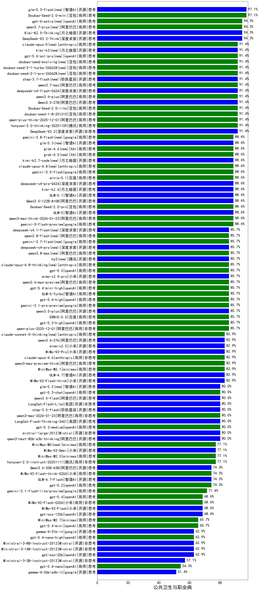

|类别|机构|大模型|【公共卫生与职业病】准确率|平均耗时|平均消耗token|花费/千次（元）|排名（准确率）|
|---|---|-----|-------------------|-------|-----------|-----------|-----------|
|开源|深度求索|DeepSeek-V3.2-Think|94.3%|104s|975|2.9|1|
|开源|月之暗面|Kimi-K2.5-Thinking|94.3%|295s|1962|40.0|2|
|商用|百度|ERNIE-4.5-Turbo-32K|92.1%|22s|563|1.7|3|
|商用|豆包|doubao-seed-1-8-251215|91.4%|24s|626|4.2|4|
|开源|阿里巴巴|Qwen3.5-27B(new)|91.4%|260s|3060|14.4|5|
|开源|深度求索|DeepSeek-V3.2-Exp-Think|91.4%|266s|986|2.9|6|
|商用|阿里巴巴|qwen-plus-think-2025-12-01|91.4%|86s|2908|22.7|7|
|商用|智谱AI|GLM-4.5-Flash|91.4%|33s|1861|0.0|8|
|开源|深度求索|DeepSeek-V3.2|91.4%|63s|373|1.1|9|
|商用|腾讯|hunyuan-turbos-20250926|88.6%|16s|673|1.2|10|
|商用|豆包|doubao-seed-1-6-251015|88.6%|7s|718|5.0|11|
|开源|智谱AI|GLM-5(new)|88.6%|140s|2251|39.6|12|
|商用|阿里巴巴|qwen-plus-2025-07-28|88.6%|15s|600|1.1|13|
|商用|阿里巴巴|qwen3-max-think-2026-01-23|88.6%|144s|2879|28.2|14|
|商用|google|gemini-3-flash-preview|88.6%|82s|1174|23.7|15|
|开源|百度|ERNIE-4.5-300B-A47B|85.7%|19s|359|2.5|16|
|商用|智谱AI|GLM-5-Turbo(new)|85.7%|31s|1283|27.1|17|
|商用|openAI|gpt-5.4-high(new)|85.7%|15s|738|70.3|18|
|商用|google|gemini-3-pro-preview|85.7%|60s|1911|157.8|19|
|商用|google|gemini-3.1-pro-preview(new)|85.7%|36s|1394|113.7|20|
|商用|科大讯飞|xunfei-spark-x1-0725|85.7%|/|895|10.8|21|
|开源|阿里巴巴|qwen3-235b-a22b-thinking-2507|85.7%|107s|2566|49.9|22|
|商用|百度|ERNIE-X1.1-Preview|85.7%|126s|841|3.2|23|
|开源|阿里巴巴|qwen3.5-plus(new)|85.7%|35s|2910|13.7|24|
|商用|阿里巴巴|qwen-plus-2025-12-01|85.7%|22s|899|1.7|25|
|开源|深度求索|DeepSeek-R1-0528|85.0%|234s|1913|29.8|26|
|开源|阿里巴巴|Qwen3-32B|84.3%|27s|1006|3.8|27|
|商用|豆包|doubao-seed-1-6-250615|83.6%|108s|502|3.3|28|
|商用|百度|ERNIE-X1-Turbo-32K|83.6%|105s|1941|7.6|29|
|商用|百度|ERNIE-5.0-Thinking-Preview|82.9%|295s|2075|48.7|30|
|开源|智谱AI|GLM-4.7|82.9%|46s|1707|23.1|31|
|开源|月之暗面|kimi-k2-0905|82.9%|61s|423|5.7|32|
|商用|anthropic|claude-opus-4.6|82.9%|13s|606|91.7|33|
|商用|豆包|doubao-seed-1-6-lite-251015|82.9%|75s|795|1.7|34|
|商用|阿里巴巴|qwen3-max-preview|82.9%|14s|629|13.7|35|
|商用|腾讯|hunyuan-t1-20250711|82.9%|29s|1743|6.7|36|
|商用|阿里巴巴|qwen-turbo-think-2025-07-15|82.9%|/|2231|6.5|37|
|商用|anthropic|claude-opus-4.5|82.9%|14s|647|100.5|38|
|商用|阿里巴巴|qwen3-max-2025-09-23|82.9%|154s|490|10.4|39|
|商用|XAI|grok-4-0709|81.4%|173s|1464|152.6|40|
|商用|豆包|doubao-seed-1-6-flash-thinking-250615|80.7%|8s|862|1.1|41|
|开源|深度求索|DeepSeek-V3.1-Think|80.0%|51s|972|11.1|42|
|开源|月之暗面|Kimi-K2-Thinking|80.0%|122s|1846|28.7|43|
|开源|豆包|Seed-OSS-36B-Instruct|80.0%|92s|2158|8.5|44|
|开源|深度求索|DeepSeek-V3.2-Exp|80.0%|270s|353|1.0|45|
|商用|openAI|gpt-5-2025-08-07|80.0%|19s|284|15.7|46|
|商用|阿里巴巴|qwen3-max-2026-01-23|80.0%|38s|499|4.4|47|
|开源|美团|LongCat-Flash-Lite(new)|80.0%|247s|480|0.0|48|
|开源|深度求索|DeepSeek-V3.1|80.0%|20s|389|4.1|49|
|开源|阿里巴巴|qwen3.5-flash(new)|80.0%|285s|3062|6.0|50|
|开源|阶跃星辰|step-3|80.0%|104s|2031|7.9|51|
|开源|阿里巴巴|Qwen3-30B-A3B-Instruct-2507|80.0%|6s|651|1.8|52|
|开源|智谱AI|GLM-4.5|80.0%|148s|1709|22.5|53|
|开源|阶跃星辰|step-3.5-flash|80.0%|26s|1994|4.1|54|
|商用|anthropic|claude-sonnet-4.5-thinking|80.0%|26s|1783|182.5|55|
|商用|豆包|doubao-seed-1-6-flash-250615|80.0%|5s|349|0.4|56|
|开源|阿里巴巴|qwen3-235b-a22b-instruct-2507|80.0%|13s|548|3.9|57|
|商用|openAI|gpt-5.3-chat(new)|80.0%|19s|373|29.5|58|
|开源|meta|Llama-4-Maverick-17B-128E-Instruct-FP8|79.3%|8s|512|2.0|59|
|开源|阿里巴巴|Qwen3-30B-A3B-Thinking-2507|78.6%|59s|2446|6.7|60|
|商用|google|gemini-2.5-pro|78.6%|29s|2265|159.8|61|
|商用|minimax|MiniMax-M2.5(new)|77.1%|25s|1274|10.1|62|
|开源|阿里巴巴|qwen3-next-80b-a3b-instruct|77.1%|9s|586|2.1|63|
|商用|腾讯|hunyuan-2.0-instruct-20251111|77.1%|10s|507|0.9|64|
|商用|阿里巴巴|qwen-plus-think-2025-07-28|77.1%|/|2702|21.1|65|
|商用|XAI|grok-4-1-fast-reasoning|77.1%|36s|1470|4.7|66|
|开源|智谱AI|GLM-4.6|77.1%|61s|2249|30.7|67|
|商用|google|gemini-2.5-flash|76.4%|11s|1817|31.8|68|
|开源|腾讯|Hunyuan-A13B-Instruct|76.4%|64s|1122|4.3|69|
|开源|阿里巴巴|Qwen3-14B|75.7%|30s|1680|3.2|70|
|开源|百度|ERNIE-4.5-21B-A3B|75.0%|31s|332|0.0|71|
|开源|智谱AI|GLM-4.5-nothink|74.3%|29s|711|9.2|72|
|商用|阿里巴巴|qwen-turbo-2025-07-15|74.3%|9s|411|0.2|73|
|商用|XAI|grok-3-mini|74.3%|158s|1078|3.8|74|
|商用|openAI|gpt-5-mini-high|74.3%|443s|2188|30.7|75|
|开源|美团|LongCat-Flash-Thinking-2601|74.3%|220s|2176|0.0|76|
|商用|openAI|gpt-5.1-medium|74.3%|127s|460|27.6|77|
|开源|智谱AI|GLM-4.7-Flash|74.3%|1195s|4669|0.0|78|
|商用|Mistral|mistral-medium-2508|74.3%|46s|500|6.2|79|
|商用|openAI|gpt-5.1-high|74.3%|110s|981|64.5|80|
|开源|智谱AI|GLM-4.5-Air-nothink|74.3%|14s|959|5.4|81|
|商用|百川智能|Baichuan4-Turbo|74.3%|/|/|/|82|
|商用|openAI|gpt-5.2|74.3%|6s|197|12.4|83|
|商用|小米|MiMo-V2-Flash-think-0204(new)|74.3%|754s|2244|4.6|84|
|商用|openAI|o4-mini|74.3%|31s|793|23.3|85|
|商用|anthropic|claude-sonnet-4.5(new)|74.3%|13s|587|54.9|86|
|商用|google|gemini-3.1-flash-lite-preview(new)|71.4%|5s|386|3.4|87|
|开源|阿里巴巴|Qwen3-14B-nothink|71.4%|22s|612|1.1|88|
|开源|阿里巴巴|Qwen3-32B-nothink|71.4%|56s|561|2.0|89|
|商用|阿里巴巴|qwen-flash-2025-07-28|71.4%|9s|653|0.9|90|
|商用|阿里巴巴|qwen-flash-think-2025-07-28|71.4%|26s|2619|3.8|91|
|开源|阿里巴巴|Qwen3-8B-nothink|68.6%|23s|525|0.0|92|
|商用|小米|MiMo-V2-Flash-0204(new)|68.6%|284s|547|1.0|93|
|开源|智谱AI|GLM-4.5-Air|68.6%|35s|1801|10.4|94|
|开源|minimax|MiniMax-M2|68.6%|24s|1394|11.1|95|
|商用|智谱AI|GLM-4.5-Flash-nothink|68.6%|19s|986|0.0|96|
|开源|openAI|gpt-oss-120b|68.6%|61s|603|1.6|97|
|商用|openAI|gpt-5.4(new)|68.6%|6s|265|20.6|98|
|商用|anthropic|claude-4-sonnet|68.6%|42s|543|49.2|99|
|开源|深度求索|DeepSeek-R1-0528-Qwen3-8B|68.6%|261s|1745|0.0|100|
|开源|阿里巴巴|Qwen3-8B|67.9%|337s|9958|0.0|101|
|开源|阿里巴巴|Qwen3-4B|67.9%|22s|1503|4.3|102|
|开源|腾讯|Hunyuan-A13B-Instruct-nothink|65.7%|34s|378|1.3|103|
|开源|meta|Llama-4-Scout-17B-16E-Instruct|65.0%|10s|531|1.0|104|
|开源|阿里巴巴|Qwen3-4B-nothink|62.9%|17s|498|1.3|105|
|商用|anthropic|claude-4-sonnet-thinking|62.9%|49s|1185|119.0|106|
|商用|anthropic|claude-haiku-4.5-thinking|62.9%|38s|2532|87.5|107|
|开源|openAI|gpt-oss-20b|62.9%|72s|1499|1.6|108|
|商用|openAI|gpt-5-mini-2025-08-07|62.9%|43s|912|12.2|109|
|商用|openAI|gpt-5-nano-high|60.0%|634s|4107|11.7|110|
|商用|anthropic|claude-haiku-4.5|60.0%|10s|626|19.3|111|
|商用|openAI|gpt-5.1|60.0%|189s|198|8.9|112|
|商用|百川智能|Baichuan4-Air|58.4%|/|/|/|113|
|商用|openAI|gpt-5-nano-2025-08-07|57.1%|54s|1881|5.2|114|
|开源|智谱AI|GLM-4-9B-0414|55.7%|11s|445|0.0|115|
|商用|google|gemini-2.5-flash-lite|54.3%|13s|4275|12.2|116|
|开源|阿里巴巴|Qwen3-1.7B|51.4%|20s|2386|7.0|117|
|开源|google|gemma-3-27b-it|50.7%|/|/|/|118|
|商用|XAI|grok-4-1-fast-non-reasoning|45.7%|51s|638|1.8|119|
|开源|阿里巴巴|Qwen3-0.6B|42.9%|8s|1135|3.2|120|
|开源|google|gemma-3-12b-it|42.1%|/|/|/|121|
|开源|Mistral|Mistral-Small-3.2-24B-Instruct-2506|40.0%|148s|546|1.1|122|
|开源|阿里巴巴|Qwen3-1.7B-nothink|40.0%|16s|499|1.3|123|
|开源|google|gemma-3-4b-it|30.0%|/|/|/|124|
|开源|阿里巴巴|Qwen3-0.6B-nothink|28.6%|11s|252|0.5|125|
|开源|百度|ERNIE-4.5-0.3B|27.1%|41s|394|0.0|126|
|开源|阿里巴巴|Qwen3.5-122B-A10B(new)|/%|257s|2781|17.4|127|
|商用|openAI|gpt-5.4-mini(new)|/%|31s|223|4.9|128|
|商用|openAI|gpt-5.4-mini-high(new)|/%|/|919|26.8|129|
|商用|openAI|gpt-5.4-nano(new)|/%|/|245|1.5|130|
|商用|openAI|gpt-5.4-nano-high(new)|/%|/|551|4.2|131|
|开源|小米|MiMo-V2-Flash-think|/%|24s|2233|0.0|132|
|商用|豆包|Doubao-Seed-2.0-pro(new)|/%|249s|1112|16.4|133|
|商用|豆包|Doubao-Seed-2.0-mini(new)|/%|352s|2056|3.9|134|
|商用|豆包|Doubao-Seed-2.0-lite(new)|/%|209s|942|3.1|135|
|开源|小米|MiMo-V2-Flash|/%|79s|562|0.0|136|
|开源|阿里巴巴|qwen3-next-80b-a3b-thinking|/%|115s|3423|13.5|137|
|开源|Mistral|mistral-large-2512|/%|14s|590|5.6|138|
|开源|Mistral|Ministral-3-14B-Instruct-2512|/%|24s|2670|3.8|139|
|开源|Mistral|Ministral-3-8B-Instruct-2512|/%|8s|752|0.8|140|
|开源|Mistral|Ministral-3-3B-Instruct-2512|/%|8s|961|0.7|141|
|商用|腾讯|hunyuan-2.0-thinking-20251109|/%|20s|903|3.4|142|
|商用|百度|ERNIE-5.0|/%|195s|2499|58.9|143|
|商用|openAI|gpt-5.2-high|/%|8s|412|33.8|144|
|商用|openAI|gpt-5.2-medium|/%|9s|338|26.5|145|
|商用|阿里巴巴|qwen3-max-preview-think|/%|183s|2776|65.2|146|
|商用|minimax|MiniMax-M2.1|/%|120s|1413|11.2|147|
|商用|minimax|MiniMax-M2.7(new)|/%|/|1446|11.5|148|

