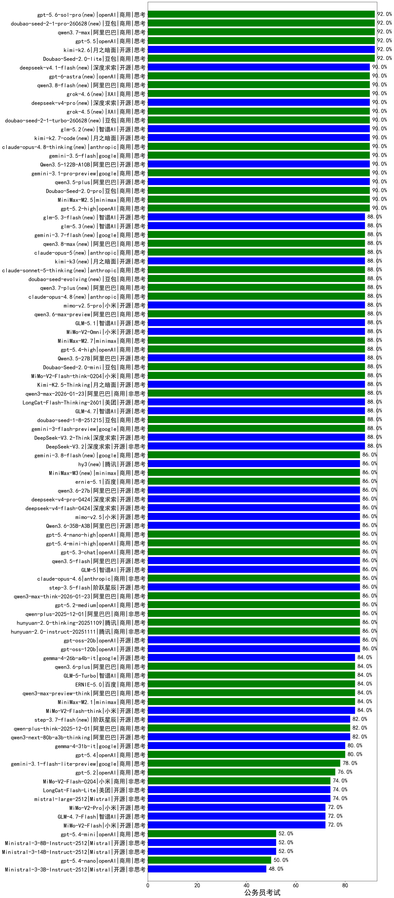

|类别|机构|大模型|【公务员考试】准确率|平均耗时|平均消耗token|花费/千次（元）|排名（准确率）|
|---|---|-----|-------------------|-------|-----------|-----------|-----------|
|开源|智谱AI|GLM-4.5|90.0%|101s|2476|33.1|1|
|商用|minimax|MiniMax-M2.5(new)|90.0%|56s|3326|26.8|2|
|开源|阿里巴巴|qwen3.5-plus(new)|90.0%|50s|3799|17.6|3|
|商用|anthropic|claude-4-sonnet|90.0%|47s|858|74.5|4|
|商用|google|gemini-3.1-pro-preview(new)|90.0%|36s|2057|163.3|5|
|商用|百度|ERNIE-5.0-Thinking-Preview|90.0%|171s|2058|46.8|6|
|商用|阿里巴巴|qwen-plus-2025-07-28|90.0%|41s|1463|2.7|7|
|开源|月之暗面|kimi-k2-0905|90.0%|82s|1298|18.9|8|
|商用|openAI|o4-mini|90.0%|33s|1211|35.0|9|
|开源|智谱AI|GLM-4.6|88.0%|63s|3414|46.2|10|
|商用|豆包|doubao-seed-1-6-250615|88.0%|24s|810|5.2|11|
|商用|openAI|gpt-5-mini-2025-08-07|88.0%|116s|1571|20.4|12|
|开源|豆包|Seed-OSS-36B-Instruct|88.0%|223s|3237|12.6|13|
|开源|深度求索|DeepSeek-R1-0528|88.0%|185s|3168|49.0|14|
|商用|google|gemini-2.5-pro|88.0%|36s|3373|233.9|15|
|商用|豆包|doubao-seed-1-6-lite-251015|88.0%|34s|1406|3.0|16|
|开源|月之暗面|Kimi-K2-Thinking|88.0%|447s|7891|124.6|17|
|商用|google|gemini-3-pro-preview(new)|88.0%|75s|2700|218.1|18|
|商用|openAI|gpt-5.1-high|88.0%|152s|2996|201.2|19|
|商用|anthropic|claude-opus-4.5(new)|88.0%|15s|1184|174.1|20|
|开源|月之暗面|Kimi-K2.5-Thinking(new)|88.0%|202s|4167|85.2|21|
|开源|智谱AI|GLM-5(new)|86.0%|149s|3619|63.1|22|
|开源|阿里巴巴|qwen3-235b-a22b-instruct-2507|86.0%|37s|1514|11.2|23|
|商用|科大讯飞|xunfei-spark-x1-0725|86.0%|/|2691|32.3|24|
|商用|anthropic|claude-opus-4.6(new)|86.0%|26s|1013|141.2|25|
|开源|阿里巴巴|Qwen3-30B-A3B-Thinking-2507|86.0%|70s|3234|8.7|26|
|开源|openAI|gpt-oss-20b|86.0%|151s|2444|2.6|27|
|开源|openAI|gpt-oss-120b|86.0%|246s|1450|4.1|28|
|商用|XAI|grok-3-mini|86.0%|147s|1766|6.2|29|
|商用|openAI|gpt-5-2025-08-07|86.0%|32s|626|34.1|30|
|商用|anthropic|claude-sonnet-4.5-thinking|86.0%|47s|3645|371.5|31|
|商用|XAI|grok-4-1-fast-reasoning|86.0%|19s|1789|5.7|32|
|商用|腾讯|hunyuan-turbos-20250926|86.0%|31s|1369|2.5|33|
|商用|阿里巴巴|qwen-plus-2025-12-01(new)|86.0%|40s|1701|3.2|34|
|商用|XAI|grok-4-0709|86.0%|379s|2351|242.0|35|
|商用|anthropic|claude-4-sonnet-thinking|86.0%|56s|1719|168.1|36|
|商用|百度|ERNIE-X1-Turbo-32K|86.0%|520s|2395|9.2|37|
|开源|深度求索|DeepSeek-V3.1-Think|84.0%|103s|2147|24.6|38|
|开源|智谱AI|GLM-4.5-Air|84.0%|38s|2485|14.2|39|
|商用|google|gemini-2.5-flash|84.0%|17s|3704|64.4|40|
|商用|阿里巴巴|qwen-turbo-think-2025-07-15|84.0%|/|4012|11.6|41|
|开源|阿里巴巴|qwen3-next-80b-a3b-instruct|84.0%|27s|1734|6.5|42|
|开源|深度求索|DeepSeek-V3.2-Exp|84.0%|434s|925|2.6|43|
|开源|深度求索|DeepSeek-V3.2-Exp-Think|84.0%|440s|2206|6.5|44|
|商用|豆包|doubao-seed-1-6-251015|84.0%|36s|1375|9.7|45|
|开源|minimax|MiniMax-M2|84.0%|64s|3349|27.0|46|
|商用|豆包|doubao-seed-1-6-thinking-250715|84.0%|98s|3025|23.1|47|
|开源|腾讯|Hunyuan-A13B-Instruct|84.0%|67s|2030|7.7|48|
|商用|openAI|gpt-5.1-medium|84.0%|254s|1820|117.8|49|
|开源|月之暗面|kimi-k2-0711-preview|84.0%|110s|1610|24.1|50|
|商用|阿里巴巴|qwen3-max-preview|82.0%|24s|1095|23.4|51|
|开源|阿里巴巴|Qwen3-8B|82.0%|24s|1631|0.0|52|
|商用|阿里巴巴|qwen-plus-think-2025-12-01(new)|82.0%|107s|3957|30.5|53|
|商用|阿里巴巴|qwen-flash-think-2025-07-28|82.0%|44s|4075|5.9|54|
|商用|阿里巴巴|qwen-plus-think-2025-07-28|82.0%|/|4702|36.5|55|
|商用|智谱AI|GLM-4.5-Flash|82.0%|43s|2398|0.0|56|
|商用|腾讯|hunyuan-t1-20250711|82.0%|39s|2554|9.7|57|
|开源|阿里巴巴|qwen3-235b-a22b-thinking-2507|82.0%|92s|4012|77.4|58|
|开源|阿里巴巴|Qwen3-30B-A3B-Instruct-2507|82.0%|12s|1435|4.0|59|
|商用|豆包|doubao-seed-1-6-flash-thinking-250615|80.0%|18s|994|1.2|60|
|商用|anthropic|claude-haiku-4.5-thinking|80.0%|51s|6509|227.3|61|
|商用|阿里巴巴|qwen-flash-2025-07-28|80.0%|17s|1662|2.3|62|
|开源|深度求索|DeepSeek-V3.1|80.0%|50s|992|10.8|63|
|开源|智谱AI|GLM-4.5-nothink|80.0%|51s|1676|21.8|64|
|商用|智谱AI|GLM-4.5-Flash-nothink|78.0%|51s|3209|0.0|65|
|商用|anthropic|claude-sonnet-4.5(new)|78.0%|12s|955|81.5|66|
|开源|minimax|MiniMax-M1|78.0%|491s|7331|56.8|67|
|开源|Mistral|Mistral-Small-3.2-24B-Instruct-2506|78.0%|37s|2288|4.7|68|
|开源|阶跃星辰|step-3|76.0%|212s|4134|16.2|69|
|商用|Mistral|mistral-medium-2508|76.0%|246s|1096|13.4|70|
|商用|openAI|gpt-5.2(new)|76.0%|11s|542|37.9|71|
|商用|openAI|gpt-5-nano-2025-08-07|76.0%|42s|3966|11.0|72|
|开源|阿里巴巴|Qwen3-32B|74.0%|228s|6660|26.2|73|
|开源|阿里巴巴|Qwen3-32B-nothink|74.0%|60s|1045|3.7|74|
|商用|百度|ERNIE-X1.1-Preview|74.0%|162s|1957|7.4|75|
|商用|百度|ERNIE-4.5-Turbo-32K|74.0%|36s|1004|2.9|76|
|开源|腾讯|Hunyuan-A13B-Instruct-nothink|74.0%|648s|538|1.7|77|
|开源|美团|LongCat-Flash-Lite(new)|74.0%|160s|1522|0.0|78|
|开源|阿里巴巴|Qwen3-14B|72.0%|246s|7782|15.3|79|
|开源|百度|ERNIE-4.5-300B-A47B|72.0%|252s|657|4.3|80|
|开源|智谱AI|GLM-4.7-Flash(new)|72.0%|600s|11870|0.0|81|
|商用|豆包|Doubao-1.5-lite-32k-250115|70.0%|7s|562|0.3|82|
|开源|阿里巴巴|Qwen3-8B-nothink|70.0%|45s|1124|0.0|83|
|开源|阿里巴巴|Qwen3-14B-nothink|70.0%|24s|1225|2.2|84|
|开源|深度求索|DeepSeek-R1-0528-Qwen3-8B|70.0%|572s|3186|0.0|85|
|开源|meta|Llama-4-Maverick-17B-128E-Instruct-FP8|68.0%|15s|904|3.5|86|
|商用|阿里巴巴|qwen-turbo-2025-07-15|68.0%|15s|1111|0.6|87|
|开源|智谱AI|GLM-4.5-Air-nothink|66.0%|67s|5553|32.5|88|
|开源|阿里巴巴|Qwen3-4B|64.0%|136s|3320|9.5|89|
|开源|minimax|MiniMax-Text-01|64.0%|11s|985|7.9|90|
|商用|google|gemini-2.5-flash-lite|64.0%|32s|5735|16.3|91|
|商用|豆包|doubao-seed-1-6-flash-250615|62.0%|6s|516|0.6|92|
|商用|anthropic|claude-haiku-4.5|62.0%|11s|989|28.0|93|
|商用|XAI|grok-4-1-fast-non-reasoning|62.0%|83s|788|2.1|94|
|开源|百度|ERNIE-4.5-21B-A3B|60.0%|41s|1582|0.0|95|
|开源|阿里巴巴|Qwen3-1.7B|60.0%|122s|4442|12.9|96|
|商用|openAI|gpt-5.1|56.0%|85s|783|44.2|97|
|商用|百川智能|Baichuan4-Turbo|56.0%|/|/|/|98|
|开源|阿里巴巴|Qwen3-4B-nothink|54.0%|31s|1279|3.4|99|
|开源|智谱AI|GLM-4-9B-0414|52.0%|11s|516|0.0|100|
|开源|google|gemma-3-12b-it|52.0%|/|/|/|101|
|开源|meta|Llama-4-Scout-17B-16E-Instruct|50.0%|15s|927|1.8|102|
|开源|google|gemma-3-27b-it|50.0%|/|/|/|103|
|开源|阿里巴巴|Qwen3-0.6B|48.0%|77s|3415|9.8|104|
|商用|百度|ERNIE-Lite-8K|46.0%|/|/|/|105|
|商用|百川智能|Baichuan4-Air|42.0%|/|/|/|106|
|开源|阿里巴巴|Qwen3-0.6B-nothink|42.0%|9s|658|1.5|107|
|开源|google|gemma-3-4b-it|36.0%|/|/|/|108|
|开源|阿里巴巴|Qwen3-1.7B-nothink|28.0%|13s|981|2.5|109|
|开源|百度|ERNIE-4.5-0.3B|22.0%|29s|1064|0.0|110|
|开源|Mistral|Ministral-3-14B-Instruct-2512(new)|/%|27s|2329|3.3|111|
|商用|阿里巴巴|qwen3-max-think-2026-01-23(new)|/%|124s|4377|42.6|112|
|商用|openAI|gpt-5-nano-high|/%|786s|7192|20.4|113|
|开源|阶跃星辰|step-3.5-flash(new)|/%|32s|5304|10.9|114|
|商用|openAI|gpt-5-mini-high|/%|815s|2687|36.6|115|
|商用|阿里巴巴|qwen3-max-2025-09-23|/%|58s|1443|31.8|116|
|商用|小米|MiMo-V2-Flash-think-0204(new)|/%|554s|2964|6.0|117|
|商用|小米|MiMo-V2-Flash-0204(new)|/%|206s|1455|2.8|118|
|开源|Mistral|Ministral-3-8B-Instruct-2512(new)|/%|14s|1364|1.5|119|
|商用|豆包|Doubao-Seed-2.0-pro(new)|/%|/|1563|22.5|120|
|商用|豆包|Doubao-Seed-2.0-lite(new)|/%|/|1667|5.4|121|
|商用|豆包|Doubao-Seed-2.0-mini(new)|/%|292s|6763|13.2|122|
|开源|阿里巴巴|qwen3.5-flash(new)|/%|427s|5187|10.1|123|
|开源|阿里巴巴|Qwen3.5-27B(new)|/%|415s|4345|20.2|124|
|商用|阿里巴巴|qwen3-max-2026-01-23(new)|/%|139s|1272|11.5|125|
|商用|百度|ERNIE-5.0(new)|/%|250s|3716|86.6|126|
|开源|美团|LongCat-Flash-Thinking-2601(new)|/%|453s|3512|0.0|127|
|开源|深度求索|DeepSeek-V3.2(new)|/%|27s|957|2.7|128|
|开源|Mistral|Ministral-3-3B-Instruct-2512(new)|/%|15s|1355|1.0|129|
|商用|腾讯|hunyuan-2.0-instruct-20251111|/%|11s|1042|1.9|130|
|商用|腾讯|hunyuan-2.0-thinking-20251109|/%|33s|3051|11.8|131|
|开源|Mistral|mistral-large-2512(new)|/%|20s|1028|9.4|132|
|开源|阿里巴巴|qwen3-next-80b-a3b-thinking|/%|206s|5330|20.8|133|
|开源|深度求索|DeepSeek-V3.2-Think(new)|/%|176s|2037|6.0|134|
|商用|openAI|gpt-5.2-high(new)|/%|20s|1006|84.0|135|
|商用|openAI|gpt-5.2-medium(new)|/%|17s|929|76.4|136|
|商用|google|gemini-3-flash-preview(new)|/%|110s|3126|63.6|137|
|商用|豆包|doubao-seed-1-8-251215(new)|/%|50s|1371|9.5|138|
|开源|小米|MiMo-V2-Flash(new)|/%|24s|1513|0.0|139|
|开源|小米|MiMo-V2-Flash-think(new)|/%|91s|3133|0.0|140|
|开源|智谱AI|GLM-4.7(new)|/%|85s|3294|44.5|141|
|商用|minimax|MiniMax-M2.1(new)|/%|128s|2929|23.5|142|
|商用|阿里巴巴|qwen3-max-preview-think(new)|/%|261s|3852|89.6|143|
|开源|阿里巴巴|Qwen3.5-122B-A10B(new)|/%|103s|3987|24.7|144|

