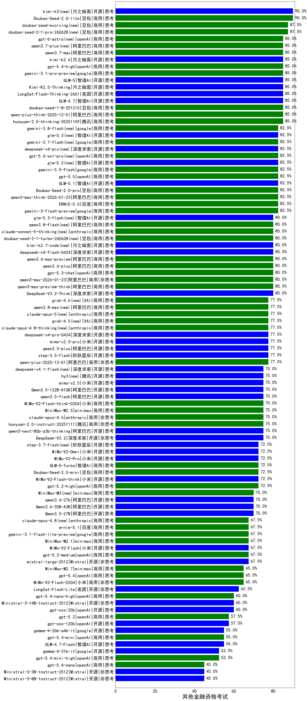

|类别|机构|大模型|【其他金融资格考试】准确率|平均耗时|平均消耗token|花费/千次（元）|排名（准确率）|
|---|---|-----|-------------------|-------|-----------|-----------|-----------|
|商用|阿里巴巴|qwen3-max-preview|87.5%|18s|846|18.8|1|
|商用|阿里巴巴|qwen-plus-think-2025-12-01(new)|85.0%|65s|2975|23.2|2|
|商用|阿里巴巴|qwen-plus-think-2025-07-28|85.0%|/|3135|24.5|3|
|商用|google|gemini-3.1-pro-preview(new)|85.0%|43s|1939|159.2|4|
|商用|豆包|doubao-seed-1-6-thinking-250715|85.0%|65s|2528|19.6|5|
|开源|阿里巴巴|qwen3-235b-a22b-thinking-2507|85.0%|159s|3579|70.1|6|
|商用|豆包|doubao-seed-1-6-251015|85.0%|33s|934|6.7|7|
|开源|智谱AI|GLM-4.7(new)|85.0%|66s|2823|38.7|8|
|开源|智谱AI|GLM-5(new)|85.0%|187s|2896|51.1|9|
|开源|月之暗面|Kimi-K2.5-Thinking(new)|85.0%|299s|3056|62.9|10|
|开源|月之暗面|kimi-k2-0711-preview|83.8%|49s|643|9.4|11|
|商用|阿里巴巴|qwen3-max-think-2026-01-23(new)|82.5%|181s|4342|42.8|12|
|商用|百度|ERNIE-4.5-Turbo-32K|81.2%|36s|675|2.0|13|
|开源|阿里巴巴|qwen3-235b-a22b-instruct-2507|80.0%|23s|1024|7.7|14|
|商用|anthropic|claude-opus-4.5(new)|80.0%|18s|1023|164.6|15|
|商用|google|gemini-3-pro-preview(new)|80.0%|55s|2585|214.2|16|
|商用|阿里巴巴|qwen3-max-2026-01-23(new)|80.0%|48s|750|6.9|17|
|开源|深度求索|DeepSeek-V3.1|80.0%|28s|560|6.1|18|
|商用|百度|ERNIE-X1.1-Preview|77.5%|159s|1832|7.1|19|
|开源|阿里巴巴|qwen3.5-plus(new)|77.5%|47s|3760|17.7|20|
|商用|anthropic|claude-sonnet-4.5-thinking|77.5%|36s|2619|271.7|21|
|开源|阿里巴巴|qwen3-next-80b-a3b-instruct|77.5%|15s|906|3.4|22|
|商用|阿里巴巴|qwen-plus-2025-07-28|77.5%|31s|1223|2.3|23|
|开源|深度求索|DeepSeek-V3.1-Think|77.5%|102s|1999|23.4|24|
|商用|腾讯|hunyuan-turbos-20250926|77.5%|28s|1116|2.1|25|
|商用|阿里巴巴|qwen-plus-2025-12-01(new)|77.5%|43s|1237|2.4|26|
|商用|百度|ERNIE-X1-Turbo-32K|76.9%|163s|2615|10.2|27|
|开源|阿里巴巴|Qwen3-14B|76.2%|47s|2295|4.5|28|
|商用|豆包|doubao-seed-1-6-250615|75.6%|100s|458|2.8|29|
|商用|google|gemini-2.5-pro|75.6%|31s|2302|161.6|30|
|开源|豆包|Seed-OSS-36B-Instruct|75.0%|190s|3979|15.7|31|
|商用|minimax|MiniMax-M2.5(new)|75.0%|56s|3263|26.7|32|
|开源|深度求索|DeepSeek-V3.2-Exp|75.0%|209s|470|1.3|33|
|开源|智谱AI|GLM-4.5-Air|75.0%|65s|3632|21.4|34|
|商用|anthropic|claude-opus-4.6(new)|75.0%|16s|624|92.1|35|
|商用|豆包|Doubao-1.5-lite-32k-250115|73.1%|7s|325|0.2|36|
|商用|豆包|doubao-seed-1-6-flash-thinking-250615|73.1%|35s|1734|2.4|37|
|开源|深度求索|DeepSeek-V3.2-Exp-Think|72.5%|105s|2037|6.0|38|
|商用|百度|ERNIE-5.0-Thinking-Preview|72.5%|345s|3791|89.7|39|
|商用|腾讯|hunyuan-t1-20250711|72.5%|50s|3196|12.4|40|
|开源|智谱AI|GLM-4.6|72.5%|58s|2550|34.8|41|
|商用|阿里巴巴|qwen-flash-2025-07-28|72.5%|15s|1256|1.8|42|
|开源|深度求索|DeepSeek-R1-0528|71.9%|267s|3017|47.4|43|
|开源|百度|ERNIE-4.5-300B-A47B|71.9%|28s|596|4.3|44|
|商用|XAI|grok-4-0709|71.2%|318s|2502|264.6|45|
|开源|阿里巴巴|Qwen3-32B|71.2%|28s|1089|4.1|46|
|商用|google|gemini-2.5-flash|70.6%|11s|1907|33.2|47|
|开源|智谱AI|GLM-4.5-nothink|70.0%|78s|2613|35.7|48|
|商用|openAI|gpt-5-2025-08-07|70.0%|33s|439|26.3|49|
|开源|智谱AI|GLM-4.5|70.0%|122s|3109|42.7|50|
|开源|月之暗面|Kimi-K2-Thinking|70.0%|273s|4531|71.6|51|
|开源|阿里巴巴|Qwen3-8B|67.5%|434s|11462|0.0|52|
|商用|阿里巴巴|qwen-flash-think-2025-07-28|67.5%|38s|3643|5.3|53|
|商用|anthropic|claude-sonnet-4.5(new)|67.5%|11s|613|56.0|54|
|商用|openAI|gpt-5.1-high|67.5%|96s|2484|170.6|55|
|开源|智谱AI|GLM-4.5-Air-nothink|67.5%|51s|2770|16.1|56|
|商用|阿里巴巴|qwen-turbo-2025-07-15|67.5%|17s|918|0.5|57|
|开源|阿里巴巴|Qwen3-30B-A3B-Instruct-2507|67.5%|13s|1215|3.5|58|
|商用|openAI|gpt-5.1-medium|67.5%|216s|1086|71.4|59|
|商用|anthropic|claude-4-sonnet|67.5%|55s|587|52.8|60|
|开源|腾讯|Hunyuan-A13B-Instruct|65.6%|70s|1706|6.6|61|
|开源|minimax|MiniMax-M1|65.6%|297s|4314|31.2|62|
|开源|月之暗面|kimi-k2-0905|65.0%|65s|543|7.5|63|
|商用|豆包|doubao-seed-1-6-lite-251015|65.0%|122s|1433|3.2|64|
|商用|阿里巴巴|qwen-turbo-think-2025-07-15|65.0%|/|4254|12.5|65|
|商用|openAI|gpt-5-mini-2025-08-07|65.0%|42s|1436|19.7|66|
|开源|阶跃星辰|step-3|65.0%|210s|4080|16.1|67|
|商用|小米|MiMo-V2-Flash-0204(new)|65.0%|305s|814|1.6|68|
|开源|meta|Llama-4-Maverick-17B-128E-Instruct-FP8|65.0%|9s|624|2.5|69|
|商用|豆包|doubao-seed-1-6-flash-250615|65.0%|28s|639|0.8|70|
|商用|科大讯飞|xunfei-spark-x1-0725|65.0%|/|2735|32.6|71|
|开源|阿里巴巴|Qwen3-32B-nothink|65.0%|51s|671|2.4|72|
|开源|阿里巴巴|Qwen3-30B-A3B-Thinking-2507|63.8%|89s|3678|10.1|73|
|商用|百川智能|Baichuan4-Turbo|63.8%|/|/|/|74|
|开源|阿里巴巴|Qwen3-4B|63.1%|23s|1728|5.0|75|
|商用|anthropic|claude-haiku-4.5-thinking|62.5%|38s|3720|130.0|76|
|开源|美团|LongCat-Flash-Lite(new)|62.5%|204s|933|0.0|77|
|开源|minimax|MiniMax-M2|62.5%|47s|3166|25.9|78|
|开源|minimax|MiniMax-Text-01|61.9%|14s|944|7.6|79|
|商用|openAI|o4-mini|61.2%|34s|1203|36.2|80|
|开源|深度求索|DeepSeek-R1-0528-Qwen3-8B|61.2%|261s|3311|0.0|81|
|商用|智谱AI|GLM-4.5-Flash|60.0%|66s|3879|0.0|82|
|开源|阿里巴巴|Qwen3-14B-nothink|60.0%|17s|786|1.4|83|
|商用|XAI|grok-3-mini|60.0%|192s|1333|4.7|84|
|开源|openAI|gpt-oss-20b|60.0%|51s|3253|3.6|85|
|商用|Mistral|mistral-medium-2508|60.0%|68s|572|7.0|86|
|商用|XAI|grok-4-1-fast-reasoning|60.0%|75s|2488|8.3|87|
|商用|anthropic|claude-haiku-4.5|60.0%|10s|614|18.3|88|
|开源|百度|ERNIE-4.5-21B-A3B|59.4%|28s|761|0.0|89|
|商用|openAI|gpt-5.2(new)|57.5%|6s|264|18.2|90|
|开源|openAI|gpt-oss-120b|57.5%|60s|841|2.4|91|
|商用|anthropic|claude-4-sonnet-thinking|55.0%|62s|1317|132.1|92|
|开源|腾讯|Hunyuan-A13B-Instruct-nothink|55.0%|53s|428|1.5|93|
|开源|Mistral|Mistral-Small-3.2-24B-Instruct-2506|55.0%|36s|1046|2.1|94|
|商用|智谱AI|GLM-4.5-Flash-nothink|55.0%|21s|1103|0.0|95|
|开源|智谱AI|GLM-4.7-Flash(new)|55.0%|1534s|7208|0.0|96|
|开源|阿里巴巴|Qwen3-4B-nothink|55.0%|18s|595|1.5|97|
|商用|openAI|gpt-5.1|55.0%|199s|305|15.9|98|
|商用|百川智能|Baichuan4-Air|53.8%|/|/|/|99|
|开源|meta|Llama-4-Scout-17B-16E-Instruct|53.8%|10s|612|1.2|100|
|商用|google|gemini-2.5-flash-lite|52.5%|24s|3397|9.7|101|
|商用|openAI|gpt-5-nano-2025-08-07|52.5%|50s|3128|8.8|102|
|开源|阿里巴巴|Qwen3-8B-nothink|52.5%|47s|735|0.0|103|
|开源|google|gemma-3-27b-it|49.4%|/|/|/|104|
|开源|智谱AI|GLM-4-9B-0414|49.4%|11s|496|0.0|105|
|开源|阿里巴巴|Qwen3-1.7B|46.9%|31s|3050|8.9|106|
|商用|XAI|grok-4-1-fast-non-reasoning|45.0%|50s|599|1.6|107|
|开源|google|gemma-3-12b-it|42.5%|/|/|/|108|
|商用|百度|ERNIE-Lite-8K|41.9%|/|/|/|109|
|开源|阿里巴巴|Qwen3-1.7B-nothink|40.0%|12s|570|1.5|110|
|开源|阿里巴巴|Qwen3-0.6B|40.0%|11s|1877|5.4|111|
|开源|google|gemma-3-4b-it|28.8%|/|/|/|112|
|开源|百度|ERNIE-4.5-0.3B|23.8%|20s|433|0.0|113|
|开源|阿里巴巴|Qwen3-0.6B-nothink|22.5%|8s|320|0.7|114|
|商用|百度|ERNIE-5.0(new)|/%|239s|4873|115.7|115|
|商用|小米|MiMo-V2-Flash-think-0204(new)|/%|582s|4278|8.8|116|
|商用|豆包|Doubao-Seed-2.0-pro(new)|/%|283s|1272|18.7|117|
|商用|豆包|Doubao-Seed-2.0-lite(new)|/%|293s|1341|4.5|118|
|商用|豆包|Doubao-Seed-2.0-mini(new)|/%|423s|2702|5.2|119|
|开源|阶跃星辰|step-3.5-flash(new)|/%|45s|5882|12.2|120|
|开源|阿里巴巴|qwen3.5-flash(new)|/%|345s|4603|9.1|121|
|开源|阿里巴巴|Qwen3.5-27B(new)|/%|339s|4046|19.1|122|
|开源|阿里巴巴|Qwen3.5-122B-A10B(new)|/%|273s|3677|23.1|123|
|商用|google|gemini-3.1-flash-lite-preview(new)|/%|14s|459|4.1|124|
|商用|阿里巴巴|qwen3-max-2025-09-23|/%|208s|916|20.5|125|
|商用|阿里巴巴|qwen3-max-preview-think(new)|/%|205s|3091|72.6|126|
|开源|美团|LongCat-Flash-Thinking-2601(new)|/%|376s|3814|0.0|127|
|商用|openAI|gpt-5-mini-high|/%|433s|3643|51.7|128|
|商用|openAI|gpt-5-nano-high|/%|498s|6240|17.9|129|
|开源|深度求索|DeepSeek-V3.2(new)|/%|70s|517|1.5|130|
|开源|深度求索|DeepSeek-V3.2-Think(new)|/%|145s|2590|7.7|131|
|开源|阿里巴巴|qwen3-next-80b-a3b-thinking|/%|137s|3745|14.7|132|
|开源|Mistral|mistral-large-2512(new)|/%|12s|613|5.8|133|
|开源|Mistral|Ministral-3-14B-Instruct-2512(new)|/%|12s|862|1.2|134|
|开源|Mistral|Ministral-3-8B-Instruct-2512(new)|/%|48s|5372|5.7|135|
|开源|Mistral|Ministral-3-3B-Instruct-2512(new)|/%|16s|1869|1.3|136|
|商用|腾讯|hunyuan-2.0-instruct-20251111|/%|8s|564|1.0|137|
|商用|腾讯|hunyuan-2.0-thinking-20251109|/%|20s|1731|6.7|138|
|商用|openAI|gpt-5.2-high(new)|/%|21s|1039|95.2|139|
|商用|openAI|gpt-5.2-medium(new)|/%|11s|648|56.4|140|
|商用|google|gemini-3-flash-preview(new)|/%|59s|1839|37.7|141|
|商用|豆包|doubao-seed-1-8-251215(new)|/%|31s|921|6.5|142|
|开源|小米|MiMo-V2-Flash(new)|/%|75s|1083|0.0|143|
|开源|小米|MiMo-V2-Flash-think(new)|/%|136s|4247|0.0|144|
|商用|minimax|MiniMax-M2.1(new)|/%|120s|3719|30.6|145|
|商用|openAI|gpt-5.3-chat(new)|/%|8s|491|40.2|146|

