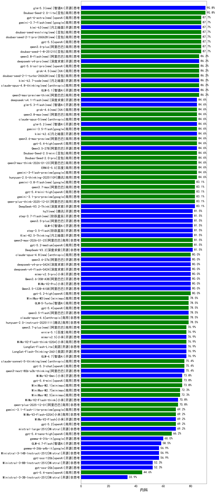

|类别|机构|大模型|【内科】准确率|平均耗时|平均消耗token|花费/千次（元）|排名（准确率）|
|---|---|-----|-------------------|-------|-----------|-----------|-----------|
|商用|豆包|Doubao-Seed-2.0-lite(new)|90.8%|210s|987|3.2|1|
|商用|豆包|doubao-seed-1-6-251015|90.8%|39s|802|5.7|2|
|商用|百度|ERNIE-4.5-Turbo-32K|89.2%|24s|557|1.6|3|
|商用|豆包|doubao-seed-1-8-251215(new)|87.7%|26s|801|5.6|4|
|商用|阿里巴巴|qwen3-max-preview-think(new)|86.2%|205s|2786|65.2|5|
|商用|阿里巴巴|qwen-plus-think-2025-07-28|86.2%|/|2768|21.5|6|
|商用|豆包|doubao-seed-1-6-250615|85.0%|71s|508|3.3|7|
|商用|豆包|Doubao-Seed-2.0-mini(new)|84.6%|358s|2477|4.7|8|
|商用|腾讯|hunyuan-2.0-thinking-20251109|84.6%|17s|910|3.4|9|
|开源|阿里巴巴|qwen3-235b-a22b-thinking-2507|84.6%|120s|2728|53.0|10|
|开源|阿里巴巴|Qwen3.5-27B(new)|84.6%|295s|3473|16.3|11|
|商用|阿里巴巴|qwen3-max-think-2026-01-23(new)|84.6%|184s|3478|34.1|12|
|商用|豆包|Doubao-Seed-2.0-pro(new)|84.6%|252s|1147|16.8|13|
|商用|阿里巴巴|qwen3-max-2025-09-23|84.6%|167s|609|13.0|14|
|商用|google|gemini-3-flash-preview(new)|84.6%|56s|1440|29.2|15|
|开源|深度求索|DeepSeek-V3.2-Think(new)|83.1%|93s|1419|4.2|16|
|商用|anthropic|claude-opus-4.5(new)|83.1%|16s|782|121.2|17|
|商用|阿里巴巴|qwen-plus-think-2025-12-01(new)|83.1%|60s|2520|19.5|18|
|商用|google|gemini-3.1-pro-preview(new)|83.1%|44s|2044|167.4|19|
|商用|豆包|doubao-seed-1-6-thinking-250715|83.1%|22s|1441|11.0|20|
|开源|深度求索|DeepSeek-V3.2(new)|81.5%|83s|418|1.2|21|
|商用|豆包|doubao-seed-1-6-lite-251015|81.5%|70s|880|1.9|22|
|开源|智谱AI|GLM-5(new)|81.5%|105s|2426|42.6|23|
|商用|openAI|gpt-5-2025-08-07|81.5%|32s|352|19.4|24|
|开源|阿里巴巴|qwen3-next-80b-a3b-instruct|81.5%|11s|708|2.6|25|
|开源|深度求索|DeepSeek-V3.2-Exp|81.5%|189s|419|1.2|26|
|开源|阿里巴巴|qwen3.5-plus(new)|81.5%|43s|3381|15.9|27|
|开源|阶跃星辰|step-3.5-flash(new)|81.5%|27s|1952|4.0|28|
|开源|月之暗面|Kimi-K2.5-Thinking(new)|81.5%|384s|2187|44.6|29|
|商用|openAI|gpt-5.1-high|81.5%|103s|1210|79.5|30|
|商用|百度|ERNIE-X1.1-Preview|81.5%|125s|914|3.4|31|
|商用|阿里巴巴|qwen3-max-2026-01-23(new)|81.5%|61s|564|5.0|32|
|开源|月之暗面|kimi-k2-0905|81.5%|105s|404|5.3|33|
|商用|豆包|doubao-seed-1-6-flash-thinking-250615|80.4%|9s|670|0.8|34|
|开源|阿里巴巴|qwen3-235b-a22b-instruct-2507|80.0%|14s|577|4.1|35|
|商用|阿里巴巴|qwen3-max-preview|80.0%|13s|557|11.8|36|
|商用|阿里巴巴|qwen-plus-2025-07-28|80.0%|15s|595|1.1|37|
|商用|科大讯飞|xunfei-spark-x1-0725|80.0%|/|1147|13.8|38|
|开源|阿里巴巴|Qwen3.5-122B-A10B(new)|80.0%|289s|3424|21.4|39|
|开源|月之暗面|kimi-k2-0711-preview|80.0%|34s|612|8.9|40|
|商用|豆包|Doubao-1.5-lite-32k-250115|79.2%|4s|201|0.1|41|
|商用|豆包|doubao-seed-1-6-flash-250615|79.2%|3s|326|0.4|42|
|开源|阿里巴巴|Qwen3-32B|78.8%|29s|1094|4.1|43|
|开源|meta|Llama-4-Maverick-17B-128E-Instruct-FP8|78.8%|8s|562|2.2|44|
|商用|google|gemini-3-pro-preview(new)|78.5%|54s|2345|193.8|45|
|商用|anthropic|claude-opus-4.6(new)|78.5%|14s|718|107.9|46|
|商用|腾讯|hunyuan-2.0-instruct-20251111|78.5%|13s|450|0.8|47|
|商用|百度|ERNIE-X1-Turbo-32K|78.5%|108s|2055|8.0|48|
|商用|anthropic|claude-sonnet-4.5-thinking|78.5%|29s|1967|200.4|49|
|商用|阿里巴巴|qwen-turbo-2025-07-15|78.5%|8s|472|0.3|50|
|商用|openAI|gpt-5.1-medium|78.5%|162s|605|36.6|51|
|开源|智谱AI|GLM-4.6|78.5%|55s|2472|33.7|52|
|商用|腾讯|hunyuan-turbos-20250926|78.5%|17s|712|1.3|53|
|开源|豆包|Seed-OSS-36B-Instruct|78.5%|91s|1932|7.5|54|
|商用|阿里巴巴|qwen-turbo-think-2025-07-15|78.5%|/|2366|6.9|55|
|开源|深度求索|DeepSeek-V3.2-Exp-Think|78.5%|123s|1185|3.5|56|
|开源|阿里巴巴|qwen3.5-flash(new)|78.5%|302s|4009|7.9|57|
|商用|腾讯|hunyuan-t1-20250711|76.9%|31s|1884|7.2|58|
|开源|智谱AI|GLM-4.7(new)|76.9%|68s|2717|37.2|59|
|开源|美团|LongCat-Flash-Lite(new)|76.9%|243s|620|0.0|60|
|商用|阿里巴巴|qwen-flash-2025-07-28|76.9%|9s|676|0.9|61|
|商用|小米|MiMo-V2-Flash-think-0204(new)|76.9%|597s|2137|4.3|62|
|开源|深度求索|DeepSeek-V3.1-Think|76.9%|54s|1042|11.9|63|
|开源|阶跃星辰|step-3|76.9%|106s|2078|8.1|64|
|开源|minimax|MiniMax-M1|75.8%|195s|3244|22.6|65|
|商用|google|gemini-2.5-pro|75.8%|37s|2511|177.0|66|
|开源|深度求索|DeepSeek-R1-0528|75.8%|235s|1932|30.1|67|
|开源|月之暗面|Kimi-K2-Thinking|75.4%|168s|2742|43.0|68|
|开源|阿里巴巴|qwen3-next-80b-a3b-thinking|75.4%|155s|3474|13.6|69|
|开源|智谱AI|GLM-4.5-nothink|75.4%|28s|833|10.7|70|
|开源|百度|ERNIE-4.5-300B-A47B|74.2%|17s|329|2.2|71|
|开源|美团|LongCat-Flash-Thinking-2601(new)|73.8%|318s|2532|0.0|72|
|商用|minimax|MiniMax-M2.1(new)|73.8%|90s|1640|13.1|73|
|开源|深度求索|DeepSeek-V3.1|73.8%|19s|367|3.8|74|
|商用|anthropic|claude-sonnet-4.5(new)|73.8%|12s|699|65.0|75|
|商用|阿里巴巴|qwen-flash-think-2025-07-28|73.8%|33s|2927|4.3|76|
|商用|XAI|grok-4-0709|73.1%|183s|1540|159.6|77|
|商用|百度|ERNIE-5.0-Thinking-Preview|72.3%|241s|1954|45.6|78|
|商用|minimax|MiniMax-M2.5(new)|72.3%|32s|1573|12.5|79|
|开源|智谱AI|GLM-4.5-Air|72.3%|34s|1763|10.2|80|
|开源|智谱AI|GLM-4.5|72.3%|59s|1834|24.8|81|
|商用|XAI|grok-4-1-fast-reasoning|72.3%|75s|1458|4.7|82|
|开源|小米|MiMo-V2-Flash-think(new)|70.8%|113s|2139|0.0|83|
|开源|阿里巴巴|Qwen3-30B-A3B-Instruct-2507|70.8%|5s|667|1.8|84|
|商用|阿里巴巴|qwen-plus-2025-12-01(new)|70.8%|25s|973|1.8|85|
|开源|阿里巴巴|Qwen3-30B-A3B-Thinking-2507|70.8%|69s|2762|7.5|86|
|开源|阿里巴巴|Qwen3-32B-nothink|70.8%|91s|639|2.3|87|
|商用|anthropic|claude-4-sonnet-thinking|70.8%|51s|1292|128.5|88|
|商用|anthropic|claude-haiku-4.5-thinking|70.8%|36s|2789|96.2|89|
|商用|百川智能|Baichuan4-Turbo|70.4%|/|/|/|90|
|开源|百度|ERNIE-4.5-21B-A3B|70.0%|35s|324|0.0|91|
|开源|Mistral|mistral-large-2512(new)|69.2%|15s|639|6.0|92|
|商用|openAI|gpt-5.2(new)|69.2%|6s|266|17.5|93|
|商用|anthropic|claude-haiku-4.5|69.2%|21s|695|21.1|94|
|开源|智谱AI|GLM-4.5-Air-nothink|69.2%|15s|1042|5.8|95|
|商用|小米|MiMo-V2-Flash-0204(new)|69.2%|200s|595|1.1|96|
|商用|Mistral|mistral-medium-2508|69.2%|97s|610|7.5|97|
|开源|小米|MiMo-V2-Flash(new)|69.2%|31s|543|0.0|98|
|开源|阿里巴巴|Qwen3-14B|68.8%|37s|1872|3.6|99|
|商用|google|gemini-2.5-flash|68.1%|12s|2010|35.2|100|
|开源|meta|Llama-4-Scout-17B-16E-Instruct|68.1%|9s|549|1.1|101|
|商用|openAI|gpt-5.1|67.7%|233s|277|13.3|102|
|商用|智谱AI|GLM-4.5-Flash-nothink|67.7%|20s|1077|0.0|103|
|开源|minimax|MiniMax-Text-01|67.7%|17s|937|7.4|104|
|开源|腾讯|Hunyuan-A13B-Instruct|67.3%|60s|1178|4.5|105|
|商用|openAI|gpt-5-mini-2025-08-07|66.2%|55s|997|13.2|106|
|开源|阿里巴巴|Qwen3-14B-nothink|66.2%|20s|672|1.2|107|
|商用|anthropic|claude-4-sonnet|65.4%|43s|632|56.7|108|
|商用|openAI|o4-mini|64.6%|33s|921|27.0|109|
|开源|minimax|MiniMax-M2|64.6%|33s|1880|15.1|110|
|商用|XAI|grok-3-mini|64.6%|191s|1192|4.2|111|
|开源|阿里巴巴|Qwen3-4B|63.9%|21s|1420|4.0|112|
|商用|智谱AI|GLM-4.5-Flash|63.1%|30s|1692|0.0|113|
|商用|openAI|gpt-5-nano-high|63.1%|489s|4661|13.3|114|
|开源|阿里巴巴|Qwen3-8B|61.5%|601s|10098|0.0|115|
|开源|智谱AI|GLM-4-9B-0414|58.9%|11s|489|0.0|116|
|开源|智谱AI|GLM-4.7-Flash(new)|58.5%|988s|3307|0.0|117|
|开源|深度求索|DeepSeek-R1-0528-Qwen3-8B|58.5%|265s|1760|0.0|118|
|开源|腾讯|Hunyuan-A13B-Instruct-nothink|56.9%|48s|420|1.4|119|
|开源|Mistral|Ministral-3-14B-Instruct-2512(new)|56.9%|9s|666|0.9|120|
|开源|openAI|gpt-oss-120b|56.9%|35s|742|2.0|121|
|商用|openAI|gpt-5-mini-high|56.9%|472s|2183|30.4|122|
|商用|google|gemini-2.5-flash-lite|55.4%|4s|717|1.9|123|
|开源|阿里巴巴|Qwen3-8B-nothink|55.4%|60s|643|0.0|124|
|商用|openAI|gpt-5-nano-2025-08-07|55.4%|48s|2068|5.7|125|
|开源|Mistral|Mistral-Small-3.2-24B-Instruct-2506|53.9%|36s|638|1.2|126|
|商用|百川智能|Baichuan4-Air|53.5%|/|/|/|127|
|开源|Mistral|Ministral-3-8B-Instruct-2512(new)|52.3%|8s|748|0.8|128|
|开源|openAI|gpt-oss-20b|52.3%|45s|1146|1.2|129|
|开源|阿里巴巴|Qwen3-4B-nothink|52.3%|21s|530|1.3|130|
|商用|百度|ERNIE-Lite-8K|45.0%|/|/|/|131|
|商用|XAI|grok-4-1-fast-non-reasoning|44.6%|52s|687|1.9|132|
|开源|google|gemma-3-27b-it|44.2%|/|/|/|133|
|开源|阿里巴巴|Qwen3-1.7B|43.5%|25s|2677|7.8|134|
|开源|google|gemma-3-12b-it|39.6%|/|/|/|135|
|开源|阿里巴巴|Qwen3-1.7B-nothink|38.5%|15s|545|1.4|136|
|开源|阿里巴巴|Qwen3-0.6B|35.0%|10s|1302|3.7|137|
|开源|Mistral|Ministral-3-3B-Instruct-2512(new)|33.9%|8s|779|0.6|138|
|开源|google|gemma-3-4b-it|29.2%|/|/|/|139|
|开源|百度|ERNIE-4.5-0.3B|20.4%|39s|401|0.0|140|
|开源|阿里巴巴|Qwen3-0.6B-nothink|20.0%|11s|305|0.7|141|
|商用|百度|ERNIE-5.0(new)|/%|209s|2375|55.7|142|
|商用|openAI|gpt-5.2-medium(new)|/%|9s|419|32.7|143|
|商用|openAI|gpt-5.2-high(new)|/%|11s|521|42.8|144|

