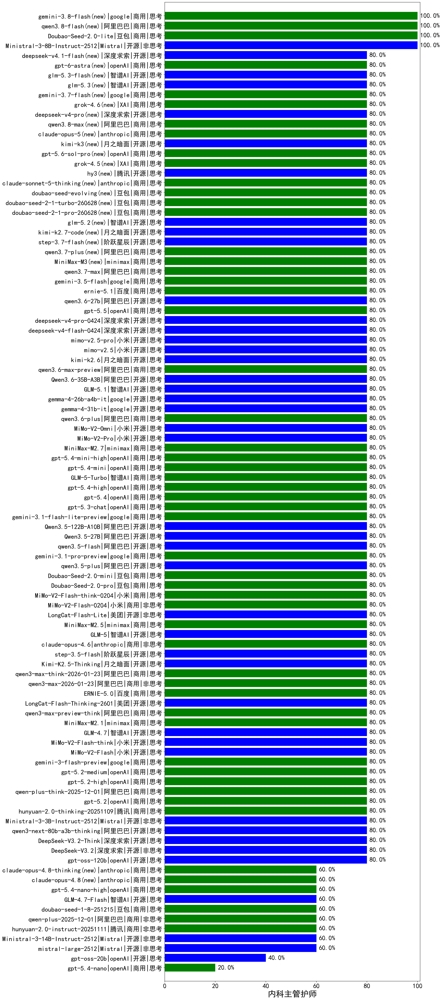

|类别|机构|大模型|【内科主管护师】准确率|平均耗时|平均消耗token|花费/千次（元）|排名（准确率）|
|---|---|-----|-------------------|-------|-----------|-----------|-----------|
|商用|腾讯|hunyuan-turbos-20250926|100.0%|14s|600|1.1|1|
|开源|Mistral|Ministral-3-8B-Instruct-2512|100.0%|4s|587|0.6|2|
|商用|豆包|Doubao-Seed-2.0-lite|100.0%|207s|895|2.9|3|
|开源|阿里巴巴|qwen3-235b-a22b-instruct-2507|100.0%|12s|482|3.4|4|
|开源|阿里巴巴|Qwen3-32B|95.0%|31s|861|3.2|5|
|商用|百度|ERNIE-4.5-Turbo-32K|95.0%|20s|503|1.5|6|
|商用|anthropic|claude-4-sonnet-thinking|90.0%|60s|587|54.3|7|
|开源|深度求索|DeepSeek-R1-0528|90.0%|255s|1919|29.9|8|
|商用|百度|ERNIE-X1-Turbo-32K|90.0%|92s|2080|8.1|9|
|商用|google|gemini-2.5-pro|90.0%|32s|2259|158.4|10|
|开源|阿里巴巴|Qwen3-8B|85.0%|38s|3459|0.0|11|
|商用|豆包|Doubao-Seed-2.0-mini|80.0%|357s|1611|3.0|12|
|开源|美团|LongCat-Flash-Lite|80.0%|47s|395|0.0|13|
|商用|小米|MiMo-V2-Flash-0204|80.0%|98s|448|0.8|14|
|商用|小米|MiMo-V2-Flash-think-0204|80.0%|111s|1705|3.4|15|
|商用|豆包|Doubao-Seed-2.0-pro|80.0%|153s|808|11.5|16|
|商用|腾讯|hunyuan-2.0-thinking-20251109|80.0%|9s|633|2.3|17|
|开源|阿里巴巴|qwen3.5-plus|80.0%|25s|1824|8.5|18|
|商用|google|gemini-3.1-pro-preview|80.0%|30s|1411|114.9|19|
|开源|智谱AI|GLM-5|80.0%|99s|2046|35.9|20|
|开源|阿里巴巴|qwen3.5-flash|80.0%|321s|2378|4.6|21|
|开源|阿里巴巴|Qwen3.5-27B|80.0%|150s|2521|11.8|22|
|开源|阿里巴巴|Qwen3.5-122B-A10B|80.0%|319s|2283|14.2|23|
|商用|minimax|MiniMax-M2.5|80.0%|20s|945|7.3|24|
|商用|阿里巴巴|qwen3-max-2026-01-23|80.0%|62s|382|3.2|25|
|商用|anthropic|claude-opus-4.6|80.0%|23s|639|96.5|26|
|开源|阶跃星辰|step-3.5-flash|80.0%|12s|1326|2.7|27|
|开源|月之暗面|Kimi-K2.5-Thinking|80.0%|208s|1107|22.1|28|
|商用|阿里巴巴|qwen3-max-think-2026-01-23|80.0%|80s|2114|20.5|29|
|商用|openAI|gpt-5.3-chat|80.0%|62s|332|24.8|30|
|商用|百度|ERNIE-5.0|80.0%|166s|1449|33.7|31|
|开源|美团|LongCat-Flash-Thinking-2601|80.0%|109s|1177|0.0|32|
|商用|阿里巴巴|qwen3-max-preview-think|80.0%|164s|1384|31.8|33|
|商用|minimax|MiniMax-M2.1|80.0%|14s|717|5.4|34|
|开源|智谱AI|GLM-4.7|80.0%|50s|1837|25.0|35|
|开源|小米|MiMo-V2-Flash-think|80.0%|22s|1750|0.0|36|
|开源|小米|MiMo-V2-Flash|80.0%|125s|414|0.0|37|
|商用|google|gemini-3-flash-preview|80.0%|95s|996|19.9|38|
|商用|openAI|gpt-5.2-medium|80.0%|6s|349|26.9|39|
|商用|google|gemini-3.1-flash-lite-preview|80.0%|32s|405|3.6|40|
|商用|openAI|gpt-5.4-mini-high|80.0%|11s|541|14.7|41|
|商用|openAI|gpt-5.4|80.0%|17s|327|26.6|42|
|商用|openAI|gpt-5.4-high|80.0%|7s|462|40.7|43|
|商用|豆包|doubao-seed-2-1-turbo-260628(new)|80.0%|165s|5341|78.8|44|
|商用|豆包|doubao-seed-2-1-pro-260628(new)|80.0%|334s|5998|177.4|45|
|开源|智谱AI|glm-5.2(new)|80.0%|33s|1558|42.1|46|
|开源|月之暗面|kimi-k2.7-code(new)|80.0%|12s|506|12.3|47|
|开源|阶跃星辰|step-3.7-flash(new)|80.0%|20s|1112|8.5|48|
|商用|阿里巴巴|qwen3.7-plus(new)|80.0%|19s|896|6.7|49|
|商用|minimax|MiniMax-M3(new)|80.0%|26s|723|9.2|50|
|商用|阿里巴巴|qwen3.7-max(new)|80.0%|17s|845|28.7|51|
|商用|google|gemini-3.5-flash(new)|80.0%|8s|1103|65.6|52|
|商用|百度|ernie-5.1(new)|80.0%|28s|750|12.6|53|
|开源|阿里巴巴|qwen3.6-27b(new)|80.0%|30s|1565|27.1|54|
|商用|openAI|gpt-5.5(new)|80.0%|6s|320|51.6|55|
|开源|深度求索|deepseek-v4-pro(new)|80.0%|37s|797|18.3|56|
|开源|深度求索|deepseek-v4-flash(new)|80.0%|26s|508|0.9|57|
|开源|小米|mimo-v2.5-pro(new)|80.0%|14s|1037|17.3|58|
|开源|小米|mimo-v2.5(new)|80.0%|402s|1358|15.5|59|
|开源|月之暗面|kimi-k2.6(new)|80.0%|97s|1643|43.0|60|
|商用|阿里巴巴|qwen3.6-max-preview|80.0%|48s|1468|76.0|61|
|开源|阿里巴巴|Qwen3.6-35B-A3B|80.0%|112s|1517|15.7|62|
|开源|智谱AI|GLM-5.1|80.0%|184s|1456|33.7|63|
|开源|google|gemma-4-26b-a4b-it|80.0%|44s|625|1.6|64|
|开源|google|gemma-4-31b-it|80.0%|71s|559|1.4|65|
|商用|阿里巴巴|qwen3.6-plus|80.0%|24s|1397|16.0|66|
|开源|小米|MiMo-V2-Omni|80.0%|152s|1002|10.4|67|
|开源|小米|MiMo-V2-Pro|80.0%|13s|1065|17.9|68|
|商用|minimax|MiniMax-M2.7|80.0%|26s|1007|7.8|69|
|商用|阿里巴巴|qwen-plus-think-2025-12-01|80.0%|47s|1785|13.7|70|
|商用|openAI|gpt-5.4-mini|80.0%|81s|259|5.8|71|
|商用|智谱AI|GLM-5-Turbo|80.0%|30s|1116|23.4|72|
|商用|openAI|gpt-5.2-high|80.0%|9s|318|23.8|73|
|商用|豆包|doubao-seed-evolving(new)|80.0%|206s|6512|192.8|74|
|商用|阿里巴巴|qwen-turbo-think-2025-07-15|80.0%|/|1529|4.4|75|
|商用|openAI|gpt-5.2|80.0%|5s|211|13.2|76|
|开源|阿里巴巴|Qwen3-14B-nothink|80.0%|12s|585|1.0|77|
|商用|openAI|gpt-5.1-medium|80.0%|47s|347|19.1|78|
|商用|智谱AI|GLM-4.5-Flash|80.0%|29s|1428|0.0|79|
|开源|月之暗面|Kimi-K2-Thinking|80.0%|56s|958|14.5|80|
|商用|豆包|doubao-seed-1-6-lite-251015|80.0%|18s|651|1.4|81|
|商用|豆包|doubao-seed-1-6-251015|80.0%|12s|616|4.2|82|
|开源|阿里巴巴|qwen3-next-80b-a3b-instruct|80.0%|12s|539|1.9|83|
|开源|豆包|Seed-OSS-36B-Instruct|80.0%|67s|1133|4.4|84|
|商用|阿里巴巴|qwen3-max-preview|80.0%|10s|484|10.2|85|
|商用|google|gemini-2.5-flash-lite|80.0%|5s|520|1.3|86|
|开源|openAI|gpt-oss-120b|80.0%|3s|635|1.7|87|
|开源|深度求索|DeepSeek-V3.1-Think|80.0%|42s|815|9.2|88|
|开源|深度求索|DeepSeek-V3.1|80.0%|15s|311|3.2|89|
|开源|智谱AI|GLM-4.5-Air|80.0%|24s|1245|7.1|90|
|开源|阿里巴巴|Qwen3-30B-A3B-Instruct-2507|80.0%|4s|534|1.4|91|
|商用|阿里巴巴|qwen-flash-think-2025-07-28|80.0%|19s|1978|2.9|92|
|商用|阿里巴巴|qwen-flash-2025-07-28|80.0%|7s|494|0.6|93|
|开源|阿里巴巴|Qwen3-30B-A3B-Thinking-2507|80.0%|55s|1834|4.9|94|
|商用|openAI|gpt-5-mini-2025-08-07|80.0%|25s|592|7.5|95|
|商用|openAI|gpt-5-2025-08-07|80.0%|22s|239|12.1|96|
|商用|anthropic|claude-haiku-4.5-thinking|80.0%|36s|1577|52.7|97|
|商用|XAI|grok-4-1-fast-reasoning|80.0%|95s|838|2.5|98|
|开源|阿里巴巴|qwen3-235b-a22b-thinking-2507|80.0%|38s|1724|33.1|99|
|商用|腾讯|hunyuan-t1-20250711|80.0%|26s|1508|5.7|100|
|开源|阿里巴巴|Qwen3-14B|80.0%|30s|1847|3.6|101|
|开源|阿里巴巴|Qwen3-4B|80.0%|21s|1288|3.6|102|
|开源|Mistral|Ministral-3-3B-Instruct-2512|80.0%|3s|939|0.7|103|
|商用|anthropic|claude-4-sonnet|80.0%|40s|676|59.6|104|
|开源|阿里巴巴|qwen3-next-80b-a3b-thinking|80.0%|132s|1957|7.6|105|
|开源|深度求索|DeepSeek-V3.2-Think|80.0%|32s|805|2.3|106|
|商用|google|gemini-2.5-flash|80.0%|13s|1902|33.1|107|
|开源|月之暗面|kimi-k2-0905|80.0%|104s|298|3.7|108|
|开源|深度求索|DeepSeek-V3.2|80.0%|144s|322|0.9|109|
|商用|openAI|gpt-5-mini-high|80.0%|971s|1077|14.5|110|
|商用|阿里巴巴|qwen3-max-2025-09-23|80.0%|404s|440|9.1|111|
|商用|anthropic|claude-opus-4.5|80.0%|12s|844|134.7|112|
|商用|阿里巴巴|qwen-turbo-2025-07-15|80.0%|14s|360|0.2|113|
|商用|百度|ERNIE-X1.1-Preview|80.0%|129s|644|2.4|114|
|商用|anthropic|claude-sonnet-4.5-thinking|80.0%|20s|1395|139.6|115|
|商用|anthropic|claude-sonnet-4.5|80.0%|20s|631|59.1|116|
|商用|openAI|gpt-5.1-high|80.0%|140s|550|33.5|117|
|开源|智谱AI|GLM-4.5-Air-nothink|80.0%|26s|1015|5.7|118|
|商用|openAI|o4-mini|70.0%|33s|627|17.3|119|
|开源|智谱AI|GLM-4-9B-0414|65.0%|13s|456|0|120|
|商用|百川智能|Baichuan4-Turbo|63.6%|/|/|/|121|
|商用|智谱AI|GLM-4.5-Flash-nothink|60.0%|21s|1043|0.0|122|
|商用|XAI|grok-4-1-fast-non-reasoning|60.0%|6s|680|1.9|123|
|商用|腾讯|hunyuan-2.0-instruct-20251111|60.0%|10s|394|0.7|124|
|商用|豆包|doubao-seed-1-8-251215|60.0%|29s|683|4.7|125|
|开源|Mistral|Ministral-3-14B-Instruct-2512|60.0%|16s|1132|1.6|126|
|商用|anthropic|claude-opus-4.8-thinking(new)|60.0%|11s|664|101.0|127|
|开源|Mistral|mistral-large-2512|60.0%|13s|506|4.7|128|
|开源|智谱AI|GLM-4.7-Flash|60.0%|744s|4370|0.0|129|
|商用|openAI|gpt-5-nano-high|60.0%|980s|2862|8.1|130|
|商用|anthropic|claude-opus-4.8(new)|60.0%|9s|519|75.5|131|
|商用|百度|ERNIE-5.0-Thinking-Preview|60.0%|148s|1543|36.0|132|
|开源|阿里巴巴|Qwen3-4B-nothink|60.0%|22s|446|1.1|133|
|开源|阿里巴巴|Qwen3-8B-nothink|60.0%|19s|510|0.0|134|
|商用|anthropic|claude-haiku-4.5|60.0%|11s|664|20.5|135|
|开源|阿里巴巴|Qwen3-32B-nothink|60.0%|27s|552|2.0|136|
|商用|openAI|gpt-5.1|60.0%|536s|233|11.0|137|
|商用|openAI|gpt-5.4-nano-high|60.0%|12s|434|3.1|138|
|商用|阿里巴巴|qwen-plus-2025-12-01|60.0%|20s|727|1.4|139|
|开源|openAI|gpt-oss-20b|40.0%|3s|763|0.8|140|
|商用|openAI|gpt-5-nano-2025-08-07|40.0%|33s|1266|3.4|141|
|商用|openAI|gpt-5.4-nano|20.0%|3s|279|1.8|142|
|开源|meta|Llama-4-Scout-17B-16E-Instruct|20.0%|7s|476|0.9|143|

