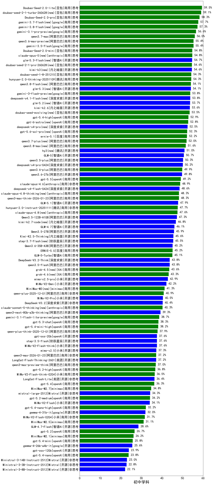

|类别|机构|大模型|【初中学科】准确率|平均耗时|平均消耗token|花费/千次（元）|排名（准确率）|
|---|---|-----|-------------------|-------|-----------|-----------|-----------|
|开源|豆包|Seed-OSS-36B-Instruct|62.5%|157s|2007|7.8|1|
|商用|百度|ERNIE-4.5-Turbo-32K|60.0%|16s|516|1.4|2|
|商用|豆包|Doubao-Seed-2.0-lite(new)|59.5%|221s|1047|3.3|3|
|商用|豆包|Doubao-Seed-2.0-pro(new)|58.3%|286s|1407|20.6|4|
|商用|google|gemini-3.1-pro-preview(new)|56.6%|39s|1956|158.4|5|
|商用|腾讯|hunyuan-turbos-20250926|55.8%|14s|664|1.2|6|
|商用|豆包|doubao-seed-1-6-251015|55.5%|62s|905|6.3|7|
|商用|豆包|doubao-seed-1-6-lite-251015|55.0%|70s|1270|2.8|8|
|商用|豆包|Doubao-Seed-2.0-mini(new)|54.8%|415s|2441|4.6|9|
|商用|豆包|doubao-seed-1-8-251215|54.3%|27s|764|5.0|10|
|商用|anthropic|claude-opus-4.5|54.3%|13s|774|114.4|11|
|商用|腾讯|hunyuan-2.0-thinking-20251109|54.3%|31s|1301|4.9|12|
|商用|google|gemini-3-flash-preview|53.8%|56s|1839|37.1|13|
|商用|openAI|gpt-5.4-high(new)|52.9%|17s|966|90.4|14|
|商用|百度|ERNIE-X1.1-Preview|52.9%|135s|1542|5.9|15|
|开源|智谱AI|GLM-5(new)|50.7%|134s|2860|50.1|16|
|开源|阿里巴巴|qwen3.5-plus(new)|50.3%|48s|3992|18.7|17|
|商用|阿里巴巴|qwen3.6-plus(new)|49.9%|58s|2830|32.9|18|
|商用|腾讯|hunyuan-t1-20250711|49.9%|28s|1607|5.7|19|
|商用|anthropic|claude-opus-4.6|48.9%|18s|673|94.9|20|
|商用|阿里巴巴|qwen3-max-think-2026-01-23|48.3%|287s|4466|43.8|21|
|开源|智谱AI|GLM-5.1(new)|47.9%|222s|2599|60.5|22|
|商用|百度|ERNIE-X1-Turbo-32K|47.9%|80s|1523|5.8|23|
|商用|腾讯|hunyuan-2.0-instruct-20251111|47.7%|19s|540|0.9|24|
|开源|阿里巴巴|Qwen3.5-122B-A10B(new)|47.3%|205s|4195|26.2|25|
|商用|anthropic|claude-sonnet-4.5-thinking|46.3%|37s|2650|271.4|26|
|开源|智谱AI|GLM-4.7|46.1%|77s|2910|39.6|27|
|开源|阿里巴巴|qwen3-235b-a22b-thinking-2507|45.9%|66s|2461|46.0|28|
|开源|阿里巴巴|Qwen3.5-27B(new)|45.9%|409s|4353|20.4|29|
|开源|月之暗面|Kimi-K2.5-Thinking|45.6%|317s|2961|60.5|30|
|开源|阿里巴巴|Qwen3.6-35B-A3B(new)|45.2%|67s|2698|28.2|31|
|商用|百度|ERNIE-5.0|45.2%|180s|2879|67.4|32|
|商用|智谱AI|GLM-5-Turbo(new)|45.1%|42s|2256|47.9|33|
|开源|深度求索|DeepSeek-V3.2-Think|43.8%|159s|1863|5.5|34|
|开源|阿里巴巴|qwen3.5-flash(new)|43.8%|343s|4711|9.2|35|
|商用|阿里巴巴|qwen3-max-preview|43.1%|33s|597|12.2|36|
|商用|anthropic|claude-sonnet-4.5(new)|42.2%|10s|642|55.6|37|
|商用|小米|MiMo-V2-Omni(new)|42.2%|279s|2200|26.8|38|
|开源|阿里巴巴|Qwen3-8B|41.4%|503s|12052|0.0|39|
|商用|百川智能|Baichuan4-Turbo|41.3%|/|/|/|40|
|商用|阿里巴巴|qwen-plus-2025-12-01|40.9%|31s|1271|2.4|41|
|商用|小米|MiMo-V2-Pro(new)|40.5%|311s|1424|24.9|42|
|开源|阿里巴巴|qwen3-235b-a22b-instruct-2507|40.4%|21s|747|5.3|43|
|开源|深度求索|DeepSeek-V3.2|40.4%|76s|507|1.4|44|
|商用|openAI|gpt-5.1-high|40.3%|77s|2025|135.9|45|
|商用|openAI|gpt-5-2025-08-07|39.9%|52s|489|27.8|46|
|开源|阿里巴巴|qwen3-next-80b-a3b-thinking|39.3%|107s|4284|16.8|47|
|开源|深度求索|DeepSeek-V3.1|39.1%|20s|450|4.6|48|
|开源|阿里巴巴|Qwen3-32B|39.0%|86s|3166|12.3|49|
|开源|阿里巴巴|qwen3-next-80b-a3b-instruct|38.9%|32s|786|2.8|50|
|商用|openAI|gpt-5.1-medium|38.8%|165s|960|60.4|51|
|商用|google|gemini-3.1-flash-lite-preview(new)|38.7%|20s|433|3.5|52|
|商用|百度|ERNIE-5.0-Thinking-Preview|38.3%|264s|2309|53.7|53|
|商用|openAI|gpt-5.3-chat(new)|38.3%|36s|498|38.1|54|
|商用|openAI|gpt-5.4-mini-high(new)|38.2%|65s|1431|41.8|55|
|商用|阿里巴巴|qwen-plus-think-2025-12-01|37.9%|70s|3200|24.8|56|
|商用|阿里巴巴|qwen3-max-2025-09-23|37.6%|210s|990|21.7|57|
|开源|openAI|gpt-oss-20b|37.6%|111s|1478|1.6|58|
|开源|阶跃星辰|step-3.5-flash|37.6%|32s|3373|6.9|59|
|开源|小米|MiMo-V2-Flash-think|37.6%|83s|3172|0.0|60|
|开源|美团|LongCat-Flash-Thinking-2601|37.2%|165s|3377|0.0|61|
|商用|阿里巴巴|qwen3-max-2026-01-23|37.2%|125s|1026|9.4|62|
|商用|阿里巴巴|qwen3-max-preview-think|37.0%|162s|2830|65.9|63|
|商用|google|gemini-2.5-pro|36.8%|46s|2446|169.8|64|
|商用|openAI|gpt-5.2-high|36.8%|16s|765|65.1|65|
|开源|深度求索|DeepSeek-V3.1-Think|36.8%|57s|1171|13.3|66|
|商用|阿里巴巴|qwen-turbo-think-2025-07-15|36.8%|/|2535|7.3|67|
|商用|小米|MiMo-V2-Flash-think-0204(new)|36.5%|560s|2782|5.7|68|
|开源|美团|LongCat-Flash-Lite(new)|36.4%|203s|796|0.0|69|
|商用|openAI|gpt-5.4(new)|36.3%|4s|344|25.2|70|
|开源|月之暗面|Kimi-K2-Thinking|35.7%|339s|5514|87.0|71|
|开源|月之暗面|kimi-k2-0905|35.5%|115s|939|13.6|72|
|开源|阿里巴巴|Qwen3-14B|35.4%|98s|5090|10.0|73|
|开源|阿里巴巴|Qwen3-30B-A3B-Thinking-2507|35.0%|78s|2369|6.4|74|
|商用|minimax|MiniMax-M2.7(new)|34.8%|61s|2566|20.7|75|
|开源|Mistral|mistral-large-2512|34.3%|14s|632|5.7|76|
|商用|openAI|gpt-5.2-medium|34.2%|13s|617|50.4|77|
|开源|小米|MiMo-V2-Flash|34.1%|61s|805|0.0|78|
|商用|anthropic|claude-haiku-4.5-thinking|34.1%|45s|3544|122.4|79|
|商用|阿里巴巴|qwen-flash-think-2025-07-28|33.7%|25s|2396|3.4|80|
|开源|深度求索|DeepSeek-R1-0528|33.5%|147s|2148|33.2|81|
|商用|阿里巴巴|qwen-flash-2025-07-28|33.0%|27s|801|1.0|82|
|商用|anthropic|claude-4-sonnet-thinking|32.8%|38s|621|53.2|83|
|商用|anthropic|claude-4-sonnet|32.8%|17s|587|50.3|84|
|开源|智谱AI|GLM-4-9B-0414|32.6%|17s|503|0.0|85|
|商用|openAI|gpt-5.4-nano-high(new)|32.2%|57s|975|7.6|86|
|开源|阿里巴巴|Qwen3-4B|32.1%|39s|2459|7.1|87|
|开源|google|gemma-4-31b-it(new)|32.0%|67s|550|1.3|88|
|商用|小米|MiMo-V2-Flash-0204(new)|31.7%|228s|766|1.4|89|
|开源|阿里巴巴|Qwen3-30B-A3B-Instruct-2507|31.6%|30s|801|2.1|90|
|商用|阿里巴巴|qwen-turbo-2025-07-15|31.3%|29s|518|0.3|91|
|商用|minimax|MiniMax-M2.5(new)|31.1%|40s|2133|17.1|92|
|开源|智谱AI|GLM-4.5-Air|29.5%|61s|2512|14.4|93|
|商用|XAI|grok-4-1-fast-reasoning|29.1%|77s|1692|5.5|94|
|开源|智谱AI|GLM-4.7-Flash|28.6%|1590s|4914|0.0|95|
|商用|anthropic|claude-haiku-4.5|28.5%|13s|662|18.9|96|
|商用|openAI|gpt-5-mini-2025-08-07|28.3%|57s|1015|13.1|97|
|商用|智谱AI|GLM-4.5-Flash|28.2%|49s|2271|0.0|98|
|商用|openAI|gpt-5-mini-high|27.7%|394s|2651|36.8|99|
|商用|openAI|gpt-5-nano-2025-08-07|27.7%|49s|2358|6.5|100|
|商用|openAI|o4-mini|27.5%|20s|970|28.3|101|
|开源|阿里巴巴|Qwen3-32B-nothink|27.1%|44s|612|2.1|102|
|商用|openAI|gpt-5.2|26.7%|6s|281|17.0|103|
|商用|openAI|gpt-5.1|26.7%|161s|323|15.1|104|
|商用|minimax|MiniMax-M2.1|26.2%|99s|2347|18.9|105|
|商用|openAI|gpt-5.4-mini(new)|25.8%|36s|313|6.5|106|
|开源|google|gemma-4-26b-a4b-it(new)|25.6%|47s|614|1.5|107|
|商用|google|gemini-2.5-flash|25.3%|14s|2126|36.6|108|
|开源|meta|Llama-4-Scout-17B-16E-Instruct|25.0%|18s|578|1.1|109|
|商用|openAI|gpt-5-nano-high|24.6%|422s|5385|15.3|110|
|商用|智谱AI|GLM-4.5-Flash-nothink|24.6%|27s|1059|0.0|111|
|商用|google|gemini-2.5-flash-lite|24.2%|19s|1775|4.9|112|
|开源|openAI|gpt-oss-120b|23.9%|45s|885|2.4|113|
|商用|openAI|gpt-5.4-nano(new)|23.8%|32s|310|1.8|114|
|开源|阿里巴巴|Qwen3-14B-nothink|23.7%|34s|616|1.1|115|
|开源|阿里巴巴|Qwen3-8B-nothink|23.2%|38s|580|0.0|116|
|开源|Mistral|Ministral-3-14B-Instruct-2512|23.0%|17s|1496|2.1|117|
|商用|XAI|grok-4-1-fast-non-reasoning|22.8%|43s|561|1.4|118|
|开源|Mistral|Ministral-3-3B-Instruct-2512|22.8%|12s|1304|0.9|119|
|开源|智谱AI|GLM-4.5-Air-nothink|22.8%|38s|1385|7.7|120|
|开源|阿里巴巴|Qwen3-4B-nothink|22.6%|17s|538|1.3|121|
|开源|Mistral|Ministral-3-8B-Instruct-2512|22.1%|12s|946|1.0|122|

