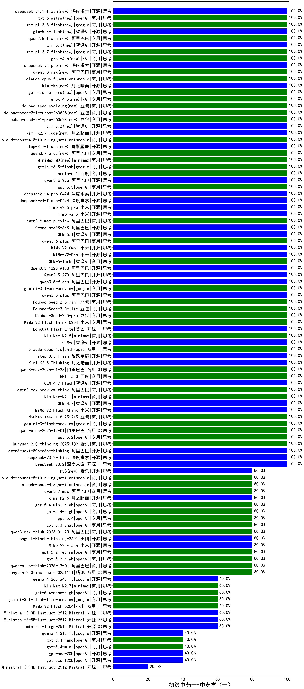

|类别|机构|大模型|【初级中药士-中药学（士）】准确率|平均耗时|平均消耗token|花费/千次（元）|排名（准确率）|
|---|---|-----|-------------------|-------|-----------|-----------|-----------|
|商用|豆包|Doubao-Seed-2.0-mini(new)|100.0%|306s|1268|2.4|1|
|开源|深度求索|DeepSeek-V3.2-Think(new)|100.0%|124s|957|2.8|2|
|商用|阿里巴巴|qwen3-max-2025-09-23|100.0%|23s|431|9.1|3|
|商用|anthropic|claude-opus-4.5(new)|100.0%|18s|574|90.0|4|
|商用|百度|ERNIE-X1.1-Preview|100.0%|127s|635|2.4|5|
|商用|anthropic|claude-sonnet-4.5-thinking|100.0%|21s|1317|133.3|6|
|商用|anthropic|claude-sonnet-4.5(new)|100.0%|14s|543|51.7|7|
|商用|openAI|gpt-5.1-high|100.0%|139s|1478|100.6|8|
|开源|月之暗面|kimi-k2-0905|100.0%|76s|248|3.0|9|
|开源|月之暗面|kimi-k2-0711-preview|100.0%|26s|448|6.5|10|
|商用|腾讯|hunyuan-t1-20250711|100.0%|17s|994|3.7|11|
|商用|google|gemini-3-pro-preview(new)|100.0%|61s|1238|101.2|12|
|商用|豆包|doubao-seed-1-6-lite-251015|100.0%|30s|597|1.2|13|
|商用|豆包|doubao-seed-1-6-251015|100.0%|6s|570|3.9|14|
|开源|智谱AI|GLM-4.6|100.0%|34s|1829|24.9|15|
|开源|阿里巴巴|qwen3-235b-a22b-thinking-2507|100.0%|51s|2027|39.4|16|
|商用|科大讯飞|xunfei-spark-x1-0725|100.0%|/|796|9.6|17|
|商用|腾讯|hunyuan-turbos-20250926|100.0%|15s|628|1.1|18|
|开源|深度求索|DeepSeek-V3.2-Exp-Think|100.0%|34s|696|2.0|19|
|开源|深度求索|DeepSeek-V3.2-Exp|100.0%|31s|329|0.9|20|
|开源|阿里巴巴|qwen3-next-80b-a3b-instruct|100.0%|13s|488|1.8|21|
|商用|阿里巴巴|qwen-turbo-think-2025-07-15|100.0%|/|2126|6.2|22|
|商用|阿里巴巴|qwen-plus-think-2025-07-28|100.0%|/|2080|16.2|23|
|商用|智谱AI|GLM-4.5-Flash|100.0%|22s|1193|0.0|24|
|商用|阿里巴巴|qwen-plus-2025-07-28|100.0%|25s|782|1.5|25|
|开源|智谱AI|GLM-4.5|100.0%|57s|1298|17.5|26|
|开源|深度求索|DeepSeek-V3.1-Think|100.0%|36s|702|7.9|27|
|商用|阿里巴巴|qwen-flash-think-2025-07-28|100.0%|19s|2029|3.0|28|
|开源|深度求索|DeepSeek-V3.2(new)|100.0%|62s|299|0.8|29|
|开源|阿里巴巴|qwen3-next-80b-a3b-thinking|100.0%|139s|2196|8.6|30|
|开源|美团|LongCat-Flash-Thinking-2601(new)|100.0%|187s|1964|0.0|31|
|商用|豆包|Doubao-Seed-2.0-lite(new)|100.0%|121s|620|1.9|32|
|商用|豆包|Doubao-Seed-2.0-pro(new)|100.0%|196s|880|12.8|33|
|商用|小米|MiMo-V2-Flash-think-0204(new)|100.0%|567s|1212|2.4|34|
|开源|美团|LongCat-Flash-Lite(new)|100.0%|58s|429|0.0|35|
|商用|minimax|MiniMax-M2.5(new)|100.0%|13s|646|4.8|36|
|开源|智谱AI|GLM-5(new)|100.0%|78s|1452|25.3|37|
|商用|anthropic|claude-opus-4.6(new)|100.0%|20s|511|77.5|38|
|开源|阶跃星辰|step-3.5-flash(new)|100.0%|13s|1169|2.4|39|
|开源|月之暗面|Kimi-K2.5-Thinking(new)|100.0%|233s|1092|21.9|40|
|商用|阿里巴巴|qwen3-max-2026-01-23(new)|100.0%|64s|442|3.9|41|
|商用|百度|ERNIE-5.0(new)|100.0%|122s|1222|28.4|42|
|开源|智谱AI|GLM-4.7-Flash(new)|100.0%|1214s|2246|0.0|43|
|商用|阿里巴巴|qwen3-max-preview-think(new)|100.0%|209s|2069|48.4|44|
|商用|minimax|MiniMax-M2.1(new)|100.0%|139s|8710|72.6|45|
|开源|智谱AI|GLM-4.7(new)|100.0%|31s|1464|19.8|46|
|开源|小米|MiMo-V2-Flash-think(new)|100.0%|28s|1465|0.0|47|
|商用|豆包|doubao-seed-1-8-251215(new)|100.0%|32s|515|3.4|48|
|商用|google|gemini-3-flash-preview(new)|100.0%|11s|1025|20.8|49|
|商用|阿里巴巴|qwen-plus-2025-12-01(new)|100.0%|22s|765|1.4|50|
|商用|openAI|gpt-5.2(new)|100.0%|7s|150|8.8|51|
|商用|腾讯|hunyuan-2.0-thinking-20251109|100.0%|11s|630|2.4|52|
|开源|阶跃星辰|step-3|100.0%|74s|1388|5.4|53|
|商用|豆包|doubao-seed-1-6-flash-250615|90.0%|4s|354|0.4|54|
|商用|百度|ERNIE-4.5-Turbo-32K|90.0%|22s|552|1.6|55|
|商用|XAI|grok-4-0709|90.0%|128s|1322|138.1|56|
|商用|anthropic|claude-4-sonnet-thinking|90.0%|60s|499|46.9|57|
|开源|阿里巴巴|Qwen3-30B-A3B-Thinking-2507|90.0%|65s|1686|4.6|58|
|商用|阿里巴巴|qwen-long-2025-01-25|85.0%|9s|332|0.6|59|
|商用|豆包|doubao-seed-1-6-flash-thinking-250615|85.0%|7s|499|0.6|60|
|开源|阿里巴巴|Qwen3-14B|85.0%|20s|983|1.9|61|
|商用|google|gemini-2.5-pro|85.0%|36s|2109|148.9|62|
|商用|百度|ERNIE-X1-Turbo-32K|85.0%|83s|1985|7.8|63|
|商用|豆包|doubao-seed-1-6-250615|80.0%|157s|431|2.8|64|
|开源|minimax|MiniMax-M2|80.0%|29s|2130|17.3|65|
|开源|月之暗面|Kimi-K2-Thinking|80.0%|147s|1226|18.9|66|
|商用|openAI|gpt-5.1-medium|80.0%|174s|775|50.7|67|
|商用|anthropic|claude-haiku-4.5-thinking|80.0%|21s|2570|89.4|68|
|商用|阿里巴巴|qwen-turbo-2025-07-15|80.0%|7s|344|0.2|69|
|商用|智谱AI|GLM-4.5-Flash-nothink|80.0%|17s|780|0.0|70|
|开源|百度|ERNIE-4.5-21B-A3B|80.0%|66s|378|0.0|71|
|开源|minimax|MiniMax-M1|80.0%|62s|1456|8.5|72|
|开源|智谱AI|GLM-4.5-Air-nothink|80.0%|17s|862|4.8|73|
|商用|豆包|doubao-seed-1-6-thinking-250715|80.0%|31s|2000|15.6|74|
|商用|腾讯|hunyuan-2.0-instruct-20251111|80.0%|7s|390|0.7|75|
|商用|anthropic|claude-4-sonnet|80.0%|44s|469|43.3|76|
|商用|阿里巴巴|qwen-plus-think-2025-12-01(new)|80.0%|43s|1886|14.6|77|
|商用|openAI|gpt-5.2-high(new)|80.0%|15s|662|59.7|78|
|商用|openAI|gpt-5.2-medium(new)|80.0%|8s|317|25.4|79|
|开源|小米|MiMo-V2-Flash(new)|80.0%|247s|417|0.0|80|
|开源|meta|Llama-4-Maverick-17B-128E-Instruct-FP8|80.0%|8s|550|2.2|81|
|商用|阿里巴巴|qwen3-max-think-2026-01-23(new)|80.0%|122s|3060|30.1|82|
|开源|阿里巴巴|qwen3-235b-a22b-instruct-2507|80.0%|13s|538|3.9|83|
|商用|百度|ERNIE-5.0-Thinking-Preview|80.0%|102s|1094|25.3|84|
|开源|阿里巴巴|Qwen3-30B-A3B-Instruct-2507|80.0%|5s|503|1.4|85|
|商用|阿里巴巴|qwen-flash-2025-07-28|80.0%|8s|502|0.7|86|
|开源|智谱AI|GLM-4.5-Air|80.0%|23s|1144|6.5|87|
|开源|深度求索|DeepSeek-V3.1|80.0%|20s|292|3.0|88|
|开源|智谱AI|GLM-4.5-nothink|80.0%|17s|604|7.7|89|
|开源|豆包|Seed-OSS-36B-Instruct|80.0%|117s|1166|4.5|90|
|商用|阿里巴巴|qwen3-max-preview|80.0%|10s|432|9.2|91|
|商用|openAI|gpt-5-2025-08-07|80.0%|37s|286|16.6|92|
|开源|阿里巴巴|Qwen3-32B|75.0%|34s|1423|5.5|93|
|开源|深度求索|DeepSeek-R1-0528|75.0%|235s|1814|28.2|94|
|开源|百度|ERNIE-4.5-300B-A47B|75.0%|9s|330|2.2|95|
|商用|豆包|Doubao-1.5-lite-32k-250115|75.0%|4s|171|0.1|96|
|开源|深度求索|DeepSeek-R1-0528-Qwen3-8B|70.0%|273s|1682|0.0|97|
|开源|阿里巴巴|Qwen3-8B|70.0%|145s|4514|0.0|98|
|开源|腾讯|Hunyuan-A13B-Instruct|65.0%|47s|1619|6.3|99|
|开源|Mistral|Mistral-Small-3.2-24B-Instruct-2506|60.0%|12s|427|0.8|100|
|开源|腾讯|Hunyuan-A13B-Instruct-nothink|60.0%|16s|411|1.5|101|
|开源|Mistral|Ministral-3-3B-Instruct-2512(new)|60.0%|3s|579|0.4|102|
|开源|Mistral|Ministral-3-8B-Instruct-2512(new)|60.0%|3s|448|0.5|103|
|开源|Mistral|mistral-large-2512(new)|60.0%|8s|323|2.9|104|
|开源|阿里巴巴|Qwen3-4B|60.0%|23s|2052|6.0|105|
|开源|阿里巴巴|Qwen3-14B-nothink|60.0%|16s|497|0.9|106|
|商用|小米|MiMo-V2-Flash-0204(new)|60.0%|152s|687|1.3|107|
|商用|百川智能|Baichuan4-Turbo|60.0%|/|/|/|108|
|开源|阿里巴巴|Qwen3-32B-nothink|60.0%|144s|592|2.2|109|
|商用|google|gemini-2.5-flash|60.0%|9s|1615|28.3|110|
|商用|openAI|gpt-5.1|60.0%|123s|151|6.4|111|
|开源|阿里巴巴|Qwen3-8B-nothink|60.0%|26s|454|0.0|112|
|商用|XAI|grok-4-1-fast-reasoning|60.0%|12s|1087|3.4|113|
|开源|阿里巴巴|Qwen3-1.7B|55.0%|33s|2306|6.7|114|
|开源|minimax|MiniMax-Text-01|55.0%|16s|869|7.0|115|
|开源|meta|Llama-4-Scout-17B-16E-Instruct|50.0%|14s|571|1.1|116|
|商用|XAI|grok-3-mini|50.0%|127s|1137|4.0|117|
|开源|智谱AI|GLM-4-9B-0414|50.0%|12s|410|0.0|118|
|商用|360|360zhinao2-o1|50.0%|/|/|/|119|
|商用|百度|ERNIE-Lite-8K|45.0%|/|/|/|120|
|商用|百川智能|Baichuan4-Air|45.0%|/|/|/|121|
|开源|openAI|gpt-oss-120b|40.0%|70s|873|2.5|122|
|开源|openAI|gpt-oss-20b|40.0%|13s|1570|1.7|123|
|商用|Mistral|mistral-medium-2508|40.0%|21s|345|4.1|124|
|开源|阿里巴巴|Qwen3-1.7B-nothink|40.0%|17s|595|1.6|125|
|商用|google|gemini-2.5-flash-lite|40.0%|2s|397|1.0|126|
|开源|Mistral|Magistral-Small-2507|40.0%|95s|3030|32.4|127|
|商用|openAI|gpt-5-mini-2025-08-07|40.0%|142s|1043|14.2|128|
|商用|openAI|gpt-5-mini-high|40.0%|108s|2678|37.9|129|
|商用|XAI|grok-4-1-fast-non-reasoning|40.0%|91s|604|1.7|130|
|商用|anthropic|claude-haiku-4.5|40.0%|9s|529|16.3|131|
|开源|阿里巴巴|Qwen3-4B-nothink|40.0%|18s|435|1.1|132|
|商用|openAI|o4-mini|30.0%|41s|1358|41.7|133|
|开源|google|gemma-3-12b-it|30.0%|/|/|/|134|
|开源|google|gemma-3-27b-it|25.0%|/|/|/|135|
|开源|阿里巴巴|Qwen3-0.6B|20.0%|16s|1160|3.3|136|
|商用|openAI|gpt-5-nano-2025-08-07|20.0%|18s|2685|7.6|137|
|开源|Mistral|Ministral-3-14B-Instruct-2512(new)|20.0%|4s|499|0.7|138|
|商用|openAI|gpt-5-nano-high|20.0%|118s|6605|19.0|139|
|开源|百度|ERNIE-4.5-0.3B|20.0%|55s|388|0.0|140|
|开源|google|gemma-3-4b-it|15.0%|/|/|/|141|
|开源|阿里巴巴|Qwen3-0.6B-nothink|/%|4s|237|0.5|142|

