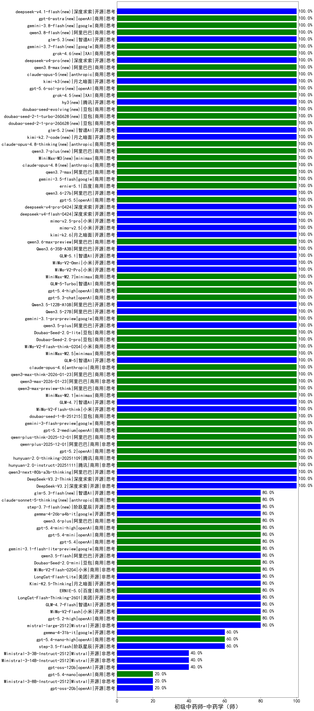

|类别|机构|大模型|【初级中药师-中药学（师）】准确率|平均耗时|平均消耗token|花费/千次（元）|排名（准确率）|
|---|---|-----|-------------------|-------|-----------|-----------|-----------|
|开源|深度求索|DeepSeek-V3.2(new)|100.0%|120s|238|0.7|1|
|商用|openAI|gpt-5.2(new)|100.0%|2s|162|10.4|2|
|商用|阿里巴巴|qwen3-max-preview-think(new)|100.0%|52s|1170|27.0|3|
|商用|minimax|MiniMax-M2.1(new)|100.0%|87s|1150|9.1|4|
|开源|智谱AI|GLM-4.7(new)|100.0%|27s|1209|16.3|5|
|开源|小米|MiMo-V2-Flash-think(new)|100.0%|38s|1087|0.0|6|
|商用|豆包|doubao-seed-1-8-251215(new)|100.0%|28s|439|2.8|7|
|商用|google|gemini-3-flash-preview(new)|100.0%|91s|811|16.3|8|
|商用|openAI|gpt-5.2-medium(new)|100.0%|5s|291|23.2|9|
|商用|阿里巴巴|qwen-plus-think-2025-12-01(new)|100.0%|33s|1309|10.0|10|
|商用|阿里巴巴|qwen-plus-2025-12-01(new)|100.0%|16s|592|1.1|11|
|商用|腾讯|hunyuan-2.0-thinking-20251109(new)|100.0%|17s|731|2.8|12|
|开源|月之暗面|Kimi-K2-Thinking(new)|100.0%|85s|1023|15.7|13|
|商用|腾讯|hunyuan-2.0-instruct-20251111(new)|100.0%|6s|343|0.6|14|
|开源|阿里巴巴|qwen3-next-80b-a3b-thinking(new)|100.0%|147s|2947|11.6|15|
|开源|深度求索|DeepSeek-V3.2-Think(new)|100.0%|17s|522|1.5|16|
|商用|阿里巴巴|qwen3-max-2025-09-23(new)|100.0%|198s|289|5.9|17|
|商用|anthropic|claude-opus-4.5(new)|100.0%|9s|545|85.8|18|
|商用|百度|ERNIE-X1.1-Preview(new)|100.0%|94s|980|3.8|19|
|商用|anthropic|claude-sonnet-4.5-thinking(new)|100.0%|14s|1023|101.8|20|
|商用|anthropic|claude-sonnet-4.5(new)|100.0%|10s|480|45.3|21|
|开源|月之暗面|kimi-k2-0905(new)|100.0%|99s|202|2.3|22|
|商用|阿里巴巴|qwen3-max-2026-01-23(new)|100.0%|44s|244|2.0|23|
|商用|阿里巴巴|qwen3-max-think-2026-01-23(new)|100.0%|56s|1575|15.3|24|
|商用|anthropic|claude-opus-4.6(new)|100.0%|20s|479|72.8|25|
|开源|智谱AI|GLM-5(new)|100.0%|52s|1033|17.8|26|
|商用|小米|mimo-v2.5(new)|100.0%|733s|841|8.4|27|
|开源|月之暗面|kimi-k2.6(new)|100.0%|31s|741|18.9|28|
|商用|阿里巴巴|qwen3.6-max-preview(new)|100.0%|31s|1189|61.5|29|
|开源|阿里巴巴|Qwen3.6-35B-A3B(new)|100.0%|10s|1480|15.5|30|
|开源|智谱AI|GLM-5.1(new)|100.0%|28s|934|21.4|31|
|商用|小米|MiMo-V2-Omni(new)|100.0%|157s|881|9.0|32|
|商用|小米|MiMo-V2-Pro(new)|100.0%|199s|911|14.9|33|
|商用|minimax|MiniMax-M2.7(new)|100.0%|19s|780|6.0|34|
|商用|智谱AI|GLM-5-Turbo(new)|100.0%|22s|1000|21.1|35|
|商用|openAI|gpt-5.4-high(new)|100.0%|51s|564|53.5|36|
|商用|openAI|gpt-5.3-chat(new)|100.0%|55s|357|29.3|37|
|开源|阿里巴巴|Qwen3.5-122B-A10B(new)|100.0%|322s|2414|15.1|38|
|开源|阿里巴巴|Qwen3.5-27B(new)|100.0%|335s|2720|12.8|39|
|商用|google|gemini-3.1-pro-preview(new)|100.0%|29s|1031|84.0|40|
|开源|阿里巴巴|qwen3.5-plus(new)|100.0%|22s|1518|7.0|41|
|商用|豆包|Doubao-Seed-2.0-lite(new)|100.0%|145s|661|2.1|42|
|商用|豆包|Doubao-Seed-2.0-pro(new)|100.0%|127s|558|7.7|43|
|商用|小米|MiMo-V2-Flash-think-0204(new)|100.0%|771s|1190|2.4|44|
|商用|minimax|MiniMax-M2.5(new)|100.0%|15s|505|3.7|45|
|商用|XAI|grok-4-1-fast-reasoning(new)|100.0%|95s|731|2.1|46|
|商用|小米|mimo-v2.5-pro(new)|100.0%|19s|925|15.2|47|
|开源|深度求索|DeepSeek-V3.1-Think(new)|100.0%|33s|661|7.5|48|
|商用|腾讯|hunyuan-turbos-20250926(new)|100.0%|10s|428|0.7|49|
|开源|阿里巴巴|qwen3-235b-a22b-thinking-2507(new)|100.0%|91s|1683|32.6|50|
|商用|阿里巴巴|qwen3-max-preview(new)|100.0%|9s|367|7.7|51|
|开源|深度求索|DeepSeek-V3.1(new)|100.0%|12s|230|2.3|52|
|开源|豆包|Seed-OSS-36B-Instruct(new)|100.0%|41s|864|3.3|53|
|开源|阿里巴巴|qwen3-next-80b-a3b-instruct(new)|100.0%|11s|382|1.4|54|
|开源|阿里巴巴|Qwen3-32B-nothink(new)|100.0%|19s|414|1.5|55|
|商用|豆包|doubao-seed-1-6-251015(new)|100.0%|16s|439|2.9|56|
|商用|智谱AI|GLM-4.5-Flash(new)|100.0%|19s|1114|0.0|57|
|商用|豆包|doubao-seed-1-6-lite-251015(new)|100.0%|16s|472|1.0|58|
|商用|腾讯|hunyuan-t1-20250711(new)|100.0%|13s|759|2.8|59|
|商用|百度|ERNIE-4.5-Turbo-32K(new)|95.0%|21s|505|1.5|60|
|开源|阿里巴巴|Qwen3-32B(new)|85.0%|15s|678|2.5|61|
|开源|月之暗面|Kimi-K2.5-Thinking(new)|80.0%|258s|1242|25.2|62|
|开源|智谱AI|GLM-4.5-Air(new)|80.0%|23s|1085|6.2|63|
|开源|阿里巴巴|Qwen3-8B-nothink(new)|80.0%|17s|360|0.0|64|
|开源|美团|LongCat-Flash-Lite(new)|80.0%|49s|280|0.0|65|
|商用|小米|MiMo-V2-Flash-0204(new)|80.0%|172s|335|0.6|66|
|开源|阿里巴巴|qwen3-235b-a22b-instruct-2507(new)|80.0%|8s|371|2.6|67|
|商用|豆包|Doubao-Seed-2.0-mini(new)|80.0%|390s|1701|3.2|68|
|商用|阿里巴巴|qwen-turbo-2025-07-15(new)|80.0%|6s|252|0.1|69|
|商用|百度|ERNIE-5.0(new)|80.0%|414s|925|21.3|70|
|开源|阿里巴巴|qwen3.5-flash(new)|80.0%|107s|2434|4.8|71|
|商用|google|gemini-2.5-pro(new)|80.0%|38s|2029|143.1|72|
|商用|google|gemini-3.1-flash-lite-preview(new)|80.0%|4s|245|2.1|73|
|商用|openAI|gpt-5.4(new)|80.0%|3s|194|14.7|74|
|开源|美团|LongCat-Flash-Thinking-2601(new)|80.0%|111s|1740|0.0|75|
|商用|anthropic|claude-4-sonnet(new)|80.0%|43s|486|43.3|76|
|商用|百度|ERNIE-X1-Turbo-32K(new)|80.0%|67s|1541|6.0|77|
|商用|openAI|gpt-5.4-mini(new)|80.0%|5s|194|4.4|78|
|商用|openAI|gpt-5.4-mini-high(new)|80.0%|22s|798|23.4|79|
|开源|深度求索|DeepSeek-R1-0528(new)|80.0%|210s|1706|26.6|80|
|商用|openAI|o4-mini(new)|80.0%|35s|1569|48.1|81|
|商用|阿里巴巴|qwen3.6-plus(new)|80.0%|27s|1392|16.1|82|
|开源|google|gemma-4-26b-a4b-it(new)|80.0%|47s|427|1.1|83|
|商用|openAI|gpt-5.1-medium(new)|80.0%|191s|366|21.9|84|
|商用|百川智能|Baichuan4-Turbo(new)|80.0%|/|/|/|85|
|开源|智谱AI|GLM-4.7-Flash(new)|80.0%|215s|1309|0.0|86|
|商用|阿里巴巴|qwen-flash-2025-07-28(new)|80.0%|6s|366|0.5|87|
|开源|阿里巴巴|Qwen3-30B-A3B-Thinking-2507(new)|80.0%|56s|2140|5.8|88|
|开源|阿里巴巴|Qwen3-30B-A3B-Instruct-2507(new)|80.0%|3s|369|1.0|89|
|商用|anthropic|claude-haiku-4.5-thinking(new)|80.0%|41s|1192|39.6|90|
|开源|小米|MiMo-V2-Flash(new)|80.0%|11s|391|0.0|91|
|开源|meta|Llama-4-Scout-17B-16E-Instruct(new)|80.0%|7s|393|0.8|92|
|商用|openAI|gpt-5.1-high(new)|80.0%|148s|1056|70.9|93|
|商用|百度|ERNIE-5.0-Thinking-Preview(new)|80.0%|223s|1242|29.0|94|
|商用|阿里巴巴|qwen-turbo-think-2025-07-15(new)|80.0%|/|1398|4.0|95|
|开源|Mistral|mistral-large-2512(new)|80.0%|9s|314|2.8|96|
|商用|openAI|gpt-5.2-high(new)|80.0%|27s|975|91.2|97|
|商用|阿里巴巴|qwen-flash-think-2025-07-28(new)|80.0%|20s|2077|3.0|98|
|商用|google|gemini-2.5-flash(new)|70.0%|11s|1984|35.0|99|
|商用|anthropic|claude-4-sonnet-thinking(new)|70.0%|8s|470|44.2|100|
|开源|阿里巴巴|Qwen3-8B(new)|70.0%|21s|685|0.0|101|
|开源|阿里巴巴|Qwen3-14B(new)|70.0%|31s|1959|3.8|102|
|商用|openAI|gpt-5-nano-high(new)|60.0%|1018s|4831|13.8|103|
|商用|openAI|gpt-5-mini-high(new)|60.0%|1081s|3338|47.6|104|
|开源|google|gemma-4-31b-it(new)|60.0%|69s|339|0.8|105|
|商用|google|gemini-2.5-flash-lite(new)|60.0%|4s|312|0.8|106|
|商用|openAI|gpt-5.4-nano-high(new)|60.0%|6s|488|3.8|107|
|商用|openAI|gpt-5.1(new)|60.0%|106s|170|8.0|108|
|开源|阿里巴巴|Qwen3-14B-nothink(new)|60.0%|15s|445|0.8|109|
|商用|openAI|gpt-5-mini-2025-08-07(new)|60.0%|27s|1195|16.5|110|
|开源|智谱AI|GLM-4.5-Air-nothink(new)|60.0%|11s|871|4.9|111|
|开源|阿里巴巴|Qwen3-4B-nothink(new)|60.0%|12s|324|0.8|112|
|商用|openAI|gpt-5-2025-08-07(new)|60.0%|20s|141|6.4|113|
|商用|智谱AI|GLM-4.5-Flash-nothink(new)|60.0%|18s|886|0.0|114|
|开源|阶跃星辰|step-3.5-flash(new)|60.0%|8s|1133|2.3|115|
|开源|阿里巴巴|Qwen3-4B(new)|55.0%|16s|1334|3.8|116|
|商用|XAI|grok-4-1-fast-non-reasoning(new)|40.0%|82s|560|1.5|117|
|开源|智谱AI|GLM-4-9B-0414(new)|40.0%|6s|416|0|118|
|开源|Mistral|Ministral-3-14B-Instruct-2512(new)|40.0%|13s|327|0.5|119|
|开源|Mistral|Ministral-3-3B-Instruct-2512(new)|40.0%|13s|558|0.4|120|
|开源|openAI|gpt-oss-120b(new)|40.0%|11s|574|1.6|121|
|商用|openAI|gpt-5-nano-2025-08-07(new)|40.0%|19s|2480|7.0|122|
|开源|openAI|gpt-oss-20b(new)|20.0%|10s|2164|2.4|123|
|商用|openAI|gpt-5.4-nano(new)|20.0%|2s|149|0.8|124|
|商用|anthropic|claude-haiku-4.5(new)|20.0%|10s|498|15.3|125|
|开源|Mistral|Ministral-3-8B-Instruct-2512(new)|20.0%|10s|475|0.5|126|

