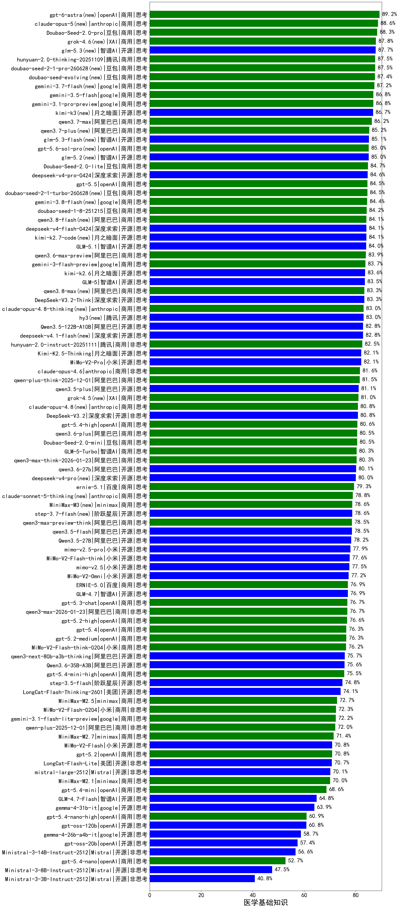

|类别|机构|大模型|【医学基础知识】准确率|平均耗时|平均消耗token|花费/千次（元）|排名（准确率）|
|---|---|-----|-------------------|-------|-----------|-----------|-----------|
|商用|豆包|Doubao-Seed-2.0-pro(new)|88.3%|235s|1057|15.6|1|
|商用|腾讯|hunyuan-2.0-thinking-20251109(new)|87.5%|12s|869|3.3|2|
|商用|百度|ERNIE-4.5-Turbo-32K(new)|86.9%|22s|535|1.6|3|
|商用|google|gemini-3.1-pro-preview(new)|86.8%|48s|1548|127.2|4|
|商用|豆包|doubao-seed-1-6-251015(new)|86.6%|26s|706|5.0|5|
|商用|豆包|doubao-seed-1-6-lite-251015(new)|84.8%|50s|763|1.6|6|
|商用|豆包|Doubao-Seed-2.0-lite(new)|84.7%|197s|905|2.9|7|
|商用|豆包|doubao-seed-1-8-251215(new)|84.2%|29s|672|4.6|8|
|开源|智谱AI|GLM-5.1(new)|84.0%|136s|1442|33.5|9|
|商用|阿里巴巴|qwen3.6-max-preview(new)|83.9%|50s|1566|81.5|10|
|商用|google|gemini-3-flash-preview(new)|83.7%|56s|1175|23.9|11|
|开源|月之暗面|kimi-k2.6(new)|83.6%|103s|1776|46.7|12|
|开源|智谱AI|GLM-5(new)|83.5%|121s|2002|35.2|13|
|开源|深度求索|DeepSeek-V3.2-Think(new)|83.3%|95s|1145|3.4|14|
|开源|阿里巴巴|qwen3-235b-a22b-thinking-2507(new)|83.1%|102s|2318|45.1|15|
|开源|阿里巴巴|Qwen3.5-122B-A10B(new)|82.8%|255s|2964|18.6|16|
|商用|腾讯|hunyuan-2.0-instruct-20251111(new)|82.5%|6s|392|0.7|17|
|开源|月之暗面|Kimi-K2.5-Thinking(new)|82.1%|345s|1827|37.3|18|
|商用|小米|MiMo-V2-Pro(new)|82.1%|209s|1058|17.9|19|
|商用|anthropic|claude-opus-4.6(new)|81.6%|15s|606|92.4|20|
|商用|阿里巴巴|qwen-plus-think-2025-12-01(new)|81.5%|54s|2359|18.4|21|
|开源|阿里巴巴|qwen3.5-plus(new)|81.1%|36s|2858|13.4|22|
|开源|深度求索|DeepSeek-V3.2(new)|80.8%|69s|336|1.0|23|
|商用|百度|ERNIE-X1.1-Preview(new)|80.7%|134s|1014|3.9|24|
|商用|openAI|gpt-5.4-high(new)|80.6%|16s|685|65.2|25|
|商用|百度|ERNIE-X1-Turbo-32K(new)|80.6%|111s|2041|8.0|26|
|商用|阿里巴巴|qwen3.6-plus(new)|80.5%|37s|1549|17.9|27|
|商用|豆包|Doubao-Seed-2.0-mini(new)|80.5%|390s|2226|4.3|28|
|商用|智谱AI|GLM-5-Turbo(new)|80.3%|42s|1378|29.2|29|
|商用|阿里巴巴|qwen3-max-think-2026-01-23(new)|80.3%|179s|2706|26.5|30|
|商用|腾讯|hunyuan-t1-20250711(new)|80.1%|25s|1550|5.9|31|
|商用|anthropic|claude-opus-4.5(new)|79.8%|13s|654|102.5|32|
|开源|豆包|Seed-OSS-36B-Instruct(new)|78.8%|109s|1854|7.3|33|
|商用|腾讯|hunyuan-turbos-20250926(new)|78.5%|13s|571|1.0|34|
|商用|阿里巴巴|qwen3-max-preview-think(new)|78.5%|168s|2237|52.4|35|
|商用|google|gemini-2.5-pro(new)|78.5%|34s|2312|163.1|36|
|开源|阿里巴巴|qwen3.5-flash(new)|78.5%|256s|3116|6.1|37|
|开源|深度求索|DeepSeek-V3.1(new)|78.3%|17s|338|3.6|38|
|开源|阿里巴巴|Qwen3.5-27B(new)|78.2%|299s|3061|14.4|39|
|商用|阿里巴巴|qwen3-max-preview(new)|77.7%|9s|445|9.4|40|
|开源|小米|MiMo-V2-Flash-think(new)|77.6%|92s|1897|0.0|41|
|开源|深度求索|DeepSeek-R1-0528(new)|77.3%|230s|1809|28.2|42|
|商用|小米|MiMo-V2-Omni(new)|77.2%|239s|1214|13.5|43|
|开源|阿里巴巴|qwen3-235b-a22b-instruct-2507(new)|76.9%|11s|466|3.3|44|
|商用|百度|ERNIE-5.0(new)|76.9%|149s|1851|43.4|45|
|开源|智谱AI|GLM-4.7(new)|76.9%|56s|2028|27.7|46|
|商用|openAI|gpt-5.3-chat(new)|76.7%|19s|372|29.7|47|
|商用|阿里巴巴|qwen3-max-2026-01-23(new)|76.7%|51s|452|4.0|48|
|商用|openAI|gpt-5.2-high(new)|76.6%|11s|481|41.0|49|
|商用|openAI|gpt-5.4(new)|76.3%|6s|253|19.8|50|
|开源|深度求索|DeepSeek-V3.1-Think(new)|76.3%|49s|955|11.0|51|
|商用|openAI|gpt-5.2-medium(new)|76.3%|8s|366|29.5|52|
|开源|月之暗面|Kimi-K2-Thinking(new)|76.2%|143s|2245|35.2|53|
|商用|小米|MiMo-V2-Flash-think-0204(new)|76.2%|551s|1770|3.6|54|
|商用|百度|ERNIE-5.0-Thinking-Preview(new)|76.1%|225s|1789|42.0|55|
|开源|阿里巴巴|Qwen3-32B(new)|75.7%|38s|1321|5.1|56|
|开源|阿里巴巴|qwen3-next-80b-a3b-thinking(new)|75.7%|106s|3177|12.5|57|
|开源|阿里巴巴|Qwen3.6-35B-A3B(new)|75.6%|69s|2045|21.5|58|
|商用|openAI|gpt-5.4-mini-high(new)|75.5%|51s|954|28.0|59|
|开源|月之暗面|kimi-k2-0905(new)|75.0%|65s|334|4.3|60|
|开源|阶跃星辰|step-3.5-flash(new)|74.8%|20s|1694|3.5|61|
|商用|anthropic|claude-sonnet-4.5-thinking(new)|74.7%|24s|1623|165.5|62|
|开源|智谱AI|GLM-4.5-Air(new)|74.6%|32s|1559|9.0|63|
|商用|阿里巴巴|qwen3-max-2025-09-23(new)|74.5%|179s|452|9.6|64|
|商用|openAI|gpt-5.1-high(new)|74.3%|70s|1138|75.9|65|
|开源|美团|LongCat-Flash-Thinking-2601(new)|74.1%|169s|2366|0.0|66|
|开源|阿里巴巴|Qwen3-30B-A3B-Thinking-2507(new)|74.0%|64s|2607|7.1|67|
|商用|openAI|gpt-5.1-medium(new)|73.7%|142s|495|30.3|68|
|开源|阿里巴巴|qwen3-next-80b-a3b-instruct(new)|73.6%|9s|526|1.9|69|
|商用|anthropic|claude-4-sonnet(new)|73.0%|43s|532|48.4|70|
|商用|智谱AI|GLM-4.5-Flash(new)|72.8%|29s|1487|0.0|71|
|商用|minimax|MiniMax-M2.5(new)|72.7%|25s|1272|10.1|72|
|商用|小米|MiMo-V2-Flash-0204(new)|72.3%|216s|496|0.9|73|
|商用|google|gemini-3.1-flash-lite-preview(new)|72.2%|16s|361|3.2|74|
|商用|阿里巴巴|qwen-plus-2025-12-01(new)|72.0%|22s|820|1.6|75|
|开源|阿里巴巴|Qwen3-14B(new)|71.7%|41s|1637|3.2|76|
|商用|阿里巴巴|qwen-flash-think-2025-07-28(new)|71.5%|23s|2439|3.6|77|
|商用|minimax|MiniMax-M2.7(new)|71.4%|36s|1482|11.9|78|
|开源|阿里巴巴|Qwen3-32B-nothink(new)|70.9%|51s|488|1.7|79|
|开源|小米|MiMo-V2-Flash(new)|70.8%|50s|446|0.0|80|
|商用|openAI|gpt-5.2(new)|70.8%|4s|192|12.3|81|
|开源|美团|LongCat-Flash-Lite(new)|70.7%|228s|456|0.0|82|
|商用|anthropic|claude-sonnet-4.5(new)|70.5%|11s|585|55.2|83|
|商用|openAI|gpt-5-2025-08-07(new)|70.4%|32s|321|18.7|84|
|商用|anthropic|claude-4-sonnet-thinking(new)|70.4%|38s|554|51.8|85|
|开源|Mistral|mistral-large-2512(new)|70.1%|12s|501|4.7|86|
|商用|阿里巴巴|qwen-turbo-think-2025-07-15(new)|70.0%|/|2155|6.3|87|
|商用|minimax|MiniMax-M2.1(new)|70.0%|82s|1583|12.7|88|
|开源|阿里巴巴|Qwen3-30B-A3B-Instruct-2507(new)|69.2%|4s|510|1.4|89|
|商用|openAI|gpt-5.4-mini(new)|68.6%|23s|217|4.8|90|
|商用|google|gemini-2.5-flash(new)|68.2%|10s|1811|31.7|91|
|商用|XAI|grok-4-1-fast-reasoning(new)|67.5%|50s|1315|4.2|92|
|商用|阿里巴巴|qwen-flash-2025-07-28(new)|67.2%|7s|506|0.7|93|
|商用|anthropic|claude-haiku-4.5-thinking(new)|67.2%|37s|2439|84.3|94|
|商用|阿里巴巴|qwen-turbo-2025-07-15(new)|66.5%|7s|349|0.2|95|
|商用|百川智能|Baichuan4-Turbo(new)|66.0%|/|/|/|96|
|开源|阿里巴巴|Qwen3-8B(new)|65.4%|285s|7275|0.0|97|
|开源|智谱AI|GLM-4.7-Flash(new)|64.8%|1233s|3902|0.0|98|
|商用|openAI|gpt-5.1(new)|64.6%|170s|199|9.2|99|
|开源|智谱AI|GLM-4.5-Air-nothink(new)|64.0%|15s|954|5.4|100|
|开源|google|gemma-4-31b-it(new)|63.9%|80s|507|1.3|101|
|商用|智谱AI|GLM-4.5-Flash-nothink(new)|63.2%|19s|964|0.0|102|
|开源|meta|Llama-4-Scout-17B-16E-Instruct(new)|63.1%|9s|519|1.0|103|
|开源|阿里巴巴|Qwen3-14B-nothink(new)|62.6%|13s|524|0.9|104|
|开源|阿里巴巴|Qwen3-4B(new)|61.8%|29s|1737|5.0|105|
|商用|openAI|o4-mini(new)|61.0%|32s|944|28.2|106|
|商用|openAI|gpt-5.4-nano-high(new)|60.9%|29s|538|4.1|107|
|开源|openAI|gpt-oss-120b(new)|60.8%|25s|620|1.7|108|
|商用|anthropic|claude-haiku-4.5(new)|59.8%|14s|599|18.5|109|
|商用|openAI|gpt-5-nano-high(new)|59.6%|609s|4212|12.0|110|
|商用|openAI|gpt-5-mini-2025-08-07(new)|58.8%|54s|881|11.8|111|
|开源|google|gemma-4-26b-a4b-it(new)|58.7%|63s|568|1.4|112|
|商用|openAI|gpt-5-nano-2025-08-07(new)|57.5%|60s|1843|5.1|113|
|开源|openAI|gpt-oss-20b(new)|57.4%|58s|1131|1.2|114|
|开源|阿里巴巴|Qwen3-8B-nothink(new)|57.4%|47s|478|0.0|115|
|开源|Mistral|Ministral-3-14B-Instruct-2512(new)|56.6%|8s|538|0.8|116|
|开源|阿里巴巴|Qwen3-4B-nothink(new)|55.5%|15s|429|1.1|117|
|商用|openAI|gpt-5-mini-high(new)|55.1%|489s|2150|30.2|118|
|商用|google|gemini-2.5-flash-lite(new)|54.1%|6s|804|2.2|119|
|商用|openAI|gpt-5.4-nano(new)|52.7%|32s|224|1.4|120|
|商用|XAI|grok-4-1-fast-non-reasoning(new)|51.8%|48s|614|1.7|121|
|开源|智谱AI|GLM-4-9B-0414(new)|49.8%|10s|434|0.0|122|
|开源|Mistral|Ministral-3-8B-Instruct-2512(new)|47.5%|9s|594|0.6|123|
|开源|Mistral|Ministral-3-3B-Instruct-2512(new)|40.8%|7s|595|0.4|124|

