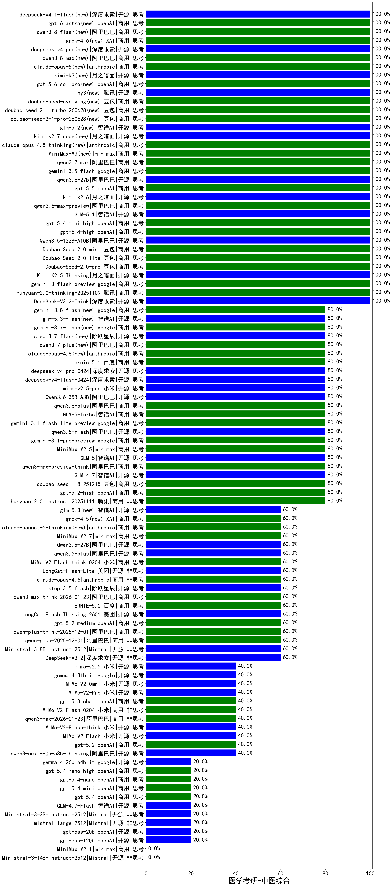

|类别|机构|大模型|【医学考研-中医综合】准确率|平均耗时|平均消耗token|花费/千次（元）|排名（准确率）|
|---|---|-----|-------------------|-------|-----------|-----------|-----------|
|商用|腾讯|hunyuan-2.0-thinking-20251109|100.0%|14s|924|3.5|1|
|商用|豆包|doubao-seed-1-6-lite-251015|100.0%|28s|1097|2.4|2|
|商用|google|gemini-3-flash-preview|100.0%|138s|1805|37.0|3|
|开源|月之暗面|Kimi-K2.5-Thinking|100.0%|385s|1953|39.8|4|
|商用|豆包|Doubao-Seed-2.0-pro|100.0%|293s|1230|18.2|5|
|商用|豆包|Doubao-Seed-2.0-lite|100.0%|222s|1063|3.5|6|
|商用|豆包|Doubao-Seed-2.0-mini|100.0%|434s|4943|9.7|7|
|开源|阿里巴巴|Qwen3.5-122B-A10B|100.0%|331s|5326|33.6|8|
|商用|openAI|gpt-5.4-high|100.0%|32s|1649|165.2|9|
|商用|openAI|gpt-5.4-mini-high|100.0%|32s|1431|42.7|10|
|开源|智谱AI|GLM-5.1|100.0%|77s|1915|44.5|11|
|商用|阿里巴巴|qwen3.6-max-preview|100.0%|66s|2042|106.6|12|
|开源|月之暗面|kimi-k2.6(new)|100.0%|89s|1233|31.8|13|
|商用|openAI|gpt-5.5(new)|100.0%|23s|581|106.1|14|
|开源|阿里巴巴|qwen3.6-27b(new)|100.0%|37s|2358|41.2|15|
|商用|google|gemini-3.5-flash(new)|100.0%|10s|1664|100.7|16|
|商用|阿里巴巴|qwen3.7-max(new)|100.0%|31s|1566|54.4|17|
|商用|minimax|MiniMax-M3(new)|100.0%|33s|940|12.7|18|
|商用|anthropic|claude-opus-4.8-thinking(new)|100.0%|15s|809|126.7|19|
|开源|月之暗面|kimi-k2.7-code(new)|100.0%|20s|986|25.1|20|
|开源|智谱AI|glm-5.2(new)|100.0%|83s|3697|101.8|21|
|商用|豆包|doubao-seed-2-1-pro-260628(new)|100.0%|485s|10184|302.8|22|
|商用|豆包|doubao-seed-2-1-turbo-260628(new)|100.0%|275s|10132|150.6|23|
|开源|深度求索|DeepSeek-V3.2-Think|100.0%|130s|1903|5.6|24|
|商用|豆包|doubao-seed-evolving(new)|100.0%|249s|8248|244.7|25|
|商用|百度|ERNIE-4.5-Turbo-32K|95.0%|24s|582|1.7|26|
|商用|阿里巴巴|qwen3-max-preview-think|80.0%|251s|3648|86.0|27|
|开源|小米|mimo-v2.5-pro(new)|80.0%|65s|2116|39.9|28|
|开源|阿里巴巴|Qwen3.6-35B-A3B|80.0%|14s|2676|28.2|29|
|商用|阿里巴巴|qwen3.6-plus|80.0%|57s|1812|21.1|30|
|开源|阿里巴巴|Qwen3-32B-nothink|80.0%|16s|581|2.1|31|
|开源|月之暗面|kimi-k2-0905|80.0%|66s|375|4.8|32|
|商用|腾讯|hunyuan-t1-20250711|80.0%|25s|1370|5.1|33|
|商用|智谱AI|GLM-5-Turbo|80.0%|103s|2593|55.7|34|
|开源|深度求索|deepseek-v4-flash(new)|80.0%|33s|828|1.6|35|
|开源|阿里巴巴|qwen3.5-flash|80.0%|267s|5150|10.2|36|
|开源|智谱AI|GLM-5|80.0%|126s|3790|67.1|37|
|商用|google|gemini-3.1-flash-lite-preview|80.0%|3s|435|3.9|38|
|开源|智谱AI|GLM-4.7|80.0%|69s|2889|39.6|39|
|商用|阿里巴巴|qwen3-max-2025-09-23|80.0%|18s|559|11.9|40|
|开源|阿里巴巴|qwen3-235b-a22b-instruct-2507|80.0%|15s|559|4.0|41|
|商用|minimax|MiniMax-M2.5|80.0%|34s|1890|15.2|42|
|商用|google|gemini-3.1-pro-preview|80.0%|57s|3296|275.3|43|
|商用|openAI|gpt-5.2-high|80.0%|19s|810|72.6|44|
|商用|豆包|doubao-seed-1-8-251215|80.0%|32s|858|6.0|45|
|商用|豆包|doubao-seed-1-6-251015|80.0%|178s|870|6.2|46|
|开源|深度求索|DeepSeek-V3.1-Think|80.0%|92s|1800|21.0|47|
|开源|阶跃星辰|step-3.7-flash(new)|80.0%|24s|3526|28.0|48|
|商用|阿里巴巴|qwen3.7-plus(new)|80.0%|27s|1432|11.0|49|
|商用|腾讯|hunyuan-2.0-instruct-20251111|80.0%|6s|498|0.9|50|
|商用|anthropic|claude-opus-4.8(new)|80.0%|10s|549|81.1|51|
|商用|百度|ernie-5.1(new)|80.0%|42s|1407|24.3|52|
|商用|腾讯|hunyuan-turbos-20250926|80.0%|16s|684|1.2|53|
|开源|深度求索|DeepSeek-V3.1|80.0%|27s|401|4.2|54|
|开源|深度求索|deepseek-v4-pro(new)|80.0%|48s|1220|28.4|55|
|商用|阿里巴巴|qwen3-max-preview|80.0%|12s|533|11.3|56|
|开源|豆包|Seed-OSS-36B-Instruct|80.0%|102s|1649|6.4|57|
|开源|阿里巴巴|qwen3-next-80b-a3b-instruct|80.0%|8s|686|2.5|58|
|商用|百度|ERNIE-X1-Turbo-32K|70.0%|113s|2270|8.9|59|
|开源|深度求索|DeepSeek-R1-0528|70.0%|236s|1907|29.7|60|
|开源|阿里巴巴|Qwen3-14B|68.4%|173s|5655|11.2|61|
|开源|阿里巴巴|Qwen3-32B|68.4%|207s|3618|14.2|62|
|商用|google|gemini-2.5-pro|63.2%|40s|2633|186.2|63|
|商用|openAI|gpt-5.2-medium|60.0%|18s|665|58.2|64|
|开源|阿里巴巴|Qwen3-30B-A3B-Instruct-2507|60.0%|6s|610|1.6|65|
|开源|美团|LongCat-Flash-Thinking-2601|60.0%|237s|2812|0.0|66|
|开源|美团|LongCat-Flash-Lite|60.0%|185s|865|0.0|67|
|商用|anthropic|claude-opus-4.6|60.0%|23s|653|99.2|68|
|商用|阿里巴巴|qwen-plus-2025-12-01|60.0%|31s|1138|2.2|69|
|商用|百度|ERNIE-5.0|60.0%|575s|4080|96.7|70|
|开源|阶跃星辰|step-3.5-flash|60.0%|75s|3416|7.1|71|
|商用|阿里巴巴|qwen-plus-think-2025-12-01|60.0%|72s|3592|28.1|72|
|商用|百度|ERNIE-X1.1-Preview|60.0%|99s|514|1.9|73|
|商用|小米|MiMo-V2-Flash-think-0204|60.0%|1386s|3362|6.9|74|
|开源|meta|Llama-4-Scout-17B-16E-Instruct|60.0%|11s|608|1.2|75|
|开源|阿里巴巴|qwen3-235b-a22b-thinking-2507|60.0%|94s|4390|86.3|76|
|开源|Mistral|Ministral-3-8B-Instruct-2512|60.0%|14s|556|0.6|77|
|开源|阿里巴巴|qwen3.5-plus|60.0%|65s|4955|23.5|78|
|商用|智谱AI|GLM-4.5-Flash|60.0%|37s|2008|0.0|79|
|开源|深度求索|DeepSeek-V3.2|60.0%|16s|495|1.4|80|
|开源|阿里巴巴|Qwen3.5-27B|60.0%|446s|5035|23.8|81|
|商用|anthropic|claude-opus-4.5|60.0%|18s|848|135.6|82|
|开源|阿里巴巴|Qwen3-14B-nothink|60.0%|26s|622|1.1|83|
|商用|anthropic|claude-sonnet-4.5-thinking|60.0%|24s|1592|161.2|84|
|商用|minimax|MiniMax-M2.7|60.0%|61s|2391|19.4|85|
|商用|openAI|gpt-5.1-medium|60.0%|177s|751|47.7|86|
|开源|月之暗面|Kimi-K2-Thinking|60.0%|148s|2108|32.8|87|
|商用|openAI|gpt-5-2025-08-07|60.0%|26s|330|18.5|88|
|商用|阿里巴巴|qwen3-max-think-2026-01-23|60.0%|137s|4196|41.3|89|
|商用|百川智能|Baichuan4-Turbo|57.1%|/|/|/|90|
|商用|google|gemini-2.5-flash|52.6%|13s|2048|36.0|91|
|开源|智谱AI|GLM-4-9B-0414|50.0%|14s|562|0|92|
|开源|阿里巴巴|Qwen3-4B|42.1%|98s|2210|6.4|93|
|商用|阿里巴巴|qwen3-max-2026-01-23|40.0%|203s|625|5.6|94|
|商用|百度|ERNIE-5.0-Thinking-Preview|40.0%|159s|1980|46.3|95|
|商用|智谱AI|GLM-4.5-Flash-nothink|40.0%|26s|1141|0.0|96|
|开源|阿里巴巴|Qwen3-8B|40.0%|600s|15533|0.0|97|
|商用|阿里巴巴|qwen-turbo-think-2025-07-15|40.0%|/|4039|11.9|98|
|开源|小米|mimo-v2.5(new)|40.0%|95s|3219|41.4|99|
|开源|google|gemma-4-31b-it|40.0%|127s|568|1.4|100|
|商用|XAI|grok-4-1-fast-reasoning|40.0%|86s|1427|4.6|101|
|开源|小米|MiMo-V2-Pro|40.0%|483s|1143|19.5|102|
|商用|XAI|grok-4-1-fast-non-reasoning|40.0%|91s|687|1.9|103|
|商用|anthropic|claude-sonnet-4.5|40.0%|11s|581|53.7|104|
|商用|openAI|gpt-5.3-chat|40.0%|11s|503|41.5|105|
|开源|小米|MiMo-V2-Omni|40.0%|8s|1261|14.0|106|
|商用|openAI|gpt-5.2|40.0%|4s|238|15.8|107|
|商用|openAI|gpt-5-nano-high|40.0%|472s|4869|13.9|108|
|开源|小米|MiMo-V2-Flash-think|40.0%|154s|3471|0.0|109|
|开源|小米|MiMo-V2-Flash|40.0%|15s|575|0.0|110|
|商用|小米|MiMo-V2-Flash-0204|40.0%|394s|593|1.1|111|
|开源|阿里巴巴|Qwen3-4B-nothink|40.0%|23s|488|1.2|112|
|开源|阿里巴巴|qwen3-next-80b-a3b-thinking|40.0%|217s|5913|23.4|113|
|商用|anthropic|claude-4-sonnet-thinking|30.0%|51s|553|50.7|114|
|开源|阿里巴巴|Qwen3-30B-A3B-Thinking-2507|30.0%|82s|3224|8.9|115|
|商用|阿里巴巴|qwen-flash-2025-07-28|20.0%|7s|613|0.8|116|
|商用|anthropic|claude-4-sonnet|20.0%|41s|571|51.9|117|
|商用|阿里巴巴|qwen-flash-think-2025-07-28|20.0%|40s|4022|5.9|118|
|商用|openAI|gpt-5-mini-high|20.0%|119s|2145|30.0|119|
|商用|openAI|gpt-5-nano-2025-08-07|20.0%|146s|2604|7.3|120|
|商用|openAI|o4-mini|20.0%|46s|1326|40.1|121|
|开源|智谱AI|GLM-4.5-Air|20.0%|46s|2215|12.9|122|
|开源|openAI|gpt-oss-120b|20.0%|7s|939|2.7|123|
|开源|智谱AI|GLM-4.5-Air-nothink|20.0%|17s|1128|6.3|124|
|开源|openAI|gpt-oss-20b|20.0%|265s|1359|1.5|125|
|开源|阿里巴巴|Qwen3-8B-nothink|20.0%|27s|552|0.0|126|
|商用|openAI|gpt-5.1|20.0%|64s|206|9.0|127|
|商用|openAI|gpt-5.4|20.0%|4s|353|28.7|128|
|商用|阿里巴巴|qwen-turbo-2025-07-15|20.0%|11s|489|0.3|129|
|商用|openAI|gpt-5.4-mini|20.0%|11s|247|5.4|130|
|商用|openAI|gpt-5.1-high|20.0%|137s|2555|175.8|131|
|商用|openAI|gpt-5.4-nano|20.0%|25s|239|1.4|132|
|商用|openAI|gpt-5.4-nano-high|20.0%|15s|681|5.3|133|
|开源|Mistral|mistral-large-2512|20.0%|11s|489|4.5|134|
|开源|智谱AI|GLM-4.7-Flash|20.0%|1806s|2404|0.0|135|
|开源|Mistral|Ministral-3-3B-Instruct-2512|20.0%|11s|624|0.4|136|
|开源|google|gemma-4-26b-a4b-it|20.0%|39s|601|1.5|137|
|商用|openAI|gpt-5-mini-2025-08-07|0.0%|39s|1382|18.9|138|
|商用|anthropic|claude-haiku-4.5-thinking|0.0%|30s|3625|127.0|139|
|商用|google|gemini-2.5-flash-lite|0.0%|3s|590|1.5|140|
|商用|anthropic|claude-haiku-4.5|0.0%|15s|649|20.0|141|
|商用|minimax|MiniMax-M2.1|0.0%|88s|2055|16.6|142|
|开源|Mistral|Ministral-3-14B-Instruct-2512|0.0%|14s|603|0.9|143|

