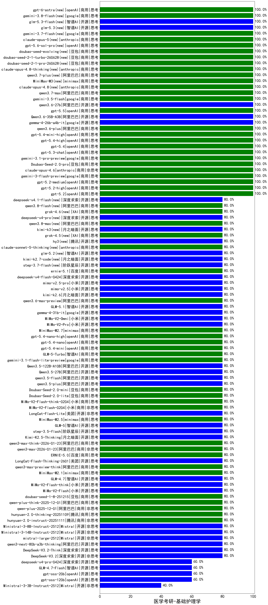

|类别|机构|大模型|【医学考研-基础护理学】准确率|平均耗时|平均消耗token|花费/千次（元）|排名（准确率）|
|---|---|-----|-------------------|-------|-----------|-----------|-----------|
|开源|google|gemma-4-26b-a4b-it(new)|100.0%|87s|529|1.3|1|
|商用|阿里巴巴|qwen-plus-2025-07-28|100.0%|13s|430|0.8|2|
|商用|openAI|gpt-5.2-medium|100.0%|9s|330|24.6|3|
|商用|openAI|gpt-5.2-high|100.0%|8s|355|27.1|4|
|开源|阿里巴巴|Qwen3-30B-A3B-Instruct-2507|100.0%|5s|435|1.1|5|
|商用|openAI|gpt-5.2|100.0%|7s|217|13.3|6|
|开源|阿里巴巴|qwen3-235b-a22b-instruct-2507|100.0%|9s|429|2.9|7|
|商用|openAI|gpt-5-2025-08-07|100.0%|19s|390|22.7|8|
|商用|anthropic|claude-opus-4.6|100.0%|17s|665|100.0|9|
|商用|阿里巴巴|qwen-flash-2025-07-28|100.0%|7s|490|0.6|10|
|商用|豆包|Doubao-Seed-2.0-pro(new)|100.0%|161s|755|10.6|11|
|商用|google|gemini-3-flash-preview|100.0%|117s|1128|22.6|12|
|商用|anthropic|claude-opus-4.5|100.0%|11s|677|103.9|13|
|商用|百度|ERNIE-5.0-Thinking-Preview|100.0%|189s|1881|44.0|14|
|商用|google|gemini-3.1-pro-preview(new)|100.0%|44s|1280|103.6|15|
|开源|阿里巴巴|Qwen3-32B-nothink|100.0%|21s|484|1.7|16|
|商用|阿里巴巴|qwen3.6-plus(new)|100.0%|28s|1510|17.3|17|
|商用|阿里巴巴|qwen3-max-preview|100.0%|11s|406|8.3|18|
|商用|openAI|gpt-5.3-chat(new)|100.0%|6s|394|30.5|19|
|商用|openAI|gpt-5.4(new)|100.0%|5s|286|21.8|20|
|商用|openAI|gpt-5.4-high(new)|100.0%|10s|593|54.0|21|
|商用|openAI|gpt-5.1-high|100.0%|132s|846|54.2|22|
|商用|openAI|gpt-5.1-medium|100.0%|165s|488|28.8|23|
|商用|google|gemini-3-pro-preview|100.0%|14s|1411|114.7|24|
|商用|openAI|gpt-5.4-mini-high(new)|100.0%|138s|776|22.0|25|
|商用|阿里巴巴|qwen-plus-2025-12-01|80.0%|18s|723|1.3|26|
|商用|腾讯|hunyuan-2.0-thinking-20251109|80.0%|6s|661|2.4|27|
|商用|anthropic|claude-haiku-4.5-thinking|80.0%|46s|1632|54.5|28|
|商用|anthropic|claude-sonnet-4.5-thinking|80.0%|29s|1781|181.0|29|
|商用|阿里巴巴|qwen-plus-think-2025-12-01|80.0%|51s|1968|15.2|30|
|商用|anthropic|claude-haiku-4.5|80.0%|7s|626|18.9|31|
|商用|腾讯|hunyuan-2.0-instruct-20251111|80.0%|9s|392|0.7|32|
|商用|XAI|grok-4-1-fast-reasoning|80.0%|10s|1088|3.4|33|
|开源|Mistral|mistral-large-2512|80.0%|15s|503|4.6|34|
|开源|Mistral|Ministral-3-8B-Instruct-2512|80.0%|5s|589|0.6|35|
|开源|Mistral|Ministral-3-14B-Instruct-2512|80.0%|4s|545|0.8|36|
|商用|XAI|grok-4-1-fast-non-reasoning|80.0%|84s|670|1.9|37|
|商用|百度|ERNIE-X1.1-Preview|80.0%|75s|696|2.6|38|
|开源|阿里巴巴|qwen3-next-80b-a3b-thinking|80.0%|156s|2528|9.9|39|
|开源|深度求索|DeepSeek-V3.2-Think|80.0%|25s|786|2.3|40|
|开源|深度求索|DeepSeek-V3.2|80.0%|95s|277|0.8|41|
|商用|openAI|gpt-5-nano-high|80.0%|96s|4002|11.4|42|
|开源|月之暗面|kimi-k2-0905|80.0%|43s|305|3.8|43|
|商用|阿里巴巴|qwen3-max-2025-09-23|80.0%|403s|417|8.6|44|
|开源|智谱AI|GLM-4.7|80.0%|49s|1611|21.7|45|
|商用|豆包|doubao-seed-1-8-251215|80.0%|28s|676|4.6|46|
|商用|豆包|Doubao-Seed-2.0-lite(new)|80.0%|183s|862|2.8|47|
|开源|google|gemma-4-31b-it(new)|80.0%|118s|521|1.3|48|
|商用|小米|MiMo-V2-Omni(new)|80.0%|729s|1254|13.9|49|
|商用|小米|MiMo-V2-Pro(new)|80.0%|15s|1023|17.0|50|
|商用|minimax|MiniMax-M2.7(new)|80.0%|36s|1298|10.2|51|
|商用|openAI|gpt-5.4-nano-high(new)|80.0%|17s|360|2.5|52|
|商用|openAI|gpt-5.4-nano(new)|80.0%|11s|259|1.6|53|
|商用|openAI|gpt-5.4-mini(new)|80.0%|17s|268|6.0|54|
|商用|智谱AI|GLM-5-Turbo(new)|80.0%|23s|1369|28.8|55|
|商用|google|gemini-3.1-flash-lite-preview(new)|80.0%|2s|372|3.2|56|
|开源|阿里巴巴|Qwen3.5-122B-A10B(new)|80.0%|88s|1898|11.7|57|
|开源|阿里巴巴|Qwen3.5-27B(new)|80.0%|286s|1960|9.1|58|
|开源|阿里巴巴|qwen3.5-flash(new)|80.0%|277s|3998|7.9|59|
|开源|阿里巴巴|qwen3.5-plus(new)|80.0%|33s|2457|11.5|60|
|商用|豆包|Doubao-Seed-2.0-mini(new)|80.0%|296s|1314|2.4|61|
|商用|小米|MiMo-V2-Flash-think-0204(new)|80.0%|470s|1794|3.6|62|
|开源|小米|MiMo-V2-Flash|80.0%|10s|394|0.0|63|
|商用|小米|MiMo-V2-Flash-0204(new)|80.0%|97s|450|0.8|64|
|开源|美团|LongCat-Flash-Lite(new)|80.0%|269s|359|0.0|65|
|商用|minimax|MiniMax-M2.5(new)|80.0%|25s|918|7.1|66|
|开源|智谱AI|GLM-5(new)|80.0%|70s|2379|41.8|67|
|开源|阶跃星辰|step-3.5-flash|80.0%|14s|1170|2.3|68|
|开源|月之暗面|Kimi-K2.5-Thinking|80.0%|257s|1227|24.6|69|
|商用|阿里巴巴|qwen3-max-think-2026-01-23|80.0%|137s|2567|25.0|70|
|商用|阿里巴巴|qwen3-max-2026-01-23|80.0%|52s|408|3.5|71|
|商用|百度|ERNIE-5.0|80.0%|156s|1498|34.8|72|
|开源|美团|LongCat-Flash-Thinking-2601|80.0%|384s|1521|0.0|73|
|商用|阿里巴巴|qwen3-max-preview-think|80.0%|190s|1696|39.2|74|
|商用|minimax|MiniMax-M2.1|80.0%|81s|2545|20.7|75|
|开源|月之暗面|Kimi-K2-Thinking|80.0%|80s|1296|19.9|76|
|开源|小米|MiMo-V2-Flash-think|80.0%|32s|1924|0.0|77|
|商用|openAI|gpt-5.1|80.0%|537s|238|11.1|78|
|商用|豆包|doubao-seed-1-6-lite-251015|80.0%|31s|718|1.5|79|
|开源|minimax|MiniMax-M2|80.0%|18s|1222|9.6|80|
|开源|阿里巴巴|Qwen3-8B-nothink|80.0%|19s|431|0.0|81|
|开源|智谱AI|GLM-4.5-Air-nothink|80.0%|17s|805|3.5|82|
|开源|智谱AI|GLM-4.5-nothink|80.0%|23s|533|6.6|83|
|开源|阶跃星辰|step-3|80.0%|61s|1232|4.7|84|
|开源|智谱AI|GLM-4.5|80.0%|27s|1372|18.4|85|
|开源|智谱AI|GLM-4.5-Air|80.0%|26s|1349|6.2|86|
|商用|智谱AI|GLM-4.5-Flash|80.0%|25s|1466|0.0|87|
|开源|阿里巴巴|Qwen3-14B-nothink|80.0%|29s|480|0.8|88|
|开源|阿里巴巴|qwen3-235b-a22b-thinking-2507|80.0%|118s|1900|36.5|89|
|商用|openAI|gpt-5-nano-2025-08-07|80.0%|17s|1334|3.6|90|
|商用|阿里巴巴|qwen-turbo-2025-07-15|80.0%|9s|339|0.2|91|
|商用|腾讯|hunyuan-t1-20250711|80.0%|17s|965|3.5|92|
|商用|XAI|grok-3-mini|80.0%|285s|1032|3.6|93|
|商用|XAI|grok-4-0709|80.0%|634s|1500|156.2|94|
|商用|anthropic|claude-4-sonnet-thinking|80.0%|9s|601|55.2|95|
|商用|anthropic|claude-4-sonnet|80.0%|42s|558|49.4|96|
|商用|百度|ERNIE-4.5-Turbo-32K|80.0%|20s|501|1.5|97|
|商用|智谱AI|GLM-4.5-Flash-nothink|80.0%|19s|807|0.0|98|
|商用|科大讯飞|xunfei-spark-x1-0725|80.0%|/|715|8.6|99|
|商用|Mistral|mistral-medium-2508|80.0%|115s|501|6.0|100|
|商用|google|gemini-2.5-flash-lite|80.0%|2s|460|1.2|101|
|商用|豆包|doubao-seed-1-6-251015|80.0%|16s|688|4.8|102|
|开源|智谱AI|GLM-4.6|80.0%|49s|2133|29.0|103|
|开源|深度求索|DeepSeek-V3.2-Exp|80.0%|22s|263|0.7|104|
|开源|深度求索|DeepSeek-V3.2-Exp-Think|80.0%|136s|786|2.3|105|
|商用|阿里巴巴|qwen-turbo-think-2025-07-15|80.0%|/|1492|4.3|106|
|商用|阿里巴巴|qwen-plus-think-2025-07-28|80.0%|/|1859|14.3|107|
|开源|豆包|Seed-OSS-36B-Instruct|80.0%|65s|1294|5.0|108|
|开源|阿里巴巴|qwen3-next-80b-a3b-instruct|80.0%|10s|473|1.6|109|
|商用|腾讯|hunyuan-turbos-20250926|80.0%|12s|523|0.9|110|
|开源|深度求索|DeepSeek-V3.1-Think|80.0%|44s|798|9.0|111|
|开源|深度求索|DeepSeek-V3.1|80.0%|15s|316|3.2|112|
|商用|阿里巴巴|qwen-flash-think-2025-07-28|80.0%|16s|1567|2.2|113|
|开源|阿里巴巴|Qwen3-14B|75.0%|27s|947|1.8|114|
|商用|豆包|doubao-seed-1-6-250615|75.0%|134s|411|2.6|115|
|开源|阿里巴巴|Qwen3-30B-A3B-Thinking-2507|70.0%|68s|3095|8.5|116|
|商用|豆包|doubao-seed-1-6-flash-250615|70.0%|4s|307|0.4|117|
|开源|百度|ERNIE-4.5-300B-A47B|70.0%|19s|331|2.2|118|
|商用|百度|ERNIE-X1-Turbo-32K|70.0%|97s|2250|8.8|119|
|商用|openAI|o4-mini|70.0%|44s|1142|34.2|120|
|开源|腾讯|Hunyuan-A13B-Instruct|65.0%|51s|1034|3.9|121|
|商用|百川智能|Baichuan4-Turbo|65.0%|/|/|/|122|
|开源|阿里巴巴|Qwen3-8B|65.0%|600s|13497|0.0|123|
|开源|阿里巴巴|Qwen3-32B|65.0%|37s|1493|5.8|124|
|开源|深度求索|DeepSeek-R1-0528-Qwen3-8B|60.0%|183s|1631|0.0|125|
|开源|深度求索|DeepSeek-R1-0528|60.0%|211s|2034|31.4|126|
|开源|meta|Llama-4-Maverick-17B-128E-Instruct-FP8|60.0%|7s|563|2.2|127|
|开源|meta|Llama-4-Scout-17B-16E-Instruct|60.0%|8s|546|1.1|128|
|商用|豆包|doubao-seed-1-6-flash-thinking-250615|60.0%|6s|554|0.7|129|
|商用|openAI|gpt-5-mini-2025-08-07|60.0%|29s|973|12.9|130|
|开源|阿里巴巴|Qwen3-4B-nothink|60.0%|13s|380|0.9|131|
|开源|openAI|gpt-oss-20b|60.0%|3s|725|0.7|132|
|商用|google|gemini-2.5-flash|60.0%|10s|1640|28.6|133|
|商用|google|gemini-2.5-pro|60.0%|27s|2413|170.4|134|
|开源|腾讯|Hunyuan-A13B-Instruct-nothink|60.0%|15s|388|1.3|135|
|商用|anthropic|claude-sonnet-4.5(new)|60.0%|16s|638|59.2|136|
|开源|智谱AI|GLM-4.7-Flash|60.0%|2729s|26777|0.0|137|
|商用|openAI|gpt-5-mini-high|60.0%|737s|1919|26.6|138|
|开源|Mistral|Mistral-Small-3.2-24B-Instruct-2506|60.0%|17s|546|1.0|139|
|开源|openAI|gpt-oss-120b|60.0%|9s|578|1.5|140|
|开源|阿里巴巴|Qwen3-4B|55.0%|20s|1878|5.4|141|
|开源|阿里巴巴|Qwen3-1.7B|50.0%|30s|2096|6.1|142|
|开源|百度|ERNIE-4.5-21B-A3B|50.0%|3s|296|0.0|143|
|开源|智谱AI|GLM-4-9B-0414|45.0%|6s|385|0.0|144|
|开源|阿里巴巴|Qwen3-1.7B-nothink|40.0%|4s|425|1.0|145|
|开源|Mistral|Ministral-3-3B-Instruct-2512|40.0%|3s|639|0.5|146|
|开源|阿里巴巴|Qwen3-0.6B-nothink|40.0%|6s|260|0.6|147|
|商用|百川智能|Baichuan4-Air|35.0%|/|/|/|148|
|开源|google|gemma-3-27b-it|30.0%|/|/|/|149|
|开源|google|gemma-3-12b-it|25.0%|/|/|/|150|
|开源|google|gemma-3-4b-it|15.0%|/|/|/|151|
|开源|百度|ERNIE-4.5-0.3B|15.0%|60s|395|0.0|152|
|开源|阿里巴巴|Qwen3-0.6B|10.0%|10s|1236|3.5|153|

