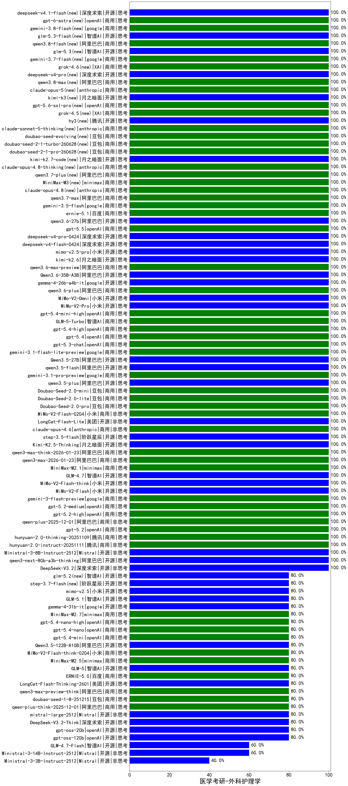

|类别|机构|大模型|【医学考研-外科护理学】准确率|平均耗时|平均消耗token|花费/千次（元）|排名（准确率）|
|---|---|-----|-------------------|-------|-----------|-----------|-----------|
|商用|阿里巴巴|qwen3.8-flash(new)|100.0%|11s|378|0.8|1|
|商用|阿里巴巴|qwen3-max-think-2026-01-23|100.0%|279s|1904|18.5|2|
|商用|豆包|Doubao-Seed-2.0-pro|100.0%|149s|695|9.8|3|
|商用|google|gemini-3.5-flash|100.0%|7s|923|55.1|4|
|商用|小米|MiMo-V2-Flash-0204|100.0%|152s|409|0.7|5|
|开源|美团|LongCat-Flash-Lite|100.0%|150s|285|0.0|6|
|商用|阿里巴巴|qwen3.7-max|100.0%|28s|588|19.7|7|
|商用|anthropic|claude-opus-4.8(new)|100.0%|11s|451|67.6|8|
|商用|anthropic|claude-opus-4.6|100.0%|12s|494|74.8|9|
|开源|阶跃星辰|step-3.5-flash|100.0%|6s|534|1.0|10|
|开源|月之暗面|Kimi-K2.5-Thinking|100.0%|260s|1208|24.4|11|
|商用|阿里巴巴|qwen3-max-2026-01-23|100.0%|19s|330|2.8|12|
|商用|openAI|gpt-5.2-high|100.0%|4s|218|15.7|13|
|商用|minimax|MiniMax-M3(new)|100.0%|19s|497|5.5|14|
|商用|阿里巴巴|qwen3.7-plus(new)|100.0%|15s|649|4.8|15|
|商用|anthropic|claude-opus-4.8-thinking(new)|100.0%|9s|496|75.3|16|
|商用|minimax|MiniMax-M2.1|100.0%|90s|762|5.8|17|
|开源|智谱AI|GLM-4.7|100.0%|38s|1389|18.8|18|
|开源|小米|MiMo-V2-Flash-think|100.0%|17s|1565|0.0|19|
|开源|小米|MiMo-V2-Flash|100.0%|15s|284|0.0|20|
|开源|月之暗面|kimi-k2.7-code(new)|100.0%|7s|266|6.0|21|
|商用|google|gemini-3-flash-preview|100.0%|8s|734|14.6|22|
|商用|豆包|Doubao-Seed-2.0-lite|100.0%|137s|616|1.9|23|
|商用|豆包|Doubao-Seed-2.0-mini|100.0%|30s|749|1.3|24|
|开源|阿里巴巴|qwen3.5-plus|100.0%|22s|1787|8.3|25|
|商用|google|gemini-3.1-pro-preview|100.0%|28s|1002|81.2|26|
|开源|阿里巴巴|Qwen3.6-35B-A3B|100.0%|8s|1204|12.4|27|
|开源|google|gemma-4-26b-a4b-it|100.0%|49s|414|1.0|28|
|开源|小米|mimo-v2.5-pro|100.0%|38s|831|13.1|29|
|商用|阿里巴巴|qwen3.6-plus|100.0%|24s|1192|13.7|30|
|开源|小米|MiMo-V2-Omni|100.0%|18s|975|10.2|31|
|开源|小米|MiMo-V2-Pro|100.0%|308s|1003|16.8|32|
|开源|深度求索|deepseek-v4-flash-0424|100.0%|22s|326|0.6|33|
|开源|深度求索|deepseek-v4-pro-0424|100.0%|14s|324|7.1|34|
|商用|openAI|gpt-5.5|100.0%|5s|211|32.3|35|
|商用|openAI|gpt-5.4-mini-high|100.0%|10s|500|13.9|36|
|开源|阿里巴巴|qwen3.6-27b|100.0%|19s|1262|21.8|37|
|商用|智谱AI|GLM-5-Turbo|100.0%|35s|1027|21.6|38|
|商用|openAI|gpt-5.4-high|100.0%|6s|269|22.2|39|
|商用|openAI|gpt-5.4|100.0%|3s|209|16.2|40|
|商用|openAI|gpt-5.3-chat|100.0%|7s|201|13.7|41|
|商用|google|gemini-3.1-flash-lite-preview|100.0%|2s|271|2.3|42|
|商用|百度|ernie-5.1|100.0%|18s|686|11.6|43|
|开源|阿里巴巴|Qwen3.5-27B|100.0%|261s|1643|7.6|44|
|开源|阿里巴巴|qwen3.5-flash|100.0%|105s|1890|3.7|45|
|开源|月之暗面|kimi-k2.6|100.0%|32s|709|18.0|46|
|商用|openAI|gpt-5.2-medium|100.0%|6s|196|13.4|47|
|开源|月之暗面|kimi-k3(new)|100.0%|18s|326|21.8|48|
|开源|豆包|Seed-OSS-36B-Instruct|100.0%|69s|1628|6.4|49|
|商用|anthropic|claude-haiku-4.5-thinking|100.0%|34s|1508|51.0|50|
|商用|阿里巴巴|qwen3.8-max(new)|100.0%|14s|352|10.3|51|
|商用|openAI|gpt-5.1-medium|100.0%|136s|252|13.6|52|
|商用|openAI|gpt-5.1|100.0%|93s|132|5.1|53|
|开源|月之暗面|Kimi-K2-Thinking|100.0%|64s|747|11.3|54|
|商用|豆包|doubao-seed-1-6-lite-251015|100.0%|15s|525|1.1|55|
|商用|豆包|doubao-seed-1-6-251015|100.0%|12s|562|3.9|56|
|商用|腾讯|hunyuan-turbos-20250926|100.0%|10s|442|0.8|57|
|开源|阿里巴巴|qwen3-next-80b-a3b-instruct|100.0%|10s|374|1.3|58|
|商用|阿里巴巴|qwen3-max-preview|100.0%|7s|333|6.8|59|
|商用|阿里巴巴|qwen-plus-2025-12-01|100.0%|15s|546|1.0|60|
|商用|阿里巴巴|qwen-turbo-think-2025-07-15|100.0%|/|1444|4.2|61|
|开源|深度求索|deepseek-v4-pro(new)|100.0%|13s|320|6.2|62|
|商用|XAI|grok-4.6(new)|100.0%|22s|858|28.8|63|
|开源|深度求索|DeepSeek-V3.1|100.0%|14s|232|2.3|64|
|商用|google|gemini-3.7-flash(new)|100.0%|4s|685|16.7|65|
|商用|阿里巴巴|qwen-flash-2025-07-28|100.0%|4s|278|0.3|66|
|商用|openAI|gpt-5-nano-2025-08-07|100.0%|27s|1095|3.0|67|
|开源|智谱AI|glm-5.3(new)|100.0%|23s|782|20.6|68|
|商用|openAI|gpt-5-2025-08-07|100.0%|15s|193|10.0|69|
|商用|anthropic|claude-opus-5(new)|100.0%|11s|498|75.8|70|
|商用|阿里巴巴|qwen3.6-max-preview|100.0%|31s|1202|62.1|71|
|开源|月之暗面|kimi-k2-0905|100.0%|58s|172|1.8|72|
|商用|openAI|gpt-5.1-high|100.0%|15s|308|17.6|73|
|商用|openAI|gpt-5.2|100.0%|3s|140|7.9|74|
|商用|腾讯|hunyuan-2.0-thinking-20251109|100.0%|4s|481|1.8|75|
|商用|腾讯|hunyuan-2.0-instruct-20251111|100.0%|3s|339|0.6|76|
|商用|豆包|doubao-seed-2-1-pro-260628(new)|100.0%|120s|3848|113.1|77|
|开源|Mistral|Ministral-3-8B-Instruct-2512|100.0%|11s|441|0.5|78|
|商用|豆包|doubao-seed-2-1-turbo-260628(new)|100.0%|151s|2957|43.2|79|
|商用|豆包|doubao-seed-evolving(new)|100.0%|259s|4027|118.5|80|
|开源|阿里巴巴|qwen3-next-80b-a3b-thinking|100.0%|119s|2148|8.4|81|
|商用|anthropic|claude-sonnet-5-thinking(new)|100.0%|21s|506|30.8|82|
|开源|深度求索|DeepSeek-V3.2|100.0%|118s|229|0.6|83|
|商用|openAI|gpt-5-nano-high|100.0%|694s|2892|8.2|84|
|开源|腾讯|hy3(new)|100.0%|83s|155|0.4|85|
|商用|阿里巴巴|qwen3-max-2025-09-23|100.0%|51s|334|6.9|86|
|商用|anthropic|claude-opus-4.5|100.0%|18s|575|90.6|87|
|商用|XAI|grok-4.5(new)|100.0%|122s|721|23.0|88|
|商用|openAI|gpt-5.6-sol-pro(new)|100.0%|81s|2384|143.9|89|
|商用|anthropic|claude-sonnet-4.5-thinking|100.0%|21s|1395|142.0|90|
|商用|anthropic|claude-sonnet-4.5|100.0%|8s|512|48.5|91|
|开源|阶跃星辰|step-3.7-flash(new)|80.0%|18s|1427|11.1|92|
|开源|小米|mimo-v2.5|80.0%|36s|803|7.8|93|
|开源|智谱AI|glm-5.2(new)|80.0%|76s|876|23.2|94|
|开源|openAI|gpt-oss-120b|80.0%|6s|382|0.9|95|
|开源|智谱AI|GLM-5.1|80.0%|62s|829|18.9|96|
|商用|豆包|doubao-seed-1-8-251215|80.0%|37s|439|2.8|97|
|商用|openAI|gpt-5-mini-2025-08-07|80.0%|13s|487|6.2|98|
|商用|阿里巴巴|qwen-flash-think-2025-07-28|80.0%|21s|1719|2.5|99|
|开源|深度求索|DeepSeek-V3.1-Think|80.0%|31s|613|6.9|100|
|商用|anthropic|claude-haiku-4.5|80.0%|7s|581|18.3|101|
|商用|XAI|grok-4-1-fast-reasoning|80.0%|85s|816|2.4|102|
|商用|百度|ERNIE-X1.1-Preview|80.0%|110s|455|1.7|103|
|商用|百度|ERNIE-5.0-Thinking-Preview|80.0%|156s|1451|33.9|104|
|商用|openAI|gpt-5-mini-high|80.0%|44s|1144|15.7|105|
|开源|深度求索|DeepSeek-V3.2-Think|80.0%|81s|457|1.3|106|
|开源|Mistral|mistral-large-2512|80.0%|9s|395|3.7|107|
|开源|google|gemma-4-31b-it|80.0%|67s|451|1.1|108|
|商用|阿里巴巴|qwen-plus-think-2025-12-01|80.0%|54s|1964|15.2|109|
|商用|阿里巴巴|qwen3-max-preview-think|80.0%|178s|1471|34.1|110|
|商用|minimax|MiniMax-M2.5|80.0%|13s|714|5.4|111|
|商用|minimax|MiniMax-M2.7|80.0%|22s|916|7.1|112|
|商用|openAI|gpt-5.4-nano-high|80.0%|108s|293|2.1|113|
|商用|openAI|gpt-5.4-nano|80.0%|7s|168|1.0|114|
|商用|openAI|gpt-5.4-mini|80.0%|10s|157|3.1|115|
|开源|阿里巴巴|Qwen3.5-122B-A10B|80.0%|121s|2553|16.0|116|
|商用|小米|MiMo-V2-Flash-think-0204|80.0%|420s|1514|3.1|117|
|开源|openAI|gpt-oss-20b|80.0%|9s|569|0.6|118|
|商用|百度|ERNIE-5.0|80.0%|60s|1340|31.2|119|
|开源|美团|LongCat-Flash-Thinking-2601|80.0%|59s|901|0.0|120|
|开源|智谱AI|GLM-5|80.0%|34s|1243|21.6|121|
|开源|智谱AI|GLM-4.7-Flash|60.0%|141s|1417|0.0|122|
|商用|XAI|grok-4-1-fast-non-reasoning|60.0%|101s|578|1.6|123|
|开源|Mistral|Ministral-3-14B-Instruct-2512|60.0%|12s|439|0.6|124|
|商用|google|gemini-2.5-flash-lite|40.0%|5s|411|1.1|125|
|开源|Mistral|Ministral-3-3B-Instruct-2512|40.0%|12s|1041|0.7|126|

