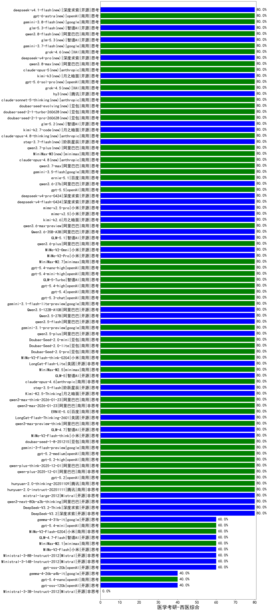

|类别|机构|大模型|【医学考研-西医综合】准确率|平均耗时|平均消耗token|花费/千次（元）|排名（准确率）|
|---|---|-----|-------------------|-------|-----------|-----------|-----------|
|商用|豆包|Doubao-1.5-lite-32k-250115|95.0%|4s|194|0.1|1|
|商用|百度|ERNIE-4.5-Turbo-32K|95.0%|23s|565|1.7|2|
|商用|豆包|doubao-seed-1-6-250615|90.0%|105s|463|3.0|3|
|商用|豆包|doubao-seed-1-6-flash-thinking-250615|85.0%|6s|524|0.6|4|
|开源|minimax|MiniMax-M1|85.0%|117s|1818|11.3|5|
|商用|百度|ERNIE-X1-Turbo-32K|85.0%|84s|1900|7.4|6|
|开源|深度求索|DeepSeek-R1-0528|85.0%|220s|1700|26.4|7|
|开源|meta|Llama-4-Maverick-17B-128E-Instruct-FP8|85.0%|7s|440|1.7|8|
|开源|百度|ERNIE-4.5-21B-A3B|85.0%|6s|329|0.0|9|
|开源|百度|ERNIE-4.5-300B-A47B|85.0%|25s|342|2.3|10|
|商用|豆包|doubao-seed-1-6-flash-250615|85.0%|3s|333|0.4|11|
|商用|google|gemini-2.5-flash|85.0%|10s|1776|31.0|12|
|商用|anthropic|claude-opus-4.5(new)|80.0%|9s|543|82.1|13|
|商用|百度|ERNIE-5.0-Thinking-Preview|80.0%|127s|1157|26.8|14|
|商用|阿里巴巴|qwen3-max-preview|80.0%|7s|320|6.4|15|
|商用|openAI|gpt-5-nano-high|80.0%|77s|2964|8.4|16|
|开源|深度求索|DeepSeek-V3.2(new)|80.0%|114s|196|0.5|17|
|开源|深度求索|DeepSeek-V3.2-Think(new)|80.0%|16s|493|1.4|18|
|开源|阿里巴巴|qwen3-next-80b-a3b-thinking|80.0%|46s|1661|6.4|19|
|开源|Mistral|mistral-large-2512(new)|80.0%|9s|406|3.6|20|
|商用|腾讯|hunyuan-2.0-instruct-20251111|80.0%|2s|314|0.5|21|
|商用|腾讯|hunyuan-2.0-thinking-20251109|80.0%|8s|548|2.0|22|
|商用|openAI|gpt-5.2(new)|80.0%|10s|160|8.6|23|
|商用|阿里巴巴|qwen3-max-2025-09-23|80.0%|15s|376|7.7|24|
|商用|anthropic|claude-sonnet-4.5(new)|80.0%|8s|535|49.2|25|
|商用|百度|ERNIE-X1.1-Preview|80.0%|87s|438|1.6|26|
|商用|anthropic|claude-sonnet-4.5-thinking|80.0%|19s|1252|124.7|27|
|开源|深度求索|DeepSeek-V3.2-Exp|80.0%|20s|185|0.5|28|
|开源|深度求索|DeepSeek-V3.2-Exp-Think|80.0%|462s|642|1.9|29|
|商用|腾讯|hunyuan-turbos-20250926|80.0%|11s|471|0.8|30|
|开源|智谱AI|GLM-4.6|80.0%|44s|1813|24.7|31|
|商用|豆包|doubao-seed-1-6-251015|80.0%|12s|507|3.4|32|
|商用|豆包|doubao-seed-1-6-lite-251015|80.0%|9s|478|1.0|33|
|开源|minimax|MiniMax-M2|80.0%|37s|753|5.7|34|
|开源|月之暗面|Kimi-K2-Thinking|80.0%|89s|962|14.6|35|
|商用|openAI|gpt-5.1-medium|80.0%|173s|291|15.4|36|
|商用|anthropic|claude-haiku-4.5-thinking|80.0%|37s|2198|75.4|37|
|商用|XAI|grok-4-1-fast-reasoning|80.0%|90s|677|1.9|38|
|商用|google|gemini-3-pro-preview(new)|80.0%|72s|1109|89.6|39|
|开源|月之暗面|kimi-k2-0905|80.0%|49s|238|2.8|40|
|商用|openAI|gpt-5.1-high|80.0%|23s|369|21.0|41|
|商用|阿里巴巴|qwen-plus-think-2025-12-01(new)|80.0%|29s|1375|10.5|42|
|商用|阿里巴巴|qwen-plus-2025-12-01(new)|80.0%|15s|543|1.0|43|
|商用|阿里巴巴|qwen3-max-preview-think(new)|80.0%|73s|1572|36.4|44|
|商用|openAI|gpt-5.2-high(new)|80.0%|4s|262|18.8|45|
|开源|美团|LongCat-Flash-Lite(new)|80.0%|343s|464|0.0|46|
|商用|openAI|gpt-5.4-high(new)|80.0%|6s|330|27.3|47|
|商用|openAI|gpt-5.4(new)|80.0%|3s|226|16.4|48|
|商用|openAI|gpt-5.3-chat(new)|80.0%|34s|303|22.5|49|
|商用|google|gemini-3.1-flash-lite-preview(new)|80.0%|2s|276|2.3|50|
|开源|阿里巴巴|Qwen3.5-122B-A10B(new)|80.0%|245s|1603|9.9|51|
|开源|阿里巴巴|Qwen3.5-27B(new)|80.0%|97s|1413|6.5|52|
|开源|阿里巴巴|qwen3.5-flash(new)|80.0%|250s|1675|3.2|53|
|商用|google|gemini-3.1-pro-preview(new)|80.0%|29s|1005|80.7|54|
|开源|阿里巴巴|qwen3.5-plus(new)|80.0%|16s|1208|5.5|55|
|商用|豆包|Doubao-Seed-2.0-mini(new)|80.0%|274s|941|1.7|56|
|商用|豆包|Doubao-Seed-2.0-lite(new)|80.0%|73s|490|1.4|57|
|商用|豆包|Doubao-Seed-2.0-pro(new)|80.0%|150s|712|10.0|58|
|商用|小米|MiMo-V2-Flash-think-0204(new)|80.0%|537s|1161|2.3|59|
|商用|minimax|MiniMax-M2.5(new)|80.0%|15s|783|6.0|60|
|商用|openAI|gpt-5.2-medium(new)|80.0%|4s|241|16.7|61|
|开源|智谱AI|GLM-5(new)|80.0%|32s|1177|20.3|62|
|商用|anthropic|claude-opus-4.6(new)|80.0%|16s|514|75.5|63|
|开源|阶跃星辰|step-3.5-flash(new)|80.0%|9s|677|1.3|64|
|开源|月之暗面|Kimi-K2.5-Thinking(new)|80.0%|190s|841|16.6|65|
|商用|阿里巴巴|qwen3-max-think-2026-01-23(new)|80.0%|288s|1930|18.7|66|
|商用|阿里巴巴|qwen3-max-2026-01-23(new)|80.0%|66s|310|2.6|67|
|商用|百度|ERNIE-5.0(new)|80.0%|126s|1033|23.8|68|
|开源|美团|LongCat-Flash-Thinking-2601(new)|80.0%|341s|1056|0.0|69|
|开源|豆包|Seed-OSS-36B-Instruct|80.0%|89s|848|3.2|70|
|开源|智谱AI|GLM-4.7(new)|80.0%|30s|1235|16.6|71|
|开源|小米|MiMo-V2-Flash-think(new)|80.0%|17s|1515|0.0|72|
|商用|豆包|doubao-seed-1-8-251215(new)|80.0%|22s|470|3.0|73|
|商用|google|gemini-3-flash-preview(new)|80.0%|97s|739|14.5|74|
|开源|阿里巴巴|qwen3-next-80b-a3b-instruct|80.0%|9s|387|1.3|75|
|商用|智谱AI|GLM-5-Turbo(new)|80.0%|18s|969|20.2|76|
|商用|百川智能|Baichuan4-Turbo|80.0%|/|/|/|77|
|商用|阿里巴巴|qwen-turbo-think-2025-07-15|80.0%|/|1407|4.0|78|
|开源|智谱AI|GLM-4.5-Air-nothink|80.0%|28s|865|4.8|79|
|开源|智谱AI|GLM-4.5-nothink|80.0%|14s|475|5.9|80|
|开源|阶跃星辰|step-3|80.0%|63s|1232|4.8|81|
|商用|腾讯|hunyuan-t1-20250711|80.0%|14s|800|2.9|82|
|开源|腾讯|Hunyuan-A13B-Instruct-nothink|80.0%|312s|330|1.1|83|
|开源|阿里巴巴|Qwen3-30B-A3B-Instruct-2507|80.0%|4s|467|1.2|84|
|开源|智谱AI|GLM-4.5|80.0%|42s|1194|16.0|85|
|开源|智谱AI|GLM-4.5-Air|80.0%|24s|1282|7.4|86|
|商用|智谱AI|GLM-4.5-Flash|80.0%|16s|1061|0.0|87|
|开源|阿里巴巴|Qwen3-32B-nothink|80.0%|21s|438|1.5|88|
|开源|阿里巴巴|qwen3-235b-a22b-instruct-2507|80.0%|9s|411|2.8|89|
|商用|豆包|doubao-seed-1-6-thinking-250715|80.0%|17s|568|4.1|90|
|开源|阿里巴巴|qwen3-235b-a22b-thinking-2507|80.0%|34s|1491|28.5|91|
|开源|阿里巴巴|Qwen3-14B-nothink|80.0%|31s|498|0.9|92|
|商用|科大讯飞|xunfei-spark-x1-0725|80.0%|/|835|10.0|93|
|商用|智谱AI|GLM-4.5-Flash-nothink|80.0%|15s|814|0.0|94|
|开源|月之暗面|kimi-k2-0711-preview|80.0%|29s|505|7.3|95|
|商用|anthropic|claude-4-sonnet-thinking|80.0%|8s|545|50.4|96|
|商用|openAI|gpt-5-2025-08-07|80.0%|17s|229|11.6|97|
|商用|阿里巴巴|qwen-plus-think-2025-07-28|80.0%|/|1424|10.9|98|
|商用|阿里巴巴|qwen-plus-2025-07-28|80.0%|11s|379|0.7|99|
|商用|Mistral|mistral-medium-2508|80.0%|109s|382|4.4|100|
|开源|深度求索|DeepSeek-V3.1-Think|80.0%|29s|567|6.3|101|
|开源|深度求索|DeepSeek-V3.1|80.0%|12s|238|2.4|102|
|开源|阿里巴巴|Qwen3-32B|80.0%|229s|3978|15.7|103|
|商用|阿里巴巴|qwen-flash-think-2025-07-28|80.0%|18s|1919|2.8|104|
|商用|阿里巴巴|qwen-flash-2025-07-28|80.0%|7s|413|0.5|105|
|商用|openAI|gpt-5-nano-2025-08-07|80.0%|37s|1669|4.6|106|
|开源|阿里巴巴|Qwen3-14B|70.0%|304s|6773|13.4|107|
|商用|anthropic|claude-4-sonnet|70.0%|42s|532|47.5|108|
|开源|深度求索|DeepSeek-R1-0528-Qwen3-8B|70.0%|166s|1840|0.0|109|
|开源|腾讯|Hunyuan-A13B-Instruct|70.0%|51s|1001|3.8|110|
|商用|XAI|grok-4-0709|70.0%|263s|1351|140.2|111|
|商用|google|gemini-2.5-pro|70.0%|51s|2844|201.2|112|
|开源|阿里巴巴|Qwen3-8B|70.0%|4s|517|0.0|113|
|开源|minimax|MiniMax-Text-01|70.0%|27s|908|7.3|114|
|开源|阿里巴巴|Qwen3-30B-A3B-Thinking-2507|70.0%|54s|2234|6.1|115|
|开源|openAI|gpt-oss-20b|60.0%|218s|729|0.7|116|
|商用|小米|MiMo-V2-Flash-0204(new)|60.0%|53s|396|0.7|117|
|商用|openAI|o4-mini|60.0%|27s|889|26.3|118|
|开源|Mistral|Mistral-Small-3.2-24B-Instruct-2506|60.0%|541s|551|1.1|119|
|商用|google|gemini-2.5-flash-lite|60.0%|2s|399|1.0|120|
|商用|openAI|gpt-5.1|60.0%|112s|201|9.1|121|
|商用|anthropic|claude-haiku-4.5|60.0%|10s|570|17.3|122|
|商用|XAI|grok-4-1-fast-non-reasoning|60.0%|79s|628|1.7|123|
|商用|openAI|gpt-5-mini-2025-08-07|60.0%|30s|833|11.0|124|
|商用|XAI|grok-3-mini|60.0%|280s|1066|3.8|125|
|开源|Mistral|Ministral-3-14B-Instruct-2512(new)|60.0%|13s|644|0.9|126|
|开源|智谱AI|GLM-4.7-Flash(new)|60.0%|302s|2135|0.0|127|
|商用|minimax|MiniMax-M2.1(new)|60.0%|88s|919|7.1|128|
|商用|阿里巴巴|qwen-turbo-2025-07-15|60.0%|6s|354|0.2|129|
|商用|openAI|gpt-5-mini-high|60.0%|128s|1417|19.5|130|
|开源|小米|MiMo-V2-Flash(new)|60.0%|8s|352|0.0|131|
|开源|Mistral|Ministral-3-8B-Instruct-2512(new)|60.0%|9s|401|0.4|132|
|开源|meta|Llama-4-Scout-17B-16E-Instruct|55.0%|8s|491|1.0|133|
|开源|阿里巴巴|Qwen3-4B|55.0%|164s|2377|6.9|134|
|开源|智谱AI|GLM-4-9B-0414|55.0%|14s|496|0.0|135|
|商用|百度|ERNIE-Lite-8K|50.0%|/|/|/|136|
|商用|百川智能|Baichuan4-Air|50.0%|/|/|/|137|
|开源|google|gemma-3-27b-it|45.0%|/|/|/|138|
|开源|阿里巴巴|Qwen3-1.7B|40.0%|104s|2832|8.3|139|
|开源|google|gemma-3-12b-it|40.0%|/|/|/|140|
|开源|openAI|gpt-oss-120b|40.0%|7s|507|1.3|141|
|开源|阿里巴巴|Qwen3-1.7B-nothink|40.0%|4s|382|0.9|142|
|开源|google|gemma-3-4b-it|35.0%|/|/|/|143|
|开源|阿里巴巴|Qwen3-0.6B|25.0%|76s|1617|4.6|144|
|开源|百度|ERNIE-4.5-0.3B|25.0%|6s|414|0.0|145|
|开源|阿里巴巴|Qwen3-4B-nothink|20.0%|16s|370|0.9|146|
|开源|阿里巴巴|Qwen3-8B-nothink|20.0%|22s|438|0.0|147|
|开源|阿里巴巴|Qwen3-0.6B-nothink|/%|5s|215|0.4|148|
|开源|Mistral|Ministral-3-3B-Instruct-2512(new)|/%|10s|490|0.3|149|

