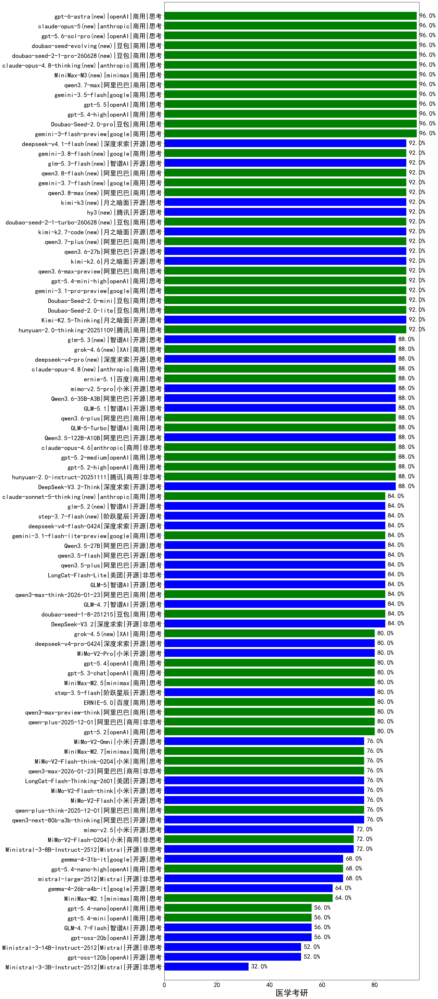

|类别|机构|大模型|【医学考研】准确率|平均耗时|平均消耗token|花费/千次（元）|排名（准确率）|
|---|---|-----|-------------------|-------|-----------|-----------|-----------|
|商用|openAI|gpt-5.4-high|96.0%|12s|682|64.3|1|
|商用|anthropic|claude-opus-4.8-thinking(new)|96.0%|11s|685|105.8|2|
|商用|minimax|MiniMax-M3(new)|96.0%|28s|726|9.2|3|
|商用|阿里巴巴|qwen3.7-max(new)|96.0%|24s|920|31.4|4|
|商用|豆包|Doubao-Seed-2.0-pro|96.0%|196s|873|12.6|5|
|商用|google|gemini-3.5-flash(new)|96.0%|8s|1196|71.7|6|
|商用|google|gemini-3-flash-preview|96.0%|74s|1121|22.6|7|
|商用|openAI|gpt-5.5(new)|96.0%|9s|371|63.1|8|
|商用|豆包|doubao-seed-1-6-lite-251015|92.0%|20s|737|1.6|9|
|开源|阿里巴巴|qwen3-235b-a22b-instruct-2507|92.0%|10s|451|3.2|10|
|商用|豆包|Doubao-Seed-2.0-mini|92.0%|264s|1968|3.7|11|
|商用|豆包|Doubao-Seed-2.0-lite|92.0%|153s|760|2.4|12|
|商用|openAI|gpt-5.4-mini-high|92.0%|57s|760|21.7|13|
|开源|阿里巴巴|Qwen3-32B-nothink|92.0%|18s|493|1.7|14|
|商用|阿里巴巴|qwen3.6-max-preview(new)|92.0%|47s|1561|81.1|15|
|开源|月之暗面|kimi-k2.6(new)|92.0%|63s|1047|26.9|16|
|商用|阿里巴巴|qwen3-max-preview|92.0%|9s|420|8.7|17|
|商用|腾讯|hunyuan-2.0-thinking-20251109|92.0%|8s|746|2.8|18|
|开源|月之暗面|Kimi-K2.5-Thinking|92.0%|270s|1386|28.0|19|
|开源|阿里巴巴|qwen3.6-27b(new)|92.0%|26s|1694|29.4|20|
|商用|阿里巴巴|qwen3.7-plus(new)|92.0%|19s|972|7.3|21|
|开源|月之暗面|kimi-k2.7-code(new)|92.0%|11s|497|12.1|22|
|商用|google|gemini-3.1-pro-preview|92.0%|41s|1674|137.7|23|
|商用|百度|ERNIE-4.5-Turbo-32K|91.0%|22s|540|1.6|24|
|商用|anthropic|claude-opus-4.6|88.0%|15s|596|89.8|25|
|商用|openAI|gpt-5.2-medium|88.0%|9s|386|31.1|26|
|商用|openAI|gpt-5.1-medium|88.0%|170s|484|29.1|27|
|商用|腾讯|hunyuan-turbos-20250926|88.0%|13s|554|1.0|28|
|商用|豆包|doubao-seed-1-6-251015|88.0%|45s|668|4.7|29|
|商用|openAI|gpt-5.2-high|88.0%|9s|435|35.9|30|
|商用|腾讯|hunyuan-2.0-instruct-20251111|88.0%|4s|391|0.7|31|
|开源|月之暗面|kimi-k2-0905|88.0%|56s|313|4.0|32|
|开源|阿里巴巴|Qwen3.5-122B-A10B|88.0%|181s|2813|17.6|33|
|商用|anthropic|claude-opus-4.5|88.0%|14s|699|109.8|34|
|商用|智谱AI|GLM-5-Turbo|88.0%|39s|1440|30.5|35|
|开源|阿里巴巴|Qwen3-30B-A3B-Instruct-2507|88.0%|4s|479|1.3|36|
|开源|智谱AI|GLM-5.1(new)|88.0%|137s|1453|33.7|37|
|开源|阿里巴巴|Qwen3.6-35B-A3B(new)|88.0%|70s|1936|20.3|38|
|开源|小米|mimo-v2.5-pro(new)|88.0%|35s|1227|21.3|39|
|商用|腾讯|hunyuan-t1-20250711|88.0%|17s|1012|3.7|40|
|开源|深度求索|DeepSeek-V3.2-Think|88.0%|58s|958|2.8|41|
|商用|百度|ernie-5.1(new)|88.0%|31s|920|15.7|42|
|商用|anthropic|claude-opus-4.8(new)|88.0%|10s|543|80.7|43|
|商用|阿里巴巴|qwen3.6-plus|88.0%|38s|1538|17.8|44|
|商用|豆包|doubao-seed-1-8-251215|84.0%|28s|630|4.3|45|
|开源|深度求索|DeepSeek-V3.2|84.0%|88s|314|0.9|46|
|商用|google|gemini-3.1-flash-lite-preview|84.0%|3s|354|3.1|47|
|开源|智谱AI|GLM-4.7|84.0%|48s|1829|24.9|48|
|商用|阿里巴巴|qwen3-max-think-2026-01-23|84.0%|202s|2826|27.7|49|
|开源|智谱AI|GLM-5|84.0%|67s|2083|36.6|50|
|开源|美团|LongCat-Flash-Lite|84.0%|212s|498|0.0|51|
|开源|阿里巴巴|qwen3.5-plus|84.0%|32s|2548|11.9|52|
|开源|阿里巴巴|qwen3.5-flash|84.0%|228s|3282|6.4|53|
|开源|阿里巴巴|Qwen3.5-27B|84.0%|287s|2616|12.3|54|
|开源|深度求索|deepseek-v4-flash(new)|84.0%|26s|652|1.2|55|
|开源|阶跃星辰|step-3.7-flash(new)|84.0%|33s|1970|15.5|56|
|商用|阿里巴巴|qwen3-max-2025-09-23|84.0%|166s|445|9.4|57|
|开源|智谱AI|glm-5.2(new)|84.0%|51s|1641|44.4|58|
|开源|豆包|Seed-OSS-36B-Instruct|84.0%|90s|1498|5.8|59|
|开源|阿里巴巴|qwen3-next-80b-a3b-instruct|84.0%|9s|515|1.8|60|
|开源|深度求索|DeepSeek-V3.1|84.0%|18s|325|3.4|61|
|商用|百度|ERNIE-X1-Turbo-32K|80.5%|89s|1919|7.5|62|
|商用|阿里巴巴|qwen-plus-2025-12-01|80.0%|19s|737|1.4|63|
|商用|百度|ERNIE-5.0|80.0%|199s|1889|44.3|64|
|商用|minimax|MiniMax-M2.5|80.0%|21s|1064|8.3|65|
|开源|深度求索|DeepSeek-V3.1-Think|80.0%|56s|1089|12.5|66|
|商用|阿里巴巴|qwen3-max-preview-think|80.0%|180s|2136|49.9|67|
|开源|月之暗面|Kimi-K2-Thinking|80.0%|90s|1296|19.9|68|
|商用|openAI|gpt-5-2025-08-07|80.0%|22s|299|16.7|69|
|商用|openAI|gpt-5.3-chat|80.0%|16s|369|28.9|70|
|商用|openAI|gpt-5.4|80.0%|4s|283|22.3|71|
|开源|阶跃星辰|step-3.5-flash|80.0%|24s|1550|3.2|72|
|商用|阿里巴巴|qwen-flash-2025-07-28|80.0%|6s|483|0.6|73|
|商用|openAI|gpt-5.2|80.0%|6s|204|13.0|74|
|开源|阿里巴巴|qwen3-235b-a22b-thinking-2507|80.0%|63s|2323|45.1|75|
|商用|anthropic|claude-sonnet-4.5-thinking|80.0%|23s|1495|151.1|76|
|商用|openAI|gpt-5.1-high|80.0%|71s|952|62.3|77|
|开源|小米|MiMo-V2-Pro|80.0%|172s|1037|17.4|78|
|开源|深度求索|deepseek-v4-pro(new)|80.0%|29s|706|16.2|79|
|开源|深度求索|DeepSeek-R1-0528|79.5%|207s|1754|27.2|80|
|开源|阿里巴巴|Qwen3-14B|79.1%|138s|3480|6.8|81|
|开源|阿里巴巴|Qwen3-32B|77.1%|143s|2472|9.7|82|
|商用|百度|ERNIE-X1.1-Preview|76.0%|102s|608|2.3|83|
|开源|阿里巴巴|Qwen3-14B-nothink|76.0%|22s|520|0.9|84|
|商用|智谱AI|GLM-4.5-Flash-nothink|76.0%|19s|903|0.0|85|
|商用|小米|MiMo-V2-Flash-think-0204|76.0%|799s|2040|4.2|86|
|商用|智谱AI|GLM-4.5-Flash|76.0%|26s|1491|0.0|87|
|商用|阿里巴巴|qwen-turbo-think-2025-07-15|76.0%|/|2152|6.3|88|
|开源|小米|MiMo-V2-Omni|76.0%|285s|1186|13.1|89|
|商用|minimax|MiniMax-M2.7|76.0%|35s|1391|11.1|90|
|商用|百度|ERNIE-5.0-Thinking-Preview|76.0%|154s|1611|37.6|91|
|商用|阿里巴巴|qwen3-max-2026-01-23|76.0%|92s|445|3.9|92|
|开源|小米|MiMo-V2-Flash|76.0%|14s|417|0.0|93|
|开源|美团|LongCat-Flash-Thinking-2601|76.0%|113s|1518|0.0|94|
|商用|openAI|gpt-5-nano-high|76.0%|289s|3913|11.1|95|
|开源|阿里巴巴|qwen3-next-80b-a3b-thinking|76.0%|133s|3031|11.9|96|
|开源|小米|MiMo-V2-Flash-think|76.0%|47s|2035|0.0|97|
|商用|阿里巴巴|qwen-plus-think-2025-12-01|76.0%|50s|2154|16.7|98|
|商用|google|gemini-2.5-pro|75.6%|37s|2413|170.4|99|
|商用|百川智能|Baichuan4-Turbo|74.4%|/|/|/|100|
|商用|google|gemini-2.5-flash|73.0%|10s|1718|30.0|101|
|商用|openAI|gpt-5-nano-2025-08-07|72.0%|52s|1783|5.0|102|
|开源|智谱AI|GLM-4.5-Air-nothink|72.0%|19s|937|5.1|103|
|商用|anthropic|claude-sonnet-4.5|72.0%|10s|583|54.5|104|
|商用|小米|MiMo-V2-Flash-0204|72.0%|189s|480|0.9|105|
|开源|小米|mimo-v2.5(new)|72.0%|34s|1430|16.5|106|
|开源|智谱AI|GLM-4.5-Air|72.0%|29s|1497|8.3|107|
|开源|Mistral|Ministral-3-8B-Instruct-2512|72.0%|10s|518|0.6|108|
|商用|XAI|grok-4-1-fast-reasoning|72.0%|56s|994|3.1|109|
|开源|阿里巴巴|Qwen3-8B|68.5%|389s|9207|0.0|110|
|商用|anthropic|claude-4-sonnet|68.0%|43s|552|49.9|111|
|商用|阿里巴巴|qwen-turbo-2025-07-15|68.0%|8s|372|0.2|112|
|商用|anthropic|claude-haiku-4.5-thinking|68.0%|33s|2240|76.9|113|
|开源|阿里巴巴|Qwen3-30B-A3B-Thinking-2507|68.0%|63s|2556|7.0|114|
|商用|openAI|gpt-5.4-nano-high|68.0%|31s|472|3.5|115|
|商用|阿里巴巴|qwen-flash-think-2025-07-28|68.0%|24s|2398|3.5|116|
|开源|meta|Llama-4-Scout-17B-16E-Instruct|68.0%|14s|552|1.1|117|
|开源|Mistral|mistral-large-2512|68.0%|11s|484|4.5|118|
|开源|google|gemma-4-31b-it|68.0%|84s|528|1.3|119|
|商用|openAI|o4-mini|68.0%|29s|892|26.4|120|
|商用|openAI|gpt-5.1|68.0%|268s|220|10.4|121|
|商用|anthropic|claude-4-sonnet-thinking|66.0%|29s|574|53.5|122|
|商用|minimax|MiniMax-M2.1|64.0%|89s|1531|12.2|123|
|开源|google|gemma-4-26b-a4b-it|64.0%|69s|582|1.5|124|
|开源|阿里巴巴|Qwen3-4B|61.9%|85s|2067|6.0|125|
|开源|智谱AI|GLM-4-9B-0414|61.0%|11s|504|0.0|126|
|商用|openAI|gpt-5-mini-high|60.0%|343s|1685|23.4|127|
|商用|anthropic|claude-haiku-4.5|60.0%|9s|612|18.8|128|
|商用|XAI|grok-4-1-fast-non-reasoning|60.0%|72s|631|1.7|129|
|开源|阿里巴巴|Qwen3-4B-nothink|56.0%|16s|421|1.1|130|
|开源|openAI|gpt-oss-20b|56.0%|100s|871|0.9|131|
|开源|智谱AI|GLM-4.7-Flash|56.0%|1275s|7433|0.0|132|
|商用|openAI|gpt-5.4-nano|56.0%|43s|248|1.6|133|
|商用|openAI|gpt-5.4-mini|56.0%|11s|227|4.9|134|
|开源|openAI|gpt-oss-120b|52.0%|6s|638|1.7|135|
|开源|Mistral|Ministral-3-14B-Instruct-2512|52.0%|11s|564|0.8|136|
|开源|阿里巴巴|Qwen3-8B-nothink|52.0%|49s|475|0.0|137|
|商用|google|gemini-2.5-flash-lite|52.0%|2s|476|1.2|138|
|商用|openAI|gpt-5-mini-2025-08-07|48.0%|27s|926|12.3|139|
|开源|Mistral|Ministral-3-3B-Instruct-2512|32.0%|10s|745|0.5|140|

