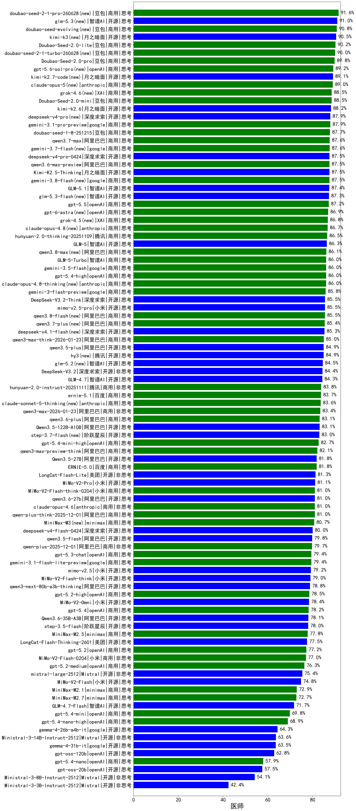

|类别|机构|大模型|【医师】准确率|平均耗时|平均消耗token|花费/千次（元）|排名（准确率）|
|---|---|-----|-------------------|-------|-----------|-----------|-----------|
|商用|豆包|doubao-seed-2-1-pro-260628(new)|91.6%|225s|7212|213.6|1|
|开源|智谱AI|glm-5.3(new)|91.0%|74s|2066|56.2|2|
|商用|豆包|doubao-seed-evolving(new)|90.8%|218s|7315|216.7|3|
|开源|月之暗面|kimi-k3(new)|90.5%|49s|742|62.0|4|
|商用|豆包|Doubao-Seed-2.0-lite|90.2%|201s|936|3.0|5|
|商用|豆包|doubao-seed-2-1-turbo-260628(new)|90.0%|195s|6635|98.1|6|
|商用|豆包|Doubao-Seed-2.0-pro|89.8%|220s|1019|14.8|7|
|商用|openAI|gpt-5.6-sol-pro(new)|89.2%|33s|3471|275.2|8|
|开源|月之暗面|kimi-k2.7-code(new)|89.1%|39s|1232|31.7|9|
|商用|anthropic|claude-opus-5(new)|89.0%|15s|730|111.1|10|
|商用|XAI|grok-4.6(new)|88.5%|208s|1624|60.4|11|
|商用|豆包|Doubao-Seed-2.0-mini|88.5%|332s|2141|4.1|12|
|开源|月之暗面|kimi-k2.6|88.2%|109s|1977|51.8|13|
|开源|深度求索|deepseek-v4-pro(new)|87.9%|127s|1124|27.6|14|
|商用|google|gemini-3.1-pro-preview|87.9%|41s|1745|142.7|15|
|商用|豆包|doubao-seed-1-8-251215|87.7%|27s|725|4.9|16|
|商用|阿里巴巴|qwen3.7-max|87.6%|25s|1210|41.6|17|
|商用|google|gemini-3.7-flash(new)|87.6%|7s|808|19.5|18|
|开源|深度求索|deepseek-v4-pro-0424|87.5%|48s|1137|26.4|19|
|商用|阿里巴巴|qwen3.6-max-preview|87.5%|55s|1737|90.1|20|
|开源|月之暗面|Kimi-K2.5-Thinking|87.5%|352s|2122|43.3|21|
|商用|google|gemini-3.8-flash(new)|87.5%|22s|808|39.0|22|
|商用|豆包|doubao-seed-1-6-251015|87.5%|33s|740|5.2|23|
|开源|智谱AI|GLM-5.1|87.4%|150s|1637|37.9|24|
|开源|智谱AI|glm-5.3-flash(new)|87.3%|80s|1983|5.4|25|
|商用|openAI|gpt-5.5|87.2%|10s|555|99.4|26|
|商用|XAI|grok-4.5(new)|86.8%|87s|1644|61.3|27|
|商用|anthropic|claude-opus-4.8(new)|86.7%|10s|589|86.3|28|
|商用|腾讯|hunyuan-2.0-thinking-20251109|86.5%|20s|899|3.4|29|
|开源|智谱AI|GLM-5|86.3%|91s|2211|38.7|30|
|商用|腾讯|hunyuan-turbos-20250926|86.2%|15s|663|1.2|31|
|商用|阿里巴巴|qwen3.8-max(new)|86.1%|47s|1468|50.0|32|
|商用|智谱AI|GLM-5-Turbo|86.0%|42s|1568|33.2|33|
|商用|google|gemini-3.5-flash|86.0%|9s|1489|89.5|34|
|商用|openAI|gpt-5.4-high|86.0%|15s|802|75.6|35|
|商用|anthropic|claude-opus-4.8-thinking(new)|86.0%|13s|769|117.8|36|
|商用|google|gemini-3-flash-preview|85.8%|63s|1318|26.6|37|
|开源|深度求索|DeepSeek-V3.2-Think|85.5%|110s|1243|3.7|38|
|开源|小米|mimo-v2.5-pro|85.5%|29s|1438|25.6|39|
|商用|阿里巴巴|qwen3.8-flash(new)|85.5%|49s|1428|3.6|40|
|商用|阿里巴巴|qwen3.7-plus(new)|85.4%|27s|1454|11.1|41|
|商用|阿里巴巴|qwen3-max-think-2026-01-23|85.0%|150s|3141|30.8|42|
|开源|阿里巴巴|qwen3.5-plus|84.9%|36s|2989|14.0|43|
|开源|腾讯|hy3(new)|84.9%|58s|257|0.8|44|
|商用|阿里巴巴|qwen3-max-preview|84.6%|12s|522|11.0|45|
|开源|智谱AI|glm-5.2(new)|84.5%|48s|1937|52.6|46|
|商用|百度|ERNIE-X1.1-Preview|84.5%|110s|768|2.9|47|
|开源|深度求索|DeepSeek-V3.2|84.4%|71s|415|1.2|48|
|开源|智谱AI|GLM-4.7|84.3%|59s|2283|31.1|49|
|商用|腾讯|hunyuan-2.0-instruct-20251111|83.8%|14s|460|0.8|50|
|商用|百度|ernie-5.1|83.7%|35s|1003|17.0|51|
|商用|anthropic|claude-sonnet-5-thinking(new)|83.6%|16s|848|52.6|52|
|商用|阿里巴巴|qwen3-max-2026-01-23|83.4%|66s|553|4.9|53|
|商用|阿里巴巴|qwen3.6-plus|83.1%|37s|1705|19.7|54|
|开源|阿里巴巴|Qwen3.5-122B-A10B|83.1%|296s|3295|20.6|55|
|开源|阶跃星辰|step-3.7-flash(new)|83.0%|37s|2777|21.9|56|
|商用|openAI|gpt-5.4-mini-high|82.7%|48s|1009|29.2|57|
|商用|anthropic|claude-opus-4.5|82.6%|14s|738|114.1|58|
|商用|阿里巴巴|qwen3-max-preview-think|82.1%|149s|2555|59.8|59|
|商用|阿里巴巴|qwen3-max-2025-09-23|82.0%|176s|566|12.1|60|
|开源|阿里巴巴|Qwen3.5-27B|81.8%|302s|3273|15.4|61|
|商用|百度|ERNIE-5.0|81.8%|168s|2226|52.2|62|
|开源|深度求索|DeepSeek-V3.1|81.6%|19s|369|3.8|63|
|商用|anthropic|claude-sonnet-4.5|81.4%|13s|652|60.3|64|
|开源|美团|LongCat-Flash-Lite|81.3%|228s|606|0.0|65|
|商用|豆包|doubao-seed-1-6-lite-251015|81.2%|50s|843|1.8|66|
|开源|小米|MiMo-V2-Pro|81.1%|242s|1172|20.1|67|
|商用|小米|MiMo-V2-Flash-think-0204|81.0%|761s|2122|4.3|68|
|开源|阿里巴巴|qwen3.6-27b|81.0%|30s|1829|31.7|69|
|商用|anthropic|claude-opus-4.6|81.0%|15s|674|101.1|70|
|商用|阿里巴巴|qwen-plus-think-2025-12-01|81.0%|64s|2542|19.7|71|
|商用|anthropic|claude-sonnet-4.5-thinking|80.9%|27s|1895|193.1|72|
|商用|openAI|gpt-5.1-high|80.9%|112s|1220|80.6|73|
|商用|minimax|MiniMax-M3(new)|80.7%|25s|697|8.7|74|
|开源|月之暗面|kimi-k2-0905|80.4%|87s|418|5.5|75|
|开源|深度求索|DeepSeek-V3.1-Think|80.0%|52s|1009|11.5|76|
|开源|豆包|Seed-OSS-36B-Instruct|80.0%|104s|1970|7.7|77|
|开源|深度求索|deepseek-v4-flash-0424|80.0%|35s|883|1.7|78|
|开源|阿里巴巴|qwen3.5-flash|79.8%|287s|3653|7.2|79|
|商用|阿里巴巴|qwen-plus-2025-12-01|79.7%|24s|916|1.7|80|
|开源|阿里巴巴|qwen3-next-80b-a3b-instruct|79.4%|10s|617|2.2|81|
|商用|openAI|gpt-5.3-chat|79.4%|25s|428|33.6|82|
|商用|google|gemini-3.1-flash-lite-preview|79.4%|11s|414|3.6|83|
|开源|小米|mimo-v2.5|79.2%|28s|1598|18.7|84|
|开源|月之暗面|Kimi-K2-Thinking|79.0%|183s|3003|47.1|85|
|开源|小米|MiMo-V2-Flash-think|79.0%|70s|2168|0.0|86|
|开源|阿里巴巴|qwen3-next-80b-a3b-thinking|78.8%|130s|3377|13.2|87|
|商用|openAI|gpt-5.2-high|78.5%|12s|549|46.1|88|
|开源|小米|MiMo-V2-Omni|78.4%|135s|1485|17.1|89|
|商用|openAI|gpt-5.4|78.2%|7s|317|24.8|90|
|商用|openAI|gpt-5-2025-08-07|78.2%|29s|312|16.8|91|
|开源|阿里巴巴|Qwen3.6-35B-A3B|78.1%|82s|1951|20.3|92|
|开源|阶跃星辰|step-3.5-flash|78.0%|22s|2142|4.4|93|
|商用|minimax|MiniMax-M2.5|77.8%|31s|1520|12.1|94|
|开源|美团|LongCat-Flash-Thinking-2601|77.5%|197s|2528|0.0|95|
|商用|百度|ERNIE-5.0-Thinking-Preview|77.3%|252s|1989|46.5|96|
|商用|openAI|gpt-5.1-medium|77.2%|145s|611|37.3|97|
|商用|openAI|gpt-5.2|77.2%|6s|237|15.1|98|
|商用|小米|MiMo-V2-Flash-0204|77.0%|253s|616|1.2|99|
|商用|openAI|gpt-5.2-medium|76.3%|9s|403|31.6|100|
|开源|Mistral|mistral-large-2512|75.4%|14s|580|5.4|101|
|开源|小米|MiMo-V2-Flash|74.8%|64s|546|0.0|102|
|商用|阿里巴巴|qwen-turbo-think-2025-07-15|73.8%|/|2365|6.9|103|
|商用|阿里巴巴|qwen-flash-think-2025-07-28|73.8%|29s|2842|4.1|104|
|商用|阿里巴巴|qwen-flash-2025-07-28|73.5%|10s|634|0.8|105|
|商用|minimax|MiniMax-M2.1|72.9%|89s|1630|13.0|106|
|商用|minimax|MiniMax-M2.7|72.7%|41s|1672|13.4|107|
|商用|XAI|grok-4-1-fast-reasoning|72.4%|63s|1449|4.6|108|
|商用|anthropic|claude-haiku-4.5-thinking|72.0%|37s|2657|91.5|109|
|开源|智谱AI|GLM-4.7-Flash|71.7%|1139s|3887|0.0|110|
|商用|openAI|gpt-5.1|70.7%|158s|252|11.8|111|
|商用|openAI|gpt-5.4-mini|69.8%|35s|277|6.2|112|
|商用|anthropic|claude-haiku-4.5|69.5%|13s|665|20.2|113|
|商用|openAI|gpt-5.4-nano-high|68.9%|41s|631|4.8|114|
|商用|openAI|gpt-5-nano-high|65.5%|546s|4662|13.3|115|
|商用|openAI|gpt-5-mini-2025-08-07|64.3%|63s|980|13.0|116|
|开源|google|gemma-4-26b-a4b-it|64.3%|52s|611|1.5|117|
|开源|Mistral|Ministral-3-14B-Instruct-2512|63.6%|11s|920|1.3|118|
|开源|google|gemma-4-31b-it|63.5%|85s|556|1.4|119|
|开源|openAI|gpt-oss-120b|62.8%|42s|727|2.0|120|
|商用|openAI|gpt-5-nano-2025-08-07|62.2%|56s|2033|5.6|121|
|商用|openAI|gpt-5-mini-high|61.9%|519s|2130|29.6|122|
|商用|openAI|gpt-5.4-nano|57.9%|35s|264|1.6|123|
|开源|openAI|gpt-oss-20b|57.5%|36s|1190|1.3|124|
|商用|google|gemini-2.5-flash-lite|56.6%|5s|1518|4.2|125|
|开源|Mistral|Ministral-3-8B-Instruct-2512|54.1%|10s|744|0.8|126|
|商用|XAI|grok-4-1-fast-non-reasoning|53.9%|54s|678|1.9|127|
|开源|Mistral|Ministral-3-3B-Instruct-2512|42.4%|8s|725|0.5|128|

