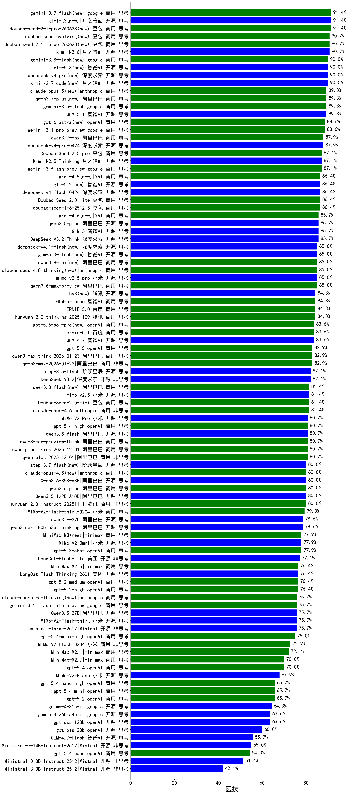

|类别|机构|大模型|【医技】准确率|平均耗时|平均消耗token|花费/千次（元）|排名（准确率）|
|---|---|-----|-------------------|-------|-----------|-----------|-----------|
|商用|百度|ERNIE-4.5-Turbo-32K|92.3%|22s|548|1.6|1|
|商用|google|gemini-3-pro-preview(new)|90.7%|53s|1768|145.3|2|
|商用|google|gemini-3-flash-preview(new)|87.1%|69s|1169|23.6|3|
|开源|月之暗面|Kimi-K2.5-Thinking(new)|87.1%|369s|2048|41.8|4|
|商用|豆包|doubao-seed-1-6-251015|86.4%|10s|689|4.8|5|
|商用|豆包|doubao-seed-1-8-251215(new)|86.4%|25s|657|4.4|6|
|开源|智谱AI|GLM-5(new)|85.7%|92s|1995|34.9|7|
|商用|腾讯|hunyuan-turbos-20250926|85.7%|14s|606|1.1|8|
|商用|豆包|doubao-seed-1-6-thinking-250715|85.7%|26s|1151|8.7|9|
|开源|深度求索|DeepSeek-V3.2-Think(new)|85.7%|101s|1273|3.8|10|
|商用|豆包|doubao-seed-1-6-250615|84.5%|112s|454|2.9|11|
|开源|月之暗面|kimi-k2-0905|84.3%|91s|371|4.8|12|
|商用|腾讯|hunyuan-2.0-thinking-20251109|84.3%|13s|884|3.3|13|
|商用|anthropic|claude-opus-4.5(new)|84.3%|14s|642|98.9|14|
|商用|百度|ERNIE-5.0(new)|84.3%|156s|2031|47.6|15|
|开源|阿里巴巴|Qwen3-32B|83.8%|30s|1168|4.4|16|
|开源|智谱AI|GLM-4.7(new)|83.6%|58s|2247|30.7|17|
|商用|阿里巴巴|qwen3-max-2026-01-23(new)|82.9%|64s|485|4.3|18|
|商用|阿里巴巴|qwen3-max-think-2026-01-23(new)|82.9%|199s|3068|30.1|19|
|商用|豆包|doubao-seed-1-6-lite-251015|82.1%|41s|772|1.6|20|
|开源|智谱AI|GLM-4.6|82.1%|56s|2218|30.2|21|
|开源|深度求索|DeepSeek-V3.2(new)|82.1%|58s|361|1.0|22|
|商用|阿里巴巴|qwen-plus-2025-07-28|82.1%|13s|494|0.9|23|
|开源|阶跃星辰|step-3.5-flash(new)|82.1%|23s|2005|4.1|24|
|商用|百度|ERNIE-X1-Turbo-32K|81.8%|108s|2030|7.9|25|
|开源|百度|ERNIE-4.5-300B-A47B|81.8%|20s|328|2.2|26|
|商用|阿里巴巴|qwen3-max-preview|81.4%|9s|460|9.6|27|
|开源|深度求索|DeepSeek-V3.2-Exp|81.4%|201s|336|0.9|28|
|商用|anthropic|claude-opus-4.6(new)|81.4%|17s|610|91.5|29|
|开源|月之暗面|kimi-k2-0711-preview|81.1%|36s|581|8.5|30|
|商用|google|gemini-2.5-pro|80.9%|33s|2351|165.7|31|
|开源|阿里巴巴|qwen3-235b-a22b-thinking-2507|80.7%|100s|2558|49.8|32|
|商用|阿里巴巴|qwen-plus-2025-12-01(new)|80.7%|22s|852|1.6|33|
|商用|阿里巴巴|qwen3-max-2025-09-23|80.7%|233s|464|9.7|34|
|商用|阿里巴巴|qwen-plus-think-2025-12-01(new)|80.7%|63s|2615|20.4|35|
|开源|深度求索|DeepSeek-V3.1|80.7%|17s|325|3.4|36|
|商用|科大讯飞|xunfei-spark-x1-0725|80.7%|/|1006|12.1|37|
|商用|阿里巴巴|qwen3-max-preview-think(new)|80.7%|161s|2592|60.8|38|
|开源|深度求索|DeepSeek-R1-0528|80.5%|237s|1941|30.2|39|
|商用|腾讯|hunyuan-2.0-instruct-20251111|80.0%|8s|423|0.7|40|
|开源|豆包|Seed-OSS-36B-Instruct|80.0%|112s|2068|8.1|41|
|商用|anthropic|claude-sonnet-4.5-thinking|80.0%|25s|1691|172.0|42|
|商用|豆包|Doubao-1.5-lite-32k-250115|79.7%|3s|189|0.1|43|
|商用|豆包|doubao-seed-1-6-flash-thinking-250615|79.6%|11s|645|0.8|44|
|开源|深度求索|DeepSeek-V3.2-Exp-Think|79.3%|208s|1075|3.2|45|
|商用|小米|MiMo-V2-Flash-think-0204(new)|79.3%|818s|2118|4.3|46|
|开源|阿里巴巴|qwen3-next-80b-a3b-thinking|78.6%|135s|3338|13.1|47|
|开源|阿里巴巴|qwen3-235b-a22b-instruct-2507|78.6%|12s|490|3.4|48|
|商用|腾讯|hunyuan-t1-20250711|78.6%|29s|1955|6.9|49|
|商用|百度|ERNIE-5.0-Thinking-Preview|78.6%|233s|1957|45.8|50|
|开源|月之暗面|Kimi-K2-Thinking|78.6%|157s|2423|37.9|51|
|商用|XAI|grok-4-0709|78.2%|252s|1529|159.3|52|
|开源|深度求索|DeepSeek-V3.1-Think|77.9%|52s|998|11.4|53|
|开源|美团|LongCat-Flash-Lite(new)|77.1%|183s|478|0.0|54|
|开源|阶跃星辰|step-3|77.1%|107s|1884|7.3|55|
|商用|百度|ERNIE-X1.1-Preview|77.1%|109s|779|2.9|56|
|商用|anthropic|claude-sonnet-4.5(new)|77.1%|11s|595|55.3|57|
|开源|智谱AI|GLM-4.5|77.1%|70s|1804|24.5|58|
|商用|豆包|doubao-seed-1-6-flash-250615|77.0%|3s|306|0.4|59|
|商用|阿里巴巴|qwen-long-2025-01-25|76.4%|68s|341|0.6|60|
|商用|阿里巴巴|qwen-plus-think-2025-07-28|76.4%|/|2766|21.6|61|
|商用|minimax|MiniMax-M2.5(new)|76.4%|28s|1375|10.9|62|
|开源|美团|LongCat-Flash-Thinking-2601(new)|76.4%|280s|2514|0.0|63|
|商用|openAI|gpt-5.2-medium(new)|76.4%|8s|372|29.3|64|
|商用|openAI|gpt-5.2-high(new)|76.4%|11s|479|39.9|65|
|开源|阿里巴巴|qwen3-next-80b-a3b-instruct|76.4%|10s|548|2.0|66|
|商用|openAI|gpt-5.1-high|76.4%|115s|1079|71.1|67|
|商用|google|gemini-2.5-flash|76.2%|10s|1769|30.9|68|
|开源|minimax|MiniMax-M1|75.9%|196s|2968|20.5|69|
|开源|阿里巴巴|Qwen3-14B|75.9%|31s|1377|2.6|70|
|开源|Mistral|mistral-large-2512(new)|75.7%|12s|496|4.6|71|
|商用|XAI|grok-4-1-fast-reasoning|75.7%|53s|1390|4.4|72|
|商用|openAI|gpt-5-2025-08-07|75.7%|24s|325|18.3|73|
|开源|meta|Llama-4-Maverick-17B-128E-Instruct-FP8|75.7%|8s|522|2.0|74|
|开源|小米|MiMo-V2-Flash-think(new)|75.7%|77s|2108|0.0|75|
|开源|阿里巴巴|Qwen3-30B-A3B-Thinking-2507|75.4%|71s|2877|7.9|76|
|商用|智谱AI|GLM-4.5-Flash|75.0%|37s|1732|0.0|77|
|商用|anthropic|claude-4-sonnet|73.9%|43s|552|49.7|78|
|商用|anthropic|claude-4-sonnet-thinking|73.9%|50s|1179|117.8|79|
|开源|智谱AI|GLM-4.5-Air|73.6%|36s|1818|10.5|80|
|开源|智谱AI|GLM-4.5-nothink|73.6%|23s|706|9.1|81|
|商用|小米|MiMo-V2-Flash-0204(new)|72.9%|255s|548|1.0|82|
|商用|anthropic|claude-haiku-4.5-thinking|72.9%|39s|2186|74.8|83|
|商用|openAI|gpt-5.1-medium|72.9%|142s|511|30.8|84|
|商用|阿里巴巴|qwen-flash-think-2025-07-28|72.9%|29s|2696|3.9|85|
|开源|minimax|MiniMax-Text-01|72.6%|12s|903|7.2|86|
|商用|阿里巴巴|qwen-flash-2025-07-28|72.1%|11s|526|0.7|87|
|商用|minimax|MiniMax-M2.1(new)|72.1%|109s|1740|14.0|88|
|开源|minimax|MiniMax-M2|71.4%|35s|1741|14.0|89|
|开源|阿里巴巴|Qwen3-32B-nothink|71.4%|48s|529|1.9|90|
|商用|XAI|grok-3-mini|71.1%|210s|1074|3.8|91|
|商用|百川智能|Baichuan4-Turbo|71.0%|/|/|/|92|
|商用|阿里巴巴|qwen-turbo-think-2025-07-15|70.7%|/|2428|7.1|93|
|商用|openAI|gpt-5-mini-2025-08-07|70.7%|60s|854|11.3|94|
|商用|openAI|gpt-5.1|70.0%|179s|209|9.3|95|
|开源|腾讯|Hunyuan-A13B-Instruct|69.6%|59s|1081|4.1|96|
|商用|360|360zhinao2-o1|69.4%|/|/|/|97|
|商用|Mistral|mistral-medium-2508|69.3%|166s|475|5.7|98|
|商用|阿里巴巴|qwen-turbo-2025-07-15|69.3%|8s|359|0.2|99|
|商用|anthropic|claude-haiku-4.5|67.9%|11s|612|18.6|100|
|开源|meta|Llama-4-Scout-17B-16E-Instruct|67.9%|9s|553|1.1|101|
|开源|小米|MiMo-V2-Flash(new)|67.9%|69s|461|0.0|102|
|开源|阿里巴巴|Qwen3-30B-A3B-Instruct-2507|67.1%|4s|557|1.5|103|
|开源|百度|ERNIE-4.5-21B-A3B|66.4%|38s|322|0.0|104|
|商用|openAI|o4-mini|66.1%|32s|952|28.2|105|
|开源|阿里巴巴|Qwen3-8B|65.7%|471s|11601|0.0|106|
|商用|openAI|gpt-5.2(new)|65.7%|5s|210|13.1|107|
|商用|openAI|gpt-5-mini-high|65.7%|462s|2007|28.0|108|
|商用|openAI|gpt-5-nano-2025-08-07|65.0%|48s|1850|5.1|109|
|开源|腾讯|Hunyuan-A13B-Instruct-nothink|64.3%|56s|360|1.2|110|
|开源|阿里巴巴|Qwen3-4B|64.1%|24s|1793|5.2|111|
|开源|openAI|gpt-oss-120b|63.6%|39s|631|1.7|112|
|开源|深度求索|DeepSeek-R1-0528-Qwen3-8B|63.4%|264s|1710|0.0|113|
|商用|openAI|gpt-5-nano-high|62.1%|602s|4132|11.8|114|
|开源|阿里巴巴|Qwen3-14B-nothink|62.1%|17s|549|1.0|115|
|商用|智谱AI|GLM-4.5-Flash-nothink|62.1%|18s|936|0.0|116|
|开源|智谱AI|GLM-4.5-Air-nothink|62.1%|15s|927|5.2|117|
|开源|openAI|gpt-oss-20b|60.0%|45s|1114|1.2|118|
|开源|阿里巴巴|Qwen3-8B-nothink|59.3%|51s|516|0.0|119|
|开源|Mistral|Magistral-Small-2507|58.6%|240s|5623|60.4|120|
|商用|google|gemini-2.5-flash-lite|56.4%|8s|1938|5.5|121|
|开源|智谱AI|GLM-4.7-Flash(new)|55.7%|1080s|3270|0.0|122|
|开源|智谱AI|GLM-4-9B-0414|55.4%|10s|443|0.0|123|
|商用|百川智能|Baichuan4-Air|55.3%|/|/|/|124|
|开源|Mistral|Ministral-3-14B-Instruct-2512(new)|55.0%|9s|553|0.8|125|
|开源|阿里巴巴|Qwen3-4B-nothink|53.6%|20s|477|1.2|126|
|开源|阿里巴巴|Qwen3-1.7B|52.0%|22s|2240|6.5|127|
|开源|Mistral|Ministral-3-8B-Instruct-2512(new)|51.4%|9s|588|0.6|128|
|开源|Mistral|Mistral-Small-3.2-24B-Instruct-2506|50.7%|185s|503|0.9|129|
|商用|XAI|grok-4-1-fast-non-reasoning|50.0%|64s|627|1.7|130|
|开源|google|gemma-3-27b-it|48.2%|/|/|/|131|
|商用|百度|ERNIE-Lite-8K|43.2%|/|/|/|132|
|开源|Mistral|Ministral-3-3B-Instruct-2512(new)|42.1%|9s|670|0.5|133|
|开源|google|gemma-3-12b-it|41.6%|/|/|/|134|
|开源|阿里巴巴|Qwen3-1.7B-nothink|40.0%|13s|463|1.2|135|
|开源|阿里巴巴|Qwen3-0.6B-nothink|36.4%|9s|240|0.5|136|
|开源|阿里巴巴|Qwen3-0.6B|35.4%|9s|1235|3.5|137|
|开源|google|gemma-3-4b-it|34.1%|/|/|/|138|
|开源|百度|ERNIE-4.5-0.3B|24.1%|38s|382|0.0|139|

