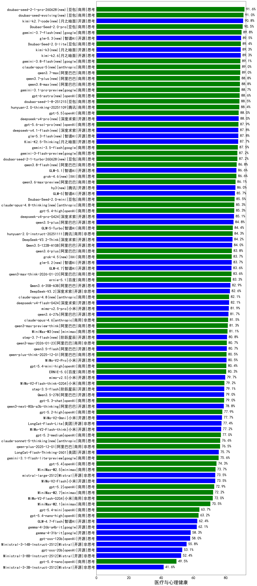

|类别|机构|大模型|【医疗与心理健康】准确率|平均耗时|平均消耗token|花费/千次（元）|排名（准确率）|
|---|---|-----|-------------------|-------|-----------|-----------|-----------|
|商用|百度|ERNIE-4.5-Turbo-32K|91.6%|21s|535|1.6|1|
|商用|豆包|Doubao-Seed-2.0-pro(new)|90.5%|223s|1003|14.6|2|
|商用|豆包|Doubao-Seed-2.0-lite(new)|89.4%|182s|859|2.8|3|
|商用|google|gemini-3.1-pro-preview(new)|88.7%|40s|1529|125.3|4|
|商用|豆包|doubao-seed-1-8-251215|88.5%|25s|647|4.4|5|
|商用|腾讯|hunyuan-2.0-thinking-20251109|88.4%|12s|824|3.1|6|
|开源|月之暗面|Kimi-K2.5-Thinking|87.7%|319s|1688|34.3|7|
|商用|豆包|doubao-seed-1-6-251015|87.6%|32s|687|4.8|8|
|商用|google|gemini-3-flash-preview|87.2%|67s|1149|23.2|9|
|商用|豆包|doubao-seed-1-6-lite-251015|86.7%|48s|749|1.6|10|
|开源|智谱AI|GLM-5.1(new)|86.6%|145s|1555|36.1|11|
|商用|腾讯|hunyuan-turbos-20250926|86.1%|13s|577|1.0|12|
|商用|阿里巴巴|qwen3.6-max-preview(new)|86.1%|48s|1562|81.2|13|
|开源|智谱AI|GLM-5(new)|85.7%|87s|1928|33.8|14|
|商用|豆包|Doubao-Seed-2.0-mini(new)|85.5%|344s|2079|4.0|15|
|商用|openAI|gpt-5.4-high(new)|85.3%|14s|684|64.6|16|
|开源|阿里巴巴|qwen3.5-plus(new)|84.8%|33s|2657|12.5|17|
|商用|智谱AI|GLM-5-Turbo(new)|84.4%|43s|1504|32.0|18|
|商用|腾讯|hunyuan-2.0-instruct-20251111|84.3%|7s|401|0.7|19|
|开源|深度求索|DeepSeek-V3.2-Think|84.2%|103s|1109|3.3|20|
|开源|阿里巴巴|Qwen3.5-122B-A10B(new)|84.0%|242s|2899|18.2|21|
|商用|阿里巴巴|qwen3.6-plus(new)|83.8%|36s|1565|18.1|22|
|开源|智谱AI|GLM-4.7|83.6%|54s|2099|28.7|23|
|商用|阿里巴巴|qwen3-max-think-2026-01-23|83.6%|159s|2862|28.0|24|
|开源|阿里巴巴|Qwen3.6-35B-A3B(new)|82.9%|67s|1789|18.7|25|
|商用|腾讯|hunyuan-t1-20250711|82.9%|27s|1656|6.2|26|
|商用|百度|ERNIE-X1-Turbo-32K|82.8%|100s|1915|7.5|27|
|商用|anthropic|claude-opus-4.5|82.8%|14s|663|103.3|28|
|商用|阿里巴巴|qwen3-max-preview|82.8%|9s|456|9.5|29|
|开源|阿里巴巴|qwen3-235b-a22b-instruct-2507|82.7%|11s|489|3.5|30|
|开源|深度求索|DeepSeek-V3.2|82.6%|63s|343|1.0|31|
|开源|豆包|Seed-OSS-36B-Instruct|82.5%|102s|1790|7.0|32|
|开源|月之暗面|kimi-k2-0905|82.1%|80s|347|4.5|33|
|商用|anthropic|claude-opus-4.6|81.5%|15s|609|92.0|34|
|商用|阿里巴巴|qwen3-max-preview-think|81.3%|152s|2350|55.0|35|
|开源|阿里巴巴|qwen3-next-80b-a3b-instruct|80.8%|9s|529|1.9|36|
|商用|阿里巴巴|qwen3-max-2026-01-23|80.7%|79s|501|4.5|37|
|开源|阿里巴巴|qwen3.5-flash(new)|80.7%|260s|3186|6.2|38|
|开源|深度求索|DeepSeek-R1-0528|80.7%|225s|1831|28.5|39|
|商用|阿里巴巴|qwen-plus-think-2025-12-01|80.5%|56s|2385|18.5|40|
|商用|小米|MiMo-V2-Pro(new)|80.5%|240s|1120|19.1|41|
|开源|深度求索|DeepSeek-V3.1-Think|80.5%|51s|994|11.4|42|
|商用|openAI|gpt-5.4-mini-high(new)|80.4%|49s|932|27.2|43|
|商用|百度|ERNIE-5.0|80.3%|167s|1981|46.5|44|
|商用|阿里巴巴|qwen3-max-2025-09-23|80.1%|215s|489|10.4|45|
|开源|阿里巴巴|Qwen3-32B|79.9%|56s|1622|6.3|46|
|开源|阿里巴巴|qwen3-235b-a22b-thinking-2507|79.5%|91s|2424|46.8|47|
|商用|小米|MiMo-V2-Flash-think-0204(new)|79.2%|668s|1916|3.9|48|
|开源|阶跃星辰|step-3.5-flash|79.1%|21s|1865|3.8|49|
|商用|anthropic|claude-sonnet-4.5-thinking|79.1%|23s|1620|164.6|50|
|开源|深度求索|DeepSeek-V3.1|79.1%|17s|334|3.5|51|
|开源|阿里巴巴|Qwen3.5-27B(new)|79.0%|279s|3101|14.6|52|
|商用|openAI|gpt-5.3-chat(new)|79.0%|23s|380|30.1|53|
|开源|阿里巴巴|qwen3-next-80b-a3b-thinking|78.8%|123s|3184|12.5|54|
|商用|openAI|gpt-5.2-high|77.9%|11s|477|40.1|55|
|商用|google|gemini-2.5-pro|77.8%|35s|2315|163.4|56|
|开源|月之暗面|Kimi-K2-Thinking|77.7%|159s|2440|38.3|57|
|商用|小米|MiMo-V2-Omni(new)|77.7%|206s|1312|14.8|58|
|商用|百度|ERNIE-X1.1-Preview|77.6%|113s|768|2.9|59|
|商用|openAI|gpt-5.1-high|77.6%|93s|1052|69.5|60|
|开源|美团|LongCat-Flash-Lite(new)|77.4%|199s|490|0.0|61|
|商用|openAI|gpt-5.1-medium|77.3%|150s|501|30.4|62|
|开源|小米|MiMo-V2-Flash-think|77.2%|79s|2019|0.0|63|
|商用|openAI|gpt-5.2-medium|77.0%|8s|361|28.7|64|
|商用|anthropic|claude-sonnet-4.5(new)|76.6%|11s|597|55.9|65|
|商用|阿里巴巴|qwen-plus-2025-12-01|76.5%|21s|820|1.6|66|
|商用|百度|ERNIE-5.0-Thinking-Preview|76.0%|226s|1749|40.9|67|
|开源|美团|LongCat-Flash-Thinking-2601|75.7%|167s|2238|0.0|68|
|商用|google|gemini-3.1-flash-lite-preview(new)|75.6%|9s|359|3.2|69|
|商用|openAI|gpt-5-2025-08-07|75.6%|25s|308|17.4|70|
|开源|阿里巴巴|Qwen3-14B|75.6%|55s|2100|4.1|71|
|商用|openAI|gpt-5.4(new)|74.3%|7s|275|21.6|72|
|商用|百川智能|Baichuan4-Turbo|74.3%|/|/|/|73|
|商用|minimax|MiniMax-M2.5(new)|73.7%|26s|1333|10.6|74|
|开源|阿里巴巴|Qwen3-30B-A3B-Instruct-2507|73.6%|4s|532|1.4|75|
|开源|Mistral|mistral-large-2512|73.5%|11s|487|4.5|76|
|开源|小米|MiMo-V2-Flash|73.5%|70s|439|0.0|77|
|开源|智谱AI|GLM-4.5-Air|73.4%|31s|1605|9.2|78|
|商用|智谱AI|GLM-4.5-Flash|73.3%|29s|1556|0.0|79|
|商用|openAI|gpt-5.2|72.9%|5s|199|12.5|80|
|商用|阿里巴巴|qwen-flash-2025-07-28|72.6%|8s|520|0.7|81|
|商用|minimax|MiniMax-M2.7(new)|72.2%|37s|1520|12.2|82|
|商用|google|gemini-2.5-flash|72.1%|10s|1723|30.1|83|
|商用|小米|MiMo-V2-Flash-0204(new)|72.0%|224s|510|0.9|84|
|开源|阿里巴巴|Qwen3-32B-nothink|71.6%|53s|510|1.8|85|
|商用|阿里巴巴|qwen-flash-think-2025-07-28|70.8%|26s|2554|3.7|86|
|商用|anthropic|claude-4-sonnet|70.7%|42s|551|49.9|87|
|开源|阿里巴巴|Qwen3-30B-A3B-Thinking-2507|70.6%|67s|2713|7.4|88|
|商用|阿里巴巴|qwen-turbo-think-2025-07-15|70.5%|/|2153|6.2|89|
|商用|anthropic|claude-4-sonnet-thinking|70.5%|34s|563|52.3|90|
|商用|minimax|MiniMax-M2.1|70.5%|95s|1938|15.7|91|
|商用|XAI|grok-4-1-fast-reasoning|70.3%|56s|1217|3.8|92|
|商用|anthropic|claude-haiku-4.5-thinking|70.0%|34s|2349|80.9|93|
|商用|阿里巴巴|qwen-turbo-2025-07-15|69.6%|7s|359|0.2|94|
|开源|阿里巴巴|Qwen3-14B-nothink|67.7%|15s|534|1.0|95|
|开源|阿里巴巴|Qwen3-8B|67.5%|337s|8700|0.0|96|
|开源|meta|Llama-4-Scout-17B-16E-Instruct|65.7%|10s|533|1.0|97|
|商用|智谱AI|GLM-4.5-Flash-nothink|65.2%|19s|934|0.0|98|
|开源|阿里巴巴|Qwen3-4B|64.8%|36s|1731|5.0|99|
|商用|openAI|gpt-5.1|64.2%|208s|209|9.6|100|
|商用|openAI|gpt-5.4-mini(new)|63.7%|32s|234|5.2|101|
|开源|智谱AI|GLM-4.5-Air-nothink|63.5%|15s|942|5.3|102|
|商用|openAI|gpt-5.4-nano-high(new)|63.2%|36s|535|4.1|103|
|商用|anthropic|claude-haiku-4.5|63.1%|11s|607|18.6|104|
|开源|智谱AI|GLM-4.7-Flash|62.4%|1087s|4362|0.0|105|
|开源|google|gemma-4-26b-a4b-it(new)|62.1%|59s|570|1.4|106|
|商用|openAI|o4-mini|60.4%|31s|943|28.1|107|
|开源|阿里巴巴|Qwen3-8B-nothink|60.4%|48s|492|0.0|108|
|商用|openAI|gpt-5-nano-high|58.9%|484s|4216|12.0|109|
|商用|openAI|gpt-5-nano-2025-08-07|58.8%|60s|1845|5.1|110|
|开源|智谱AI|GLM-4-9B-0414|58.4%|10s|441|0.0|111|
|开源|google|gemma-4-31b-it(new)|58.3%|81s|517|1.3|112|
|开源|openAI|gpt-oss-120b|58.0%|35s|635|1.7|113|
|商用|openAI|gpt-5-mini-high|56.6%|522s|2032|28.4|114|
|商用|openAI|gpt-5-mini-2025-08-07|55.8%|48s|921|12.3|115|
|开源|Mistral|Ministral-3-14B-Instruct-2512|55.8%|10s|599|0.9|116|
|开源|阿里巴巴|Qwen3-4B-nothink|54.6%|16s|433|1.1|117|
|商用|google|gemini-2.5-flash-lite|54.2%|5s|1110|3.1|118|
|开源|openAI|gpt-oss-20b|53.1%|50s|1189|1.3|119|
|开源|Mistral|Ministral-3-8B-Instruct-2512|52.4%|9s|575|0.6|120|
|商用|XAI|grok-4-1-fast-non-reasoning|51.4%|54s|629|1.7|121|
|商用|openAI|gpt-5.4-nano(new)|49.5%|27s|230|1.4|122|
|开源|Mistral|Ministral-3-3B-Instruct-2512|41.6%|9s|929|0.7|123|

