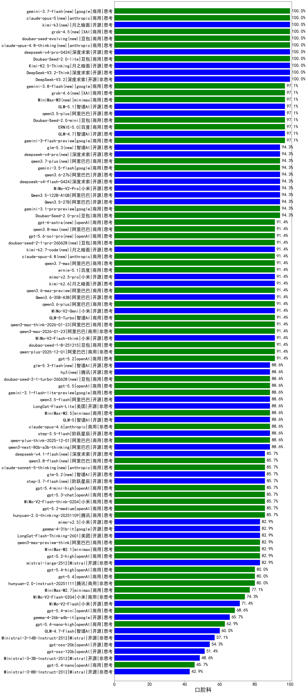

|类别|机构|大模型|【口腔科】准确率|平均耗时|平均消耗token|花费/千次（元）|排名（准确率）|
|---|---|-----|-------------------|-------|-----------|-----------|-----------|
|商用|豆包|Doubao-Seed-2.0-lite(new)|100.0%|237s|1041|3.4|1|
|开源|深度求索|DeepSeek-V3.2|100.0%|69s|392|1.1|2|
|商用|google|gemini-3-pro-preview|100.0%|51s|1818|149.0|3|
|开源|月之暗面|Kimi-K2.5-Thinking|100.0%|332s|1647|33.2|4|
|开源|深度求索|DeepSeek-V3.2-Think|100.0%|63s|1143|3.3|5|
|商用|豆包|Doubao-Seed-2.0-mini(new)|97.1%|283s|1675|3.1|6|
|开源|智谱AI|GLM-4.7|97.1%|60s|2221|30.2|7|
|商用|豆包|doubao-seed-1-6-251015|97.1%|62s|752|5.2|8|
|开源|阿里巴巴|qwen3.5-plus(new)|97.1%|29s|2484|11.6|9|
|开源|深度求索|DeepSeek-V3.2-Exp-Think|97.1%|174s|1066|3.1|10|
|商用|google|gemini-3-flash-preview|97.1%|43s|1457|29.6|11|
|商用|百度|ERNIE-4.5-Turbo-32K|95.0%|22s|565|1.7|12|
|开源|智谱AI|GLM-4.6|94.3%|49s|2316|31.5|13|
|商用|腾讯|hunyuan-t1-20250711|94.3%|22s|1382|5.2|14|
|开源|深度求索|DeepSeek-V3.2-Exp|94.3%|174s|396|1.1|15|
|商用|anthropic|claude-sonnet-4.5-thinking|94.3%|27s|1913|194.5|16|
|开源|阿里巴巴|qwen3-next-80b-a3b-instruct|94.3%|10s|618|2.2|17|
|商用|阿里巴巴|qwen3-max-2025-09-23|94.3%|246s|513|10.7|18|
|商用|阿里巴巴|qwen-plus-think-2025-07-28|94.3%|/|2163|16.7|19|
|开源|深度求索|DeepSeek-V3.1-Think|94.3%|49s|972|11.0|20|
|商用|豆包|Doubao-Seed-2.0-pro(new)|94.3%|189s|895|12.7|21|
|商用|小米|MiMo-V2-Pro(new)|94.3%|153s|1069|17.9|22|
|开源|阿里巴巴|Qwen3.5-122B-A10B(new)|94.3%|299s|2568|16.0|23|
|开源|阿里巴巴|Qwen3.5-27B(new)|94.3%|231s|2836|13.2|24|
|商用|google|gemini-3.1-pro-preview(new)|94.3%|42s|1607|131.0|25|
|开源|智谱AI|GLM-4.5|94.3%|69s|1850|25.0|26|
|商用|豆包|doubao-seed-1-6-250615|92.9%|97s|443|2.8|27|
|商用|openAI|gpt-5.2|91.4%|5s|225|13.6|28|
|开源|豆包|Seed-OSS-36B-Instruct|91.4%|95s|1576|6.1|29|
|商用|智谱AI|GLM-5-Turbo(new)|91.4%|43s|1703|36.1|30|
|商用|豆包|doubao-seed-1-6-lite-251015|91.4%|51s|912|2.0|31|
|开源|月之暗面|Kimi-K2-Thinking|91.4%|203s|3578|56.3|32|
|商用|阿里巴巴|qwen3-max-think-2026-01-23|91.4%|197s|3041|29.7|33|
|商用|anthropic|claude-sonnet-4.5(new)|91.4%|12s|683|63.3|34|
|商用|阿里巴巴|qwen3-max-2026-01-23|91.4%|73s|492|4.3|35|
|开源|小米|MiMo-V2-Flash-think|91.4%|81s|2015|0.0|36|
|商用|豆包|doubao-seed-1-8-251215|91.4%|25s|744|5.1|37|
|商用|阿里巴巴|qwen-plus-2025-12-01|91.4%|22s|840|1.6|38|
|商用|小米|MiMo-V2-Omni(new)|91.4%|246s|1517|17.5|39|
|开源|阿里巴巴|qwen3-235b-a22b-instruct-2507|91.4%|12s|510|3.6|40|
|商用|百度|ERNIE-X1-Turbo-32K|90.7%|103s|1993|7.8|41|
|商用|openAI|gpt-5.1-medium|88.6%|152s|769|48.3|42|
|商用|google|gemini-3.1-flash-lite-preview(new)|88.6%|14s|412|3.6|43|
|开源|智谱AI|GLM-5(new)|88.6%|74s|2207|38.6|44|
|商用|minimax|MiniMax-M2.5(new)|88.6%|24s|1204|9.4|45|
|开源|美团|LongCat-Flash-Lite(new)|88.6%|264s|717|0.0|46|
|商用|阿里巴巴|qwen-plus-think-2025-12-01|88.6%|69s|2206|17.0|47|
|开源|阿里巴巴|qwen3.5-flash(new)|88.6%|283s|2975|5.8|48|
|商用|anthropic|claude-opus-4.5|88.6%|15s|672|101.8|49|
|开源|阶跃星辰|step-3.5-flash|88.6%|23s|1980|4.0|50|
|商用|腾讯|hunyuan-turbos-20250926|88.6%|14s|630|1.1|51|
|开源|阿里巴巴|qwen3-235b-a22b-thinking-2507|88.6%|100s|2267|43.8|52|
|商用|anthropic|claude-opus-4.6|88.6%|17s|697|104.5|53|
|开源|智谱AI|GLM-4.5-nothink|88.6%|27s|868|11.2|54|
|开源|深度求索|DeepSeek-R1-0528|87.9%|236s|1915|29.7|55|
|商用|openAI|gpt-5.3-chat(new)|85.7%|34s|432|33.7|56|
|商用|阿里巴巴|qwen-plus-2025-07-28|85.7%|12s|515|0.9|57|
|商用|腾讯|hunyuan-2.0-thinking-20251109|85.7%|21s|725|2.7|58|
|商用|小米|MiMo-V2-Flash-think-0204(new)|85.7%|753s|1961|4.0|59|
|商用|百度|ERNIE-5.0-Thinking-Preview|85.7%|226s|1683|39.1|60|
|商用|百度|ERNIE-X1.1-Preview|85.7%|106s|679|2.5|61|
|开源|百度|ERNIE-4.5-300B-A47B|85.7%|19s|318|2.1|62|
|开源|minimax|MiniMax-M2|85.7%|43s|1795|14.4|63|
|商用|阿里巴巴|qwen3-max-preview|85.7%|12s|496|10.3|64|
|商用|openAI|gpt-5.1-high|85.7%|51s|1914|129.6|65|
|开源|深度求索|DeepSeek-V3.1|85.7%|19s|388|4.0|66|
|商用|openAI|gpt-5-2025-08-07|85.7%|23s|376|21.3|67|
|商用|科大讯飞|xunfei-spark-x1-0725|82.9%|/|888|10.7|68|
|商用|anthropic|claude-4-sonnet|82.9%|43s|557|49.5|69|
|商用|anthropic|claude-4-sonnet-thinking|82.9%|50s|1172|116.5|70|
|商用|阿里巴巴|qwen-flash-think-2025-07-28|82.9%|25s|2562|3.7|71|
|商用|minimax|MiniMax-M2.1|82.9%|96s|1936|15.5|72|
|商用|google|gemini-2.5-pro|82.9%|35s|2258|158.9|73|
|开源|月之暗面|kimi-k2-0905|82.9%|102s|398|5.1|74|
|商用|openAI|gpt-5.1|82.9%|133s|253|11.7|75|
|商用|阿里巴巴|qwen3-max-preview-think|82.9%|139s|2411|56.3|76|
|开源|阿里巴巴|Qwen3-32B|81.4%|35s|1363|5.2|77|
|商用|豆包|doubao-seed-1-6-flash-250615|81.4%|4s|315|0.4|78|
|商用|豆包|doubao-seed-1-6-flash-thinking-250615|80.0%|6s|506|0.6|79|
|开源|meta|Llama-4-Maverick-17B-128E-Instruct-FP8|80.0%|8s|536|2.1|80|
|商用|腾讯|hunyuan-2.0-instruct-20251111|80.0%|10s|459|0.8|81|
|开源|阿里巴巴|Qwen3-32B-nothink|80.0%|22s|553|1.9|82|
|商用|openAI|gpt-5.4(new)|80.0%|9s|342|27.1|83|
|开源|美团|LongCat-Flash-Thinking-2601|80.0%|315s|3057|0.0|84|
|商用|openAI|gpt-5.4-high(new)|80.0%|20s|1013|97.5|85|
|商用|XAI|grok-4-0709|80.0%|240s|1728|180.6|86|
|商用|XAI|grok-4-1-fast-reasoning|77.1%|47s|1491|4.8|87|
|开源|阿里巴巴|Qwen3-30B-A3B-Instruct-2507|77.1%|5s|681|1.8|88|
|商用|智谱AI|GLM-4.5-Flash|77.1%|31s|1640|0.0|89|
|开源|智谱AI|GLM-4.5-Air|77.1%|39s|1949|11.3|90|
|商用|阿里巴巴|qwen-turbo-think-2025-07-15|77.1%|/|2604|7.6|91|
|开源|阿里巴巴|Qwen3-30B-A3B-Thinking-2507|75.7%|59s|2482|6.8|92|
|商用|百川智能|Baichuan4-Turbo|75.0%|/|/|/|93|
|商用|小米|MiMo-V2-Flash-0204(new)|74.3%|270s|573|1.1|94|
|商用|智谱AI|GLM-4.5-Flash-nothink|74.3%|22s|1093|0.0|95|
|商用|Mistral|mistral-medium-2508|74.3%|99s|573|7.0|96|
|开源|阶跃星辰|step-3|74.3%|98s|1936|7.5|97|
|商用|google|gemini-2.5-flash|73.6%|11s|1768|30.8|98|
|开源|阿里巴巴|Qwen3-14B|72.9%|40s|1721|3.3|99|
|开源|智谱AI|GLM-4.5-Air-nothink|71.4%|16s|1040|5.8|100|
|开源|阿里巴巴|Qwen3-14B-nothink|71.4%|16s|628|1.1|101|
|开源|腾讯|Hunyuan-A13B-Instruct-nothink|71.4%|186s|413|1.4|102|
|商用|阿里巴巴|qwen-flash-2025-07-28|71.4%|8s|657|0.9|103|
|开源|小米|MiMo-V2-Flash|71.4%|94s|481|0.0|104|
|商用|XAI|grok-3-mini|70.0%|191s|1132|4.0|105|
|开源|百度|ERNIE-4.5-21B-A3B|69.3%|20s|319|0.0|106|
|开源|meta|Llama-4-Scout-17B-16E-Instruct|69.3%|11s|594|1.2|107|
|商用|阿里巴巴|qwen-turbo-2025-07-15|68.6%|7s|399|0.2|108|
|商用|openAI|gpt-5-mini-2025-08-07|68.6%|57s|1136|15.2|109|
|商用|openAI|gpt-5-nano-high|68.6%|497s|5414|15.4|110|
|开源|腾讯|Hunyuan-A13B-Instruct|67.1%|82s|1186|4.5|111|
|商用|openAI|gpt-5-mini-high|65.7%|535s|2827|39.7|112|
|商用|anthropic|claude-haiku-4.5-thinking|65.7%|43s|2936|101.5|113|
|商用|openAI|gpt-5-nano-2025-08-07|60.0%|46s|2308|6.4|114|
|商用|openAI|o4-mini|60.0%|34s|1123|33.6|115|
|开源|智谱AI|GLM-4.7-Flash|60.0%|1618s|3296|0.0|116|
|商用|anthropic|claude-haiku-4.5|60.0%|11s|663|20.0|117|
|开源|Mistral|Mistral-Small-3.2-24B-Instruct-2506|60.0%|386s|689|1.3|118|
|开源|深度求索|DeepSeek-R1-0528-Qwen3-8B|59.3%|249s|1759|0.0|119|
|开源|Mistral|Ministral-3-14B-Instruct-2512|57.1%|7s|674|1.0|120|
|开源|阿里巴巴|Qwen3-4B-nothink|57.1%|19s|494|1.2|121|
|商用|google|gemini-2.5-flash-lite|57.1%|3s|614|1.6|122|
|开源|阿里巴巴|Qwen3-1.7B-nothink|54.3%|11s|514|1.3|123|
|商用|XAI|grok-4-1-fast-non-reasoning|54.3%|51s|658|1.8|124|
|开源|openAI|gpt-oss-20b|54.3%|112s|1424|1.5|125|
|开源|阿里巴巴|Qwen3-8B|53.6%|487s|14089|0.0|126|
|开源|阿里巴巴|Qwen3-4B|52.1%|24s|1949|5.6|127|
|开源|阿里巴巴|Qwen3-8B-nothink|51.4%|44s|520|0.0|128|
|开源|openAI|gpt-oss-120b|51.4%|9s|777|2.1|129|
|开源|智谱AI|GLM-4-9B-0414|50.0%|11s|459|0.0|130|
|开源|阿里巴巴|Qwen3-1.7B|47.9%|25s|2155|6.2|131|
|开源|google|gemma-3-27b-it|45.7%|/|/|/|132|
|开源|Mistral|Ministral-3-8B-Instruct-2512|42.9%|12s|707|0.8|133|
|商用|百川智能|Baichuan4-Air|40.7%|/|/|/|134|
|开源|google|gemma-3-12b-it|40.7%|/|/|/|135|
|开源|阿里巴巴|Qwen3-0.6B|35.7%|7s|1187|3.3|136|
|开源|google|gemma-3-4b-it|32.9%|/|/|/|137|
|开源|百度|ERNIE-4.5-0.3B|30.0%|34s|381|0.0|138|
|开源|阿里巴巴|Qwen3-0.6B-nothink|28.6%|9s|263|0.5|139|
|开源|阿里巴巴|qwen3-next-80b-a3b-thinking|/%|146s|3070|12.0|140|
|商用|openAI|gpt-5.2-high|/%|13s|699|60.7|141|
|开源|Mistral|mistral-large-2512|/%|14s|571|5.3|142|
|商用|百度|ERNIE-5.0|/%|156s|1698|39.4|143|
|商用|openAI|gpt-5.4-mini(new)|/%|49s|270|5.9|144|
|商用|openAI|gpt-5.4-mini-high(new)|/%|79s|1530|45.6|145|
|商用|openAI|gpt-5.4-nano(new)|/%|12s|277|1.7|146|
|商用|openAI|gpt-5.4-nano-high(new)|/%|29s|799|6.2|147|
|商用|minimax|MiniMax-M2.7(new)|/%|60s|2440|19.8|148|
|开源|Mistral|Ministral-3-3B-Instruct-2512|/%|10s|733|0.5|149|
|商用|openAI|gpt-5.2-medium|/%|11s|494|40.3|150|

