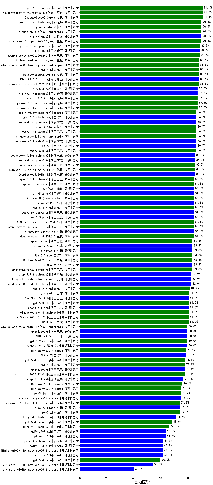

|类别|机构|大模型|【基础医学】准确率|平均耗时|平均消耗token|花费/千次（元）|排名（准确率）|
|---|---|-----|-------------------|-------|-----------|-----------|-----------|
|商用|豆包|Doubao-Seed-2.0-pro|91.4%|239s|1066|15.8|1|
|商用|豆包|doubao-seed-2-1-turbo-260628(new)|91.4%|203s|6361|94.2|2|
|商用|google|gemini-3.7-flash(new)|90.5%|6s|787|19.4|3|
|商用|XAI|grok-4.6(new)|90.5%|30s|1216|43.8|4|
|商用|anthropic|claude-opus-5(new)|90.5%|14s|644|100.1|5|
|开源|月之暗面|kimi-k3(new)|90.5%|33s|608|49.9|6|
|商用|豆包|doubao-seed-2-1-pro-260628(new)|90.5%|247s|7289|216.3|7|
|商用|openAI|gpt-5.6-sol-pro(new)|89.5%|38s|2964|219.4|8|
|商用|阿里巴巴|qwen-plus-think-2025-12-01|89.5%|53s|2280|17.8|9|
|开源|月之暗面|kimi-k2.6|89.5%|76s|1497|39.2|10|
|开源|月之暗面|Kimi-K2.5-Thinking|88.6%|346s|1892|38.8|11|
|商用|anthropic|claude-opus-4.8-thinking(new)|88.6%|13s|682|106.8|12|
|商用|豆包|doubao-seed-evolving(new)|88.6%|225s|7407|219.9|13|
|商用|豆包|Doubao-Seed-2.0-lite|88.6%|198s|909|3.0|14|
|商用|豆包|doubao-seed-1-6-251015|88.6%|44s|676|4.8|15|
|商用|openAI|gpt-5.5|88.6%|8s|386|68.0|16|
|商用|腾讯|hunyuan-2.0-instruct-20251111|88.6%|7s|411|0.7|17|
|开源|月之暗面|kimi-k2.7-code(new)|87.6%|32s|749|19.0|18|
|商用|google|gemini-3.5-flash|87.6%|9s|1269|76.8|19|
|商用|google|gemini-3-flash-preview|87.6%|47s|1111|22.6|20|
|商用|google|gemini-3.1-pro-preview|87.6%|55s|1387|114.0|21|
|商用|阿里巴巴|qwen3.6-plus|86.7%|36s|1493|17.3|22|
|商用|XAI|grok-4.5(new)|86.7%|93s|1327|48.5|23|
|商用|阿里巴巴|qwen3.7-plus(new)|86.7%|22s|1106|8.5|24|
|开源|深度求索|deepseek-v4-flash-0424|86.7%|31s|943|1.8|25|
|商用|anthropic|claude-opus-4.8(new)|86.7%|10s|569|87.0|26|
|商用|百度|ERNIE-X1.1-Preview|86.7%|129s|971|3.7|27|
|开源|深度求索|deepseek-v4-pro(new)|86.7%|149s|944|23.1|28|
|开源|智谱AI|GLM-5.1|86.7%|163s|1400|32.5|29|
|商用|阿里巴巴|qwen3.6-max-preview|85.7%|47s|1491|77.7|30|
|商用|腾讯|hunyuan-2.0-thinking-20251109|85.7%|11s|892|3.4|31|
|开源|深度求索|DeepSeek-V3.2-Think|85.7%|102s|1255|3.7|32|
|开源|深度求索|deepseek-v4-pro-0424|85.7%|37s|900|20.9|33|
|商用|阿里巴巴|qwen3-max-preview|85.7%|10s|456|9.8|34|
|开源|月之暗面|Kimi-K2-Thinking|85.7%|166s|2706|42.6|35|
|商用|豆包|doubao-seed-1-6-lite-251015|85.7%|62s|770|1.7|36|
|商用|阿里巴巴|qwen3.8-max(new)|84.8%|20s|746|24.5|37|
|开源|阿里巴巴|qwen3.5-plus|84.8%|33s|2672|12.6|38|
|开源|腾讯|hy3(new)|84.8%|87s|231|0.7|39|
|商用|阿里巴巴|qwen3-max-think-2026-01-23|84.8%|185s|2732|26.8|40|
|开源|阿里巴巴|Qwen3.5-122B-A10B|84.8%|272s|2871|18.0|41|
|商用|openAI|gpt-5.4-high|84.8%|13s|633|59.9|42|
|开源|小米|MiMo-V2-Pro|84.8%|107s|1098|18.8|43|
|开源|小米|MiMo-V2-Flash-think|84.8%|122s|1829|0.0|44|
|商用|豆包|doubao-seed-1-8-251215|84.8%|27s|674|4.7|45|
|商用|小米|MiMo-V2-Flash-think-0204|84.8%|563s|1623|3.3|46|
|开源|智谱AI|glm-5.2(new)|84.8%|39s|1418|38.4|47|
|商用|minimax|MiniMax-M3(new)|84.8%|23s|655|8.2|48|
|开源|智谱AI|GLM-5|83.8%|98s|1875|32.9|49|
|开源|豆包|Seed-OSS-36B-Instruct|83.8%|90s|1881|7.4|50|
|商用|豆包|Doubao-Seed-2.0-mini|83.8%|299s|2085|4.0|51|
|商用|阿里巴巴|qwen3.7-max|83.8%|23s|1043|36.1|52|
|商用|智谱AI|GLM-5-Turbo|83.8%|44s|1293|27.5|53|
|商用|阿里巴巴|qwen3-max-preview-think|83.8%|153s|2234|52.4|54|
|开源|小米|mimo-v2.5-pro|83.8%|20s|1169|20.2|55|
|开源|小米|mimo-v2.5|83.8%|55s|1343|15.4|56|
|商用|百度|ERNIE-5.0-Thinking-Preview|82.9%|239s|1932|45.5|57|
|开源|月之暗面|kimi-k2-0905|82.9%|72s|354|4.7|58|
|开源|美团|LongCat-Flash-Thinking-2601|82.9%|150s|2076|0.0|59|
|开源|阿里巴巴|qwen3-next-80b-a3b-thinking|82.9%|112s|3092|12.2|60|
|开源|阶跃星辰|step-3.7-flash(new)|82.9%|42s|2696|21.4|61|
|商用|openAI|gpt-5.1-medium|82.9%|136s|436|26.3|62|
|开源|深度求索|DeepSeek-V3.1|81.9%|19s|332|3.5|63|
|商用|openAI|gpt-5.2-high|81.9%|9s|424|35.7|64|
|商用|openAI|gpt-5.3-chat|81.0%|19s|367|29.6|65|
|开源|阿里巴巴|qwen3.5-flash|81.0%|298s|3173|6.2|66|
|开源|阿里巴巴|Qwen3.6-35B-A3B|81.0%|85s|2386|25.2|67|
|商用|百度|ernie-5.1|81.0%|31s|912|15.7|68|
|商用|anthropic|claude-opus-4.6|81.0%|16s|614|94.8|69|
|商用|阿里巴巴|qwen3-max-2026-01-23|81.0%|63s|508|4.6|70|
|商用|百度|ERNIE-5.0|81.0%|169s|2032|47.9|71|
|开源|深度求索|DeepSeek-V3.1-Think|81.0%|53s|1021|11.8|72|
|商用|腾讯|hunyuan-turbos-20250926|81.0%|15s|624|1.1|73|
|开源|阿里巴巴|qwen3-next-80b-a3b-instruct|81.0%|11s|535|1.9|74|
|开源|小米|MiMo-V2-Omni|80.0%|227s|1262|14.2|75|
|商用|anthropic|claude-sonnet-5-thinking(new)|80.0%|18s|770|49.0|76|
|开源|阿里巴巴|qwen3.6-27b|80.0%|27s|1632|28.4|77|
|开源|深度求索|DeepSeek-V3.2|80.0%|54s|355|1.0|78|
|商用|openAI|gpt-5.2-medium|80.0%|8s|341|27.4|79|
|商用|minimax|MiniMax-M2.5|79.0%|23s|1173|9.3|80|
|商用|anthropic|claude-opus-4.5|79.0%|16s|655|103.7|81|
|商用|阿里巴巴|qwen3-max-2025-09-23|79.0%|187s|511|11.1|82|
|商用|openAI|gpt-5.1-high|79.0%|87s|847|55.5|83|
|开源|智谱AI|GLM-4.7|78.8%|54s|2057|28.2|84|
|商用|阿里巴巴|qwen-plus-2025-12-01|78.1%|23s|887|1.7|85|
|商用|anthropic|claude-sonnet-4.5-thinking|78.1%|25s|1682|172.5|86|
|开源|阿里巴巴|Qwen3.5-27B|78.1%|254s|3065|14.4|87|
|商用|openAI|gpt-5.4-mini-high|78.1%|32s|666|19.0|88|
|商用|openAI|gpt-5.4|78.1%|5s|273|22.2|89|
|商用|阿里巴巴|qwen-turbo-think-2025-07-15|77.1%|/|2109|6.2|90|
|开源|阶跃星辰|step-3.5-flash|77.1%|23s|1887|3.9|91|
|商用|minimax|MiniMax-M2.1|76.2%|81s|2031|16.5|92|
|商用|openAI|gpt-5-2025-08-07|76.2%|25s|329|19.5|93|
|商用|阿里巴巴|qwen-flash-think-2025-07-28|76.2%|25s|2687|3.9|94|
|开源|Mistral|mistral-large-2512|75.2%|12s|520|5.0|95|
|商用|openAI|gpt-5.4-mini|75.2%|19s|230|5.3|96|
|商用|minimax|MiniMax-M2.7|75.2%|31s|1225|9.7|97|
|商用|openAI|gpt-5.2|74.3%|5s|194|12.8|98|
|商用|anthropic|claude-sonnet-4.5|74.3%|11s|582|55.4|99|
|商用|google|gemini-3.1-flash-lite-preview|74.3%|20s|354|3.2|100|
|开源|小米|MiMo-V2-Flash|74.3%|32s|450|0.0|101|
|商用|阿里巴巴|qwen-flash-2025-07-28|73.3%|9s|563|0.8|102|
|开源|美团|LongCat-Flash-Lite|71.4%|203s|456|0.0|103|
|商用|anthropic|claude-haiku-4.5-thinking|70.5%|37s|2634|91.6|104|
|商用|XAI|grok-4-1-fast-reasoning|70.5%|74s|1681|5.5|105|
|商用|openAI|gpt-5.1|68.6%|208s|197|9.3|106|
|商用|openAI|gpt-5.4-nano-high|68.6%|43s|476|3.6|107|
|商用|openAI|gpt-5-mini-2025-08-07|67.6%|53s|840|11.2|108|
|商用|小米|MiMo-V2-Flash-0204|66.7%|232s|513|1.0|109|
|商用|openAI|gpt-5-nano-2025-08-07|65.7%|73s|1700|4.7|110|
|商用|openAI|gpt-5-nano-high|64.8%|751s|3939|11.2|111|
|商用|anthropic|claude-haiku-4.5|64.8%|12s|612|19.1|112|
|开源|openAI|gpt-oss-120b|63.8%|17s|604|1.6|113|
|开源|智谱AI|GLM-4.7-Flash|63.8%|1127s|3422|0.0|114|
|商用|openAI|gpt-5-mini-high|61.9%|528s|1849|25.9|115|
|开源|google|gemma-4-26b-a4b-it|61.9%|67s|582|1.5|116|
|开源|google|gemma-4-31b-it|61.9%|90s|530|1.4|117|
|开源|openAI|gpt-oss-20b|61.9%|54s|1096|1.2|118|
|开源|Mistral|Ministral-3-14B-Instruct-2512|61.9%|8s|522|0.7|119|
|商用|openAI|gpt-5.4-nano|60.0%|19s|220|1.4|120|
|开源|Mistral|Ministral-3-8B-Instruct-2512|54.3%|9s|646|0.7|121|
|商用|google|gemini-2.5-flash-lite|54.3%|8s|1065|3.0|122|
|商用|XAI|grok-4-1-fast-non-reasoning|50.5%|34s|633|1.8|123|
|开源|Mistral|Ministral-3-3B-Instruct-2512|40.0%|8s|690|0.5|124|

