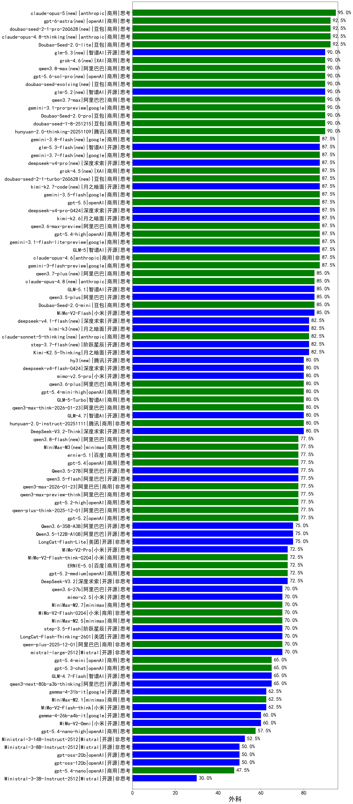

|类别|机构|大模型|【外科】准确率|平均耗时|平均消耗token|花费/千次（元）|排名（准确率）|
|---|---|-----|-------------------|-------|-----------|-----------|-----------|
|商用|豆包|doubao-seed-1-6-thinking-250715|95.0%|31s|1355|10.3|1|
|商用|百度|ERNIE-4.5-Turbo-32K|92.5%|22s|566|1.7|2|
|商用|豆包|Doubao-Seed-2.0-lite(new)|92.5%|219s|993|3.2|3|
|商用|阿里巴巴|qwen3-max-preview|90.0%|11s|501|10.6|4|
|商用|google|gemini-3.1-pro-preview(new)|90.0%|40s|2121|175.2|5|
|商用|豆包|Doubao-Seed-2.0-pro(new)|90.0%|216s|1006|14.6|6|
|商用|豆包|doubao-seed-1-8-251215(new)|90.0%|26s|758|5.2|7|
|商用|腾讯|hunyuan-2.0-thinking-20251109|90.0%|14s|841|3.2|8|
|商用|豆包|doubao-seed-1-6-251015|90.0%|19s|764|5.4|9|
|商用|google|gemini-3.1-flash-lite-preview(new)|87.5%|23s|416|3.7|10|
|开源|智谱AI|GLM-5(new)|87.5%|77s|2245|39.4|11|
|商用|anthropic|claude-opus-4.6(new)|87.5%|19s|670|101.0|12|
|商用|google|gemini-3-flash-preview(new)|87.5%|48s|1343|27.2|13|
|商用|腾讯|hunyuan-turbos-20250926|87.5%|15s|643|1.2|14|
|商用|阿里巴巴|qwen-plus-2025-07-28|87.5%|14s|542|1.0|15|
|开源|阿里巴巴|qwen3-235b-a22b-instruct-2507|87.5%|13s|547|3.9|16|
|商用|openAI|gpt-5.4-high(new)|87.5%|26s|987|95.4|17|
|商用|豆包|doubao-seed-1-6-flash-thinking-250615|86.2%|6s|675|0.8|18|
|商用|豆包|Doubao-1.5-lite-32k-250115|85.6%|5s|201|0.1|19|
|开源|小米|MiMo-V2-Flash(new)|85.0%|60s|791|0.0|20|
|开源|百度|ERNIE-4.5-300B-A47B|85.0%|15s|321|2.1|21|
|商用|豆包|Doubao-Seed-2.0-mini(new)|85.0%|465s|2795|5.4|22|
|开源|阿里巴巴|qwen3.5-plus(new)|85.0%|41s|3330|15.7|23|
|商用|科大讯飞|xunfei-spark-x1-0725|85.0%|/|1241|14.9|24|
|商用|google|gemini-3-pro-preview(new)|85.0%|53s|2072|171.0|25|
|商用|豆包|doubao-seed-1-6-250615|84.4%|96s|484|3.1|26|
|商用|阿里巴巴|qwen-plus-think-2025-07-28|82.5%|/|3007|23.5|27|
|开源|豆包|Seed-OSS-36B-Instruct|82.5%|123s|2131|8.3|28|
|开源|月之暗面|Kimi-K2.5-Thinking(new)|82.5%|463s|2405|49.3|29|
|开源|月之暗面|kimi-k2-0905|82.5%|88s|371|4.8|30|
|商用|阿里巴巴|qwen3-max-2025-09-23|82.5%|163s|590|12.7|31|
|商用|豆包|doubao-seed-1-6-flash-250615|82.5%|3s|310|0.4|32|
|开源|阿里巴巴|Qwen3-32B|81.9%|34s|1315|5.0|33|
|商用|百度|ERNIE-X1-Turbo-32K|80.6%|118s|2142|8.4|34|
|开源|深度求索|DeepSeek-V3.2-Think(new)|80.0%|106s|1443|4.3|35|
|商用|腾讯|hunyuan-2.0-instruct-20251111|80.0%|11s|456|0.8|36|
|开源|meta|Llama-4-Maverick-17B-128E-Instruct-FP8|80.0%|8s|537|2.1|37|
|开源|智谱AI|GLM-4.7(new)|80.0%|65s|2345|32.0|38|
|开源|深度求索|DeepSeek-V3.2-Exp|80.0%|162s|374|1.1|39|
|商用|anthropic|claude-opus-4.5(new)|80.0%|13s|794|124.8|40|
|商用|阿里巴巴|qwen3-max-think-2026-01-23(new)|80.0%|192s|3528|34.7|41|
|开源|百度|ERNIE-4.5-21B-A3B|79.4%|23s|306|0.0|42|
|开源|月之暗面|Kimi-K2-Thinking|77.5%|158s|2200|34.4|43|
|商用|阿里巴巴|qwen3-max-preview-think(new)|77.5%|155s|2861|67.2|44|
|商用|阿里巴巴|qwen3-max-2026-01-23(new)|77.5%|77s|551|4.9|45|
|开源|阿里巴巴|qwen3-next-80b-a3b-instruct|77.5%|8s|608|2.2|46|
|商用|openAI|gpt-5.2(new)|77.5%|6s|236|15.2|47|
|商用|阿里巴巴|qwen-plus-think-2025-12-01(new)|77.5%|72s|2981|23.3|48|
|开源|深度求索|DeepSeek-V3.1|77.5%|21s|366|3.8|49|
|开源|阿里巴巴|Qwen3-30B-A3B-Instruct-2507|77.5%|5s|638|1.7|50|
|开源|智谱AI|GLM-4.5-nothink|77.5%|25s|799|10.3|51|
|商用|豆包|doubao-seed-1-6-lite-251015|77.5%|32s|859|1.9|52|
|商用|腾讯|hunyuan-t1-20250711|77.5%|40s|2316|8.9|53|
|开源|月之暗面|kimi-k2-0711-preview|77.5%|44s|690|10.2|54|
|商用|openAI|gpt-5.4(new)|77.5%|7s|309|24.2|55|
|开源|阿里巴巴|qwen3-235b-a22b-thinking-2507|77.5%|99s|2758|53.7|56|
|开源|阿里巴巴|Qwen3.5-27B(new)|77.5%|339s|3701|17.4|57|
|开源|阿里巴巴|qwen3.5-flash(new)|77.5%|311s|4106|8.1|58|
|商用|google|gemini-2.5-pro|75.6%|40s|2445|172.2|59|
|商用|阿里巴巴|qwen-turbo-2025-07-15|75.0%|8s|402|0.2|60|
|商用|anthropic|claude-sonnet-4.5-thinking|75.0%|28s|1871|190.8|61|
|开源|阿里巴巴|Qwen3.5-122B-A10B(new)|75.0%|299s|3605|22.6|62|
|开源|美团|LongCat-Flash-Lite(new)|75.0%|239s|512|0.0|63|
|开源|深度求索|DeepSeek-R1-0528|74.4%|233s|1992|31.0|64|
|开源|minimax|MiniMax-M1|73.1%|244s|3744|26.7|65|
|商用|阿里巴巴|qwen-flash-2025-07-28|72.5%|8s|549|0.7|66|
|开源|深度求索|DeepSeek-V3.2(new)|72.5%|95s|394|1.1|67|
|商用|google|gemini-2.5-flash|72.5%|12s|1892|33.0|68|
|商用|百度|ERNIE-X1.1-Preview|72.5%|131s|1051|4.0|69|
|商用|Mistral|mistral-medium-2508|72.5%|122s|558|6.8|70|
|商用|小米|MiMo-V2-Flash-think-0204(new)|72.5%|694s|2215|4.5|71|
|开源|智谱AI|GLM-4.6|72.5%|65s|2436|33.3|72|
|商用|anthropic|claude-sonnet-4.5(new)|72.5%|13s|652|60.8|73|
|开源|minimax|MiniMax-Text-01|71.2%|13s|919|7.4|74|
|商用|百川智能|Baichuan4-Turbo|71.2%|/|/|/|75|
|开源|腾讯|Hunyuan-A13B-Instruct|70.6%|72s|1114|4.2|76|
|商用|小米|MiMo-V2-Flash-0204(new)|70.0%|250s|542|1.0|77|
|商用|阿里巴巴|qwen-plus-2025-12-01(new)|70.0%|37s|869|1.6|78|
|开源|阶跃星辰|step-3.5-flash(new)|70.0%|26s|2600|5.4|79|
|商用|openAI|gpt-5.1-high|70.0%|135s|1208|79.9|80|
|商用|minimax|MiniMax-M2.5(new)|70.0%|38s|1751|14.1|81|
|开源|阿里巴巴|Qwen3-14B|70.0%|32s|1585|3.0|82|
|开源|阿里巴巴|Qwen3-14B-nothink|70.0%|18s|581|1.0|83|
|开源|Mistral|mistral-large-2512(new)|70.0%|13s|540|5.0|84|
|商用|XAI|grok-4-0709|70.0%|203s|1780|186.1|85|
|开源|阿里巴巴|Qwen3-8B|69.4%|583s|11636|0.0|86|
|开源|meta|Llama-4-Scout-17B-16E-Instruct|68.1%|10s|564|1.1|87|
|商用|anthropic|claude-4-sonnet-thinking|67.5%|47s|1201|119.1|88|
|开源|美团|LongCat-Flash-Thinking-2601(new)|67.5%|314s|2868|0.0|89|
|开源|智谱AI|GLM-4.5|67.5%|61s|2076|28.3|90|
|商用|openAI|gpt-5.1|67.5%|232s|258|12.5|91|
|开源|腾讯|Hunyuan-A13B-Instruct-nothink|67.5%|845s|366|1.2|92|
|开源|深度求索|DeepSeek-V3.2-Exp-Think|67.5%|187s|1237|3.6|93|
|开源|智谱AI|GLM-4.5-Air-nothink|67.5%|13s|994|5.6|94|
|商用|智谱AI|GLM-4.5-Flash-nothink|67.5%|20s|990|0.0|95|
|开源|深度求索|DeepSeek-V3.1-Think|67.5%|68s|1311|15.2|96|
|开源|阿里巴巴|Qwen3-32B-nothink|67.5%|65s|557|2.0|97|
|商用|anthropic|claude-4-sonnet|66.2%|45s|618|55.6|98|
|商用|阿里巴巴|qwen-flash-think-2025-07-28|65.0%|31s|3212|4.7|99|
|开源|阿里巴巴|Qwen3-30B-A3B-Thinking-2507|65.0%|97s|3247|8.9|100|
|商用|智谱AI|GLM-4.5-Flash|65.0%|31s|1662|0.0|101|
|商用|openAI|gpt-5.3-chat(new)|65.0%|46s|437|34.8|102|
|开源|智谱AI|GLM-4.7-Flash(new)|65.0%|1351s|3264|0.0|103|
|商用|XAI|grok-4-1-fast-reasoning|65.0%|59s|1411|4.5|104|
|商用|百度|ERNIE-5.0-Thinking-Preview|65.0%|212s|1957|45.8|105|
|开源|智谱AI|GLM-4.5-Air|65.0%|35s|1644|9.5|106|
|商用|openAI|gpt-5.1-medium|65.0%|136s|637|39.4|107|
|开源|阿里巴巴|qwen3-next-80b-a3b-thinking|65.0%|114s|3799|14.9|108|
|商用|openAI|gpt-5-2025-08-07|62.5%|31s|301|16.2|109|
|开源|小米|MiMo-V2-Flash-think(new)|62.5%|121s|2165|0.0|110|
|商用|阿里巴巴|qwen-turbo-think-2025-07-15|62.5%|/|2443|7.1|111|
|商用|minimax|MiniMax-M2.1(new)|62.5%|121s|1824|14.7|112|
|开源|阶跃星辰|step-3|62.5%|101s|1974|7.7|113|
|开源|阿里巴巴|Qwen3-4B|61.9%|29s|2267|6.6|114|
|开源|智谱AI|GLM-4-9B-0414|61.9%|9s|493|0.0|115|
|商用|anthropic|claude-haiku-4.5-thinking|60.0%|57s|2866|99.2|116|
|开源|minimax|MiniMax-M2|60.0%|32s|1887|15.2|117|
|开源|深度求索|DeepSeek-R1-0528-Qwen3-8B|60.0%|239s|1679|0.0|118|
|开源|阿里巴巴|Qwen3-8B-nothink|57.5%|74s|509|0.0|119|
|商用|openAI|o4-mini|56.2%|34s|959|28.3|120|
|商用|XAI|grok-4-1-fast-non-reasoning|55.0%|44s|652|1.8|121|
|商用|anthropic|claude-haiku-4.5|55.0%|8s|673|20.6|122|
|商用|百川智能|Baichuan4-Air|53.8%|/|/|/|123|
|商用|XAI|grok-3-mini|52.5%|204s|1223|4.3|124|
|开源|Mistral|Ministral-3-14B-Instruct-2512(new)|52.5%|10s|605|0.9|125|
|商用|openAI|gpt-5-nano-high|52.5%|517s|4873|13.9|126|
|开源|Mistral|Mistral-Small-3.2-24B-Instruct-2506|52.5%|90s|543|1.0|127|
|商用|google|gemini-2.5-flash-lite|52.5%|4s|602|1.6|128|
|商用|百度|ERNIE-Lite-8K|51.2%|/|/|/|129|
|开源|Mistral|Ministral-3-8B-Instruct-2512(new)|50.0%|8s|647|0.7|130|
|商用|openAI|gpt-5-mini-high|50.0%|466s|2536|35.6|131|
|开源|openAI|gpt-oss-120b|50.0%|57s|690|1.9|132|
|开源|openAI|gpt-oss-20b|50.0%|43s|1057|1.1|133|
|开源|google|gemma-3-27b-it|49.4%|/|/|/|134|
|开源|阿里巴巴|Qwen3-1.7B|48.8%|20s|2136|6.2|135|
|商用|openAI|gpt-5-nano-2025-08-07|47.5%|43s|2041|5.7|136|
|商用|openAI|gpt-5-mini-2025-08-07|45.0%|96s|1025|13.7|137|
|开源|google|gemma-3-12b-it|44.4%|/|/|/|138|
|开源|阿里巴巴|Qwen3-4B-nothink|42.5%|15s|465|1.2|139|
|开源|阿里巴巴|Qwen3-1.7B-nothink|42.5%|12s|485|1.2|140|
|开源|阿里巴巴|Qwen3-0.6B|37.5%|11s|1283|3.6|141|
|开源|Mistral|Ministral-3-3B-Instruct-2512(new)|30.0%|9s|679|0.5|142|
|开源|google|gemma-3-4b-it|27.5%|/|/|/|143|
|开源|百度|ERNIE-4.5-0.3B|21.2%|18s|398|0.0|144|
|开源|阿里巴巴|Qwen3-0.6B-nothink|17.5%|7s|266|0.6|145|
|商用|openAI|gpt-5.2-high(new)|/%|11s|543|45.7|146|
|商用|百度|ERNIE-5.0(new)|/%|154s|2700|63.7|147|
|商用|openAI|gpt-5.2-medium(new)|/%|9s|441|35.7|148|

