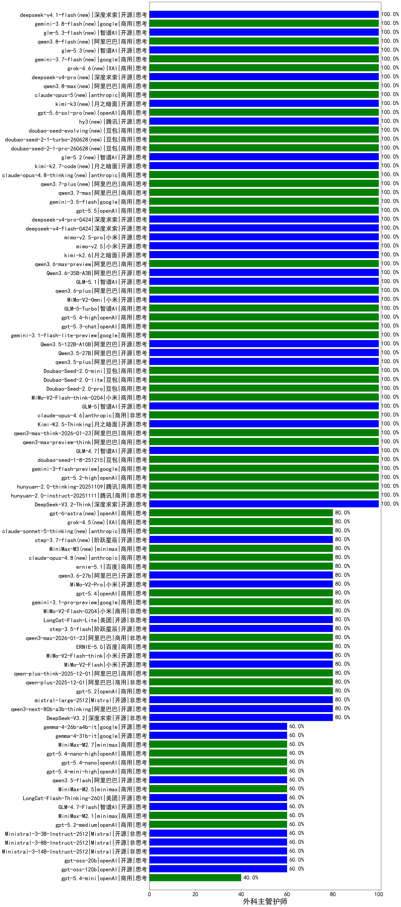

|类别|机构|大模型|【外科主管护师】准确率|平均耗时|平均消耗token|花费/千次（元）|排名（准确率）|
|---|---|-----|-------------------|-------|-----------|-----------|-----------|
|商用|豆包|doubao-seed-1-6-251015|100.0%|15s|740|5.2|1|
|商用|google|gemini-3-pro-preview|100.0%|24s|2702|224.9|2|
|商用|google|gemini-3-flash-preview|100.0%|99s|988|19.7|3|
|商用|openAI|gpt-5.2-high|100.0%|13s|494|41.1|4|
|商用|腾讯|hunyuan-2.0-thinking-20251109|100.0%|6s|599|2.2|5|
|商用|腾讯|hunyuan-2.0-instruct-20251111|100.0%|16s|428|0.7|6|
|开源|深度求索|DeepSeek-V3.2-Think|100.0%|45s|1384|4.1|7|
|商用|anthropic|claude-opus-4.5|100.0%|26s|822|129.6|8|
|商用|百度|ERNIE-5.0-Thinking-Preview|100.0%|269s|2389|56.2|9|
|商用|豆包|doubao-seed-1-6-lite-251015|100.0%|32s|767|1.6|10|
|开源|智谱AI|GLM-4.7|100.0%|59s|1790|24.3|11|
|开源|深度求索|DeepSeek-V3.2-Exp-Think|100.0%|494s|1258|3.7|12|
|开源|深度求索|DeepSeek-V3.2-Exp|100.0%|99s|371|1.0|13|
|开源|阿里巴巴|qwen3-next-80b-a3b-instruct|100.0%|16s|841|3.1|14|
|开源|豆包|Seed-OSS-36B-Instruct|100.0%|74s|1584|6.2|15|
|商用|阿里巴巴|qwen-plus-think-2025-07-28|100.0%|/|2908|22.7|16|
|商用|阿里巴巴|qwen-flash-2025-07-28|100.0%|9s|648|0.9|17|
|开源|智谱AI|GLM-4.5-nothink|100.0%|22s|661|8.4|18|
|商用|豆包|doubao-seed-1-8-251215|100.0%|22s|626|4.2|19|
|商用|阿里巴巴|qwen3-max-preview-think|100.0%|76s|2221|51.8|20|
|商用|智谱AI|GLM-4.5-Flash|100.0%|38s|1757|0.0|21|
|开源|阿里巴巴|qwen3.5-plus(new)|100.0%|27s|2220|10.4|22|
|商用|小米|MiMo-V2-Omni(new)|100.0%|201s|1551|18.1|23|
|商用|智谱AI|GLM-5-Turbo(new)|100.0%|49s|1135|23.8|24|
|商用|openAI|gpt-5.4-high(new)|100.0%|12s|748|70.5|25|
|商用|openAI|gpt-5.3-chat(new)|100.0%|8s|405|31.8|26|
|商用|google|gemini-3.1-flash-lite-preview(new)|100.0%|3s|404|3.6|27|
|开源|阿里巴巴|Qwen3.5-122B-A10B(new)|100.0%|173s|2963|18.6|28|
|开源|阿里巴巴|Qwen3.5-27B(new)|100.0%|397s|3954|18.7|29|
|商用|豆包|Doubao-Seed-2.0-mini(new)|100.0%|457s|1968|3.7|30|
|开源|美团|LongCat-Flash-Thinking-2601|100.0%|208s|2574|0.0|31|
|商用|豆包|Doubao-Seed-2.0-lite(new)|100.0%|162s|870|2.8|32|
|商用|豆包|Doubao-Seed-2.0-pro(new)|100.0%|198s|886|12.7|33|
|商用|小米|MiMo-V2-Flash-think-0204(new)|100.0%|239s|2435|5.0|34|
|开源|智谱AI|GLM-5(new)|100.0%|73s|2141|37.6|35|
|商用|anthropic|claude-opus-4.6|100.0%|12s|712|108.2|36|
|开源|月之暗面|Kimi-K2.5-Thinking|100.0%|285s|1449|29.2|37|
|商用|阿里巴巴|qwen3-max-think-2026-01-23|100.0%|178s|3759|37.0|38|
|开源|阿里巴巴|Qwen3-30B-A3B-Instruct-2507|100.0%|7s|702|1.9|39|
|商用|阿里巴巴|qwen3.6-plus(new)|100.0%|29s|1772|20.5|40|
|商用|阿里巴巴|qwen-turbo-2025-07-15|100.0%|9s|432|0.2|41|
|开源|阿里巴巴|qwen3-235b-a22b-instruct-2507|100.0%|16s|584|4.2|42|
|开源|阿里巴巴|qwen3-235b-a22b-thinking-2507|100.0%|237s|3737|73.3|43|
|开源|百度|ERNIE-4.5-21B-A3B|95.0%|3s|277|0.0|44|
|商用|豆包|doubao-seed-1-6-flash-250615|95.0%|4s|310|0.4|45|
|商用|豆包|doubao-seed-1-6-flash-thinking-250615|95.0%|7s|493|0.6|46|
|商用|百度|ERNIE-4.5-Turbo-32K|95.0%|21s|533|1.6|47|
|商用|百度|ERNIE-X1-Turbo-32K|85.0%|129s|1664|6.5|48|
|开源|阿里巴巴|qwen3-next-80b-a3b-thinking|80.0%|89s|4730|18.7|49|
|商用|腾讯|hunyuan-t1-20250711|80.0%|42s|2414|9.3|50|
|商用|腾讯|hunyuan-turbos-20250926|80.0%|18s|709|1.3|51|
|开源|智谱AI|GLM-4.6|80.0%|74s|3202|44.0|52|
|商用|阿里巴巴|qwen3-max-2026-01-23|80.0%|174s|586|5.3|53|
|开源|月之暗面|Kimi-K2-Thinking|80.0%|94s|1381|21.3|54|
|开源|Mistral|mistral-large-2512|80.0%|13s|556|5.2|55|
|开源|阿里巴巴|Qwen3-4B-nothink|80.0%|6s|470|1.2|56|
|商用|小米|MiMo-V2-Flash-0204(new)|80.0%|111s|493|0.9|57|
|开源|腾讯|Hunyuan-A13B-Instruct-nothink|80.0%|18s|397|1.4|58|
|开源|百度|ERNIE-4.5-300B-A47B|80.0%|21s|311|2.1|59|
|商用|XAI|grok-4-1-fast-non-reasoning|80.0%|83s|676|1.9|60|
|开源|深度求索|DeepSeek-V3.2|80.0%|31s|317|0.9|61|
|开源|月之暗面|kimi-k2-0905|80.0%|108s|532|7.4|62|
|商用|openAI|gpt-5.1-high|80.0%|156s|1218|80.7|63|
|开源|深度求索|DeepSeek-R1-0528|80.0%|225s|1925|30.0|64|
|商用|anthropic|claude-sonnet-4.5-thinking|80.0%|40s|2774|288.9|65|
|商用|百度|ERNIE-X1.1-Preview|80.0%|131s|922|3.5|66|
|商用|google|gemini-2.5-flash|80.0%|13s|1888|33.1|67|
|开源|阿里巴巴|Qwen3-8B-nothink|80.0%|24s|556|0.0|68|
|开源|美团|LongCat-Flash-Lite(new)|80.0%|63s|649|0.0|69|
|商用|google|gemini-3.1-pro-preview(new)|80.0%|79s|1314|106.7|70|
|商用|阿里巴巴|qwen3-max-preview|80.0%|17s|706|15.5|71|
|开源|阶跃星辰|step-3.5-flash|80.0%|17s|2124|4.4|72|
|开源|小米|MiMo-V2-Flash-think|80.0%|31s|2357|0.0|73|
|开源|阿里巴巴|Qwen3-32B-nothink|80.0%|17s|476|1.7|74|
|开源|阿里巴巴|Qwen3-1.7B-nothink|80.0%|10s|512|1.3|75|
|商用|小米|MiMo-V2-Pro(new)|80.0%|398s|1288|22.6|76|
|开源|智谱AI|GLM-4.5|80.0%|97s|2109|28.8|77|
|开源|小米|MiMo-V2-Flash|80.0%|126s|487|0.0|78|
|商用|科大讯飞|xunfei-spark-x1-0725|80.0%|/|1415|17.0|79|
|开源|智谱AI|GLM-4.5-Air-nothink|80.0%|15s|977|5.5|80|
|商用|智谱AI|GLM-4.5-Flash-nothink|80.0%|26s|986|0.0|81|
|商用|豆包|doubao-seed-1-6-250615|80.0%|107s|466|3.0|82|
|商用|openAI|gpt-5.4(new)|80.0%|6s|328|26.4|83|
|商用|阿里巴巴|qwen-plus-think-2025-12-01|80.0%|67s|2759|21.5|84|
|商用|阿里巴巴|qwen-plus-2025-12-01|80.0%|21s|850|1.6|85|
|商用|openAI|gpt-5.2|80.0%|4s|235|15.3|86|
|开源|阿里巴巴|Qwen3-32B|80.0%|28s|973|3.7|87|
|开源|深度求索|DeepSeek-V3.1|80.0%|17s|345|3.6|88|
|开源|深度求索|DeepSeek-V3.1-Think|80.0%|61s|1184|13.7|89|
|商用|google|gemini-2.5-flash-lite|80.0%|3s|509|1.3|90|
|商用|百度|ERNIE-5.0|80.0%|99s|2010|47.1|91|
|开源|Mistral|Mistral-Small-3.2-24B-Instruct-2506|80.0%|22s|646|1.2|92|
|商用|阿里巴巴|qwen-plus-2025-07-28|80.0%|13s|501|0.9|93|
|商用|阿里巴巴|qwen3-max-2025-09-23|80.0%|206s|575|12.4|94|
|开源|阿里巴巴|Qwen3-8B|75.0%|812s|11274|0.0|95|
|开源|腾讯|Hunyuan-A13B-Instruct|75.0%|53s|1022|3.9|96|
|开源|meta|Llama-4-Scout-17B-16E-Instruct|75.0%|9s|536|1.0|97|
|开源|阿里巴巴|Qwen3-1.7B|75.0%|21s|2402|7.0|98|
|开源|meta|Llama-4-Maverick-17B-128E-Instruct-FP8|75.0%|8s|520|2.0|99|
|商用|google|gemini-2.5-pro|75.0%|39s|2415|170.4|100|
|商用|百川智能|Baichuan4-Turbo|70.0%|/|/|/|101|
|商用|XAI|grok-4-0709|70.0%|492s|2305|244.1|102|
|开源|智谱AI|GLM-4-9B-0414|70.0%|6s|440|0.0|103|
|开源|阿里巴巴|Qwen3-14B|70.0%|44s|2208|4.3|104|
|商用|anthropic|claude-4-sonnet|70.0%|46s|576|52.1|105|
|开源|阿里巴巴|Qwen3-4B|70.0%|21s|1444|4.1|106|
|开源|深度求索|DeepSeek-R1-0528-Qwen3-8B|65.0%|187s|1603|0.0|107|
|开源|阿里巴巴|qwen3.5-flash(new)|60.0%|202s|3752|7.4|108|
|商用|minimax|MiniMax-M2.5(new)|60.0%|34s|1637|13.1|109|
|商用|openAI|gpt-5.4-mini-high(new)|60.0%|18s|1197|35.3|110|
|商用|openAI|gpt-5.4-nano(new)|60.0%|12s|283|1.8|111|
|商用|openAI|gpt-5.4-nano-high(new)|60.0%|109s|777|6.1|112|
|商用|minimax|MiniMax-M2.7(new)|60.0%|34s|1289|10.2|113|
|开源|google|gemma-3-27b-it|60.0%|/|/|/|114|
|开源|智谱AI|GLM-4.7-Flash|60.0%|997s|2423|0.0|115|
|商用|openAI|gpt-5-nano-high|60.0%|90s|4716|13.4|116|
|商用|minimax|MiniMax-M2.1|60.0%|91s|1610|12.9|117|
|商用|openAI|gpt-5.1|60.0%|533s|241|11.4|118|
|开源|阿里巴巴|Qwen3-14B-nothink|60.0%|16s|596|1.1|119|
|开源|智谱AI|GLM-4.5-Air|60.0%|35s|1744|10.1|120|
|开源|阿里巴巴|Qwen3-30B-A3B-Thinking-2507|60.0%|85s|3502|9.6|121|
|开源|阶跃星辰|step-3|60.0%|121s|2425|9.5|122|
|开源|openAI|gpt-oss-120b|60.0%|6s|665|1.8|123|
|开源|openAI|gpt-oss-20b|60.0%|7s|1241|1.3|124|
|商用|openAI|gpt-5-2025-08-07|60.0%|23s|469|28.5|125|
|商用|openAI|gpt-5-nano-2025-08-07|60.0%|85s|1685|4.7|126|
|商用|阿里巴巴|qwen-flash-think-2025-07-28|60.0%|36s|3871|5.7|127|
|商用|Mistral|mistral-medium-2508|60.0%|713s|495|5.9|128|
|商用|anthropic|claude-4-sonnet-thinking|60.0%|8s|595|54.5|129|
|开源|minimax|MiniMax-M2|60.0%|22s|1608|12.9|130|
|商用|XAI|grok-3-mini|60.0%|120s|1184|4.2|131|
|商用|openAI|gpt-5.1-medium|60.0%|179s|570|34.7|132|
|商用|anthropic|claude-sonnet-4.5(new)|60.0%|11s|864|83.7|133|
|商用|openAI|gpt-5.2-medium|60.0%|8s|392|31.0|134|
|开源|Mistral|Ministral-3-3B-Instruct-2512|60.0%|10s|673|0.5|135|
|开源|Mistral|Ministral-3-8B-Instruct-2512|60.0%|15s|562|0.6|136|
|开源|Mistral|Ministral-3-14B-Instruct-2512|60.0%|9s|608|0.9|137|
|商用|百川智能|Baichuan4-Air|60.0%|/|/|/|138|
|商用|XAI|grok-4-1-fast-reasoning|60.0%|22s|1801|5.9|139|
|开源|google|gemma-3-12b-it|55.0%|/|/|/|140|
|商用|openAI|o4-mini|50.0%|22s|680|19.6|141|
|开源|阿里巴巴|Qwen3-0.6B|45.0%|14s|1518|4.4|142|
|商用|openAI|gpt-5-mini-2025-08-07|40.0%|28s|911|12.0|143|
|商用|openAI|gpt-5-mini-high|40.0%|970s|1517|20.8|144|
|开源|google|gemma-3-4b-it|40.0%|/|/|/|145|
|商用|openAI|gpt-5.4-mini(new)|40.0%|12s|310|7.3|146|
|商用|anthropic|claude-haiku-4.5-thinking|40.0%|39s|3110|108.0|147|
|商用|阿里巴巴|qwen-turbo-think-2025-07-15|40.0%|/|2877|8.4|148|
|开源|阿里巴巴|Qwen3-0.6B-nothink|40.0%|7s|283|0.6|149|
|商用|anthropic|claude-haiku-4.5|40.0%|12s|667|20.4|150|
|开源|百度|ERNIE-4.5-0.3B|30.0%|2s|378|0.0|151|

