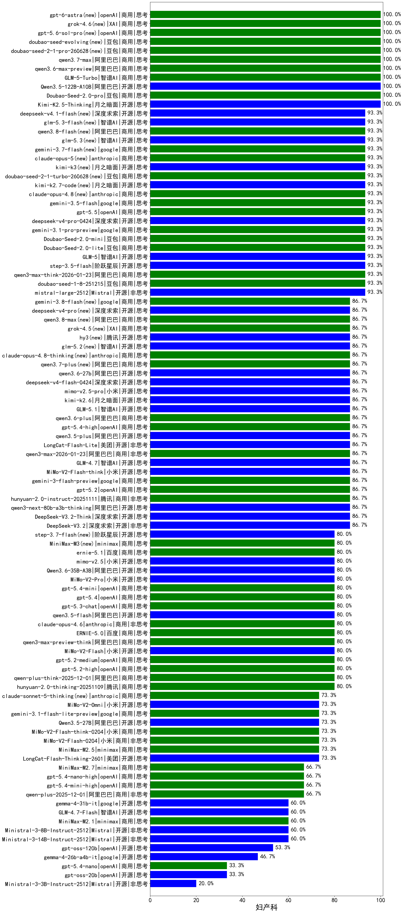

|类别|机构|大模型|【妇产科】准确率|平均耗时|平均消耗token|花费/千次（元）|排名（准确率）|
|---|---|-----|-------------------|-------|-----------|-----------|-----------|
|商用|智谱AI|GLM-5-Turbo(new)|100.0%|34s|1438|29.9|1|
|开源|阿里巴巴|Qwen3.5-122B-A10B(new)|100.0%|392s|4055|25.4|2|
|商用|豆包|doubao-seed-1-6-251015|100.0%|8s|837|5.8|3|
|商用|百度|ERNIE-4.5-Turbo-32K|100.0%|22s|566|1.6|4|
|商用|豆包|Doubao-Seed-2.0-pro(new)|100.0%|223s|1060|15.1|5|
|开源|月之暗面|Kimi-K2.5-Thinking(new)|100.0%|440s|2388|48.5|6|
|开源|阶跃星辰|step-3.5-flash(new)|93.3%|18s|2515|5.1|7|
|商用|豆包|doubao-seed-1-6-250615|93.3%|143s|500|3.2|8|
|开源|Mistral|mistral-large-2512(new)|93.3%|18s|741|6.9|9|
|商用|豆包|doubao-seed-1-8-251215(new)|93.3%|28s|796|5.3|10|
|开源|深度求索|DeepSeek-V3.2-Exp|93.3%|222s|439|1.2|11|
|商用|阿里巴巴|qwen3-max-think-2026-01-23(new)|93.3%|113s|3261|31.8|12|
|商用|豆包|Doubao-Seed-2.0-lite(new)|93.3%|213s|1043|3.3|13|
|商用|豆包|Doubao-Seed-2.0-mini(new)|93.3%|283s|2012|3.8|14|
|开源|智谱AI|GLM-5(new)|93.3%|201s|2469|43.1|15|
|商用|google|gemini-3.1-pro-preview(new)|93.3%|48s|1940|157.5|16|
|开源|阿里巴巴|Qwen3-32B|88.3%|31s|1144|4.3|17|
|商用|豆包|doubao-seed-1-6-flash-thinking-250615|88.3%|9s|947|1.2|18|
|商用|anthropic|claude-sonnet-4.5(new)|86.7%|14s|717|64.6|19|
|商用|百度|ERNIE-X1.1-Preview|86.7%|134s|1290|4.9|20|
|商用|openAI|gpt-5-2025-08-07|86.7%|35s|281|12.8|21|
|商用|anthropic|claude-sonnet-4.5-thinking|86.7%|29s|2070|209.1|22|
|开源|深度求索|DeepSeek-V3.1|86.7%|19s|411|4.2|23|
|商用|google|gemini-3-pro-preview(new)|86.7%|74s|2274|186.0|24|
|开源|智谱AI|GLM-4.6|86.7%|60s|2533|34.3|25|
|开源|深度求索|DeepSeek-V3.1-Think|86.7%|56s|1110|12.5|26|
|开源|阿里巴巴|qwen3-next-80b-a3b-instruct|86.7%|13s|709|2.5|27|
|商用|阿里巴巴|qwen3-max-2025-09-23|86.7%|48s|620|12.9|28|
|商用|anthropic|claude-opus-4.5(new)|86.7%|17s|913|140.5|29|
|商用|openAI|gpt-5.2(new)|86.7%|6s|316|20.5|30|
|开源|深度求索|DeepSeek-V3.2(new)|86.7%|26s|451|1.3|31|
|开源|深度求索|DeepSeek-V3.2-Think(new)|86.7%|120s|1333|3.9|32|
|开源|阿里巴巴|qwen3-next-80b-a3b-thinking|86.7%|121s|4270|16.7|33|
|商用|腾讯|hunyuan-2.0-instruct-20251111|86.7%|18s|478|0.8|34|
|商用|科大讯飞|xunfei-spark-x1-0725|86.7%|/|993|11.9|35|
|商用|google|gemini-3-flash-preview(new)|86.7%|47s|1377|27.4|36|
|开源|小米|MiMo-V2-Flash-think(new)|86.7%|25s|2474|0.0|37|
|开源|智谱AI|GLM-4.7(new)|86.7%|56s|2319|31.4|38|
|商用|阿里巴巴|qwen3-max-2026-01-23(new)|86.7%|103s|596|5.1|39|
|开源|美团|LongCat-Flash-Lite(new)|86.7%|385s|698|0.0|40|
|开源|阿里巴巴|qwen3.5-plus(new)|86.7%|40s|3306|15.5|41|
|商用|openAI|gpt-5.4-high(new)|86.7%|17s|1083|102.6|42|
|开源|智谱AI|GLM-4.5|86.7%|65s|1750|23.4|43|
|商用|阿里巴巴|qwen3-max-preview|86.7%|13s|581|12.0|44|
|商用|anthropic|claude-4-sonnet-thinking|86.7%|55s|1234|121.9|45|
|商用|豆包|doubao-seed-1-6-thinking-250715|86.7%|20s|1304|9.7|46|
|商用|豆包|doubao-seed-1-6-flash-250615|85.0%|4s|346|0.4|47|
|商用|豆包|Doubao-1.5-lite-32k-250115|85.0%|4s|207|0.1|48|
|商用|百度|ERNIE-X1-Turbo-32K|85.0%|152s|2572|10.1|49|
|开源|月之暗面|kimi-k2-0711-preview|83.3%|30s|536|7.6|50|
|商用|anthropic|claude-4-sonnet|80.0%|45s|620|55.1|51|
|商用|阿里巴巴|qwen-plus-think-2025-12-01(new)|80.0%|56s|2694|20.8|52|
|商用|Mistral|mistral-medium-2508|80.0%|49s|636|7.5|53|
|商用|腾讯|hunyuan-2.0-thinking-20251109|80.0%|30s|1037|3.9|54|
|商用|阿里巴巴|qwen-plus-think-2025-07-28|80.0%|/|2758|21.3|55|
|商用|腾讯|hunyuan-t1-20250711|80.0%|31s|1947|7.4|56|
|开源|豆包|Seed-OSS-36B-Instruct|80.0%|111s|1964|7.6|57|
|商用|openAI|gpt-5.1-medium|80.0%|137s|813|49.9|58|
|开源|深度求索|DeepSeek-V3.2-Exp-Think|80.0%|88s|1276|3.7|59|
|商用|腾讯|hunyuan-turbos-20250926|80.0%|17s|754|1.3|60|
|商用|google|gemini-2.5-pro|80.0%|30s|2529|177.8|61|
|商用|豆包|doubao-seed-1-6-lite-251015|80.0%|83s|860|1.8|62|
|开源|月之暗面|Kimi-K2-Thinking|80.0%|124s|2038|31.5|63|
|开源|阿里巴巴|qwen3-235b-a22b-instruct-2507|80.0%|18s|700|4.9|64|
|开源|百度|ERNIE-4.5-300B-A47B|80.0%|20s|362|2.4|65|
|开源|小米|MiMo-V2-Flash(new)|80.0%|92s|581|0.0|66|
|商用|阿里巴巴|qwen3-max-preview-think(new)|80.0%|95s|2584|60.0|67|
|商用|openAI|gpt-5.3-chat(new)|80.0%|45s|520|40.1|68|
|商用|openAI|gpt-5.4(new)|80.0%|4s|370|27.9|69|
|开源|智谱AI|GLM-4.5-nothink|80.0%|34s|1137|14.8|70|
|商用|百度|ERNIE-5.0-Thinking-Preview|80.0%|382s|2630|61.4|71|
|开源|月之暗面|kimi-k2-0905|80.0%|76s|416|5.2|72|
|开源|阿里巴巴|qwen3.5-flash(new)|80.0%|347s|4262|8.3|73|
|开源|阿里巴巴|qwen3-235b-a22b-thinking-2507|80.0%|89s|2691|51.9|74|
|商用|anthropic|claude-opus-4.6(new)|80.0%|20s|770|113.1|75|
|开源|百度|ERNIE-4.5-21B-A3B|78.3%|22s|329|0.0|76|
|商用|百川智能|Baichuan4-Turbo|78.3%|/|/|/|77|
|开源|meta|Llama-4-Maverick-17B-128E-Instruct-FP8|76.7%|9s|592|2.2|78|
|开源|深度求索|DeepSeek-R1-0528|76.7%|246s|2150|33.4|79|
|开源|minimax|MiniMax-Text-01|75.0%|12s|957|7.4|80|
|开源|阿里巴巴|Qwen3-14B|75.0%|38s|2181|4.2|81|
|商用|小米|MiMo-V2-Flash-think-0204(new)|73.3%|958s|2510|5.1|82|
|商用|openAI|gpt-5.1-high|73.3%|108s|1918|128.4|83|
|开源|minimax|MiniMax-M1|73.3%|202s|2849|19.3|84|
|开源|阿里巴巴|Qwen3.5-27B(new)|73.3%|278s|3759|17.6|85|
|商用|anthropic|claude-haiku-4.5-thinking|73.3%|28s|3052|104.9|86|
|商用|阿里巴巴|qwen-plus-2025-07-28|73.3%|20s|667|1.2|87|
|商用|小米|MiMo-V2-Flash-0204(new)|73.3%|217s|676|1.2|88|
|商用|阿里巴巴|qwen-flash-think-2025-07-28|73.3%|32s|3241|4.7|89|
|商用|minimax|MiniMax-M2.5(new)|73.3%|34s|1867|14.9|90|
|商用|google|gemini-3.1-flash-lite-preview(new)|73.3%|6s|487|4.2|91|
|开源|阿里巴巴|Qwen3-30B-A3B-Instruct-2507|73.3%|6s|791|2.1|92|
|开源|阿里巴巴|Qwen3-32B-nothink|73.3%|63s|701|2.5|93|
|开源|美团|LongCat-Flash-Thinking-2601(new)|73.3%|336s|3040|0.0|94|
|开源|阿里巴巴|Qwen3-8B-nothink|73.3%|78s|694|0.0|95|
|商用|XAI|grok-3-mini|70.0%|184s|1191|4.2|96|
|开源|阿里巴巴|Qwen3-30B-A3B-Thinking-2507|70.0%|70s|2961|8.1|97|
|商用|XAI|grok-4-0709|70.0%|350s|1734|180.2|98|
|开源|阿里巴巴|Qwen3-8B|70.0%|341s|8813|0.0|99|
|开源|腾讯|Hunyuan-A13B-Instruct|68.3%|50s|1309|5.0|100|
|商用|google|gemini-2.5-flash|66.7%|12s|2078|36.3|101|
|商用|阿里巴巴|qwen-turbo-think-2025-07-15|66.7%|/|2637|7.6|102|
|开源|智谱AI|GLM-4.5-Air|66.7%|42s|1899|10.9|103|
|开源|阶跃星辰|step-3|66.7%|117s|2324|9.0|104|
|商用|阿里巴巴|qwen-plus-2025-12-01(new)|66.7%|26s|1089|2.0|105|
|开源|腾讯|Hunyuan-A13B-Instruct-nothink|66.7%|114s|417|1.4|106|
|开源|minimax|MiniMax-M2|66.7%|65s|3208|26.1|107|
|开源|智谱AI|GLM-4-9B-0414|63.3%|11s|481|0.0|108|
|开源|Mistral|Ministral-3-14B-Instruct-2512(new)|60.0%|6s|879|1.3|109|
|商用|anthropic|claude-haiku-4.5|60.0%|14s|757|22.5|110|
|开源|阿里巴巴|Qwen3-4B-nothink|60.0%|15s|577|1.4|111|
|开源|阿里巴巴|Qwen3-14B-nothink|60.0%|17s|773|1.4|112|
|开源|智谱AI|GLM-4.7-Flash(new)|60.0%|1384s|2985|0.0|113|
|商用|智谱AI|GLM-4.5-Flash|60.0%|35s|2099|0.0|114|
|商用|minimax|MiniMax-M2.1(new)|60.0%|101s|1615|12.7|115|
|商用|XAI|grok-4-1-fast-reasoning|60.0%|69s|1685|5.4|116|
|商用|openAI|o4-mini|60.0%|26s|865|25.1|117|
|商用|openAI|gpt-5.1|60.0%|113s|341|16.4|118|
|开源|智谱AI|GLM-4.5-Air-nothink|60.0%|18s|1150|6.4|119|
|开源|Mistral|Ministral-3-8B-Instruct-2512(new)|60.0%|9s|787|0.8|120|
|商用|阿里巴巴|qwen-flash-2025-07-28|60.0%|9s|722|0.9|121|
|商用|google|gemini-2.5-flash-lite|60.0%|4s|1023|2.7|122|
|商用|阿里巴巴|qwen-turbo-2025-07-15|60.0%|9s|517|0.3|123|
|开源|meta|Llama-4-Scout-17B-16E-Instruct|58.3%|9s|623|1.2|124|
|开源|阿里巴巴|Qwen3-4B|58.3%|23s|1757|5.0|125|
|开源|openAI|gpt-oss-120b|53.3%|91s|898|2.5|126|
|商用|百度|ERNIE-Lite-8K|50.0%|/|/|/|127|
|商用|百川智能|Baichuan4-Air|50.0%|/|/|/|128|
|开源|阿里巴巴|Qwen3-0.6B|50.0%|11s|1191|3.3|129|
|开源|深度求索|DeepSeek-R1-0528-Qwen3-8B|50.0%|277s|1963|0.0|130|
|开源|阿里巴巴|Qwen3-0.6B-nothink|46.7%|11s|292|0.6|131|
|商用|openAI|gpt-5-nano-high|46.7%|721s|6487|18.5|132|
|商用|智谱AI|GLM-4.5-Flash-nothink|46.7%|20s|1066|0.0|133|
|商用|openAI|gpt-5-mini-2025-08-07|46.7%|49s|1158|15.2|134|
|开源|google|gemma-3-12b-it|45.0%|/|/|/|135|
|开源|google|gemma-3-27b-it|41.7%|/|/|/|136|
|开源|阿里巴巴|Qwen3-1.7B|41.7%|28s|2807|8.2|137|
|商用|openAI|gpt-5-nano-2025-08-07|40.0%|58s|2952|8.2|138|
|开源|google|gemma-3-4b-it|38.3%|/|/|/|139|
|商用|openAI|gpt-5-mini-high|33.3%|214s|2729|38.0|140|
|开源|阿里巴巴|Qwen3-1.7B-nothink|33.3%|14s|605|1.5|141|
|商用|XAI|grok-4-1-fast-non-reasoning|33.3%|29s|748|2.1|142|
|开源|Mistral|Mistral-Small-3.2-24B-Instruct-2506|33.3%|182s|647|1.2|143|
|开源|openAI|gpt-oss-20b|33.3%|11s|1207|1.2|144|
|开源|Mistral|Ministral-3-3B-Instruct-2512(new)|20.0%|9s|679|0.5|145|
|开源|百度|ERNIE-4.5-0.3B|18.3%|39s|407|0.0|146|
|商用|百度|ERNIE-5.0(new)|/%|181s|2128|49.4|147|
|商用|openAI|gpt-5.2-high(new)|/%|18s|815|70.1|148|
|商用|openAI|gpt-5.2-medium(new)|/%|13s|570|45.7|149|

