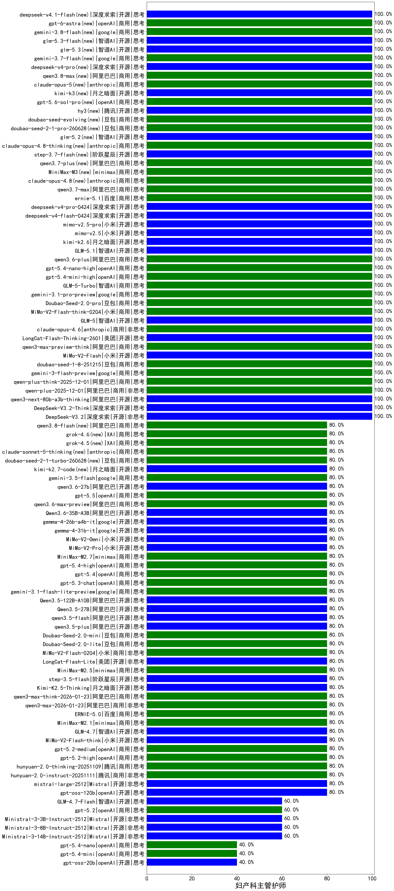

|类别|机构|大模型|【妇产科主管护师】准确率|平均耗时|平均消耗token|花费/千次（元）|排名（准确率）|
|---|---|-----|-------------------|-------|-----------|-----------|-----------|
|商用|minimax|MiniMax-M3(new)|100.0%|19s|609|7.1|1|
|商用|openAI|gpt-5.1-medium|100.0%|145s|539|30.9|2|
|商用|anthropic|claude-opus-4.6|100.0%|13s|731|107.6|3|
|开源|美团|LongCat-Flash-Thinking-2601|100.0%|244s|2516|0.0|4|
|商用|阿里巴巴|qwen3-max-preview-think|100.0%|232s|3192|74.9|5|
|开源|小米|MiMo-V2-Flash|100.0%|252s|476|0.0|6|
|商用|豆包|doubao-seed-1-8-251215|100.0%|28s|729|4.9|7|
|商用|google|gemini-3-flash-preview|100.0%|113s|1169|23.2|8|
|商用|阿里巴巴|qwen-plus-think-2025-12-01|100.0%|47s|2098|16.1|9|
|商用|阿里巴巴|qwen-plus-2025-12-01|100.0%|22s|840|1.6|10|
|开源|阿里巴巴|qwen3-next-80b-a3b-thinking|100.0%|69s|3034|11.8|11|
|开源|深度求索|DeepSeek-V3.2-Think|100.0%|49s|849|2.5|12|
|开源|深度求索|DeepSeek-V3.1|100.0%|19s|397|4.1|13|
|开源|深度求索|DeepSeek-V3.1-Think|100.0%|44s|822|9.2|14|
|开源|深度求索|DeepSeek-V3.2|100.0%|56s|380|1.1|15|
|商用|anthropic|claude-opus-4.5|100.0%|20s|836|128.1|16|
|商用|阿里巴巴|qwen3-max-preview|100.0%|9s|477|9.7|17|
|商用|anthropic|claude-sonnet-4.5-thinking|100.0%|38s|2610|268.8|18|
|开源|阿里巴巴|qwen3-next-80b-a3b-instruct|100.0%|8s|661|2.4|19|
|商用|腾讯|hunyuan-turbos-20250926|100.0%|17s|693|1.2|20|
|商用|豆包|doubao-seed-1-6-251015|100.0%|6s|681|4.6|21|
|商用|豆包|doubao-seed-1-6-lite-251015|100.0%|15s|725|1.5|22|
|商用|anthropic|claude-sonnet-4.5|100.0%|12s|741|68.0|23|
|开源|智谱AI|GLM-5|100.0%|44s|1700|29.4|24|
|商用|小米|MiMo-V2-Flash-think-0204|100.0%|1073s|1876|3.8|25|
|商用|豆包|Doubao-Seed-2.0-pro|100.0%|166s|778|10.8|26|
|商用|google|gemini-3.1-pro-preview|100.0%|45s|1318|105.5|27|
|商用|anthropic|claude-opus-4.8(new)|100.0%|10s|618|88.2|28|
|商用|阿里巴巴|qwen3.7-max(new)|100.0%|22s|982|33.2|29|
|商用|百度|ernie-5.1(new)|100.0%|21s|834|13.9|30|
|开源|深度求索|deepseek-v4-pro(new)|100.0%|23s|801|18.2|31|
|开源|深度求索|deepseek-v4-flash(new)|100.0%|31s|629|1.2|32|
|开源|小米|mimo-v2.5-pro(new)|100.0%|22s|1144|19.3|33|
|开源|小米|mimo-v2.5(new)|100.0%|25s|1415|16.1|34|
|开源|月之暗面|kimi-k2.6(new)|100.0%|177s|2339|61.5|35|
|开源|智谱AI|GLM-5.1(new)|100.0%|148s|1201|27.3|36|
|商用|阿里巴巴|qwen3.6-plus|100.0%|38s|1796|20.7|37|
|开源|阿里巴巴|qwen3-235b-a22b-thinking-2507|100.0%|38s|1708|32.4|38|
|商用|openAI|gpt-5.4-nano-high|100.0%|25s|638|4.7|39|
|商用|openAI|gpt-5.4-mini-high|100.0%|15s|1294|37.7|40|
|商用|智谱AI|GLM-5-Turbo|100.0%|21s|1150|23.9|41|
|开源|月之暗面|kimi-k2-0905|100.0%|89s|490|6.6|42|
|商用|百度|ERNIE-4.5-Turbo-32K|95.0%|21s|518|1.5|43|
|开源|阿里巴巴|Qwen3-32B|95.0%|21s|633|2.3|44|
|开源|深度求索|DeepSeek-R1-0528|90.0%|238s|1727|26.8|45|
|商用|google|gemini-2.5-pro|85.0%|27s|2378|167.3|46|
|商用|google|gemini-2.5-flash|85.0%|10s|1831|31.9|47|
|商用|百度|ERNIE-X1-Turbo-32K|85.0%|88s|1631|6.3|48|
|商用|百川智能|Baichuan4-Turbo|83.3%|/|/|/|49|
|开源|阿里巴巴|Qwen3-30B-A3B-Instruct-2507|80.0%|6s|659|1.8|50|
|开源|阿里巴巴|qwen3.5-plus|80.0%|26s|2027|9.4|51|
|开源|智谱AI|GLM-4.5-Air-nothink|80.0%|14s|971|5.4|52|
|商用|百度|ERNIE-5.0|80.0%|187s|1718|39.9|53|
|商用|阿里巴巴|qwen3-max-2026-01-23|80.0%|108s|629|5.6|54|
|商用|阿里巴巴|qwen3-max-think-2026-01-23|80.0%|102s|3126|30.5|55|
|开源|月之暗面|Kimi-K2.5-Thinking|80.0%|334s|1706|34.4|56|
|开源|阶跃星辰|step-3.5-flash|80.0%|23s|2042|4.2|57|
|商用|anthropic|claude-haiku-4.5-thinking|80.0%|51s|3188|110.1|58|
|商用|minimax|MiniMax-M2.5|80.0%|31s|1639|13.0|59|
|开源|美团|LongCat-Flash-Lite|80.0%|518s|544|0.0|60|
|商用|小米|MiMo-V2-Flash-0204|80.0%|382s|579|1.1|61|
|开源|智谱AI|GLM-4.5-Air|80.0%|33s|1637|9.4|62|
|商用|智谱AI|GLM-4.5-Flash|80.0%|40s|2035|0.0|63|
|商用|豆包|Doubao-Seed-2.0-lite|80.0%|177s|927|3.0|64|
|商用|豆包|Doubao-Seed-2.0-mini|80.0%|242s|1102|2.0|65|
|开源|阿里巴巴|Qwen3-32B-nothink|80.0%|32s|608|2.1|66|
|开源|阿里巴巴|qwen3-235b-a22b-instruct-2507|80.0%|13s|562|3.9|67|
|开源|阿里巴巴|qwen3.5-flash|80.0%|114s|2564|5.0|68|
|开源|阿里巴巴|Qwen3.5-27B|80.0%|328s|2624|12.2|69|
|开源|阿里巴巴|Qwen3.5-122B-A10B|80.0%|306s|2365|14.6|70|
|商用|google|gemini-3.1-flash-lite-preview|80.0%|7s|466|4.1|71|
|商用|openAI|gpt-5.3-chat|80.0%|48s|477|36.6|72|
|商用|openAI|gpt-5.4|80.0%|22s|397|31.3|73|
|商用|openAI|gpt-5.4-high|80.0%|22s|1265|122.5|74|
|商用|阿里巴巴|qwen3.6-max-preview(new)|80.0%|56s|1825|94.5|75|
|开源|阿里巴巴|Qwen3.6-35B-A3B(new)|80.0%|11s|1822|18.9|76|
|商用|阿里巴巴|qwen-turbo-2025-07-15|80.0%|9s|401|0.2|77|
|开源|google|gemma-4-26b-a4b-it|80.0%|95s|696|1.7|78|
|开源|google|gemma-4-31b-it|80.0%|61s|565|1.4|79|
|商用|minimax|MiniMax-M2.7|80.0%|51s|1882|15.1|80|
|开源|小米|MiMo-V2-Pro|80.0%|142s|1472|26.2|81|
|商用|腾讯|hunyuan-t1-20250711|80.0%|21s|1207|4.5|82|
|商用|智谱AI|GLM-4.5-Flash-nothink|80.0%|21s|1005|0.0|83|
|商用|minimax|MiniMax-M2.1|80.0%|69s|1221|9.5|84|
|开源|meta|Llama-4-Scout-17B-16E-Instruct|80.0%|10s|627|1.2|85|
|开源|阿里巴巴|Qwen3-14B|80.0%|25s|1588|3.1|86|
|商用|openAI|gpt-5.1|80.0%|116s|323|15.6|87|
|商用|openAI|gpt-5.1-high|80.0%|30s|1520|100.6|88|
|开源|月之暗面|Kimi-K2-Thinking|80.0%|127s|1749|27.0|89|
|开源|豆包|Seed-OSS-36B-Instruct|80.0%|55s|1706|6.6|90|
|商用|百度|ERNIE-X1.1-Preview|80.0%|93s|553|2.0|91|
|商用|百度|ERNIE-5.0-Thinking-Preview|80.0%|210s|2395|56.1|92|
|商用|google|gemini-3.5-flash(new)|80.0%|8s|1448|86.2|93|
|商用|阿里巴巴|qwen3-max-2025-09-23|80.0%|255s|611|12.9|94|
|商用|openAI|gpt-5-mini-high|80.0%|116s|1781|24.3|95|
|开源|阿里巴巴|qwen3.6-27b(new)|80.0%|31s|1965|34.0|96|
|商用|openAI|gpt-5.5(new)|80.0%|9s|603|106.0|97|
|商用|阿里巴巴|qwen-flash-2025-07-28|80.0%|10s|672|0.9|98|
|开源|智谱AI|GLM-4.7|80.0%|52s|1914|25.9|99|
|开源|Mistral|mistral-large-2512|80.0%|19s|797|7.5|100|
|开源|小米|MiMo-V2-Omni|80.0%|190s|1744|20.6|101|
|商用|openAI|gpt-5-2025-08-07|80.0%|21s|347|18.1|102|
|商用|腾讯|hunyuan-2.0-instruct-20251111|80.0%|5s|445|0.7|103|
|商用|腾讯|hunyuan-2.0-thinking-20251109|80.0%|11s|640|2.3|104|
|开源|小米|MiMo-V2-Flash-think|80.0%|25s|2223|0.0|105|
|商用|anthropic|claude-4-sonnet|80.0%|41s|687|62.0|106|
|商用|openAI|gpt-5-nano-2025-08-07|80.0%|30s|2295|6.4|107|
|商用|openAI|gpt-5-mini-2025-08-07|80.0%|18s|755|9.4|108|
|开源|openAI|gpt-oss-120b|80.0%|3s|643|1.7|109|
|商用|openAI|gpt-5.2-high|80.0%|13s|596|49.0|110|
|商用|openAI|gpt-5.2-medium|80.0%|12s|489|38.3|111|
|开源|阿里巴巴|Qwen3-4B|75.0%|19s|1389|3.9|112|
|商用|openAI|o4-mini|70.0%|26s|699|19.8|113|
|开源|阿里巴巴|Qwen3-8B|70.0%|92s|2703|0.0|114|
|开源|智谱AI|GLM-4-9B-0414|70.0%|12s|431|0|115|
|开源|阿里巴巴|Qwen3-30B-A3B-Thinking-2507|70.0%|72s|2919|8.0|116|
|商用|anthropic|claude-4-sonnet-thinking|60.0%|40s|692|62.6|117|
|开源|Mistral|Ministral-3-14B-Instruct-2512|60.0%|5s|648|0.9|118|
|开源|Mistral|Ministral-3-3B-Instruct-2512|60.0%|12s|935|0.7|119|
|商用|阿里巴巴|qwen-flash-think-2025-07-28|60.0%|21s|2310|3.3|120|
|商用|XAI|grok-4-1-fast-reasoning|60.0%|12s|1229|3.8|121|
|开源|阿里巴巴|Qwen3-14B-nothink|60.0%|16s|641|1.1|122|
|开源|智谱AI|GLM-4.7-Flash|60.0%|2500s|2606|0.0|123|
|商用|阿里巴巴|qwen-turbo-think-2025-07-15|60.0%|/|2525|7.3|124|
|商用|openAI|gpt-5.2|60.0%|7s|275|17.0|125|
|商用|openAI|gpt-5-nano-high|60.0%|138s|5063|14.4|126|
|开源|Mistral|Ministral-3-8B-Instruct-2512|60.0%|14s|704|0.8|127|
|商用|XAI|grok-4-1-fast-non-reasoning|40.0%|7s|739|2.1|128|
|开源|阿里巴巴|Qwen3-4B-nothink|40.0%|12s|646|1.7|129|
|商用|openAI|gpt-5.4-nano|40.0%|10s|254|1.4|130|
|开源|openAI|gpt-oss-20b|40.0%|340s|1058|1.1|131|
|商用|openAI|gpt-5.4-mini|40.0%|171s|368|8.5|132|
|开源|阿里巴巴|Qwen3-8B-nothink|40.0%|157s|597|0.0|133|
|商用|anthropic|claude-haiku-4.5|40.0%|10s|736|22.1|134|
|商用|google|gemini-2.5-flash-lite|0.0%|6s|669|1.7|135|

