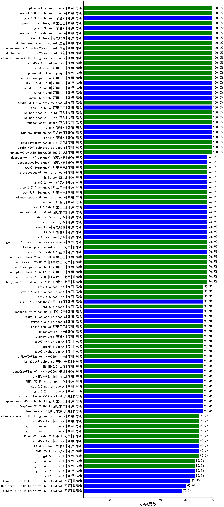

|类别|机构|大模型|【小学奥数】准确率|平均耗时|平均消耗token|花费/千次（元）|排名（准确率）|
|---|---|-----|-------------------|-------|-----------|-----------|-----------|
|商用|google|gemini-3-pro-preview|100.0%|62s|1102|91.7|1|
|商用|百度|ERNIE-X1.1-Preview|100.0%|119s|855|3.3|2|
|开源|月之暗面|Kimi-K2.5-Thinking|100.0%|70s|811|16.5|3|
|商用|豆包|doubao-seed-1-6-250615|100.0%|108s|314|2.0|4|
|商用|豆包|doubao-seed-1-6-flash-250615|100.0%|5s|350|0.5|5|
|商用|anthropic|claude-4-sonnet|100.0%|42s|354|32.6|6|
|开源|智谱AI|GLM-5(new)|100.0%|52s|1078|19.0|7|
|商用|百度|ERNIE-4.5-Turbo-32K|100.0%|23s|561|1.7|8|
|商用|openAI|o4-mini|100.0%|34s|566|16.8|9|
|商用|google|gemini-2.5-pro|100.0%|236s|1547|109.8|10|
|开源|阿里巴巴|qwen3.5-plus(new)|100.0%|24s|1838|8.7|11|
|商用|google|gemini-3.1-pro-preview(new)|100.0%|17s|929|76.9|12|
|商用|百度|ERNIE-5.0-Thinking-Preview|96.7%|89s|1156|27.3|13|
|开源|阿里巴巴|Qwen3-30B-A3B-Thinking-2507|96.7%|325s|1030|2.8|14|
|商用|阿里巴巴|qwen-plus-2025-07-28|96.7%|321s|400|0.7|15|
|开源|豆包|Seed-OSS-36B-Instruct|96.7%|392s|1020|4.0|16|
|开源|阿里巴巴|Qwen3-30B-A3B-Instruct-2507|96.7%|315s|434|1.2|17|
|开源|智谱AI|GLM-4.5|96.7%|81s|2000|27.6|18|
|开源|深度求索|DeepSeek-V3.2-Exp|96.7%|260s|333|1.0|19|
|商用|腾讯|hunyuan-turbos-20250926|96.7%|10s|420|0.7|20|
|商用|anthropic|claude-opus-4.5|96.7%|6s|323|50.2|21|
|开源|智谱AI|GLM-4.6|96.7%|36s|1465|20.1|22|
|商用|阿里巴巴|qwen-plus-2025-12-01|96.7%|11s|389|0.7|23|
|商用|豆包|doubao-seed-1-6-251015|96.7%|4s|498|3.5|24|
|商用|阿里巴巴|qwen-plus-think-2025-12-01|96.7%|21s|977|7.5|25|
|开源|月之暗面|Kimi-K2-Thinking|96.7%|146s|1208|18.9|26|
|开源|腾讯|Hunyuan-A13B-Instruct-nothink|96.7%|730s|342|1.2|27|
|商用|豆包|doubao-seed-1-6-lite-251015|96.7%|47s|411|0.9|28|
|商用|豆包|doubao-seed-1-6-flash-thinking-250615|96.7%|8s|592|0.8|29|
|商用|anthropic|claude-opus-4.6|96.7%|8s|254|37.2|30|
|商用|阿里巴巴|qwen-flash-2025-07-28|93.3%|292s|398|0.5|31|
|开源|智谱AI|GLM-4.5-Air-nothink|93.3%|26s|1166|6.8|32|
|商用|智谱AI|GLM-4.5-Flash-nothink|93.3%|38s|1182|0.0|33|
|商用|openAI|gpt-5.4(new)|93.3%|3s|136|11.0|34|
|开源|深度求索|DeepSeek-V3.2-Exp-Think|93.3%|175s|653|1.9|35|
|开源|meta|Llama-4-Maverick-17B-128E-Instruct-FP8|93.3%|5s|354|1.4|36|
|开源|阿里巴巴|qwen3-next-80b-a3b-instruct|93.3%|344s|366|1.3|37|
|开源|阿里巴巴|Qwen3-32B|93.3%|71s|2195|8.6|38|
|商用|google|gemini-2.5-flash|93.3%|242s|897|15.7|39|
|开源|阶跃星辰|step-3|93.3%|162s|1981|7.8|40|
|商用|阿里巴巴|qwen-flash-think-2025-07-28|93.3%|282s|994|1.4|41|
|开源|深度求索|DeepSeek-V3.1|93.3%|17s|300|3.3|42|
|开源|深度求索|DeepSeek-V3.1-Think|93.3%|32s|648|7.5|43|
|商用|阿里巴巴|qwen3-max-preview|93.3%|295s|321|6.9|44|
|开源|阿里巴巴|Qwen3-8B|93.3%|110s|3933|0.0|45|
|商用|anthropic|claude-sonnet-4.5-thinking|93.3%|8s|640|62.6|46|
|开源|阿里巴巴|Qwen3-14B|93.3%|42s|2973|5.9|47|
|开源|智谱AI|GLM-4.5-nothink|93.3%|313s|849|11.4|48|
|商用|智谱AI|GLM-5-Turbo(new)|93.3%|30s|795|16.9|49|
|商用|openAI|gpt-5.4-high(new)|93.3%|19s|219|19.7|50|
|开源|阿里巴巴|qwen3-235b-a22b-thinking-2507|93.3%|383s|998|16.2|51|
|商用|openAI|gpt-5.1-high|93.3%|10s|361|23.3|52|
|开源|腾讯|Hunyuan-A13B-Instruct|93.3%|367s|691|2.7|53|
|商用|腾讯|hunyuan-t1-20250711|93.3%|324s|957|3.6|54|
|商用|XAI|grok-4-1-fast-reasoning|93.3%|122s|624|1.8|55|
|开源|百度|ERNIE-4.5-300B-A47B|93.3%|526s|586|4.4|56|
|开源|阿里巴巴|qwen3-235b-a22b-instruct-2507|93.3%|241s|381|2.8|57|
|商用|阿里巴巴|qwen-plus-think-2025-07-28|93.3%|922s|1014|7.8|58|
|商用|阿里巴巴|qwen3.6-plus(new)|93.3%|42s|1190|13.9|59|
|开源|minimax|MiniMax-M2|93.3%|43s|1167|9.4|60|
|开源|月之暗面|kimi-k2-0905|93.3%|90s|762|11.5|61|
|商用|智谱AI|GLM-4.5-Flash|93.3%|53s|1752|0.0|62|
|开源|智谱AI|GLM-4.5-Air|93.3%|43s|1887|11.1|63|
|商用|anthropic|claude-sonnet-4.5(new)|93.3%|9s|300|28.2|64|
|商用|阿里巴巴|qwen-turbo-think-2025-07-15|90.0%|885s|2086|6.1|65|
|商用|openAI|gpt-5.1-medium|90.0%|184s|326|20.8|66|
|商用|anthropic|claude-haiku-4.5-thinking|90.0%|35s|696|22.5|67|
|商用|openAI|gpt-5-nano-2025-08-07|90.0%|354s|1004|2.8|68|
|开源|阿里巴巴|Qwen3-4B|90.0%|18s|1633|4.8|69|
|开源|深度求索|DeepSeek-R1-0528|90.0%|128s|1978|31.2|70|
|商用|XAI|grok-3-mini|90.0%|334s|743|2.6|71|
|商用|openAI|gpt-5.2|90.0%|9s|138|10.5|72|
|商用|anthropic|claude-4-sonnet-thinking|90.0%|48s|651|64.8|73|
|开源|智谱AI|GLM-4.7-Flash|90.0%|1374s|1215|0.0|74|
|商用|minimax|MiniMax-M2.5(new)|90.0%|17s|789|6.2|75|
|开源|阿里巴巴|Qwen3-32B-nothink|90.0%|362s|354|1.3|76|
|商用|openAI|gpt-5-2025-08-07|90.0%|24s|353|23.0|77|
|商用|openAI|gpt-5-mini-2025-08-07|90.0%|262s|453|6.0|78|
|开源|阿里巴巴|Qwen3-1.7B|86.7%|20s|2446|7.2|79|
|开源|openAI|gpt-oss-120b|86.7%|87s|563|1.6|80|
|开源|openAI|gpt-oss-20b|86.7%|225s|1189|1.3|81|
|商用|openAI|gpt-5.1|86.7%|97s|157|8.8|82|
|开源|阿里巴巴|Qwen3-4B-nothink|86.7%|322s|362|1.0|83|
|商用|anthropic|claude-haiku-4.5|86.7%|32s|322|9.8|84|
|商用|阿里巴巴|qwen-turbo-2025-07-15|86.7%|301s|314|0.2|85|
|开源|阿里巴巴|Qwen3-14B-nothink|86.7%|222s|343|0.6|86|
|商用|百川智能|Baichuan4-Air|83.3%|/|/|/|87|
|开源|百度|ERNIE-4.5-21B-A3B|83.3%|271s|830|0.6|88|
|商用|百川智能|Baichuan4-Turbo|83.3%|/|/|/|89|
|商用|google|gemini-2.5-flash-lite|83.3%|252s|1153|3.3|90|
|开源|google|gemma-3-12b-it|83.3%|/|/|/|91|
|开源|meta|Llama-4-Scout-17B-16E-Instruct|80.0%|3s|243|0.5|92|
|商用|XAI|grok-4-1-fast-non-reasoning|76.7%|111s|392|1.0|93|
|开源|google|gemma-3-27b-it|76.7%|/|/|/|94|
|开源|智谱AI|GLM-4-9B-0414|73.3%|7s|272|0.0|95|
|开源|google|gemma-3-4b-it|70.0%|/|/|/|96|
|开源|阿里巴巴|Qwen3-1.7B-nothink|66.7%|18s|414|1.1|97|
|开源|阿里巴巴|Qwen3-0.6B|56.7%|12s|2191|6.5|98|
|开源|深度求索|DeepSeek-R1-0528-Qwen3-8B|50.0%|522s|1911|0.0|99|
|开源|Mistral|Mistral-Small-3.2-24B-Instruct-2506|50.0%|41s|2061|4.4|100|
|商用|百度|ERNIE-X1-Turbo-32K|50.0%|377s|1129|4.4|101|
|商用|XAI|grok-4-0709|50.0%|328s|1289|136.2|102|
|开源|阿里巴巴|Qwen3-0.6B-nothink|50.0%|17s|284|0.7|103|
|商用|科大讯飞|xunfei-spark-x1-0725|50.0%|/|1196|14.4|104|
|开源|百度|ERNIE-4.5-0.3B|20.0%|49s|647|0.1|105|
|开源|google|gemma-4-31b-it(new)|/%|29s|207|0.5|106|
|开源|美团|LongCat-Flash-Lite(new)|/%|305s|566|0.0|107|
|商用|小米|MiMo-V2-Flash-0204(new)|/%|24s|332|0.6|108|
|商用|小米|MiMo-V2-Flash-think-0204(new)|/%|270s|1624|3.3|109|
|商用|豆包|Doubao-Seed-2.0-pro(new)|/%|/|600|8.6|110|
|商用|豆包|Doubao-Seed-2.0-lite(new)|/%|/|534|1.7|111|
|商用|豆包|Doubao-Seed-2.0-mini(new)|/%|/|765|1.4|112|
|商用|openAI|gpt-5.4-nano(new)|/%|/|/|1.0|113|
|商用|小米|MiMo-V2-Omni(new)|/%|44s|788|7.9|114|
|商用|openAI|gpt-5.4-mini-high(new)|/%|/|/|6.8|115|
|开源|阿里巴巴|Qwen3.5-27B(new)|/%|315s|1894|8.9|116|
|开源|阿里巴巴|Qwen3.5-122B-A10B(new)|/%|95s|2009|12.6|117|
|商用|google|gemini-3.1-flash-lite-preview(new)|/%|3s|191|1.7|118|
|商用|openAI|gpt-5.3-chat(new)|/%|10s|216|17.9|119|
|商用|小米|MiMo-V2-Pro(new)|/%|8s|644|9.6|120|
|商用|minimax|MiniMax-M2.7(new)|/%|/|/|6.4|121|
|商用|openAI|gpt-5.4-nano-high(new)|/%|/|/|2.4|122|
|商用|openAI|gpt-5.4-mini(new)|/%|/|/|3.1|123|
|开源|阿里巴巴|qwen3.5-flash(new)|/%|304s|2034|4.0|124|
|商用|阿里巴巴|qwen3-max-2026-01-23|/%|104s|264|2.4|125|
|开源|阶跃星辰|step-3.5-flash|/%|18s|962|2.0|126|
|商用|阿里巴巴|qwen3-max-think-2026-01-23|/%|162s|1112|10.8|127|
|商用|Mistral|mistral-medium-2508|/%|352s|378|4.9|128|
|开源|阿里巴巴|Qwen3-8B-nothink|/%|22s|497|0.0|129|
|商用|阿里巴巴|qwen3-max-2025-09-23|/%|240s|261|5.6|130|
|商用|openAI|gpt-5-mini-high|/%|560s|627|8.6|131|
|商用|openAI|gpt-5-nano-high|/%|41s|1563|4.4|132|
|开源|深度求索|DeepSeek-V3.2|/%|102s|299|0.9|133|
|开源|深度求索|DeepSeek-V3.2-Think|/%|19s|569|1.7|134|
|开源|阿里巴巴|qwen3-next-80b-a3b-thinking|/%|16s|1206|4.7|135|
|开源|Mistral|mistral-large-2512|/%|7s|295|2.9|136|
|开源|Mistral|Ministral-3-14B-Instruct-2512|/%|12s|285|0.4|137|
|开源|Mistral|Ministral-3-8B-Instruct-2512|/%|12s|315|0.3|138|
|开源|Mistral|Ministral-3-3B-Instruct-2512|/%|11s|351|0.2|139|
|商用|腾讯|hunyuan-2.0-instruct-20251111|/%|4s|385|0.7|140|
|商用|腾讯|hunyuan-2.0-thinking-20251109|/%|7s|726|2.8|141|
|商用|openAI|gpt-5.2-high|/%|7s|205|17.1|142|
|商用|openAI|gpt-5.2-medium|/%|7s|188|15.4|143|
|商用|google|gemini-3-flash-preview|/%|11s|649|13.3|144|
|商用|豆包|doubao-seed-1-8-251215|/%|17s|354|2.3|145|
|开源|小米|MiMo-V2-Flash|/%|57s|302|0.0|146|
|开源|小米|MiMo-V2-Flash-think|/%|173s|1399|0.0|147|
|开源|智谱AI|GLM-4.7|/%|35s|1257|17.2|148|
|商用|minimax|MiniMax-M2.1|/%|89s|757|5.9|149|
|商用|阿里巴巴|qwen3-max-preview-think|/%|58s|832|19.2|150|
|开源|美团|LongCat-Flash-Thinking-2601|/%|413s|1658|0.0|151|
|商用|百度|ERNIE-5.0|/%|114s|1318|31.2|152|
|开源|google|gemma-4-26b-a4b-it(new)|/%|46s|248|0.6|153|

