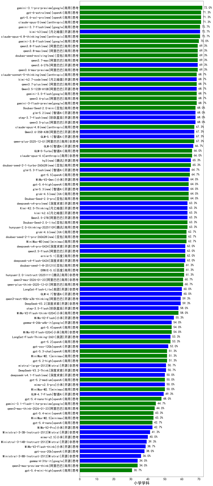

|类别|机构|大模型|【小学学科】准确率|平均耗时|平均消耗token|花费/千次（元）|排名（准确率）|
|---|---|-----|-------------------|-------|-----------|-----------|-----------|
|商用|anthropic|claude-4-sonnet|73.3%|43s|358|32.1|1|
|商用|google|gemini-3-pro-preview(new)|70.7%|41s|2124|176.9|2|
|开源|百度|ERNIE-4.5-300B-A47B|70.0%|117s|434|3.1|3|
|商用|百度|ERNIE-4.5-Turbo-32K|69.1%|133s|601|1.8|4|
|商用|阿里巴巴|qwen-plus-think-2025-07-28|68.7%|/|2009|15.6|5|
|商用|google|gemini-3-flash-preview(new)|68.7%|62s|1903|39.5|6|
|商用|腾讯|hunyuan-t1-20250711|68.0%|57s|1407|5.2|7|
|商用|阿里巴巴|qwen-plus-2025-12-01(new)|67.3%|29s|1274|2.5|8|
|开源|阿里巴巴|Qwen3-30B-A3B-Thinking-2507|67.3%|103s|2104|5.8|9|
|商用|anthropic|claude-opus-4.5(new)|67.3%|15s|694|111.5|10|
|商用|豆包|doubao-seed-1-6-251015|66.7%|51s|1146|8.6|11|
|开源|智谱AI|GLM-5(new)|66.7%|112s|2939|52.1|12|
|商用|阿里巴巴|qwen3-max-preview|66.0%|72s|512|11.2|13|
|商用|anthropic|claude-opus-4.6(new)|66.0%|18s|469|70.2|14|
|开源|智谱AI|GLM-4.6|64.0%|42s|2158|29.6|15|
|商用|豆包|doubao-seed-1-6-250615|64.0%|70s|362|2.3|16|
|商用|科大讯飞|xunfei-spark-x1-0725|63.3%|/|1266|15.2|17|
|开源|月之暗面|Kimi-K2.5-Thinking(new)|63.3%|483s|3281|68.0|18|
|商用|腾讯|hunyuan-2.0-thinking-20251109|63.3%|55s|1828|7.2|19|
|开源|腾讯|Hunyuan-A13B-Instruct|62.7%|177s|1047|4.0|20|
|商用|豆包|doubao-seed-1-6-thinking-250715|62.7%|14s|1204|9.2|21|
|开源|美团|LongCat-Flash-Thinking-2601(new)|62.7%|281s|3874|0.0|22|
|开源|阿里巴巴|qwen3-235b-a22b-thinking-2507|62.0%|153s|2277|41.1|23|
|商用|阿里巴巴|qwen3-max-2025-09-23|61.3%|253s|903|20.6|24|
|商用|豆包|doubao-seed-1-8-251215(new)|61.3%|22s|652|4.5|25|
|商用|腾讯|hunyuan-2.0-instruct-20251111|61.3%|29s|682|1.3|26|
|商用|百度|ERNIE-5.0(new)|61.3%|222s|2859|67.7|27|
|开源|智谱AI|GLM-4.5-nothink|60.7%|75s|960|12.7|28|
|商用|豆包|doubao-seed-1-6-flash-thinking-250615|60.7%|7s|842|1.1|29|
|商用|阿里巴巴|qwen3-max-2026-01-23(new)|60.7%|145s|907|8.6|30|
|商用|阿里巴巴|qwen-plus-think-2025-12-01(new)|60.7%|93s|3039|23.9|31|
|开源|深度求索|DeepSeek-V3.2-Exp|60.7%|135s|335|1.0|32|
|开源|阿里巴巴|qwen3-next-80b-a3b-instruct|60.0%|47s|543|2.0|33|
|开源|智谱AI|GLM-4.7(new)|60.0%|66s|2614|36.0|34|
|商用|anthropic|claude-sonnet-4.5-thinking|59.3%|32s|2307|241.0|35|
|商用|百度|ERNIE-X1.1-Preview|59.3%|152s|1646|6.4|36|
|商用|豆包|doubao-seed-1-6-lite-251015|59.3%|22s|806|1.8|37|
|开源|深度求索|DeepSeek-V3.2(new)|59.3%|81s|620|1.8|38|
|开源|阿里巴巴|qwen3-next-80b-a3b-thinking|59.3%|166s|4114|16.3|39|
|开源|深度求索|DeepSeek-V3.1-Think|58.7%|52s|1083|12.6|40|
|商用|百度|ERNIE-5.0-Thinking-Preview|58.7%|237s|2279|53.8|41|
|商用|XAI|grok-4-0709|58.5%|225s|1277|133.9|42|
|开源|阶跃星辰|step-3.5-flash(new)|58.0%|32s|3655|7.6|43|
|商用|阿里巴巴|qwen-flash-2025-07-28|58.0%|10s|603|0.8|44|
|商用|google|gemini-2.5-pro|58.0%|44s|1782|125.6|45|
|商用|阿里巴巴|qwen-plus-2025-07-28|57.3%|90s|580|1.1|46|
|开源|阿里巴巴|qwen3-235b-a22b-instruct-2507|57.3%|40s|537|3.9|47|
|商用|阿里巴巴|qwen-flash-think-2025-07-28|56.7%|58s|2077|3.0|48|
|商用|openAI|gpt-5-2025-08-07|56.7%|81s|415|26.6|49|
|商用|openAI|o4-mini|56.7%|31s|559|16.4|50|
|商用|豆包|doubao-seed-1-6-flash-250615|56.7%|3s|401|0.5|51|
|商用|anthropic|claude-4-sonnet-thinking|56.7%|49s|778|77.7|52|
|开源|深度求索|DeepSeek-R1-0528-Qwen3-8B|56.2%|354s|2182|0.0|53|
|开源|小米|MiMo-V2-Flash(new)|55.3%|55s|1097|0.0|54|
|商用|豆包|Doubao-1.5-lite-32k-250115|54.8%|4s|241|0.1|55|
|商用|anthropic|claude-sonnet-4.5(new)|54.7%|11s|518|48.9|56|
|商用|阿里巴巴|qwen-turbo-2025-07-15|54.7%|48s|402|0.2|57|
|开源|腾讯|Hunyuan-A13B-Instruct-nothink|54.0%|147s|382|1.4|58|
|商用|XAI|grok-4-1-fast-reasoning|54.0%|50s|1531|5.0|59|
|商用|百度|ERNIE-X1-Turbo-32K|53.8%|139s|1468|5.7|60|
|开源|阿里巴巴|Qwen3-14B|53.4%|83s|2675|5.3|61|
|商用|openAI|gpt-5.2(new)|53.3%|7s|238|18.2|62|
|商用|openAI|gpt-5.1-medium|53.3%|107s|808|53.5|63|
|商用|智谱AI|GLM-4.5-Flash-nothink|52.7%|30s|1061|0.0|64|
|开源|深度求索|DeepSeek-R1-0528|52.4%|163s|1858|29.1|65|
|开源|openAI|gpt-oss-120b|52.0%|122s|681|1.9|66|
|开源|深度求索|DeepSeek-V3.2-Exp-Think|52.0%|166s|1134|3.4|67|
|商用|minimax|MiniMax-M2.1(new)|51.3%|96s|2226|18.1|68|
|商用|XAI|grok-3-mini|51.3%|160s|1050|3.7|69|
|商用|openAI|gpt-5.2-high(new)|51.3%|15s|703|64.5|70|
|开源|智谱AI|GLM-4.5|51.3%|57s|1713|23.4|71|
|开源|Mistral|mistral-large-2512(new)|50.7%|17s|782|7.9|72|
|商用|腾讯|hunyuan-turbos-20250926|50.7%|13s|605|1.1|73|
|开源|深度求索|DeepSeek-V3.2-Think(new)|50.7%|180s|1929|5.7|74|
|商用|openAI|gpt-5.2-medium(new)|50.0%|11s|511|45.3|75|
|开源|智谱AI|GLM-4.7-Flash(new)|49.3%|1754s|4699|0.0|76|
|开源|月之暗面|kimi-k2-0711-preview|49.3%|48s|581|8.7|77|
|商用|openAI|gpt-5-mini-2025-08-07|49.3%|71s|715|9.6|78|
|开源|阿里巴巴|Qwen3-32B|48.4%|97s|2121|8.3|79|
|开源|月之暗面|kimi-k2-0905|48.0%|129s|671|9.8|80|
|开源|阿里巴巴|Qwen3-4B|47.6%|134s|2759|8.1|81|
|开源|meta|Llama-4-Maverick-17B-128E-Instruct-FP8|47.3%|7s|459|1.8|82|
|开源|豆包|Seed-OSS-36B-Instruct|47.3%|164s|1684|6.6|83|
|商用|google|gemini-2.5-flash-lite|47.3%|57s|1102|3.1|84|
|开源|百度|ERNIE-4.5-21B-A3B|46.7%|81s|572|0.3|85|
|开源|深度求索|DeepSeek-V3.1|46.7%|20s|399|4.4|86|
|开源|阿里巴巴|Qwen3-30B-A3B-Instruct-2507|46.0%|41s|572|1.6|87|
|商用|openAI|gpt-5.1-high|46.0%|86s|1772|121.9|88|
|开源|月之暗面|Kimi-K2-Thinking|46.0%|267s|4558|72.3|89|
|开源|智谱AI|GLM-4.5-Air-nothink|45.3%|78s|1307|7.5|90|
|商用|百川智能|Baichuan4-Turbo|44.8%|/|/|/|91|
|商用|阿里巴巴|qwen3-max-think-2026-01-23(new)|44.0%|354s|3851|38.0|92|
|开源|Mistral|Mistral-Small-3.2-24B-Instruct-2506|43.8%|102s|666|1.4|93|
|商用|anthropic|claude-haiku-4.5|43.3%|13s|563|17.6|94|
|商用|百川智能|Baichuan4-Air|42.2%|/|/|/|95|
|开源|Mistral|Magistral-Small-2507|41.9%|76s|4512|48.6|96|
|开源|google|gemma-3-4b-it|41.5%|/|/|/|97|
|开源|meta|Llama-4-Scout-17B-16E-Instruct|41.5%|11s|481|1.0|98|
|开源|Mistral|Ministral-3-3B-Instruct-2512(new)|41.3%|23s|2638|1.9|99|
|开源|阿里巴巴|Qwen3-4B-nothink|40.7%|50s|479|1.3|100|
|商用|openAI|gpt-5.1|40.7%|116s|292|16.8|101|
|商用|360|360zhinao2-o1|40.6%|/|/|/|102|
|商用|anthropic|claude-haiku-4.5-thinking|40.0%|36s|4009|141.6|103|
|开源|阿里巴巴|Qwen3-32B-nothink|40.0%|61s|465|1.7|104|
|开源|Mistral|Ministral-3-14B-Instruct-2512(new)|39.3%|21s|1628|2.3|105|
|商用|阿里巴巴|qwen-long-2025-01-25|38.9%|29s|300|0.5|106|
|开源|小米|MiMo-V2-Flash-think(new)|38.7%|105s|3349|0.0|107|
|开源|openAI|gpt-oss-20b|38.0%|69s|1195|1.3|108|
|商用|openAI|gpt-5-nano-high|38.0%|217s|4623|13.2|109|
|商用|阿里巴巴|qwen-turbo-think-2025-07-15|36.7%|/|2274|6.7|110|
|开源|Mistral|Ministral-3-8B-Instruct-2512(new)|36.0%|29s|2862|3.1|111|
|商用|google|gemini-2.5-flash|35.3%|37s|1409|24.6|112|
|开源|阿里巴巴|Qwen3-0.6B-nothink|35.3%|83s|221|0.5|113|
|商用|Mistral|mistral-medium-2508|35.2%|16s|418|5.3|114|
|开源|google|gemma-3-27b-it|34.8%|/|/|/|115|
|开源|阿里巴巴|Qwen3-8B|34.3%|197s|4844|0.0|116|
|商用|阿里巴巴|qwen3-max-preview-think(new)|34.0%|136s|3241|76.6|117|
|开源|智谱AI|GLM-4.5-Air|32.7%|95s|1951|11.4|118|
|开源|阿里巴巴|Qwen3-1.7B|31.4%|120s|3065|9.0|119|
|开源|minimax|MiniMax-M1|31.4%|204s|3956|29.4|120|
|开源|minimax|MiniMax-M2|31.3%|99s|2816|23.1|121|
|商用|openAI|gpt-5-mini-high|31.3%|374s|2093|29.6|122|
|开源|智谱AI|GLM-4-9B-0414|30.0%|8s|286|0.0|123|
|商用|XAI|grok-4-1-fast-non-reasoning|28.7%|76s|486|1.3|124|
|开源|阿里巴巴|Qwen3-1.7B-nothink|28.0%|81s|432|1.1|125|
|开源|阶跃星辰|step-3|23.3%|129s|2205|8.7|126|
|商用|openAI|gpt-5-nano-2025-08-07|22.0%|64s|1659|4.7|127|
|开源|google|gemma-3-12b-it|18.9%|/|/|/|128|
|商用|智谱AI|GLM-4.5-Flash|18.0%|44s|1768|0.0|129|
|开源|minimax|MiniMax-Text-01|16.8%|7s|857|6.9|130|
|开源|阿里巴巴|Qwen3-14B-nothink|16.0%|44s|549|1.0|131|
|开源|阿里巴巴|Qwen3-0.6B|11.4%|61s|1699|4.9|132|
|开源|阿里巴巴|Qwen3-8B-nothink|10.7%|29s|444|0.0|133|
|开源|百度|ERNIE-4.5-0.3B|4.0%|107s|409|0.0|134|
|商用|百度|ERNIE-Lite-8K|3.4%|/|/|/|135|

