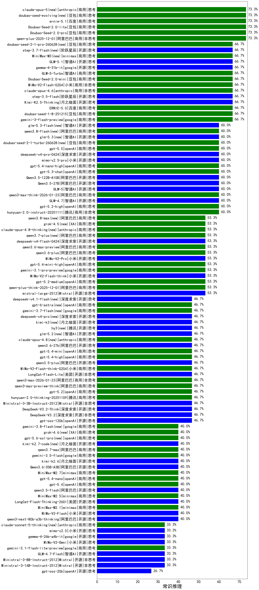

|类别|机构|大模型|【常识推理】准确率|平均耗时|平均消耗token|花费/千次（元）|排名（准确率）|
|---|---|-----|-------------------|-------|-----------|-----------|-----------|
|商用|openAI|o4-mini|80.0%|26s|559|16.4|1|
|商用|openAI|gpt-5.1|73.3%|186s|73|1.7|2|
|商用|openAI|gpt-5.1-medium|73.3%|165s|322|19.4|3|
|商用|阿里巴巴|qwen-plus-2025-12-01|73.3%|17s|589|1.1|4|
|商用|豆包|Doubao-Seed-2.0-lite(new)|73.3%|269s|1276|4.3|5|
|商用|豆包|Doubao-Seed-2.0-pro(new)|73.3%|207s|953|14.1|6|
|商用|openAI|gpt-5.1-high|73.3%|22s|942|63.4|7|
|开源|智谱AI|GLM-5.1(new)|66.7%|261s|1740|40.9|8|
|开源|阶跃星辰|step-3.5-flash|66.7%|25s|2408|5.0|9|
|商用|anthropic|claude-opus-4.6|66.7%|6s|247|32.7|10|
|商用|百度|ERNIE-5.0|66.7%|89s|1388|32.6|11|
|开源|google|gemma-4-31b-it(new)|66.7%|11s|111|0.2|12|
|商用|anthropic|claude-sonnet-4.5(new)|66.7%|7s|394|36.2|13|
|商用|智谱AI|GLM-5-Turbo(new)|66.7%|70s|1199|25.6|14|
|商用|小米|MiMo-V2-Flash-0204(new)|66.7%|170s|307|0.6|15|
|商用|豆包|Doubao-Seed-2.0-mini(new)|66.7%|497s|2958|5.8|16|
|商用|豆包|doubao-seed-1-8-251215|66.7%|25s|554|3.8|17|
|商用|google|gemini-3-flash-preview|66.7%|126s|1367|28.3|18|
|开源|月之暗面|Kimi-K2.5-Thinking|66.7%|192s|1652|33.9|19|
|商用|阿里巴巴|qwen3-max-think-2026-01-23|60.0%|510s|3251|32.1|20|
|商用|openAI|gpt-5.4-nano-high(new)|60.0%|7s|351|2.7|21|
|开源|智谱AI|GLM-4.7|60.0%|130s|3738|51.8|22|
|开源|美团|LongCat-Flash-Thinking-2601|60.0%|566s|1835|0.0|23|
|商用|腾讯|hunyuan-2.0-instruct-20251111|60.0%|10s|482|0.9|24|
|商用|openAI|gpt-5.2-high|60.0%|6s|282|23.2|25|
|开源|智谱AI|GLM-5(new)|60.0%|139s|2867|51.0|26|
|商用|anthropic|claude-4-sonnet-thinking|60.0%|43s|358|32.4|27|
|商用|anthropic|claude-sonnet-4.5-thinking|60.0%|20s|1068|107.0|28|
|商用|openAI|gpt-5.3-chat(new)|60.0%|6s|263|21.0|29|
|开源|阿里巴巴|Qwen3.5-27B(new)|60.0%|193s|3966|18.8|30|
|开源|阿里巴巴|Qwen3.5-122B-A10B(new)|60.0%|589s|3931|24.9|31|
|商用|anthropic|claude-opus-4.5|53.3%|21s|315|45.3|32|
|商用|openAI|gpt-5.4-mini-high(new)|53.3%|48s|706|20.8|33|
|商用|阿里巴巴|qwen3-max-2025-09-23|53.3%|224s|288|6.0|34|
|商用|openAI|gpt-5-nano-high|53.3%|465s|4259|12.2|35|
|开源|Mistral|mistral-large-2512|53.3%|7s|273|2.5|36|
|商用|XAI|grok-4-1-fast-reasoning|53.3%|16s|1464|4.8|37|
|商用|anthropic|claude-haiku-4.5-thinking|53.3%|15s|1666|56.9|38|
|商用|小米|MiMo-V2-Pro(new)|53.3%|303s|1063|18.3|39|
|商用|阿里巴巴|qwen-plus-think-2025-12-01|53.3%|28s|1333|10.3|40|
|开源|小米|MiMo-V2-Flash-think|53.3%|26s|1731|0.0|41|
|商用|openAI|gpt-5.2-medium|53.3%|8s|209|16.0|42|
|商用|google|gemini-3.1-pro-preview(new)|53.3%|45s|2481|208.1|43|
|商用|阿里巴巴|qwen3.6-plus(new)|53.3%|31s|1309|15.2|44|
|开源|meta|Llama-4-Maverick-17B-128E-Instruct-FP8|46.7%|6s|492|2.0|45|
|开源|深度求索|DeepSeek-V3.2-Exp-Think|46.7%|307s|1272|3.8|46|
|开源|google|gemma-3-12b-it|46.7%|/|/|/|47|
|商用|openAI|gpt-5.4-high(new)|46.7%|9s|467|44.1|48|
|商用|openAI|gpt-5.2|46.7%|2s|92|4.3|49|
|开源|阿里巴巴|qwen3.5-plus(new)|46.7%|57s|4499|21.4|50|
|商用|XAI|grok-4-1-fast-non-reasoning|46.7%|116s|414|1.0|51|
|商用|小米|MiMo-V2-Flash-think-0204(new)|46.7%|826s|1726|3.5|52|
|商用|google|gemini-3-pro-preview|46.7%|52s|2785|234.0|53|
|开源|美团|LongCat-Flash-Lite(new)|46.7%|49s|404|0.0|54|
|商用|百度|ERNIE-4.5-Turbo-32K|46.7%|9s|208|0.6|55|
|商用|openAI|gpt-5.4-mini(new)|46.7%|2s|101|1.7|56|
|商用|阿里巴巴|qwen-flash-2025-07-28|46.7%|6s|320|0.4|57|
|开源|月之暗面|Kimi-K2-Thinking|46.7%|294s|4990|79.3|58|
|商用|百度|ERNIE-5.0-Thinking-Preview|46.7%|261s|952|22.1|59|
|商用|腾讯|hunyuan-2.0-thinking-20251109|46.7%|20s|1477|5.8|60|
|商用|openAI|gpt-5-2025-08-07|46.7%|24s|224|13.3|61|
|商用|阿里巴巴|qwen3-max-preview-think|46.7%|88s|3084|73.1|62|
|开源|openAI|gpt-oss-120b|46.7%|2s|412|1.1|63|
|开源|Mistral|Ministral-3-3B-Instruct-2512|46.7%|12s|951|0.7|64|
|商用|openAI|gpt-5-mini-high|46.7%|79s|1856|26.2|65|
|商用|阿里巴巴|qwen3-max-2026-01-23|46.7%|12s|221|1.8|66|
|开源|深度求索|DeepSeek-V3.2|46.7%|106s|258|0.7|67|
|开源|深度求索|DeepSeek-V3.2-Think|46.7%|65s|1901|5.7|68|
|开源|阿里巴巴|Qwen3-30B-A3B-Instruct-2507|46.7%|2s|294|0.8|69|
|开源|小米|MiMo-V2-Flash|40.0%|49s|254|0.0|70|
|开源|阿里巴巴|qwen3.5-flash(new)|40.0%|177s|3967|7.8|71|
|商用|minimax|MiniMax-M2.1|40.0%|76s|3303|27.2|72|
|开源|阿里巴巴|qwen3-next-80b-a3b-thinking|40.0%|226s|2914|11.5|73|
|开源|月之暗面|kimi-k2-0905|40.0%|54s|96|0.7|74|
|商用|minimax|MiniMax-M2.5(new)|40.0%|25s|1226|9.8|75|
|商用|百度|ERNIE-X1.1-Preview|40.0%|94s|1131|4.4|76|
|商用|openAI|gpt-5.4(new)|40.0%|3s|119|7.6|77|
|开源|豆包|Seed-OSS-36B-Instruct|40.0%|95s|1292|5.0|78|
|商用|豆包|doubao-seed-1-6-lite-251015|40.0%|103s|621|1.3|79|
|开源|Mistral|Mistral-Small-3.2-24B-Instruct-2506|40.0%|31s|255|0.5|80|
|商用|豆包|doubao-seed-1-6-251015|40.0%|68s|534|3.7|81|
|开源|腾讯|Hunyuan-A13B-Instruct-nothink|40.0%|726s|206|0.7|82|
|商用|minimax|MiniMax-M2.7(new)|40.0%|48s|1842|15.0|83|
|商用|XAI|grok-4-0709|40.0%|132s|1732|184.1|84|
|商用|openAI|gpt-5.4-nano(new)|40.0%|68s|99|0.5|85|
|商用|openAI|gpt-5-mini-2025-08-07|40.0%|27s|659|8.9|86|
|开源|深度求索|DeepSeek-R1-0528-Qwen3-8B|40.0%|797s|1848|0.0|87|
|商用|智谱AI|GLM-4.5-Flash|40.0%|41s|1909|0.0|88|
|商用|阿里巴巴|qwen3-max-preview|40.0%|10s|358|7.7|89|
|开源|智谱AI|GLM-4.6|40.0%|35s|1994|27.4|90|
|开源|阿里巴巴|Qwen3-0.6B|33.3%|38s|1099|3.2|91|
|商用|小米|MiMo-V2-Omni(new)|33.3%|120s|1255|14.3|92|
|开源|阿里巴巴|Qwen3-8B-nothink|33.3%|32s|209|0.0|93|
|开源|百度|ERNIE-4.5-300B-A47B|33.3%|3s|118|0.7|94|
|开源|google|gemma-4-26b-a4b-it(new)|33.3%|30s|298|0.7|95|
|商用|google|gemini-2.5-flash|33.3%|9s|1203|21.1|96|
|开源|智谱AI|GLM-4.7-Flash|33.3%|320s|2463|0.0|97|
|开源|智谱AI|GLM-4-9B-0414|33.3%|4s|139|0.0|98|
|商用|google|gemini-2.5-pro|33.3%|21s|1773|125.8|99|
|商用|腾讯|hunyuan-t1-20250711|33.3%|19s|1059|4.0|100|
|开源|meta|Llama-4-Scout-17B-16E-Instruct|33.3%|2s|187|0.3|101|
|开源|google|gemma-3-4b-it|33.3%|/|/|/|102|
|开源|百度|ERNIE-4.5-0.3B|33.3%|47s|153|0.0|103|
|商用|google|gemini-3.1-flash-lite-preview(new)|33.3%|11s|167|1.3|104|
|商用|anthropic|claude-haiku-4.5|33.3%|6s|391|11.6|105|
|商用|腾讯|hunyuan-turbos-20250926|33.3%|7s|317|0.5|106|
|商用|阿里巴巴|qwen-plus-2025-07-28|33.3%|5s|212|0.4|107|
|开源|Mistral|Ministral-3-8B-Instruct-2512|33.3%|11s|496|0.5|108|
|开源|Mistral|Ministral-3-14B-Instruct-2512|33.3%|5s|585|0.8|109|
|商用|google|gemini-2.5-flash-lite|33.3%|2s|162|0.4|110|
|开源|智谱AI|GLM-4.5|33.3%|78s|1819|25.0|111|
|开源|深度求索|DeepSeek-V3.2-Exp|33.3%|363s|269|0.8|112|
|开源|阿里巴巴|Qwen3-32B-nothink|33.3%|17s|184|0.6|113|
|商用|openAI|gpt-5-nano-2025-08-07|33.3%|110s|1689|4.8|114|
|开源|阿里巴巴|Qwen3-8B|26.7%|44s|955|0.0|115|
|开源|阿里巴巴|Qwen3-14B|26.7%|134s|1604|3.1|116|
|开源|阿里巴巴|Qwen3-32B|26.7%|124s|1529|6.0|117|
|开源|深度求索|DeepSeek-V3.1|26.7%|18s|255|2.7|118|
|开源|阿里巴巴|Qwen3-1.7B|26.7%|80s|1610|4.7|119|
|开源|openAI|gpt-oss-20b|26.7%|202s|650|0.7|120|
|商用|阿里巴巴|qwen-plus-think-2025-07-28|26.7%|/|1653|12.9|121|
|开源|智谱AI|GLM-4.5-nothink|26.7%|11s|333|4.1|122|
|商用|XAI|grok-3-mini|26.7%|136s|1164|4.2|123|
|开源|阶跃星辰|step-3|26.7%|102s|1994|7.9|124|
|商用|阿里巴巴|qwen-turbo-2025-07-15|26.7%|4s|179|0.1|125|
|开源|阿里巴巴|qwen3-235b-a22b-instruct-2507|26.7%|5s|218|1.5|126|
|开源|阿里巴巴|qwen3-235b-a22b-thinking-2507|26.7%|49s|1439|27.9|127|
|开源|阿里巴巴|Qwen3-0.6B-nothink|26.7%|7s|127|0.2|128|
|开源|google|gemma-3-27b-it|20.0%|/|/|/|129|
|开源|阿里巴巴|Qwen3-14B-nothink|20.0%|10s|199|0.3|130|
|开源|百度|ERNIE-4.5-21B-A3B|20.0%|48s|183|0.0|131|
|开源|深度求索|DeepSeek-R1-0528|20.0%|184s|1969|31.0|132|
|商用|Mistral|mistral-medium-2508|20.0%|336s|239|2.8|133|
|商用|anthropic|claude-4-sonnet|20.0%|43s|303|25.7|134|
|商用|豆包|doubao-seed-1-6-250615|20.0%|144s|211|1.1|135|
|开源|腾讯|Hunyuan-A13B-Instruct|20.0%|93s|926|3.6|136|
|商用|智谱AI|GLM-4.5-Flash-nothink|20.0%|9s|343|0.0|137|
|开源|阿里巴巴|Qwen3-1.7B-nothink|20.0%|10s|247|0.6|138|
|商用|科大讯飞|xunfei-spark-x1-0725|20.0%|/|697|8.4|139|
|商用|百川智能|Baichuan4-Air|13.3%|/|/|/|140|
|开源|阿里巴巴|qwen3-next-80b-a3b-instruct|13.3%|11s|463|1.7|141|
|开源|深度求索|DeepSeek-V3.1-Think|13.3%|72s|1370|16.1|142|
|开源|智谱AI|GLM-4.5-Air-nothink|13.3%|4s|334|1.8|143|
|开源|阿里巴巴|Qwen3-30B-A3B-Thinking-2507|13.3%|31s|1352|3.7|144|
|开源|智谱AI|GLM-4.5-Air|13.3%|41s|2153|12.7|145|
|开源|阿里巴巴|Qwen3-4B-nothink|13.3%|11s|236|0.6|146|
|商用|豆包|doubao-seed-1-6-flash-250615|13.3%|1s|172|0.2|147|
|开源|阿里巴巴|Qwen3-4B|13.3%|67s|1043|3.0|148|
|开源|minimax|MiniMax-M2|13.3%|25s|1692|13.7|149|
|商用|百川智能|Baichuan4-Turbo|6.7%|/|/|/|150|
|商用|豆包|doubao-seed-1-6-flash-thinking-250615|6.7%|4s|550|0.7|151|
|商用|百度|ERNIE-X1-Turbo-32K|6.7%|427s|1666|6.6|152|
|商用|阿里巴巴|qwen-turbo-think-2025-07-15|/%|/|1197|3.5|153|
|商用|阿里巴巴|qwen-flash-think-2025-07-28|/%|14s|1255|1.8|154|

