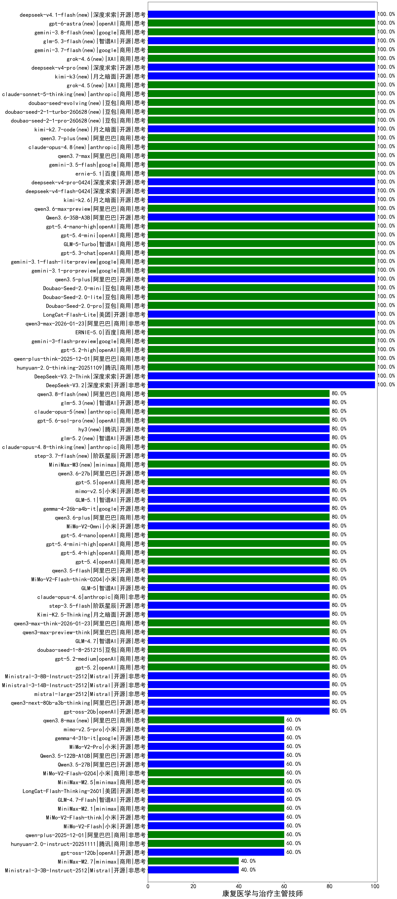

|类别|机构|大模型|【康复医学与治疗主管技师】准确率|平均耗时|平均消耗token|花费/千次（元）|排名（准确率）|
|---|---|-----|-------------------|-------|-----------|-----------|-----------|
|商用|阿里巴巴|qwen-plus-think-2025-12-01|100.0%|58s|3005|23.3|1|
|商用|openAI|gpt-5.2-high|100.0%|16s|644|53.4|2|
|开源|阿里巴巴|qwen3.5-plus|100.0%|28s|2300|10.6|3|
|商用|豆包|Doubao-Seed-2.0-mini|100.0%|441s|1968|3.7|4|
|商用|豆包|Doubao-Seed-2.0-lite|100.0%|188s|861|2.7|5|
|商用|豆包|Doubao-Seed-2.0-pro|100.0%|159s|838|11.5|6|
|开源|美团|LongCat-Flash-Lite|100.0%|104s|453|0.0|7|
|商用|阿里巴巴|qwen3-max-2026-01-23|100.0%|154s|551|4.7|8|
|商用|百度|ERNIE-5.0|100.0%|102s|2176|50.6|9|
|商用|google|gemini-3-flash-preview|100.0%|15s|1139|22.4|10|
|开源|meta|Llama-4-Scout-17B-16E-Instruct|100.0%|8s|594|1.1|11|
|商用|google|gemini-3.1-flash-lite-preview|100.0%|36s|389|3.2|12|
|商用|腾讯|hunyuan-2.0-thinking-20251109|100.0%|8s|884|3.3|13|
|开源|深度求索|DeepSeek-V3.2-Think|100.0%|135s|1489|4.4|14|
|开源|深度求索|DeepSeek-V3.2|100.0%|130s|429|1.2|15|
|商用|阿里巴巴|qwen3-max-2025-09-23|100.0%|255s|695|14.7|16|
|商用|anthropic|claude-sonnet-4.5-thinking|100.0%|24s|1519|148.7|17|
|商用|anthropic|claude-sonnet-4.5|100.0%|12s|678|59.8|18|
|开源|月之暗面|kimi-k2-0905|100.0%|123s|413|5.2|19|
|开源|月之暗面|Kimi-K2-Thinking|100.0%|106s|1965|30.3|20|
|商用|google|gemini-3.1-pro-preview|100.0%|66s|2197|179.7|21|
|商用|openAI|gpt-5.3-chat|100.0%|59s|410|29.7|22|
|商用|豆包|doubao-seed-1-6-251015|100.0%|8s|887|6.1|23|
|商用|阿里巴巴|qwen3.7-max(new)|100.0%|26s|1393|47.7|24|
|商用|XAI|grok-4.5(new)|100.0%|91s|1218|42.7|25|
|商用|anthropic|claude-sonnet-5-thinking(new)|100.0%|13s|604|33.3|26|
|商用|豆包|doubao-seed-evolving(new)|100.0%|136s|5945|174.9|27|
|商用|豆包|doubao-seed-2-1-turbo-260628(new)|100.0%|184s|8213|121.4|28|
|商用|豆包|doubao-seed-2-1-pro-260628(new)|100.0%|202s|9289|275.2|29|
|开源|月之暗面|kimi-k2.7-code(new)|100.0%|51s|1885|48.9|30|
|商用|阿里巴巴|qwen3.7-plus(new)|100.0%|20s|1078|8.0|31|
|商用|anthropic|claude-opus-4.8(new)|100.0%|12s|549|73.8|32|
|商用|google|gemini-3.5-flash(new)|100.0%|9s|1600|95.2|33|
|商用|智谱AI|GLM-5-Turbo|100.0%|48s|1466|30.6|34|
|商用|百度|ernie-5.1(new)|100.0%|48s|866|14.1|35|
|开源|深度求索|deepseek-v4-pro(new)|100.0%|35s|591|13.1|36|
|开源|深度求索|deepseek-v4-flash(new)|100.0%|63s|1118|2.1|37|
|开源|月之暗面|kimi-k2.6(new)|100.0%|119s|2110|55.0|38|
|商用|阿里巴巴|qwen3.6-max-preview|100.0%|49s|1632|83.6|39|
|开源|阿里巴巴|Qwen3.6-35B-A3B|100.0%|10s|1709|17.5|40|
|商用|openAI|gpt-5.4-nano-high|100.0%|32s|686|5.1|41|
|商用|openAI|gpt-5.4-mini|100.0%|90s|288|5.9|42|
|商用|豆包|doubao-seed-1-6-lite-251015|100.0%|32s|737|1.5|43|
|开源|月之暗面|kimi-k3(new)|100.0%|48s|722|58.3|44|
|开源|豆包|Seed-OSS-36B-Instruct|100.0%|125s|1893|7.3|45|
|开源|深度求索|DeepSeek-V3.1|100.0%|21s|446|4.6|46|
|商用|openAI|gpt-5-2025-08-07|100.0%|13s|228|9.2|47|
|开源|阿里巴巴|Qwen3-32B|95.0%|14s|696|2.5|48|
|商用|anthropic|claude-4-sonnet|90.0%|46s|547|47.7|49|
|商用|百度|ERNIE-4.5-Turbo-32K|85.0%|21s|517|1.5|50|
|开源|阿里巴巴|Qwen3-32B-nothink|80.0%|23s|618|2.1|51|
|商用|openAI|gpt-5.4-nano|80.0%|10s|276|1.5|52|
|商用|openAI|gpt-5.4-mini-high|80.0%|17s|1151|33.0|53|
|开源|阿里巴巴|Qwen3-8B-nothink|80.0%|21s|547|0.0|54|
|商用|openAI|gpt-5.4-high|80.0%|17s|985|92.7|55|
|商用|openAI|gpt-5.4|80.0%|6s|308|21.6|56|
|开源|阿里巴巴|Qwen3-14B-nothink|80.0%|37s|726|1.3|57|
|商用|腾讯|hunyuan-turbos-20250926|80.0%|15s|665|1.2|58|
|商用|阿里巴巴|qwen3.6-plus|80.0%|23s|1504|17.0|59|
|开源|阿里巴巴|qwen3.5-flash|80.0%|348s|3095|6.0|60|
|开源|阿里巴巴|qwen3-next-80b-a3b-instruct|80.0%|13s|652|2.3|61|
|开源|智谱AI|GLM-5|80.0%|68s|1903|32.9|62|
|商用|anthropic|claude-opus-4.6|80.0%|11s|712|102.2|63|
|开源|阶跃星辰|step-3.5-flash|80.0%|24s|1965|4.0|64|
|开源|月之暗面|Kimi-K2.5-Thinking|80.0%|356s|2020|40.8|65|
|开源|小米|MiMo-V2-Omni|80.0%|136s|2427|30.0|66|
|开源|阿里巴巴|qwen3-235b-a22b-instruct-2507|80.0%|11s|569|3.9|67|
|开源|google|gemma-4-26b-a4b-it|80.0%|59s|545|1.3|68|
|商用|minimax|MiniMax-M3(new)|80.0%|21s|636|7.4|69|
|商用|openAI|gpt-5.6-sol-pro(new)|80.0%|24s|3754|321.4|70|
|开源|腾讯|hy3(new)|80.0%|77s|252|0.7|71|
|开源|阿里巴巴|Qwen3-8B|80.0%|302s|6942|0.0|72|
|开源|智谱AI|glm-5.2(new)|80.0%|42s|1607|42.9|73|
|商用|anthropic|claude-opus-4.8-thinking(new)|80.0%|24s|740|107.1|74|
|开源|阶跃星辰|step-3.7-flash(new)|80.0%|43s|3793|30.0|75|
|商用|anthropic|claude-4-sonnet-thinking|80.0%|9s|666|58.5|76|
|开源|智谱AI|GLM-5.1|80.0%|27s|1180|26.6|77|
|开源|阿里巴巴|qwen3.6-27b(new)|80.0%|32s|1838|31.6|78|
|商用|openAI|gpt-5.5(new)|80.0%|20s|1214|233.4|79|
|开源|小米|mimo-v2.5(new)|80.0%|19s|1106|11.6|80|
|商用|腾讯|hunyuan-t1-20250711|80.0%|22s|1399|5.2|81|
|商用|阿里巴巴|qwen-turbo-2025-07-15|80.0%|6s|403|0.2|82|
|开源|openAI|gpt-oss-20b|80.0%|8s|1650|1.8|83|
|商用|阿里巴巴|qwen3-max-think-2026-01-23|80.0%|151s|4044|39.6|84|
|商用|小米|MiMo-V2-Flash-think-0204|80.0%|671s|2055|4.1|85|
|开源|Mistral|Ministral-3-8B-Instruct-2512|80.0%|13s|594|0.6|86|
|商用|google|gemini-2.5-flash-lite|80.0%|3s|608|1.5|87|
|开源|阿里巴巴|qwen3-next-80b-a3b-thinking|80.0%|209s|4134|16.2|88|
|商用|阿里巴巴|qwen-flash-think-2025-07-28|80.0%|23s|2414|3.5|89|
|商用|阿里巴巴|qwen-flash-2025-07-28|80.0%|7s|714|0.9|90|
|商用|openAI|gpt-5.2|80.0%|4s|257|14.9|91|
|商用|openAI|gpt-5-mini-high|80.0%|66s|2355|32.6|92|
|商用|openAI|gpt-5-nano-2025-08-07|80.0%|33s|2140|5.9|93|
|开源|深度求索|DeepSeek-V3.1-Think|80.0%|42s|801|8.9|94|
|商用|openAI|gpt-5.2-medium|80.0%|11s|490|38.0|95|
|商用|anthropic|claude-opus-4.5|80.0%|13s|730|107.1|96|
|商用|百度|ERNIE-5.0-Thinking-Preview|80.0%|265s|2657|62.1|97|
|开源|Mistral|Ministral-3-14B-Instruct-2512|80.0%|5s|625|0.9|98|
|商用|百度|ERNIE-X1.1-Preview|80.0%|97s|847|3.1|99|
|商用|阿里巴巴|qwen-turbo-think-2025-07-15|80.0%|/|2103|6.0|100|
|商用|豆包|doubao-seed-1-8-251215|80.0%|21s|689|4.4|101|
|商用|openAI|gpt-5.1-high|80.0%|120s|953|60.1|102|
|商用|阿里巴巴|qwen3-max-preview|80.0%|8s|455|9.0|103|
|商用|anthropic|claude-haiku-4.5-thinking|80.0%|38s|1984|66.0|104|
|商用|anthropic|claude-haiku-4.5|80.0%|7s|700|20.3|105|
|开源|智谱AI|GLM-4.7|80.0%|39s|2128|28.7|106|
|商用|openAI|gpt-5.1-medium|80.0%|187s|696|41.8|107|
|商用|阿里巴巴|qwen3-max-preview-think|80.0%|217s|2375|55.0|108|
|商用|openAI|gpt-5.1|80.0%|106s|281|12.4|109|
|开源|Mistral|mistral-large-2512|80.0%|17s|573|5.1|110|
|商用|google|gemini-2.5-flash|75.0%|9s|1743|30.4|111|
|商用|google|gemini-2.5-pro|75.0%|39s|2226|156.6|112|
|开源|深度求索|DeepSeek-R1-0528|70.0%|233s|1935|30.1|113|
|商用|百川智能|Baichuan4-Turbo|66.7%|/|/|/|114|
|开源|阿里巴巴|Qwen3-4B|65.0%|21s|1390|4.0|115|
|开源|智谱AI|GLM-4-9B-0414|65.0%|11s|433|0|116|
|开源|阿里巴巴|Qwen3-14B|65.0%|21s|1382|2.6|117|
|商用|百度|ERNIE-X1-Turbo-32K|65.0%|94s|2184|8.5|118|
|商用|minimax|MiniMax-M2.1|60.0%|183s|1882|15.0|119|
|开源|小米|MiMo-V2-Flash-think|60.0%|34s|2628|0.0|120|
|开源|openAI|gpt-oss-120b|60.0%|4s|735|1.9|121|
|开源|小米|MiMo-V2-Flash|60.0%|127s|514|0.0|122|
|开源|小米|MiMo-V2-Pro|60.0%|164s|2066|38.5|123|
|商用|XAI|grok-4-1-fast-reasoning|60.0%|102s|1442|4.6|124|
|商用|openAI|o4-mini|60.0%|34s|1045|31.0|125|
|商用|XAI|grok-4-1-fast-non-reasoning|60.0%|75s|699|1.9|126|
|商用|minimax|MiniMax-M2.5|60.0%|29s|1380|10.8|127|
|商用|智谱AI|GLM-4.5-Flash-nothink|60.0%|24s|1057|0.0|128|
|商用|小米|MiMo-V2-Flash-0204|60.0%|170s|602|1.1|129|
|开源|智谱AI|GLM-4.5-Air-nothink|60.0%|18s|1078|6.0|130|
|开源|阿里巴巴|Qwen3-30B-A3B-Thinking-2507|60.0%|66s|2671|7.3|131|
|开源|美团|LongCat-Flash-Thinking-2601|60.0%|260s|3082|0.0|132|
|开源|阿里巴巴|Qwen3-30B-A3B-Instruct-2507|60.0%|5s|598|1.5|133|
|开源|智谱AI|GLM-4.5-Air|60.0%|39s|2091|12.0|134|
|商用|智谱AI|GLM-4.5-Flash|60.0%|46s|2023|0.0|135|
|开源|阿里巴巴|Qwen3.5-27B|60.0%|106s|2510|11.6|136|
|开源|阿里巴巴|Qwen3.5-122B-A10B|60.0%|356s|3118|19.4|137|
|开源|小米|mimo-v2.5-pro(new)|60.0%|39s|1718|31.2|138|
|商用|openAI|gpt-5-mini-2025-08-07|60.0%|20s|1027|13.3|139|
|商用|阿里巴巴|qwen-plus-2025-12-01|60.0%|35s|1409|2.7|140|
|商用|openAI|gpt-5-nano-high|60.0%|1092s|5413|15.4|141|
|开源|阿里巴巴|Qwen3-4B-nothink|60.0%|15s|470|1.1|142|
|商用|腾讯|hunyuan-2.0-instruct-20251111|60.0%|10s|502|0.8|143|
|开源|google|gemma-4-31b-it|60.0%|118s|572|1.4|144|
|开源|阿里巴巴|qwen3-235b-a22b-thinking-2507|60.0%|68s|3150|61.0|145|
|开源|智谱AI|GLM-4.7-Flash|60.0%|1621s|14202|0.0|146|
|开源|Mistral|Ministral-3-3B-Instruct-2512|40.0%|13s|1612|1.1|147|
|商用|minimax|MiniMax-M2.7|40.0%|67s|2467|19.9|148|

