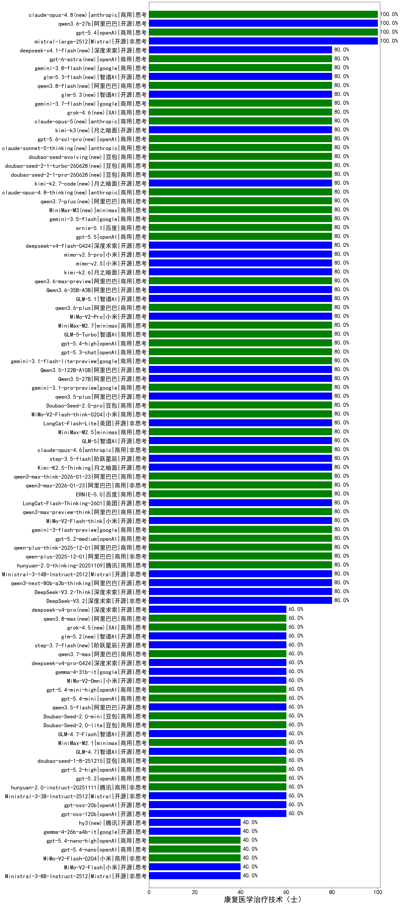

|类别|机构|大模型|【康复医学治疗技术（士）】准确率|平均耗时|平均消耗token|花费/千次（元）|排名（准确率）|
|---|---|-----|-------------------|-------|-----------|-----------|-----------|
|开源|阿里巴巴|Qwen3-8B-nothink|100.0%|24s|494|0.0|1|
|开源|Mistral|mistral-large-2512(new)|100.0%|10s|406|3.8|2|
|商用|百度|ERNIE-4.5-Turbo-32K|85.0%|21s|514|1.5|3|
|商用|阿里巴巴|qwen-flash-think-2025-07-28|80.0%|17s|1836|2.7|4|
|开源|豆包|Seed-OSS-36B-Instruct|80.0%|34s|1396|5.4|5|
|商用|google|gemini-3-pro-preview(new)|80.0%|14s|1098|89.6|6|
|商用|XAI|grok-4-1-fast-reasoning|80.0%|17s|1496|4.9|7|
|商用|anthropic|claude-haiku-4.5|80.0%|13s|550|17.2|8|
|商用|openAI|gpt-5.1-medium|80.0%|169s|576|36.8|9|
|开源|minimax|MiniMax-M2|80.0%|22s|1445|11.6|10|
|商用|豆包|doubao-seed-1-6-251015|80.0%|7s|740|5.3|11|
|开源|智谱AI|GLM-4.6|80.0%|42s|2275|31.2|12|
|开源|深度求索|DeepSeek-V3.2-Exp-Think|80.0%|40s|933|2.7|13|
|开源|深度求索|DeepSeek-V3.2-Exp|80.0%|476s|463|1.3|14|
|商用|阿里巴巴|qwen3-max-preview|80.0%|9s|370|7.8|15|
|商用|openAI|gpt-5.1-high|80.0%|138s|621|40.0|16|
|商用|阿里巴巴|qwen-turbo-think-2025-07-15|80.0%|/|2316|6.8|17|
|商用|阿里巴巴|qwen-plus-think-2025-07-28|80.0%|/|1391|10.7|18|
|商用|阿里巴巴|qwen-plus-2025-07-28|80.0%|8s|378|0.7|19|
|商用|google|gemini-2.5-flash-lite|80.0%|2s|402|1.0|20|
|开源|深度求索|DeepSeek-V3.1-Think|80.0%|46s|873|10.0|21|
|开源|深度求索|DeepSeek-V3.1|80.0%|18s|299|3.2|22|
|商用|阿里巴巴|qwen-flash-2025-07-28|80.0%|5s|353|0.4|23|
|商用|openAI|gpt-5-mini-2025-08-07|80.0%|104s|942|12.8|24|
|商用|openAI|gpt-5-2025-08-07|80.0%|17s|363|22.5|25|
|开源|阶跃星辰|step-3|80.0%|103s|2030|8.0|26|
|开源|阿里巴巴|Qwen3-30B-A3B-Thinking-2507|80.0%|75s|2578|7.1|27|
|开源|月之暗面|kimi-k2-0905|80.0%|99s|259|3.2|28|
|商用|anthropic|claude-sonnet-4.5(new)|80.0%|14s|530|50.5|29|
|开源|智谱AI|GLM-4.5|80.0%|78s|1990|27.2|30|
|商用|openAI|gpt-5.2-medium(new)|80.0%|11s|377|31.7|31|
|商用|anthropic|claude-opus-4.6(new)|80.0%|10s|517|79.1|32|
|开源|阶跃星辰|step-3.5-flash(new)|80.0%|14s|1155|2.3|33|
|开源|月之暗面|Kimi-K2.5-Thinking(new)|80.0%|139s|2729|56.4|34|
|商用|阿里巴巴|qwen3-max-think-2026-01-23(new)|80.0%|60s|1530|14.8|35|
|商用|阿里巴巴|qwen3-max-2026-01-23(new)|80.0%|53s|371|3.2|36|
|商用|百度|ERNIE-5.0(new)|80.0%|432s|1669|39.2|37|
|开源|美团|LongCat-Flash-Thinking-2601(new)|80.0%|326s|3051|0.0|38|
|商用|阿里巴巴|qwen3-max-preview-think(new)|80.0%|190s|1703|39.7|39|
|开源|小米|MiMo-V2-Flash-think(new)|80.0%|140s|1809|0.0|40|
|商用|google|gemini-3-flash-preview(new)|80.0%|102s|762|15.2|41|
|商用|阿里巴巴|qwen-plus-think-2025-12-01(new)|80.0%|33s|1513|11.7|42|
|商用|anthropic|claude-sonnet-4.5-thinking|80.0%|18s|1267|128.2|43|
|商用|阿里巴巴|qwen-plus-2025-12-01(new)|80.0%|14s|567|1.1|44|
|商用|腾讯|hunyuan-2.0-thinking-20251109|80.0%|6s|666|2.5|45|
|开源|Mistral|Ministral-3-14B-Instruct-2512(new)|80.0%|14s|361|0.5|46|
|开源|阿里巴巴|qwen3-next-80b-a3b-thinking|80.0%|54s|2242|8.8|47|
|开源|深度求索|DeepSeek-V3.2-Think(new)|80.0%|24s|754|2.2|48|
|开源|深度求索|DeepSeek-V3.2(new)|80.0%|25s|379|1.1|49|
|商用|阿里巴巴|qwen3-max-2025-09-23|80.0%|346s|349|7.3|50|
|商用|anthropic|claude-opus-4.5(new)|80.0%|10s|539|84.4|51|
|商用|百度|ERNIE-5.0-Thinking-Preview|80.0%|130s|1402|32.8|52|
|商用|百度|ERNIE-X1.1-Preview|80.0%|94s|407|1.5|53|
|开源|阿里巴巴|Qwen3-30B-A3B-Instruct-2507|80.0%|3s|341|0.9|54|
|开源|智谱AI|GLM-5(new)|80.0%|41s|1503|26.3|55|
|开源|智谱AI|GLM-4.5-Air|80.0%|27s|1491|8.7|56|
|开源|阿里巴巴|Qwen3-14B-nothink|80.0%|14s|480|0.9|57|
|商用|腾讯|hunyuan-t1-20250711|80.0%|16s|1011|3.8|58|
|商用|阿里巴巴|qwen-turbo-2025-07-15|80.0%|6s|276|0.1|59|
|开源|阿里巴巴|qwen3-235b-a22b-instruct-2507|80.0%|10s|392|2.8|60|
|商用|豆包|doubao-seed-1-6-thinking-250715|80.0%|18s|1103|8.4|61|
|开源|阿里巴巴|qwen3-235b-a22b-thinking-2507|80.0%|20s|1474|28.4|62|
|商用|科大讯飞|xunfei-spark-x1-0725|80.0%|/|1033|12.4|63|
|商用|智谱AI|GLM-4.5-Flash|80.0%|31s|1743|0.0|64|
|开源|阿里巴巴|Qwen3-32B|75.0%|40s|1721|6.7|65|
|开源|深度求索|DeepSeek-R1-0528|75.0%|208s|1758|27.4|66|
|商用|anthropic|claude-4-sonnet|70.0%|47s|480|43.4|67|
|商用|XAI|grok-4-0709|70.0%|452s|1097|113.2|68|
|商用|豆包|Doubao-1.5-lite-32k-250115|70.0%|5s|183|0.1|69|
|商用|XAI|grok-3-mini|70.0%|158s|978|3.4|70|
|商用|豆包|doubao-seed-1-6-250615|65.0%|148s|394|2.5|71|
|开源|腾讯|Hunyuan-A13B-Instruct|65.0%|92s|1093|4.2|72|
|商用|google|gemini-2.5-flash|65.0%|10s|1647|28.8|73|
|开源|百度|ERNIE-4.5-21B-A3B|65.0%|6s|290|0.0|74|
|商用|360|360zhinao2-o1|65.0%|/|/|/|75|
|商用|豆包|doubao-seed-1-8-251215(new)|60.0%|29s|664|4.6|76|
|商用|百度|ERNIE-X1-Turbo-32K|60.0%|177s|2328|9.1|77|
|商用|豆包|doubao-seed-1-6-flash-250615|60.0%|3s|287|0.3|78|
|商用|anthropic|claude-4-sonnet-thinking|60.0%|9s|547|52.4|79|
|开源|深度求索|DeepSeek-R1-0528-Qwen3-8B|60.0%|302s|1917|0.0|80|
|开源|minimax|MiniMax-Text-01|60.0%|10s|892|7.1|81|
|商用|openAI|gpt-5-mini-high|60.0%|62s|2224|31.4|82|
|商用|openAI|gpt-5-nano-high|60.0%|955s|2694|7.6|83|
|商用|openAI|gpt-5.2-high(new)|60.0%|8s|402|34.2|84|
|开源|智谱AI|GLM-4.7-Flash(new)|60.0%|1564s|1586|0.0|85|
|开源|Mistral|Ministral-3-3B-Instruct-2512(new)|60.0%|11s|596|0.4|86|
|商用|腾讯|hunyuan-2.0-instruct-20251111|60.0%|11s|351|0.6|87|
|商用|minimax|MiniMax-M2.1(new)|60.0%|161s|999|7.8|88|
|开源|智谱AI|GLM-4.7(new)|60.0%|75s|3144|43.4|89|
|商用|openAI|gpt-5.2(new)|60.0%|5s|187|12.8|90|
|开源|阿里巴巴|Qwen3-14B|60.0%|29s|1221|2.3|91|
|商用|openAI|o4-mini|60.0%|30s|814|24.2|92|
|开源|minimax|MiniMax-M1|60.0%|185s|2939|20.4|93|
|商用|阿里巴巴|qwen-long-2025-01-25|60.0%|9s|290|0.5|94|
|商用|Mistral|mistral-medium-2508|60.0%|105s|394|4.9|95|
|开源|openAI|gpt-oss-120b|60.0%|3s|581|1.6|96|
|开源|智谱AI|GLM-4.5-nothink|60.0%|16s|503|6.4|97|
|开源|阿里巴巴|Qwen3-32B-nothink|60.0%|16s|436|1.5|98|
|开源|阿里巴巴|Qwen3-4B-nothink|60.0%|34s|421|1.1|99|
|开源|腾讯|Hunyuan-A13B-Instruct-nothink|60.0%|15s|320|1.1|100|
|开源|阿里巴巴|qwen3-next-80b-a3b-instruct|60.0%|5s|396|1.4|101|
|开源|openAI|gpt-oss-20b|60.0%|11s|1361|1.5|102|
|商用|google|gemini-2.5-pro|60.0%|31s|2206|155.7|103|
|商用|腾讯|hunyuan-turbos-20250926|60.0%|12s|538|1.0|104|
|商用|豆包|doubao-seed-1-6-lite-251015|60.0%|28s|632|1.3|105|
|开源|月之暗面|Kimi-K2-Thinking|60.0%|87s|1354|21.0|106|
|商用|openAI|gpt-5.1|60.0%|124s|167|7.7|107|
|商用|openAI|gpt-5-nano-2025-08-07|60.0%|13s|969|2.6|108|
|开源|百度|ERNIE-4.5-300B-A47B|60.0%|25s|315|2.1|109|
|商用|anthropic|claude-haiku-4.5-thinking|60.0%|21s|2507|87.2|110|
|开源|Mistral|Magistral-Small-2507|60.0%|491s|3755|40.3|111|
|开源|阿里巴巴|Qwen3-8B|55.0%|603s|20488|0.0|112|
|商用|百川智能|Baichuan4-Turbo|55.0%|/|/|/|113|
|开源|meta|Llama-4-Maverick-17B-128E-Instruct-FP8|55.0%|6s|429|1.7|114|
|开源|阿里巴巴|Qwen3-4B|50.0%|45s|2171|6.3|115|
|开源|月之暗面|kimi-k2-0711-preview|50.0%|23s|412|5.9|116|
|开源|meta|Llama-4-Scout-17B-16E-Instruct|50.0%|9s|556|1.1|117|
|商用|豆包|doubao-seed-1-6-flash-thinking-250615|50.0%|5s|876|1.2|118|
|开源|google|gemma-3-27b-it|45.0%|/|/|/|119|
|开源|小米|MiMo-V2-Flash(new)|40.0%|14s|675|0.0|120|
|商用|XAI|grok-4-1-fast-non-reasoning|40.0%|79s|614|1.7|121|
|开源|阿里巴巴|Qwen3-1.7B-nothink|40.0%|24s|431|1.1|122|
|开源|Mistral|Ministral-3-8B-Instruct-2512(new)|40.0%|11s|566|0.6|123|
|开源|Mistral|Mistral-Small-3.2-24B-Instruct-2506|40.0%|641s|456|0.9|124|
|商用|百川智能|Baichuan4-Air|35.0%|/|/|/|125|
|开源|google|gemma-3-12b-it|35.0%|/|/|/|126|
|商用|百度|ERNIE-Lite-8K|35.0%|/|/|/|127|
|开源|百度|ERNIE-4.5-0.3B|30.0%|4s|373|0.0|128|
|开源|google|gemma-3-4b-it|30.0%|/|/|/|129|
|开源|智谱AI|GLM-4-9B-0414|25.0%|12s|437|0.0|130|
|开源|阿里巴巴|Qwen3-1.7B|25.0%|20s|2279|6.6|131|
|开源|阿里巴巴|Qwen3-0.6B|25.0%|17s|1188|3.4|132|
|商用|智谱AI|GLM-4.5-Flash-nothink|20.0%|18s|883|0.0|133|
|开源|智谱AI|GLM-4.5-Air-nothink|20.0%|13s|774|4.3|134|
|开源|阿里巴巴|Qwen3-0.6B-nothink|20.0%|11s|220|0.5|135|

