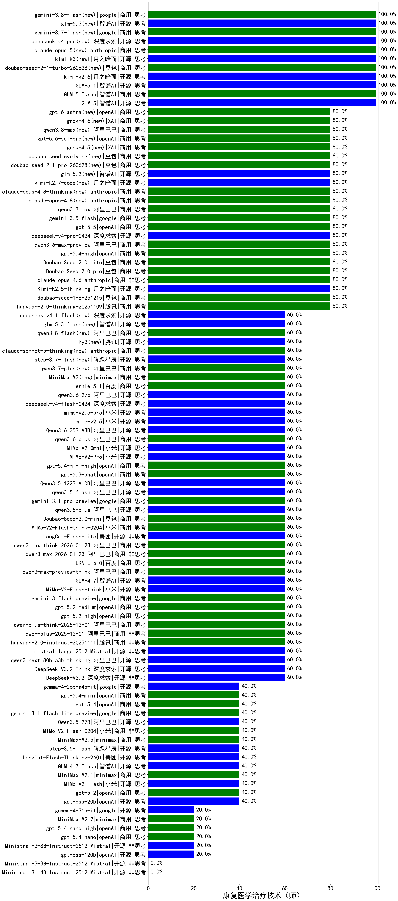

|类别|机构|大模型|【康复医学治疗技术（师）】准确率|平均耗时|平均消耗token|花费/千次（元）|排名（准确率）|
|---|---|-----|-------------------|-------|-----------|-----------|-----------|
|开源|智谱AI|GLM-5(new)|100.0%|42s|1449|25.2|1|
|商用|腾讯|hunyuan-turbos-20250926|100.0%|12s|507|0.9|2|
|商用|豆包|doubao-seed-1-6-lite-251015|100.0%|21s|640|1.4|3|
|商用|google|gemini-3-pro-preview(new)|100.0%|34s|2095|174.0|4|
|商用|百度|ERNIE-4.5-Turbo-32K|95.0%|21s|514|1.5|5|
|商用|anthropic|claude-sonnet-4.5-thinking|80.0%|22s|1323|133.7|6|
|商用|豆包|doubao-seed-1-8-251215(new)|80.0%|30s|599|4.1|7|
|商用|阿里巴巴|qwen-plus-2025-07-28|80.0%|9s|337|0.6|8|
|商用|anthropic|claude-opus-4.6(new)|80.0%|21s|521|79.0|9|
|开源|月之暗面|Kimi-K2.5-Thinking(new)|80.0%|309s|1590|32.3|10|
|开源|月之暗面|kimi-k2-0905|80.0%|11s|395|5.3|11|
|商用|腾讯|hunyuan-2.0-thinking-20251109|80.0%|9s|1072|4.1|12|
|商用|anthropic|claude-opus-4.5(new)|80.0%|9s|577|90.4|13|
|开源|深度求索|DeepSeek-R1-0528|75.0%|243s|2039|31.8|14|
|商用|豆包|doubao-seed-1-6-250615|70.0%|144s|474|3.1|15|
|商用|google|gemini-2.5-pro|70.0%|27s|2099|147.8|16|
|商用|阿里巴巴|qwen-long-2025-01-25|70.0%|7s|287|0.5|17|
|开源|阿里巴巴|Qwen3-14B|70.0%|34s|1242|2.4|18|
|开源|阿里巴巴|Qwen3-32B|70.0%|32s|1158|4.4|19|
|开源|阿里巴巴|Qwen3-30B-A3B-Thinking-2507|70.0%|66s|2861|7.9|20|
|商用|豆包|Doubao-1.5-lite-32k-250115|70.0%|6s|185|0.1|21|
|开源|腾讯|Hunyuan-A13B-Instruct|65.0%|74s|993|3.8|22|
|开源|minimax|MiniMax-M1|65.0%|239s|2562|17.3|23|
|商用|豆包|doubao-seed-1-6-flash-thinking-250615|65.0%|6s|620|0.8|24|
|开源|百度|ERNIE-4.5-300B-A47B|65.0%|28s|337|2.3|25|
|开源|深度求索|DeepSeek-R1-0528-Qwen3-8B|65.0%|274s|1570|0.0|26|
|商用|百度|ERNIE-X1-Turbo-32K|65.0%|129s|2658|10.5|27|
|开源|minimax|MiniMax-Text-01|65.0%|11s|899|7.2|28|
|商用|阿里巴巴|qwen-plus-2025-12-01(new)|60.0%|18s|596|1.1|29|
|开源|深度求索|DeepSeek-V3.2-Exp|60.0%|458s|250|0.7|30|
|商用|openAI|gpt-5.1-medium|60.0%|149s|400|23.9|31|
|商用|百度|ERNIE-5.0(new)|60.0%|147s|1624|38.0|32|
|商用|豆包|doubao-seed-1-6-251015|60.0%|15s|625|4.4|33|
|开源|智谱AI|GLM-4.6|60.0%|84s|1972|26.9|34|
|商用|阿里巴巴|qwen3-max-2026-01-23(new)|60.0%|92s|305|2.5|35|
|开源|深度求索|DeepSeek-V3.2-Exp-Think|60.0%|110s|823|2.4|36|
|商用|阿里巴巴|qwen3-max-think-2026-01-23(new)|60.0%|103s|2092|20.4|37|
|开源|阿里巴巴|qwen3-next-80b-a3b-instruct|60.0%|11s|444|1.6|38|
|商用|anthropic|claude-haiku-4.5-thinking|60.0%|42s|1713|58.3|39|
|开源|豆包|Seed-OSS-36B-Instruct|60.0%|136s|1981|7.8|40|
|商用|阿里巴巴|qwen3-max-preview|60.0%|7s|349|7.2|41|
|商用|阿里巴巴|qwen-plus-think-2025-07-28|60.0%|/|1951|15.1|42|
|商用|Mistral|mistral-medium-2508|60.0%|184s|407|5.0|43|
|开源|深度求索|DeepSeek-V3.1-Think|60.0%|36s|688|7.8|44|
|商用|anthropic|claude-haiku-4.5|60.0%|12s|583|18.2|45|
|开源|美团|LongCat-Flash-Thinking-2601(new)|60.0%|471s|2825|0.0|46|
|商用|XAI|grok-4-1-fast-reasoning|60.0%|9s|998|3.1|47|
|商用|阿里巴巴|qwen-plus-think-2025-12-01(new)|60.0%|43s|1877|14.5|48|
|商用|openAI|gpt-5.2-high(new)|60.0%|6s|330|26.4|49|
|商用|腾讯|hunyuan-2.0-instruct-20251111|60.0%|10s|327|0.5|50|
|开源|Mistral|mistral-large-2512(new)|60.0%|10s|404|3.7|51|
|商用|阿里巴巴|qwen-flash-2025-07-28|60.0%|41s|423|0.5|52|
|商用|openAI|gpt-5.2-medium(new)|60.0%|8s|303|23.8|53|
|开源|阿里巴巴|qwen3-next-80b-a3b-thinking|60.0%|72s|3346|13.2|54|
|开源|深度求索|DeepSeek-V3.2-Think(new)|60.0%|136s|867|2.5|55|
|开源|深度求索|DeepSeek-V3.2(new)|60.0%|107s|270|0.8|56|
|商用|google|gemini-3-flash-preview(new)|60.0%|76s|964|19.4|57|
|商用|阿里巴巴|qwen3-max-2025-09-23|60.0%|54s|375|7.8|58|
|开源|小米|MiMo-V2-Flash-think(new)|60.0%|267s|2493|0.0|59|
|商用|百度|ERNIE-X1.1-Preview|60.0%|148s|869|3.3|60|
|开源|智谱AI|GLM-4.7(new)|60.0%|52s|1808|24.6|61|
|商用|anthropic|claude-sonnet-4.5(new)|60.0%|9s|552|52.5|62|
|商用|阿里巴巴|qwen3-max-preview-think(new)|60.0%|213s|2133|50.0|63|
|商用|阿里巴巴|qwen-flash-think-2025-07-28|60.0%|59s|2338|3.4|64|
|开源|深度求索|DeepSeek-V3.1|60.0%|16s|317|3.3|65|
|开源|阿里巴巴|Qwen3-32B-nothink|60.0%|21s|443|1.6|66|
|开源|智谱AI|GLM-4.5|60.0%|22s|1421|19.2|67|
|开源|阿里巴巴|qwen3-235b-a22b-instruct-2507|60.0%|10s|400|2.8|68|
|商用|XAI|grok-4-0709|60.0%|370s|1433|149.5|69|
|商用|豆包|doubao-seed-1-6-thinking-250715|60.0%|17s|960|7.2|70|
|开源|阿里巴巴|qwen3-235b-a22b-thinking-2507|60.0%|108s|1942|37.6|71|
|商用|google|gemini-2.5-flash|60.0%|10s|1757|30.7|72|
|商用|科大讯飞|xunfei-spark-x1-0725|60.0%|/|845|10.1|73|
|商用|豆包|doubao-seed-1-6-flash-250615|60.0%|3s|276|0.3|74|
|商用|anthropic|claude-4-sonnet-thinking|60.0%|48s|508|47.7|75|
|商用|anthropic|claude-4-sonnet|60.0%|42s|516|47.8|76|
|开源|阿里巴巴|Qwen3-14B-nothink|60.0%|27s|501|0.9|77|
|开源|月之暗面|kimi-k2-0711-preview|60.0%|29s|512|7.4|78|
|商用|智谱AI|GLM-4.5-Flash|60.0%|26s|1438|0.0|79|
|商用|腾讯|hunyuan-t1-20250711|60.0%|26s|1448|5.5|80|
|开源|阿里巴巴|Qwen3-30B-A3B-Instruct-2507|60.0%|4s|412|1.1|81|
|开源|meta|Llama-4-Maverick-17B-128E-Instruct-FP8|60.0%|7s|573|2.3|82|
|开源|阶跃星辰|step-3|60.0%|81s|1622|6.3|83|
|商用|百川智能|Baichuan4-Turbo|60.0%|/|/|/|84|
|商用|百度|ERNIE-Lite-8K|55.0%|/|/|/|85|
|商用|360|360zhinao2-o1|55.0%|/|/|/|86|
|开源|meta|Llama-4-Scout-17B-16E-Instruct|55.0%|8s|478|0.9|87|
|开源|百度|ERNIE-4.5-21B-A3B|55.0%|60s|301|0.0|88|
|开源|阿里巴巴|Qwen3-1.7B|55.0%|20s|1846|5.3|89|
|开源|阿里巴巴|Qwen3-8B|55.0%|333s|9046|0.0|90|
|开源|智谱AI|GLM-4-9B-0414|50.0%|6s|433|0.0|91|
|开源|阿里巴巴|Qwen3-4B|50.0%|25s|2255|6.6|92|
|商用|openAI|o4-mini|50.0%|42s|886|26.4|93|
|商用|minimax|MiniMax-M2.1(new)|40.0%|158s|1250|9.9|94|
|商用|openAI|gpt-5.2(new)|40.0%|3s|156|9.2|95|
|开源|智谱AI|GLM-4.7-Flash(new)|40.0%|1318s|5191|0.0|96|
|开源|阶跃星辰|step-3.5-flash(new)|40.0%|11s|1811|3.7|97|
|开源|小米|MiMo-V2-Flash(new)|40.0%|249s|375|0.0|98|
|商用|XAI|grok-3-mini|40.0%|148s|1115|3.9|99|
|商用|openAI|gpt-5-nano-high|40.0%|957s|2419|6.8|100|
|商用|openAI|gpt-5-mini-high|40.0%|53s|1416|19.6|101|
|商用|openAI|gpt-5-nano-2025-08-07|40.0%|127s|1176|3.2|102|
|商用|百度|ERNIE-5.0-Thinking-Preview|40.0%|209s|2102|49.5|103|
|商用|openAI|gpt-5-mini-2025-08-07|40.0%|100s|802|10.7|104|
|商用|openAI|gpt-5.1|40.0%|316s|129|4.6|105|
|商用|openAI|gpt-5-2025-08-07|40.0%|20s|218|11.6|106|
|商用|百川智能|Baichuan4-Air|40.0%|/|/|/|107|
|开源|openAI|gpt-oss-20b|40.0%|7s|753|0.8|108|
|商用|智谱AI|GLM-4.5-Flash-nothink|40.0%|19s|873|0.0|109|
|开源|智谱AI|GLM-4.5-Air-nothink|40.0%|11s|916|5.2|110|
|商用|阿里巴巴|qwen-turbo-think-2025-07-15|40.0%|/|2065|6.0|111|
|开源|智谱AI|GLM-4.5-nothink|40.0%|26s|861|11.3|112|
|开源|智谱AI|GLM-4.5-Air|40.0%|32s|1748|10.2|113|
|商用|阿里巴巴|qwen-turbo-2025-07-15|40.0%|13s|325|0.2|114|
|开源|月之暗面|Kimi-K2-Thinking|40.0%|108s|1855|28.9|115|
|开源|阿里巴巴|Qwen3-8B-nothink|40.0%|23s|465|0.0|116|
|开源|阿里巴巴|Qwen3-4B-nothink|40.0%|25s|351|0.9|117|
|商用|openAI|gpt-5.1-high|40.0%|132s|775|50.5|118|
|开源|腾讯|Hunyuan-A13B-Instruct-nothink|40.0%|11s|311|1.0|119|
|商用|minimax|MiniMax-M2.5(new)|40.0%|18s|932|7.2|120|
|开源|阿里巴巴|Qwen3-1.7B-nothink|40.0%|19s|389|1.0|121|
|开源|google|gemma-3-4b-it|30.0%|/|/|/|122|
|开源|阿里巴巴|Qwen3-0.6B|30.0%|6s|1341|3.8|123|
|开源|google|gemma-3-12b-it|25.0%|/|/|/|124|
|开源|百度|ERNIE-4.5-0.3B|20.0%|55s|383|0.0|125|
|开源|Mistral|Ministral-3-8B-Instruct-2512(new)|20.0%|13s|468|0.5|126|
|开源|Mistral|Mistral-Small-3.2-24B-Instruct-2506|20.0%|26s|558|1.1|127|
|开源|minimax|MiniMax-M2|20.0%|49s|1712|13.8|128|
|开源|openAI|gpt-oss-120b|20.0%|51s|495|1.3|129|
|开源|google|gemma-3-27b-it|20.0%|/|/|/|130|
|商用|XAI|grok-4-1-fast-non-reasoning|20.0%|81s|635|1.8|131|
|开源|Mistral|Magistral-Small-2507|20.0%|143s|5350|57.6|132|
|开源|Mistral|Ministral-3-3B-Instruct-2512(new)|/%|13s|570|0.4|133|
|开源|Mistral|Ministral-3-14B-Instruct-2512(new)|/%|4s|474|0.7|134|
|开源|阿里巴巴|Qwen3-0.6B-nothink|/%|4s|183|0.4|135|
|商用|google|gemini-2.5-flash-lite|/%|2s|438|1.1|136|

