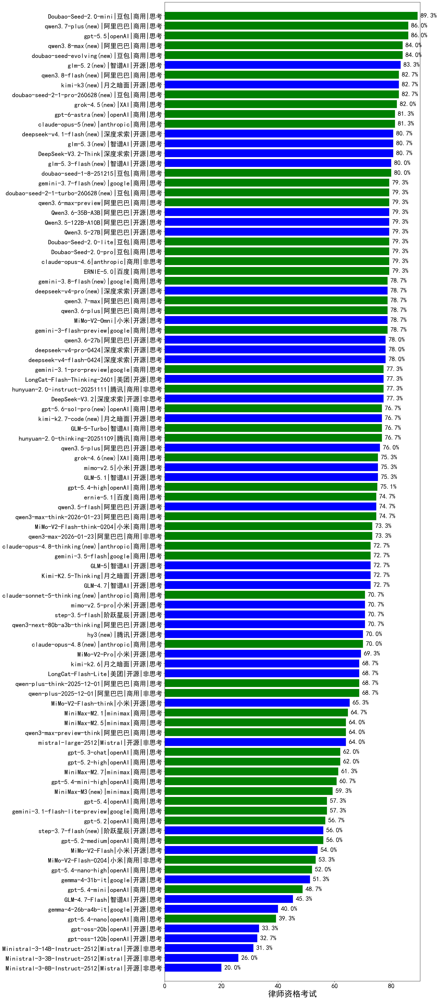

|类别|机构|大模型|【律师资格考试】准确率|平均耗时|平均消耗token|花费/千次（元）|排名（准确率）|
|---|---|-----|-------------------|-------|-----------|-----------|-----------|
|商用|百度|ERNIE-4.5-Turbo-32K|89.0%|22s|612|1.7|1|
|商用|豆包|doubao-seed-1-6-251015|87.3%|16s|903|6.2|2|
|商用|豆包|doubao-seed-1-6-thinking-250715|86.0%|47s|1835|13.8|3|
|商用|豆包|doubao-seed-1-6-lite-251015|81.3%|54s|1034|2.2|4|
|开源|深度求索|DeepSeek-V3.1-Think|80.0%|68s|1375|15.6|5|
|开源|深度求索|DeepSeek-V3.2-Exp-Think|80.0%|161s|1749|5.1|6|
|商用|anthropic|claude-opus-4.6(new)|79.3%|21s|850|120.7|7|
|商用|腾讯|hunyuan-turbos-20250926|78.7%|17s|736|1.3|8|
|商用|google|gemini-3-pro-preview(new)|77.3%|91s|2700|220.8|9|
|商用|google|gemini-3.1-pro-preview(new)|77.3%|52s|2180|176.5|10|
|商用|豆包|doubao-seed-1-6-250615|77.3%|83s|560|3.3|11|
|开源|阿里巴巴|qwen3-next-80b-a3b-instruct|77.3%|11s|806|2.9|12|
|商用|智谱AI|GLM-5-Turbo(new)|76.7%|40s|1928|40.5|13|
|商用|anthropic|claude-opus-4.5(new)|76.7%|19s|890|129.8|14|
|商用|百度|ERNIE-X1-Turbo-32K|76.3%|337s|2508|9.7|15|
|开源|阿里巴巴|qwen3.5-plus(new)|76.0%|50s|4258|20.0|16|
|开源|深度求索|DeepSeek-V3.2-Exp|76.0%|129s|537|1.5|17|
|商用|anthropic|claude-sonnet-4.5-thinking|76.0%|52s|3516|362.4|18|
|商用|阿里巴巴|qwen-plus-think-2025-07-28|75.3%|/|3146|24.3|19|
|商用|阿里巴巴|qwen-plus-2025-07-28|75.3%|18s|729|1.3|20|
|商用|openAI|gpt-5.4-high(new)|75.1%|30s|1776|173.8|21|
|开源|月之暗面|kimi-k2-0905|74.7%|64s|577|7.7|22|
|开源|阿里巴巴|qwen3-235b-a22b-thinking-2507|74.7%|82s|3431|66.4|23|
|商用|百度|ERNIE-5.0-Thinking-Preview|74.7%|287s|1985|45.8|24|
|开源|百度|ERNIE-4.5-300B-A47B|74.3%|197s|471|3.0|25|
|开源|深度求索|DeepSeek-R1-0528|74.0%|193s|2318|35.7|26|
|开源|豆包|Seed-OSS-36B-Instruct|74.0%|157s|2795|10.9|27|
|商用|豆包|doubao-seed-1-6-flash-thinking-250615|73.7%|11s|850|1.0|28|
|开源|月之暗面|kimi-k2-0711-preview|73.3%|34s|628|8.7|29|
|开源|月之暗面|Kimi-K2.5-Thinking(new)|72.7%|190s|3463|70.9|30|
|开源|智谱AI|GLM-5(new)|72.7%|104s|2815|49.1|31|
|开源|智谱AI|GLM-4.6|72.7%|56s|2681|36.3|32|
|开源|阿里巴巴|qwen3-235b-a22b-instruct-2507|72.7%|17s|717|5.0|33|
|商用|百度|ERNIE-X1.1-Preview|72.0%|80s|597|2.1|34|
|商用|阿里巴巴|qwen3-max-preview|72.0%|14s|652|13.5|35|
|开源|minimax|MiniMax-M1|71.0%|340s|4306|32.2|36|
|商用|腾讯|hunyuan-t1-20250711|70.7%|27s|1601|6.0|37|
|商用|豆包|doubao-seed-1-6-flash-250615|70.3%|5s|413|0.4|38|
|开源|阶跃星辰|step-3|70.0%|119s|2376|9.2|39|
|商用|google|gemini-2.5-pro|69.7%|34s|2803|194.2|40|
|开源|深度求索|DeepSeek-V3.1|69.3%|20s|454|4.6|41|
|开源|美团|LongCat-Flash-Lite(new)|68.7%|312s|701|0.0|42|
|商用|阿里巴巴|qwen-plus-think-2025-12-01(new)|68.7%|79s|3429|26.6|43|
|商用|阿里巴巴|qwen-plus-2025-12-01(new)|68.7%|28s|1217|2.3|44|
|商用|科大讯飞|xunfei-spark-x1-0725|67.3%|/|1254|14.1|45|
|商用|anthropic|claude-sonnet-4.5(new)|67.3%|11s|712|60.0|46|
|开源|阿里巴巴|Qwen3-30B-A3B-Thinking-2507|65.3%|84s|3604|9.8|47|
|开源|阿里巴巴|Qwen3-32B|64.7%|137s|3210|12.4|48|
|商用|minimax|MiniMax-M2.5(new)|64.0%|47s|2451|19.7|49|
|开源|minimax|MiniMax-Text-01|64.0%|8s|950|7.6|50|
|商用|智谱AI|GLM-4.5-Flash|63.3%|32s|1911|0.0|51|
|商用|阿里巴巴|qwen-flash-think-2025-07-28|63.3%|34s|3450|5.0|52|
|商用|anthropic|claude-4-sonnet-thinking|62.7%|70s|1370|130.3|53|
|商用|XAI|grok-4-0709|62.1%|469s|2639|275.6|54|
|商用|openAI|gpt-5.1-high|62.0%|171s|3704|254.0|55|
|商用|google|gemini-2.5-flash|62.0%|14s|2278|39.0|56|
|商用|豆包|Doubao-1.5-lite-32k-250115|62.0%|4s|368|0.2|57|
|商用|openAI|gpt-5-2025-08-07|61.3%|37s|528|29.5|58|
|开源|腾讯|Hunyuan-A13B-Instruct|60.7%|57s|1619|6.1|59|
|开源|阿里巴巴|Qwen3-14B|60.3%|157s|5493|10.8|60|
|开源|智谱AI|GLM-4.5-nothink|58.7%|31s|1074|12.0|61|
|商用|openAI|gpt-5.1-medium|58.7%|226s|1268|81.0|62|
|商用|阿里巴巴|qwen-flash-2025-07-28|58.0%|10s|865|1.1|63|
|商用|openAI|gpt-5.4(new)|57.3%|6s|427|32.2|64|
|商用|智谱AI|GLM-4.5-Flash-nothink|57.3%|20s|1022|0.0|65|
|商用|百川智能|Baichuan4-Turbo|57.0%|/|/|/|66|
|开源|百度|ERNIE-4.5-21B-A3B|56.7%|22s|511|0.0|67|
|商用|openAI|gpt-5.2(new)|56.7%|7s|369|24.1|68|
|开源|月之暗面|Kimi-K2-Thinking|56.7%|498s|8525|135.1|69|
|开源|阿里巴巴|Qwen3-14B-nothink|56.0%|14s|672|1.2|70|
|商用|阿里巴巴|qwen-turbo-think-2025-07-15|56.0%|/|2635|7.6|71|
|开源|meta|Llama-4-Maverick-17B-128E-Instruct-FP8|56.0%|10s|671|2.5|72|
|开源|智谱AI|GLM-4.5|55.3%|67s|1776|21.0|73|
|开源|智谱AI|GLM-4.5-Air|55.3%|35s|1883|10.0|74|
|商用|阿里巴巴|qwen-turbo-2025-07-15|54.7%|10s|545|0.3|75|
|商用|anthropic|claude-haiku-4.5-thinking|53.3%|55s|4859|169.0|76|
|开源|minimax|MiniMax-M2|53.3%|64s|3006|24.4|77|
|商用|Mistral|mistral-medium-2508|52.7%|20s|611|6.9|78|
|开源|阿里巴巴|Qwen3-8B|51.7%|681s|9679|0.0|79|
|开源|阿里巴巴|Qwen3-30B-A3B-Instruct-2507|51.3%|8s|879|2.4|80|
|开源|阿里巴巴|Qwen3-32B-nothink|51.3%|41s|691|2.4|81|
|开源|智谱AI|GLM-4-9B-0414|51.0%|15s|652|0.0|82|
|商用|anthropic|claude-4-sonnet|50.0%|41s|685|55.7|83|
|商用|openAI|gpt-5.1|48.0%|178s|481|25.2|84|
|开源|深度求索|DeepSeek-R1-0528-Qwen3-8B|47.0%|464s|2624|0.0|85|
|开源|智谱AI|GLM-4.7-Flash(new)|45.3%|1074s|5678|0.0|86|
|商用|anthropic|claude-haiku-4.5|44.7%|14s|747|20.8|87|
|商用|XAI|grok-4-1-fast-reasoning|44.7%|71s|1923|6.3|88|
|开源|Mistral|Mistral-Small-3.2-24B-Instruct-2506|42.7%|14s|684|1.2|89|
|开源|阿里巴巴|Qwen3-4B|42.0%|87s|2371|6.8|90|
|商用|XAI|grok-3-mini|42.0%|147s|1322|4.6|91|
|开源|腾讯|Hunyuan-A13B-Instruct-nothink|42.0%|436s|598|2.0|92|
|开源|meta|Llama-4-Scout-17B-16E-Instruct|39.3%|11s|693|1.3|93|
|商用|XAI|grok-4-1-fast-non-reasoning|39.3%|32s|667|1.8|94|
|商用|百度|ERNIE-Lite-8K|38.7%|/|/|/|95|
|开源|智谱AI|GLM-4.5-Air-nothink|38.7%|15s|1072|5.3|96|
|商用|google|gemini-2.5-flash-lite|37.3%|32s|7770|22.2|97|
|商用|百川智能|Baichuan4-Air|36.7%|/|/|/|98|
|商用|openAI|o4-mini|36.7%|38s|1967|59.1|99|
|开源|阿里巴巴|Qwen3-8B-nothink|35.3%|24s|621|0.0|100|
|开源|openAI|gpt-oss-20b|33.3%|96s|1921|2.1|101|
|开源|google|gemma-3-12b-it|33.0%|/|/|/|102|
|开源|openAI|gpt-oss-120b|32.7%|14s|1005|2.8|103|
|商用|openAI|gpt-5-mini-2025-08-07|32.0%|80s|1565|20.9|104|
|开源|阿里巴巴|Qwen3-1.7B|32.0%|72s|2622|7.5|105|
|开源|google|gemma-3-27b-it|29.3%|/|/|/|106|
|商用|openAI|gpt-5-nano-2025-08-07|28.7%|52s|3742|10.5|107|
|开源|阿里巴巴|Qwen3-4B-nothink|24.0%|16s|574|1.4|108|
|开源|google|gemma-3-4b-it|21.0%|/|/|/|109|
|开源|百度|ERNIE-4.5-0.3B|20.7%|3s|452|0.0|110|
|开源|阿里巴巴|Qwen3-1.7B-nothink|16.0%|12s|569|1.4|111|
|开源|阿里巴巴|Qwen3-0.6B|13.3%|53s|1663|4.6|112|
|开源|阿里巴巴|Qwen3-0.6B-nothink|12.0%|8s|303|0.6|113|
|开源|阿里巴巴|Qwen3.5-122B-A10B(new)|/%|374s|4890|30.7|114|
|商用|小米|MiMo-V2-Flash-0204(new)|/%|222s|738|1.4|115|
|开源|阶跃星辰|step-3.5-flash(new)|/%|29s|3564|7.3|116|
|商用|openAI|gpt-5.3-chat(new)|/%|25s|616|48.0|117|
|商用|google|gemini-3.1-flash-lite-preview(new)|/%|6s|540|4.5|118|
|商用|小米|MiMo-V2-Flash-think-0204(new)|/%|301s|2545|5.2|119|
|开源|阿里巴巴|Qwen3.5-27B(new)|/%|298s|4435|20.8|120|
|商用|豆包|Doubao-Seed-2.0-pro(new)|/%|/|1233|17.6|121|
|商用|豆包|Doubao-Seed-2.0-lite(new)|/%|/|1285|4.1|122|
|商用|豆包|Doubao-Seed-2.0-mini(new)|/%|434s|3169|6.0|123|
|商用|阿里巴巴|qwen3-max-think-2026-01-23(new)|/%|176s|4473|43.8|124|
|开源|阿里巴巴|qwen3.5-flash(new)|/%|280s|5049|9.9|125|
|商用|openAI|gpt-5-nano-high|/%|96s|7988|22.8|126|
|商用|百度|ERNIE-5.0(new)|/%|157s|2136|49.4|127|
|商用|阿里巴巴|qwen3-max-2026-01-23(new)|/%|49s|798|7.1|128|
|开源|深度求索|DeepSeek-V3.2(new)|/%|107s|662|1.9|129|
|开源|深度求索|DeepSeek-V3.2-Think(new)|/%|99s|1878|5.5|130|
|开源|Mistral|mistral-large-2512(new)|/%|15s|686|6.1|131|
|开源|Mistral|Ministral-3-14B-Instruct-2512(new)|/%|9s|706|1.0|132|
|开源|Mistral|Ministral-3-8B-Instruct-2512(new)|/%|7s|689|0.7|133|
|开源|Mistral|Ministral-3-3B-Instruct-2512(new)|/%|5s|681|0.5|134|
|商用|腾讯|hunyuan-2.0-instruct-20251111|/%|7s|468|0.8|135|
|商用|腾讯|hunyuan-2.0-thinking-20251109|/%|14s|1230|4.6|136|
|商用|openAI|gpt-5-mini-high|/%|892s|4579|64.6|137|
|商用|阿里巴巴|qwen3-max-2025-09-23|/%|367s|743|15.6|138|
|商用|openAI|gpt-5.2-high(new)|/%|38s|1260|112.7|139|
|商用|openAI|gpt-5.2-medium(new)|/%|20s|835|70.5|140|
|商用|google|gemini-3-flash-preview(new)|/%|72s|1937|38.9|141|
|商用|豆包|doubao-seed-1-8-251215(new)|/%|25s|840|5.5|142|
|开源|小米|MiMo-V2-Flash(new)|/%|15s|661|0.0|143|
|开源|小米|MiMo-V2-Flash-think(new)|/%|85s|2537|0.0|144|
|开源|智谱AI|GLM-4.7(new)|/%|89s|2822|38.3|145|
|商用|minimax|MiniMax-M2.1(new)|/%|87s|3010|24.4|146|
|商用|阿里巴巴|qwen3-max-preview-think(new)|/%|152s|3144|73.2|147|
|开源|美团|LongCat-Flash-Thinking-2601(new)|/%|466s|4201|0.0|148|
|开源|阿里巴巴|qwen3-next-80b-a3b-thinking|/%|174s|3962|15.5|149|

