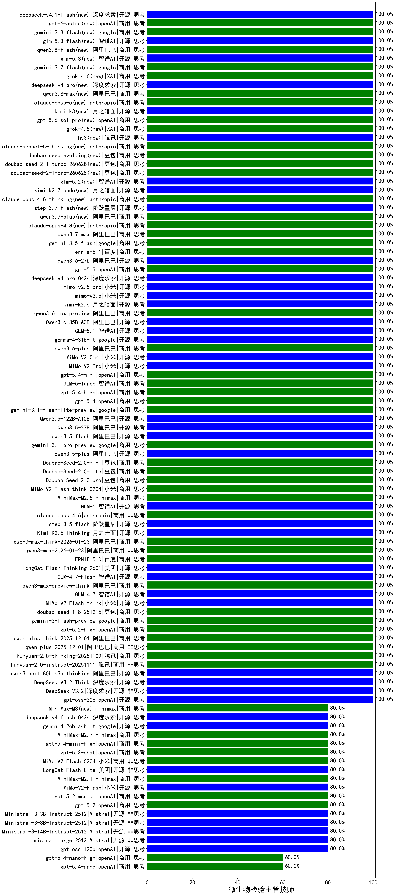

|类别|机构|大模型|【微生物检验主管技师】准确率|平均耗时|平均消耗token|花费/千次（元）|排名（准确率）|
|---|---|-----|-------------------|-------|-----------|-----------|-----------|
|商用|腾讯|hunyuan-2.0-thinking-20251109|100.0%|10s|519|1.9|1|
|商用|阿里巴巴|qwen3-max-2026-01-23|100.0%|79s|254|2.1|2|
|开源|阿里巴巴|qwen3.5-flash|100.0%|245s|1606|3.1|3|
|商用|google|gemini-3.1-pro-preview|100.0%|16s|940|76.5|4|
|开源|阿里巴巴|qwen3.5-plus|100.0%|18s|1319|6.1|5|
|商用|豆包|Doubao-Seed-2.0-mini|100.0%|178s|928|1.7|6|
|商用|豆包|Doubao-Seed-2.0-lite|100.0%|124s|675|2.1|7|
|商用|豆包|Doubao-Seed-2.0-pro|100.0%|215s|610|8.6|8|
|商用|小米|MiMo-V2-Flash-think-0204|100.0%|621s|932|1.9|9|
|商用|minimax|MiniMax-M2.5|100.0%|13s|553|4.1|10|
|开源|智谱AI|GLM-5|100.0%|32s|1069|18.5|11|
|商用|anthropic|claude-opus-4.6|100.0%|10s|546|84.5|12|
|开源|阶跃星辰|step-3.5-flash|100.0%|7s|721|1.4|13|
|开源|月之暗面|Kimi-K2.5-Thinking|100.0%|219s|1078|21.8|14|
|商用|阿里巴巴|qwen3-max-think-2026-01-23|100.0%|55s|1556|15.1|15|
|商用|百度|ERNIE-5.0|100.0%|95s|995|23.1|16|
|开源|深度求索|DeepSeek-V3.2|100.0%|85s|230|0.6|17|
|开源|美团|LongCat-Flash-Thinking-2601|100.0%|170s|1539|0.0|18|
|开源|智谱AI|GLM-4.7-Flash|100.0%|1455s|1081|0.0|19|
|商用|阿里巴巴|qwen3-max-preview-think|100.0%|174s|1166|26.9|20|
|开源|智谱AI|GLM-4.7|100.0%|31s|1177|15.9|21|
|开源|小米|MiMo-V2-Flash-think|100.0%|133s|1209|0.0|22|
|商用|豆包|doubao-seed-1-8-251215|100.0%|14s|469|3.1|23|
|商用|google|gemini-3-flash-preview|100.0%|88s|711|14.2|24|
|商用|openAI|gpt-5.2-high|100.0%|5s|255|20.1|25|
|商用|阿里巴巴|qwen-plus-think-2025-12-01|100.0%|24s|1279|9.8|26|
|商用|阿里巴巴|qwen-plus-2025-12-01|100.0%|16s|490|0.9|27|
|开源|meta|Llama-4-Scout-17B-16E-Instruct|100.0%|6s|386|0.8|28|
|商用|腾讯|hunyuan-2.0-instruct-20251111|100.0%|2s|304|0.5|29|
|开源|阿里巴巴|qwen3-next-80b-a3b-thinking|100.0%|136s|1625|6.3|30|
|开源|阿里巴巴|Qwen3.5-27B|100.0%|43s|1135|5.2|31|
|开源|阿里巴巴|Qwen3.5-122B-A10B|100.0%|201s|1537|9.5|32|
|商用|google|gemini-3.1-flash-lite-preview|100.0%|3s|242|2.1|33|
|商用|openAI|gpt-5.4|100.0%|5s|200|15.7|34|
|商用|豆包|doubao-seed-2-1-turbo-260628(new)|100.0%|60s|1920|27.7|35|
|商用|豆包|doubao-seed-2-1-pro-260628(new)|100.0%|106s|2845|83.2|36|
|开源|智谱AI|glm-5.2(new)|100.0%|26s|948|25.4|37|
|开源|月之暗面|kimi-k2.7-code(new)|100.0%|8s|470|11.7|38|
|商用|anthropic|claude-opus-4.8-thinking(new)|100.0%|11s|565|88.1|39|
|开源|阶跃星辰|step-3.7-flash(new)|100.0%|11s|1509|11.8|40|
|商用|阿里巴巴|qwen3.7-plus(new)|100.0%|11s|550|4.1|41|
|商用|anthropic|claude-opus-4.8(new)|100.0%|9s|498|76.3|42|
|商用|阿里巴巴|qwen3.7-max(new)|100.0%|13s|593|20.0|43|
|商用|google|gemini-3.5-flash(new)|100.0%|8s|746|44.4|44|
|商用|百度|ernie-5.1(new)|100.0%|33s|709|12.1|45|
|开源|阿里巴巴|qwen3.6-27b(new)|100.0%|20s|1187|20.6|46|
|商用|openAI|gpt-5.5(new)|100.0%|6s|253|42.5|47|
|开源|深度求索|deepseek-v4-pro(new)|100.0%|30s|373|8.4|48|
|开源|小米|mimo-v2.5-pro(new)|100.0%|22s|1124|19.4|49|
|开源|小米|mimo-v2.5(new)|100.0%|13s|834|8.4|50|
|开源|月之暗面|kimi-k2.6(new)|100.0%|51s|828|21.3|51|
|商用|阿里巴巴|qwen3.6-max-preview|100.0%|36s|1133|58.7|52|
|开源|阿里巴巴|Qwen3.6-35B-A3B|100.0%|105s|1084|11.2|53|
|开源|智谱AI|GLM-5.1|100.0%|113s|823|18.8|54|
|开源|google|gemma-4-31b-it|100.0%|42s|354|0.9|55|
|商用|阿里巴巴|qwen3.6-plus|100.0%|52s|1221|14.1|56|
|开源|小米|MiMo-V2-Omni|100.0%|5s|870|8.8|57|
|开源|小米|MiMo-V2-Pro|100.0%|478s|799|12.6|58|
|商用|openAI|gpt-5.4-mini|100.0%|8s|148|3.0|59|
|商用|智谱AI|GLM-5-Turbo|100.0%|17s|940|19.8|60|
|商用|openAI|gpt-5.4-high|100.0%|23s|445|41.3|61|
|开源|深度求索|DeepSeek-V3.2-Think|100.0%|19s|527|1.5|62|
|商用|豆包|doubao-seed-evolving(new)|100.0%|128s|4750|140.3|63|
|商用|openAI|gpt-5-nano-high|100.0%|948s|2488|7.1|64|
|开源|深度求索|DeepSeek-V3.1-Think|100.0%|30s|598|6.8|65|
|商用|豆包|doubao-seed-1-6-lite-251015|100.0%|24s|523|1.1|66|
|商用|豆包|doubao-seed-1-6-251015|100.0%|16s|504|3.5|67|
|商用|腾讯|hunyuan-turbos-20250926|100.0%|10s|427|0.7|68|
|开源|阿里巴巴|qwen3-next-80b-a3b-instruct|100.0%|10s|398|1.4|69|
|开源|豆包|Seed-OSS-36B-Instruct|100.0%|41s|754|2.9|70|
|商用|阿里巴巴|qwen3-max-preview|100.0%|8s|375|8.0|71|
|商用|阿里巴巴|qwen-turbo-think-2025-07-15|100.0%|/|1134|3.2|72|
|开源|阿里巴巴|Qwen3-14B-nothink|100.0%|6s|388|0.7|73|
|开源|深度求索|DeepSeek-V3.1|100.0%|12s|241|2.5|74|
|开源|阿里巴巴|qwen3-235b-a22b-instruct-2507|100.0%|9s|363|2.6|75|
|商用|阿里巴巴|qwen-flash-think-2025-07-28|100.0%|13s|1281|1.8|76|
|商用|阿里巴巴|qwen-flash-2025-07-28|100.0%|5s|335|0.4|77|
|开源|阿里巴巴|Qwen3-32B-nothink|100.0%|15s|364|1.3|78|
|商用|openAI|gpt-5-2025-08-07|100.0%|29s|174|9.1|79|
|开源|openAI|gpt-oss-20b|100.0%|3s|584|0.6|80|
|商用|智谱AI|GLM-4.5-Flash|100.0%|16s|865|0.0|81|
|开源|智谱AI|GLM-4.5-Air|100.0%|18s|971|5.6|82|
|开源|阿里巴巴|Qwen3-30B-A3B-Instruct-2507|100.0%|4s|375|1.0|83|
|开源|阿里巴巴|qwen3-235b-a22b-thinking-2507|100.0%|24s|1236|23.7|84|
|开源|月之暗面|Kimi-K2-Thinking|100.0%|66s|787|12.0|85|
|商用|阿里巴巴|qwen-turbo-2025-07-15|100.0%|7s|242|0.1|86|
|商用|anthropic|claude-sonnet-4.5|100.0%|11s|511|48.7|87|
|商用|阿里巴巴|qwen3-max-2025-09-23|100.0%|18s|331|6.9|88|
|商用|anthropic|claude-opus-4.5|100.0%|9s|532|83.4|89|
|商用|百度|ERNIE-5.0-Thinking-Preview|100.0%|119s|1062|24.7|90|
|商用|百度|ERNIE-X1.1-Preview|100.0%|93s|595|2.3|91|
|商用|anthropic|claude-haiku-4.5-thinking|100.0%|14s|1749|59.8|92|
|商用|anthropic|claude-sonnet-4.5-thinking|100.0%|17s|1118|112.2|93|
|商用|腾讯|hunyuan-t1-20250711|100.0%|13s|698|2.5|94|
|开源|月之暗面|kimi-k2-0905|100.0%|102s|316|4.2|95|
|商用|百度|ERNIE-4.5-Turbo-32K|95.0%|22s|526|1.5|96|
|商用|anthropic|claude-4-sonnet|90.0%|42s|494|44.3|97|
|商用|anthropic|claude-4-sonnet-thinking|90.0%|7s|500|47.6|98|
|开源|阿里巴巴|Qwen3-30B-A3B-Thinking-2507|90.0%|57s|2423|6.6|99|
|商用|百度|ERNIE-X1-Turbo-32K|85.0%|128s|2083|8.2|100|
|商用|google|gemini-2.5-flash|80.0%|8s|1437|24.9|101|
|开源|阿里巴巴|Qwen3-8B-nothink|80.0%|147s|329|0.0|102|
|开源|阿里巴巴|Qwen3-4B-nothink|80.0%|22s|373|1.0|103|
|开源|深度求索|deepseek-v4-flash(new)|80.0%|37s|1726|3.4|104|
|商用|minimax|MiniMax-M3(new)|80.0%|25s|579|7.0|105|
|开源|深度求索|DeepSeek-R1-0528|80.0%|242s|2058|32.1|106|
|开源|阿里巴巴|Qwen3-14B|80.0%|26s|886|1.7|107|
|开源|阿里巴巴|Qwen3-32B|80.0%|40s|1721|6.7|108|
|商用|openAI|gpt-5.4-mini-high|80.0%|175s|413|11.4|109|
|商用|minimax|MiniMax-M2.7|80.0%|21s|824|6.4|110|
|开源|google|gemma-4-26b-a4b-it|80.0%|86s|555|1.4|111|
|商用|openAI|gpt-5-mini-2025-08-07|80.0%|64s|486|6.3|112|
|商用|XAI|grok-4-1-fast-reasoning|80.0%|14s|1316|4.2|113|
|开源|美团|LongCat-Flash-Lite|80.0%|290s|374|0.0|114|
|商用|openAI|gpt-5.2-medium|80.0%|8s|232|17.7|115|
|商用|openAI|gpt-5.1-high|80.0%|11s|499|31.6|116|
|开源|小米|MiMo-V2-Flash|80.0%|7s|388|0.0|117|
|开源|Mistral|Ministral-3-8B-Instruct-2512|80.0%|2s|391|0.4|118|
|商用|minimax|MiniMax-M2.1|80.0%|40s|791|6.1|119|
|开源|Mistral|Ministral-3-14B-Instruct-2512|80.0%|11s|415|0.6|120|
|商用|openAI|gpt-5.1-medium|80.0%|170s|357|21.5|121|
|开源|Mistral|Ministral-3-3B-Instruct-2512|80.0%|4s|826|0.6|122|
|商用|openAI|gpt-5.1|80.0%|106s|148|6.7|123|
|商用|小米|MiMo-V2-Flash-0204|80.0%|165s|313|0.6|124|
|开源|Mistral|mistral-large-2512|80.0%|10s|367|3.4|125|
|商用|openAI|gpt-5-nano-2025-08-07|80.0%|114s|941|2.6|126|
|商用|openAI|gpt-5-mini-high|80.0%|38s|960|13.1|127|
|商用|openAI|gpt-5.3-chat|80.0%|6s|298|24.0|128|
|开源|openAI|gpt-oss-120b|80.0%|41s|394|1.0|129|
|商用|智谱AI|GLM-4.5-Flash-nothink|80.0%|13s|706|0.0|130|
|开源|智谱AI|GLM-4.5-Air-nothink|80.0%|12s|776|4.4|131|
|商用|openAI|gpt-5.2|80.0%|4s|155|10.1|132|
|开源|阿里巴巴|Qwen3-8B|70.0%|600s|15122|0.0|133|
|商用|openAI|o4-mini|70.0%|25s|652|18.9|134|
|商用|百川智能|Baichuan4-Turbo|70.0%|/|/|/|135|
|商用|google|gemini-2.5-pro|70.0%|34s|2146|151.2|136|
|开源|阿里巴巴|Qwen3-4B|60.0%|18s|1668|4.8|137|
|商用|openAI|gpt-5.4-nano-high|60.0%|8s|282|2.0|138|
|商用|anthropic|claude-haiku-4.5|60.0%|9s|537|16.8|139|
|商用|google|gemini-2.5-flash-lite|60.0%|4s|382|1.0|140|
|商用|openAI|gpt-5.4-nano|60.0%|4s|197|1.3|141|
|开源|智谱AI|GLM-4-9B-0414|50.0%|12s|412|0|142|
|商用|XAI|grok-4-1-fast-non-reasoning|40.0%|81s|574|1.6|143|

