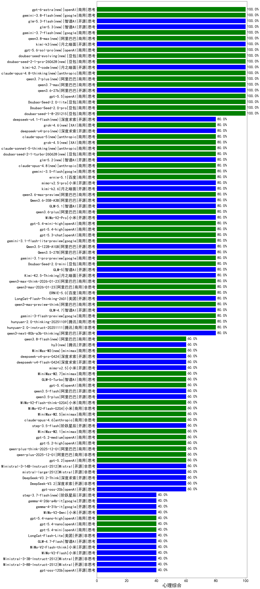

|类别|机构|大模型|【心理综合】准确率|平均耗时|平均消耗token|花费/千次（元）|排名（准确率）|
|---|---|-----|-------------------|-------|-----------|-----------|-----------|
|商用|豆包|doubao-seed-1-8-251215|100.0%|19s|594|4.1|1|
|商用|豆包|Doubao-Seed-2.0-lite(new)|100.0%|152s|764|2.5|2|
|商用|豆包|Doubao-Seed-2.0-pro(new)|100.0%|245s|1053|15.7|3|
|商用|百度|ERNIE-4.5-Turbo-32K|95.0%|21s|477|1.4|4|
|商用|豆包|doubao-seed-1-6-flash-250615|85.0%|5s|301|0.4|5|
|商用|百川智能|Baichuan4-Turbo|85.0%|/|/|/|6|
|商用|豆包|doubao-seed-1-6-250615|85.0%|112s|362|2.3|7|
|开源|阿里巴巴|Qwen3-32B|85.0%|19s|559|2.1|8|
|商用|google|gemini-2.5-pro|85.0%|55s|1771|125.4|9|
|商用|豆包|doubao-seed-1-6-flash-thinking-250615|85.0%|5s|426|0.5|10|
|开源|豆包|Seed-OSS-36B-Instruct|80.0%|72s|1158|4.5|11|
|商用|豆包|doubao-seed-1-6-251015|80.0%|16s|655|4.7|12|
|商用|腾讯|hunyuan-turbos-20250926|80.0%|8s|365|0.6|13|
|开源|阿里巴巴|qwen3-next-80b-a3b-instruct|80.0%|5s|378|1.4|14|
|商用|豆包|doubao-seed-1-6-lite-251015|80.0%|27s|636|1.4|15|
|商用|阿里巴巴|qwen3-max-preview|80.0%|8s|370|8.0|16|
|商用|阿里巴巴|qwen3-max-preview-think|80.0%|185s|1680|39.4|17|
|商用|豆包|Doubao-Seed-2.0-mini(new)|80.0%|690s|2875|5.6|18|
|开源|阿里巴巴|Qwen3-30B-A3B-Instruct-2507|80.0%|2s|295|0.8|19|
|商用|google|gemini-3.1-pro-preview(new)|80.0%|22s|1175|97.1|20|
|开源|阿里巴巴|Qwen3.5-27B(new)|80.0%|185s|2724|12.9|21|
|商用|openAI|gpt-5-2025-08-07|80.0%|16s|251|15.4|22|
|开源|月之暗面|Kimi-K2-Thinking|80.0%|77s|1304|20.3|23|
|商用|google|gemini-3.1-flash-lite-preview(new)|80.0%|2s|282|2.6|24|
|开源|智谱AI|GLM-5(new)|80.0%|107s|1692|29.8|25|
|商用|google|gemini-3-pro-preview|80.0%|11s|1244|103.0|26|
|商用|anthropic|claude-opus-4.5|80.0%|13s|470|74.4|27|
|商用|阿里巴巴|qwen3-max-2025-09-23|80.0%|211s|333|7.1|28|
|开源|月之暗面|Kimi-K2.5-Thinking|80.0%|246s|994|20.1|29|
|开源|阿里巴巴|qwen3-next-80b-a3b-thinking|80.0%|75s|2948|11.6|30|
|商用|阿里巴巴|qwen3-max-think-2026-01-23|80.0%|82s|2546|25.1|31|
|商用|阿里巴巴|qwen3-max-2026-01-23|80.0%|36s|361|3.3|32|
|商用|腾讯|hunyuan-2.0-instruct-20251111|80.0%|5s|274|0.4|33|
|商用|腾讯|hunyuan-2.0-thinking-20251109|80.0%|14s|649|2.5|34|
|商用|google|gemini-3-flash-preview|80.0%|111s|767|15.6|35|
|商用|百度|ERNIE-5.0|80.0%|146s|2735|65.0|36|
|开源|美团|LongCat-Flash-Thinking-2601|80.0%|394s|2106|0.0|37|
|开源|智谱AI|GLM-4.7|80.0%|48s|2230|30.7|38|
|开源|阿里巴巴|Qwen3.5-122B-A10B(new)|80.0%|200s|2672|16.8|39|
|商用|阿里巴巴|qwen-flash-2025-07-28|80.0%|6s|303|0.4|40|
|商用|小米|MiMo-V2-Pro(new)|80.0%|135s|827|13.3|41|
|开源|meta|Llama-4-Scout-17B-16E-Instruct|80.0%|8s|470|1.0|42|
|商用|openAI|gpt-5.4-high(new)|80.0%|8s|449|42.7|43|
|商用|openAI|gpt-5.3-chat(new)|80.0%|45s|300|25.0|44|
|商用|腾讯|hunyuan-t1-20250711|80.0%|47s|2771|10.8|45|
|商用|openAI|gpt-5.4-mini-high(new)|80.0%|8s|778|23.2|46|
|商用|阿里巴巴|qwen3.6-plus(new)|80.0%|24s|1351|15.7|47|
|开源|meta|Llama-4-Maverick-17B-128E-Instruct-FP8|75.0%|7s|373|1.5|48|
|开源|腾讯|Hunyuan-A13B-Instruct|75.0%|21s|713|2.7|49|
|商用|google|gemini-2.5-flash|70.0%|8s|1320|23.2|50|
|开源|百度|ERNIE-4.5-300B-A47B|70.0%|26s|289|2.0|51|
|开源|阿里巴巴|Qwen3-4B|70.0%|17s|911|2.6|52|
|开源|阿里巴巴|Qwen3-14B|70.0%|23s|1288|2.5|53|
|商用|百度|ERNIE-X1-Turbo-32K|70.0%|59s|1331|5.2|54|
|开源|深度求索|DeepSeek-R1-0528|65.0%|192s|1288|20.1|55|
|开源|google|gemma-3-27b-it|65.0%|/|/|/|56|
|开源|阿里巴巴|Qwen3-8B|65.0%|98s|2745|0.0|57|
|开源|google|gemma-3-12b-it|65.0%|/|/|/|58|
|商用|openAI|gpt-5.1-high|60.0%|26s|664|44.0|59|
|开源|月之暗面|kimi-k2-0905|60.0%|61s|270|3.5|60|
|商用|anthropic|claude-sonnet-4.5(new)|60.0%|8s|464|44.8|61|
|商用|anthropic|claude-sonnet-4.5-thinking|60.0%|23s|1450|149.4|62|
|开源|阶跃星辰|step-3.5-flash|60.0%|19s|2772|5.8|63|
|商用|XAI|grok-4-1-fast-non-reasoning|60.0%|77s|513|1.4|64|
|商用|XAI|grok-4-1-fast-reasoning|60.0%|87s|634|1.8|65|
|商用|百度|ERNIE-5.0-Thinking-Preview|60.0%|221s|1331|31.3|66|
|开源|阿里巴巴|Qwen3-0.6B-nothink|60.0%|11s|203|0.5|67|
|商用|openAI|gpt-5-mini-high|60.0%|1027s|877|12.1|68|
|商用|minimax|MiniMax-M2.7(new)|60.0%|28s|1078|8.6|69|
|开源|深度求索|DeepSeek-V3.2|60.0%|150s|238|0.7|70|
|开源|深度求索|DeepSeek-V3.2-Think|60.0%|18s|527|1.5|71|
|开源|深度求索|DeepSeek-R1-0528-Qwen3-8B|60.0%|228s|1242|0.0|72|
|开源|Mistral|mistral-large-2512|60.0%|8s|280|2.6|73|
|开源|Mistral|Ministral-3-14B-Instruct-2512|60.0%|16s|431|0.6|74|
|开源|智谱AI|GLM-4-9B-0414|60.0%|10s|325|0.0|75|
|商用|openAI|gpt-5.2|60.0%|2s|107|6.2|76|
|商用|阿里巴巴|qwen-plus-2025-12-01|60.0%|16s|543|1.0|77|
|商用|阿里巴巴|qwen-plus-think-2025-12-01|60.0%|51s|2332|18.3|78|
|商用|openAI|gpt-5.2-high|60.0%|11s|370|32.4|79|
|商用|openAI|gpt-5.2-medium|60.0%|5s|211|16.5|80|
|商用|anthropic|claude-opus-4.6|60.0%|14s|478|74.4|81|
|商用|智谱AI|GLM-5-Turbo(new)|60.0%|29s|1156|24.7|82|
|商用|openAI|gpt-5.1-medium|60.0%|147s|415|26.3|83|
|开源|智谱AI|GLM-4.5-nothink|60.0%|14s|483|6.2|84|
|商用|小米|MiMo-V2-Flash-think-0204(new)|60.0%|763s|1441|2.9|85|
|商用|openAI|gpt-5-mini-2025-08-07|60.0%|17s|521|6.9|86|
|商用|openAI|gpt-5.4(new)|60.0%|17s|177|14.1|87|
|开源|openAI|gpt-oss-20b|60.0%|4s|558|0.6|88|
|商用|智谱AI|GLM-4.5-Flash-nothink|60.0%|21s|1063|0.0|89|
|商用|阿里巴巴|qwen-turbo-2025-07-15|60.0%|8s|249|0.1|90|
|开源|阿里巴巴|qwen3.5-plus(new)|60.0%|37s|2753|13.0|91|
|商用|minimax|MiniMax-M2.5(new)|60.0%|35s|1845|15.0|92|
|开源|阿里巴巴|qwen3-235b-a22b-instruct-2507|60.0%|8s|379|2.8|93|
|开源|阿里巴巴|qwen3-235b-a22b-thinking-2507|60.0%|45s|2017|39.5|94|
|开源|智谱AI|GLM-4.5-Air|60.0%|33s|1524|8.9|95|
|商用|智谱AI|GLM-4.5-Flash|60.0%|33s|1896|0.0|96|
|开源|阿里巴巴|Qwen3-32B-nothink|60.0%|23s|432|1.6|97|
|开源|阿里巴巴|qwen3.5-flash(new)|60.0%|380s|3180|6.3|98|
|商用|XAI|grok-4-0709|60.0%|311s|1088|114.1|99|
|商用|阿里巴巴|qwen-flash-think-2025-07-28|60.0%|26s|2536|3.7|100|
|开源|深度求索|DeepSeek-V3.1|60.0%|18s|239|2.5|101|
|开源|深度求索|DeepSeek-V3.1-Think|60.0%|35s|645|7.4|102|
|商用|google|gemini-2.5-flash-lite|60.0%|2s|400|1.1|103|
|商用|Mistral|mistral-medium-2508|60.0%|717s|310|3.9|104|
|开源|Mistral|Mistral-Small-3.2-24B-Instruct-2506|60.0%|15s|327|0.6|105|
|商用|阿里巴巴|qwen-plus-2025-07-28|60.0%|8s|286|0.5|106|
|商用|阿里巴巴|qwen-plus-think-2025-07-28|60.0%|/|2354|18.5|107|
|商用|小米|MiMo-V2-Flash-0204(new)|60.0%|355s|461|0.9|108|
|开源|深度求索|DeepSeek-V3.2-Exp|60.0%|491s|234|0.7|109|
|开源|深度求索|DeepSeek-V3.2-Exp-Think|60.0%|36s|672|2.0|110|
|开源|百度|ERNIE-4.5-21B-A3B|60.0%|4s|290|0.0|111|
|开源|智谱AI|GLM-4.6|60.0%|43s|1857|25.5|112|
|商用|anthropic|claude-4-sonnet-thinking|60.0%|7s|438|41.9|113|
|开源|minimax|MiniMax-M2|60.0%|53s|1763|14.3|114|
|商用|科大讯飞|xunfei-spark-x1-0725|60.0%|/|944|11.3|115|
|商用|minimax|MiniMax-M2.1|60.0%|21s|1319|10.6|116|
|商用|百川智能|Baichuan4-Air|50.0%|/|/|/|117|
|开源|阿里巴巴|Qwen3-30B-A3B-Thinking-2507|50.0%|85s|3079|8.5|118|
|商用|XAI|grok-3-mini|50.0%|234s|989|3.5|119|
|开源|google|gemma-3-4b-it|45.0%|/|/|/|120|
|商用|openAI|o4-mini|40.0%|20s|619|18.5|121|
|开源|阿里巴巴|Qwen3-8B-nothink|40.0%|16s|332|0.0|122|
|开源|阿里巴巴|Qwen3-4B-nothink|40.0%|19s|310|0.8|123|
|开源|腾讯|Hunyuan-A13B-Instruct-nothink|40.0%|16s|354|1.3|124|
|商用|anthropic|claude-4-sonnet|40.0%|43s|396|36.8|125|
|商用|openAI|gpt-5.4-mini(new)|40.0%|45s|149|3.4|126|
|开源|智谱AI|GLM-4.7-Flash|40.0%|1183s|1093|0.0|127|
|开源|小米|MiMo-V2-Flash-think|40.0%|146s|1906|0.0|128|
|商用|openAI|gpt-5.4-nano-high(new)|40.0%|20s|344|2.6|129|
|开源|阿里巴巴|Qwen3-0.6B|40.0%|6s|893|2.5|130|
|开源|阿里巴巴|Qwen3-1.7B|40.0%|12s|1572|4.6|131|
|商用|小米|MiMo-V2-Omni(new)|40.0%|5s|776|7.6|132|
|开源|google|gemma-4-31b-it(new)|40.0%|113s|612|1.6|133|
|商用|openAI|gpt-5.4-nano(new)|40.0%|6s|88|0.4|134|
|开源|阿里巴巴|Qwen3-14B-nothink|40.0%|23s|380|0.7|135|
|开源|智谱AI|GLM-4.5|40.0%|61s|1487|20.3|136|
|开源|阶跃星辰|step-3|40.0%|76s|1501|5.9|137|
|开源|小米|MiMo-V2-Flash|40.0%|6s|299|0.0|138|
|开源|Mistral|Ministral-3-3B-Instruct-2512|40.0%|11s|320|0.2|139|
|开源|Mistral|Ministral-3-8B-Instruct-2512|40.0%|9s|404|0.4|140|
|商用|openAI|gpt-5-nano-high|40.0%|1027s|3361|9.6|141|
|商用|百度|ERNIE-X1.1-Preview|40.0%|107s|392|1.5|142|
|商用|anthropic|claude-haiku-4.5-thinking|40.0%|12s|1249|42.1|143|
|商用|anthropic|claude-haiku-4.5|40.0%|6s|500|15.8|144|
|商用|openAI|gpt-5.1|40.0%|532s|120|5.4|145|
|开源|美团|LongCat-Flash-Lite(new)|40.0%|80s|264|0.0|146|
|商用|阿里巴巴|qwen-turbo-think-2025-07-15|40.0%|/|1705|5.0|147|
|商用|openAI|gpt-5-nano-2025-08-07|40.0%|85s|1587|4.5|148|
|开源|openAI|gpt-oss-120b|40.0%|3s|420|1.1|149|
|开源|智谱AI|GLM-4.5-Air-nothink|40.0%|16s|1039|6.0|150|
|开源|google|gemma-4-26b-a4b-it(new)|40.0%|62s|584|1.5|151|
|开源|百度|ERNIE-4.5-0.3B|35.0%|2s|330|0.0|152|
|开源|阿里巴巴|Qwen3-1.7B-nothink|20.0%|20s|290|0.7|153|

