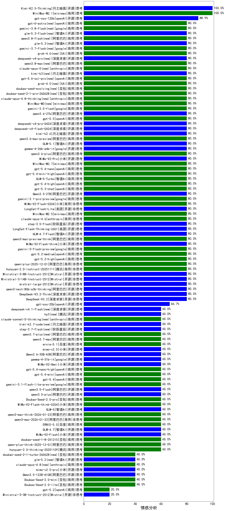

|类别|机构|大模型|【情感分析】准确率|平均耗时|平均消耗token|花费/千次（元）|排名（准确率）|
|---|---|-----|-------------------|-------|-----------|-----------|-----------|
|商用|minimax|MiniMax-M2.1|100.0%|66s|489|3.4|1|
|开源|月之暗面|Kimi-K2.5-Thinking|100.0%|161s|1029|20.2|2|
|商用|google|gemini-2.5-flash-lite|100.0%|9s|231|0.5|3|
|开源|openAI|gpt-oss-120b|88.9%|2s|256|0.5|4|
|商用|openAI|gpt-5-2025-08-07|88.9%|28s|224|12.6|5|
|商用|openAI|gpt-5.3-chat|80.0%|6s|231|13.5|6|
|开源|google|gemma-4-26b-a4b-it|80.0%|11s|285|0.6|7|
|商用|阿里巴巴|qwen3.6-plus|80.0%|36s|1060|11.8|8|
|开源|小米|MiMo-V2-Pro|80.0%|267s|794|12.0|9|
|商用|minimax|MiniMax-M2.7|80.0%|10s|373|2.4|10|
|商用|openAI|gpt-5.4-nano|80.0%|3s|114|0.2|11|
|商用|openAI|gpt-5.4-mini-high|80.0%|12s|267|5.6|12|
|商用|智谱AI|GLM-5-Turbo|80.0%|65s|642|12.6|13|
|商用|openAI|gpt-5.4-high|80.0%|7s|296|21.7|14|
|商用|小米|MiMo-V2-Flash-0204|80.0%|35s|292|0.5|15|
|开源|阿里巴巴|Qwen3.5-27B|80.0%|119s|1864|8.6|16|
|商用|google|gemini-3.1-pro-preview|80.0%|14s|931|72.7|17|
|商用|阿里巴巴|qwen3.6-max-preview|80.0%|35s|1022|51.2|18|
|开源|美团|LongCat-Flash-Lite|80.0%|28s|214|0.0|19|
|商用|anthropic|claude-opus-4.6|80.0%|14s|324|35.7|20|
|开源|阶跃星辰|step-3.5-flash|80.0%|16s|821|1.6|21|
|开源|美团|LongCat-Flash-Thinking-2601|80.0%|149s|1364|0.0|22|
|开源|智谱AI|GLM-4.7-Flash|80.0%|1592s|1623|0.0|23|
|商用|阿里巴巴|qwen3-max-preview-think|80.0%|169s|1438|32.7|24|
|开源|智谱AI|GLM-5.1|80.0%|99s|680|14.7|25|
|开源|月之暗面|kimi-k2.6|80.0%|37s|620|15.1|26|
|商用|google|gemini-3-flash-preview|80.0%|88s|796|15.3|27|
|开源|深度求索|deepseek-v4-flash-0424|80.0%|23s|313|0.5|28|
|开源|智谱AI|glm-5.3-flash(new)|80.0%|39s|1419|3.8|29|
|商用|阿里巴巴|qwen3.8-flash(new)|80.0%|11s|463|1.0|30|
|开源|智谱AI|glm-5.3(new)|80.0%|34s|1207|31.9|31|
|商用|google|gemini-3.7-flash(new)|80.0%|26s|483|10.7|32|
|商用|XAI|grok-4.6(new)|80.0%|26s|1474|53.4|33|
|开源|深度求索|deepseek-v4-pro(new)|80.0%|11s|459|9.5|34|
|商用|阿里巴巴|qwen3.8-max(new)|80.0%|13s|355|9.7|35|
|商用|anthropic|claude-opus-5(new)|80.0%|11s|585|81.6|36|
|开源|月之暗面|kimi-k3(new)|80.0%|36s|701|57.3|37|
|商用|openAI|gpt-5.6-sol-pro(new)|80.0%|7s|2303|123.8|38|
|商用|XAI|grok-4.5(new)|80.0%|94s|1051|35.7|39|
|商用|豆包|doubao-seed-evolving(new)|80.0%|117s|3637|106.0|40|
|商用|豆包|doubao-seed-2-1-pro-260628(new)|80.0%|100s|4650|136.3|41|
|商用|anthropic|claude-opus-4.8-thinking(new)|80.0%|10s|551|75.6|42|
|商用|minimax|MiniMax-M3(new)|80.0%|20s|630|7.4|43|
|商用|google|gemini-3.5-flash|80.0%|6s|837|47.8|44|
|开源|阿里巴巴|qwen3.6-27b|80.0%|21s|1276|21.6|45|
|商用|openAI|gpt-5.5|80.0%|5s|187|20.6|46|
|开源|深度求索|deepseek-v4-pro-0424|80.0%|18s|302|6.2|47|
|开源|小米|MiMo-V2-Flash-think|80.0%|31s|1540|0.0|48|
|商用|minimax|MiniMax-M2.5|80.0%|13s|629|4.6|49|
|商用|google|gemini-3.8-flash(new)|80.0%|41s|425|18.3|50|
|开源|Mistral|Ministral-3-8B-Instruct-2512|80.0%|13s|368|0.4|51|
|商用|anthropic|claude-sonnet-4.5-thinking|80.0%|15s|843|76.1|52|
|商用|XAI|grok-4-1-fast-reasoning|80.0%|89s|723|2.1|53|
|商用|anthropic|claude-haiku-4.5-thinking|80.0%|9s|997|30.5|54|
|商用|anthropic|claude-haiku-4.5|80.0%|9s|438|11.1|55|
|商用|openAI|gpt-5.1-medium|80.0%|174s|197|7.4|56|
|商用|openAI|gpt-5-mini-high|80.0%|995s|606|7.4|57|
|商用|openAI|gpt-5-nano-high|80.0%|730s|1559|4.3|58|
|开源|深度求索|DeepSeek-V3.2|80.0%|53s|340|0.9|59|
|开源|深度求索|DeepSeek-V3.2-Think|80.0%|106s|780|2.3|60|
|开源|阿里巴巴|qwen3-next-80b-a3b-thinking|80.0%|131s|1477|5.6|61|
|开源|Mistral|mistral-large-2512|80.0%|7s|361|3.0|62|
|开源|Mistral|Ministral-3-14B-Instruct-2512|80.0%|9s|344|0.5|63|
|商用|openAI|gpt-5.1-high|80.0%|17s|284|13.6|64|
|商用|openAI|gpt-5.2-medium|80.0%|3s|159|6.6|65|
|商用|openAI|gpt-5.2-high|80.0%|5s|162|6.9|66|
|商用|腾讯|hunyuan-2.0-instruct-20251111|80.0%|7s|340|0.5|67|
|商用|阿里巴巴|qwen-plus-2025-12-01|80.0%|14s|491|0.9|68|
|商用|豆包|doubao-seed-1-6-251015|77.8%|5s|465|3.0|69|
|开源|阿里巴巴|qwen3-next-80b-a3b-instruct|77.8%|2s|210|0.7|70|
|开源|豆包|Seed-OSS-36B-Instruct|77.8%|20s|401|1.5|71|
|商用|腾讯|hunyuan-turbos-20250926|77.8%|3s|197|0.3|72|
|商用|openAI|gpt-5-mini-2025-08-07|77.8%|17s|276|3.2|73|
|商用|豆包|doubao-seed-1-6-lite-251015|77.8%|52s|373|0.7|74|
|商用|openAI|gpt-5-nano-2025-08-07|77.8%|130s|541|1.4|75|
|商用|阿里巴巴|qwen-flash-2025-07-28|77.8%|4s|167|0.2|76|
|开源|深度求索|DeepSeek-V3.1|77.8%|8s|153|1.4|77|
|商用|阿里巴巴|qwen-flash-think-2025-07-28|66.7%|13s|1194|1.7|78|
|开源|openAI|gpt-oss-20b|66.7%|1s|297|0.2|79|
|商用|阿里巴巴|qwen-turbo-think-2025-07-15|66.7%|/|514|1.4|80|
|商用|阿里巴巴|qwen3-max-preview|66.7%|3s|183|3.3|81|
|开源|阶跃星辰|step-3.7-flash(new)|60.0%|10s|573|4.0|82|
|商用|阿里巴巴|qwen3.7-max|60.0%|15s|591|19.1|83|
|开源|月之暗面|Kimi-K2-Thinking|60.0%|34s|456|6.3|84|
|商用|百度|ernie-5.1|60.0%|48s|494|7.5|85|
|开源|月之暗面|kimi-k2.7-code(new)|60.0%|11s|421|9.7|86|
|开源|阿里巴巴|Qwen3.6-35B-A3B|60.0%|95s|829|8.1|87|
|商用|anthropic|claude-sonnet-5-thinking(new)|60.0%|9s|481|25.3|88|
|商用|XAI|grok-4-1-fast-non-reasoning|60.0%|3s|410|0.9|89|
|开源|小米|mimo-v2.5|60.0%|7s|859|8.3|90|
|开源|腾讯|hy3(new)|60.0%|63s|164|0.4|91|
|商用|阿里巴巴|qwen3.7-plus(new)|60.0%|19s|915|6.8|92|
|商用|豆包|doubao-seed-1-8-251215|60.0%|21s|438|2.5|93|
|商用|anthropic|claude-sonnet-4.5|60.0%|7s|370|27.2|94|
|商用|google|gemini-3.1-flash-lite-preview|60.0%|34s|308|2.4|95|
|开源|智谱AI|GLM-4.7|60.0%|64s|2208|29.9|96|
|商用|阿里巴巴|qwen-plus-think-2025-12-01|60.0%|55s|2296|17.7|97|
|商用|百度|ERNIE-5.0|60.0%|81s|905|20.3|98|
|商用|阿里巴巴|qwen3-max-2026-01-23|60.0%|5s|259|1.9|99|
|商用|阿里巴巴|qwen3-max-think-2026-01-23|60.0%|101s|2327|22.5|100|
|商用|腾讯|hunyuan-2.0-thinking-20251109|60.0%|12s|1007|3.8|101|
|开源|智谱AI|GLM-5|60.0%|34s|1100|18.6|102|
|商用|小米|MiMo-V2-Flash-think-0204|60.0%|947s|1455|2.9|103|
|商用|豆包|Doubao-Seed-2.0-pro|60.0%|384s|1831|27.6|104|
|开源|阿里巴巴|qwen3.5-plus|60.0%|42s|3489|16.4|105|
|开源|阿里巴巴|qwen3.5-flash|60.0%|297s|2069|4.0|106|
|商用|百度|ERNIE-X1.1-Preview|60.0%|114s|638|2.3|107|
|商用|openAI|gpt-5.4|60.0%|4s|157|7.2|108|
|商用|openAI|gpt-5.4-mini|60.0%|5s|136|1.5|109|
|开源|google|gemma-4-31b-it|60.0%|23s|285|0.6|110|
|开源|小米|MiMo-V2-Flash|60.0%|6s|276|0.0|111|
|开源|小米|MiMo-V2-Omni|60.0%|12s|859|8.2|112|
|商用|百度|ERNIE-5.0-Thinking-Preview|60.0%|48s|398|8.1|113|
|商用|anthropic|claude-opus-4.5|60.0%|8s|410|51.5|114|
|商用|阿里巴巴|qwen3-max-2025-09-23|60.0%|253s|274|4.8|115|
|商用|openAI|gpt-5.4-nano-high|60.0%|6s|183|0.8|116|
|开源|深度求索|DeepSeek-V3.1-Think|55.6%|29s|543|6.1|117|
|商用|豆包|Doubao-Seed-2.0-lite|40.0%|158s|785|2.4|118|
|开源|阿里巴巴|Qwen3.5-122B-A10B|40.0%|406s|4150|26.1|119|
|商用|豆包|Doubao-Seed-2.0-mini|40.0%|131s|667|1.1|120|
|商用|豆包|doubao-seed-2-1-turbo-260628(new)|40.0%|128s|5905|87.0|121|
|商用|anthropic|claude-opus-4.8(new)|40.0%|7s|383|46.3|122|
|开源|小米|mimo-v2.5-pro|40.0%|17s|1042|17.1|123|
|商用|openAI|gpt-5.1|40.0%|530s|120|1.9|124|
|开源|智谱AI|glm-5.2(new)|40.0%|37s|1166|30.7|125|
|开源|Mistral|Ministral-3-3B-Instruct-2512|20.0%|13s|377|0.3|126|
|开源|月之暗面|kimi-k2-0905|20.0%|60s|148|1.1|127|
|商用|openAI|gpt-5.2|20.0%|2s|133|4.0|128|

