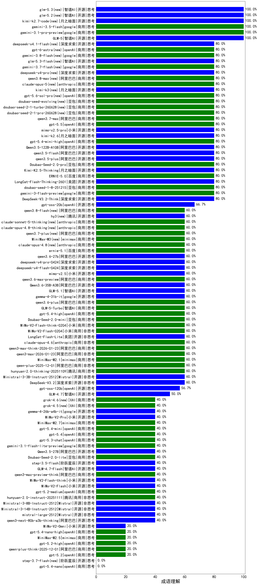

|类别|机构|大模型|【成语理解】准确率|平均耗时|平均消耗token|花费/千次（元）|排名（准确率）|
|---|---|-----|-------------------|-------|-----------|-----------|-----------|
|商用|anthropic|claude-4-sonnet(new)|100.0%|40s|568|42.2|1|
|开源|智谱AI|GLM-5(new)|100.0%|72s|2637|45.4|2|
|商用|google|gemini-3.1-pro-preview(new)|100.0%|33s|1833|144.8|3|
|商用|openAI|o4-mini(new)|100.0%|12s|931|25.7|4|
|商用|anthropic|claude-4-sonnet-thinking(new)|100.0%|73s|642|50.3|5|
|商用|openAI|gpt-5-2025-08-07(new)|83.3%|227s|429|20.8|6|
|商用|豆包|doubao-seed-1-6-lite-251015(new)|83.3%|58s|739|1.4|7|
|商用|小米|mimo-v2.5-pro(new)|80.0%|43s|2407|44.9|8|
|开源|美团|LongCat-Flash-Thinking-2601(new)|80.0%|325s|3804|0.0|9|
|商用|豆包|doubao-seed-1-8-251215(new)|80.0%|38s|862|5.5|10|
|商用|google|gemini-3-flash-preview(new)|80.0%|105s|2085|41.6|11|
|商用|阿里巴巴|qwen3-max-2025-09-23(new)|80.0%|197s|991|20.9|12|
|开源|深度求索|DeepSeek-V3.2-Think(new)|80.0%|199s|1592|4.6|13|
|商用|阿里巴巴|qwen3-max-preview(new)|80.0%|343s|589|11.0|14|
|商用|anthropic|claude-sonnet-4.5-thinking(new)|80.0%|22s|1388|128.9|15|
|商用|豆包|doubao-seed-1-6-251015(new)|80.0%|14s|696|4.4|16|
|开源|深度求索|DeepSeek-V3.1-Think(new)|80.0%|45s|1148|12.7|17|
|商用|百度|ERNIE-5.0(new)|80.0%|120s|2463|56.6|18|
|开源|月之暗面|Kimi-K2.5-Thinking(new)|80.0%|245s|1614|31.7|19|
|开源|阿里巴巴|qwen3-235b-a22b-thinking-2507(new)|80.0%|80s|2130|32.1|20|
|商用|豆包|Doubao-Seed-2.0-pro(new)|80.0%|172s|874|11.6|21|
|开源|月之暗面|kimi-k2.6(new)|80.0%|127s|1862|47.6|22|
|商用|openAI|gpt-5.4-mini-high(new)|80.0%|29s|1374|38.9|23|
|开源|阿里巴巴|Qwen3.5-122B-A10B(new)|80.0%|143s|3147|19.3|24|
|开源|阿里巴巴|qwen3.5-plus(new)|80.0%|47s|3987|18.6|25|
|开源|阿里巴巴|qwen3.5-flash(new)|80.0%|229s|3194|6.1|26|
|商用|google|gemini-2.5-pro(new)|80.0%|221s|1804|121.0|27|
|开源|深度求索|DeepSeek-R1-0528(new)|76.7%|114s|1682|25.3|28|
|开源|阿里巴巴|qwen3-235b-a22b-instruct-2507(new)|76.7%|201s|738|5.0|29|
|商用|腾讯|hunyuan-turbos-20250926(new)|76.7%|14s|671|1.1|30|
|开源|深度求索|DeepSeek-V3.1(new)|76.7%|20s|470|4.5|31|
|商用|google|gemini-2.5-flash(new)|73.3%|20s|1660|27.6|32|
|开源|阿里巴巴|Qwen3-32B-nothink(new)|73.3%|357s|588|1.9|33|
|商用|openAI|gpt-5-mini-2025-08-07(new)|73.3%|250s|897|10.9|34|
|商用|腾讯|hunyuan-t1-20250711(new)|73.3%|271s|1277|4.6|35|
|开源|豆包|Seed-OSS-36B-Instruct(new)|73.3%|407s|1140|4.2|36|
|开源|阿里巴巴|Qwen3-30B-A3B-Thinking-2507(new)|70.0%|413s|2437|6.5|37|
|开源|阿里巴巴|qwen3-next-80b-a3b-instruct(new)|70.0%|319s|823|2.7|38|
|商用|阿里巴巴|qwen-flash-think-2025-07-28(new)|70.0%|30s|2237|3.1|39|
|商用|百川智能|Baichuan4-Turbo(new)|66.7%|/|/|/|40|
|商用|百度|ERNIE-X1-Turbo-32K(new)|66.7%|357s|798|2.8|41|
|开源|openAI|gpt-oss-20b(new)|66.7%|339s|1377|1.4|42|
|商用|google|gemini-2.5-flash-lite(new)|66.7%|190s|2474|6.8|43|
|商用|百度|ERNIE-4.5-Turbo-32K(new)|66.7%|14s|432|1.1|44|
|开源|阿里巴巴|Qwen3-8B-nothink(new)|66.7%|39s|652|0.0|45|
|开源|阿里巴巴|Qwen3-4B(new)|66.7%|100s|1446|3.9|46|
|商用|阿里巴巴|qwen-turbo-think-2025-07-15(new)|63.3%|1261s|1835|5.0|47|
|商用|openAI|gpt-5-nano-2025-08-07(new)|63.3%|246s|1696|4.5|48|
|开源|智谱AI|GLM-4.5-Air(new)|63.3%|268s|1939|10.6|49|
|商用|阿里巴巴|qwen3-max-think-2026-01-23(new)|60.0%|116s|3199|30.8|50|
|商用|anthropic|claude-opus-4.6(new)|60.0%|7s|434|44.5|51|
|开源|阿里巴巴|Qwen3-14B-nothink(new)|60.0%|236s|645|1.1|52|
|商用|阿里巴巴|qwen3-max-2026-01-23(new)|60.0%|211s|779|6.6|53|
|商用|小米|MiMo-V2-Flash-0204(new)|60.0%|509s|609|1.0|54|
|商用|minimax|MiniMax-M2.1(new)|60.0%|110s|2337|18.5|55|
|商用|阿里巴巴|qwen-plus-2025-12-01(new)|60.0%|37s|1482|2.8|56|
|开源|美团|LongCat-Flash-Lite(new)|60.0%|207s|702|0.0|57|
|商用|豆包|Doubao-Seed-2.0-mini(new)|60.0%|77s|1897|3.5|58|
|商用|小米|MiMo-V2-Flash-think-0204(new)|60.0%|575s|3395|6.9|59|
|开源|Mistral|Ministral-3-3B-Instruct-2512(new)|60.0%|2s|621|0.4|60|
|商用|openAI|gpt-5.4-high(new)|60.0%|15s|867|76.2|61|
|商用|智谱AI|GLM-5-Turbo(new)|60.0%|28s|1736|35.7|62|
|商用|阿里巴巴|qwen3.6-plus(new)|60.0%|37s|2071|23.4|63|
|开源|google|gemma-4-31b-it(new)|60.0%|99s|598|1.4|64|
|开源|智谱AI|GLM-5.1(new)|60.0%|198s|1852|41.8|65|
|开源|阿里巴巴|Qwen3.6-35B-A3B(new)|60.0%|21s|2447|25.1|66|
|商用|阿里巴巴|qwen3.6-max-preview(new)|60.0%|82s|2690|138.7|67|
|商用|小米|mimo-v2.5(new)|60.0%|29s|2072|24.6|68|
|商用|腾讯|hunyuan-2.0-thinking-20251109(new)|60.0%|14s|1436|5.3|69|
|开源|深度求索|DeepSeek-V3.2(new)|60.0%|44s|371|1.0|70|
|商用|openAI|gpt-5.1-high(new)|60.0%|168s|1520|97.4|71|
|开源|月之暗面|kimi-k2-0905(new)|60.0%|44s|330|3.4|72|
|商用|anthropic|claude-opus-4.5(new)|60.0%|9s|639|81.7|73|
|商用|百度|ERNIE-5.0-Thinking-Preview(new)|60.0%|64s|1000|21.5|74|
|商用|百度|ERNIE-X1.1-Preview(new)|60.0%|90s|1062|3.8|75|
|商用|anthropic|claude-sonnet-4.5(new)|60.0%|15s|596|45.2|76|
|商用|XAI|grok-4-1-fast-reasoning(new)|60.0%|93s|1650|5.2|77|
|商用|openAI|gpt-5.1(new)|60.0%|250s|347|14.2|78|
|开源|月之暗面|Kimi-K2-Thinking(new)|60.0%|108s|1487|22.2|79|
|商用|智谱AI|GLM-4.5-Flash(new)|56.7%|52s|1790|0.0|80|
|开源|openAI|gpt-oss-120b(new)|56.7%|20s|718|1.8|81|
|开源|阿里巴巴|Qwen3-30B-A3B-Instruct-2507(new)|56.7%|24s|811|2.0|82|
|开源|meta|Llama-4-Scout-17B-16E-Instruct(new)|56.7%|11s|698|1.3|83|
|商用|阿里巴巴|qwen-turbo-2025-07-15(new)|56.7%|319s|474|0.2|84|
|开源|阿里巴巴|Qwen3-8B(new)|56.7%|66s|1798|0.0|85|
|商用|阿里巴巴|qwen-flash-2025-07-28(new)|53.3%|19s|782|1.0|86|
|开源|阿里巴巴|Qwen3-4B-nothink(new)|50.0%|262s|718|1.7|87|
|开源|智谱AI|GLM-4.7(new)|50.0%|124s|4911|67.1|88|
|开源|智谱AI|GLM-4-9B-0414(new)|50.0%|11s|488|0|89|
|开源|阿里巴巴|Qwen3-32B(new)|44.4%|135s|1413|5.2|90|
|开源|阿里巴巴|Qwen3-14B(new)|44.4%|151s|2271|4.3|91|
|开源|智谱AI|GLM-4.5-Air-nothink(new)|43.3%|240s|718|3.5|92|
|商用|智谱AI|GLM-4.5-Flash-nothink(new)|43.3%|19s|715|0.0|93|
|商用|openAI|gpt-5.4-mini(new)|40.0%|111s|316|5.5|94|
|商用|openAI|gpt-5.4(new)|40.0%|5s|391|26.4|95|
|商用|minimax|MiniMax-M2.7(new)|40.0%|59s|2476|19.7|96|
|商用|小米|MiMo-V2-Pro(new)|40.0%|54s|1418|24.2|97|
|商用|anthropic|claude-haiku-4.5(new)|40.0%|16s|703|18.6|98|
|商用|openAI|gpt-5.3-chat(new)|40.0%|59s|598|44.2|99|
|商用|openAI|gpt-5.1-medium(new)|40.0%|173s|1241|77.6|100|
|开源|google|gemma-4-26b-a4b-it(new)|40.0%|67s|652|1.5|101|
|商用|google|gemini-3.1-flash-lite-preview(new)|40.0%|40s|533|4.2|102|
|商用|腾讯|hunyuan-2.0-instruct-20251111(new)|40.0%|9s|517|0.8|103|
|商用|豆包|Doubao-Seed-2.0-lite(new)|40.0%|246s|1161|3.6|104|
|开源|阿里巴巴|Qwen3.5-27B(new)|40.0%|426s|4508|21.0|105|
|开源|智谱AI|GLM-4.7-Flash(new)|40.0%|3043s|15201|0.0|106|
|开源|Mistral|Ministral-3-14B-Instruct-2512(new)|40.0%|47s|6136|8.7|107|
|商用|openAI|gpt-5.2-medium(new)|40.0%|11s|615|46.5|108|
|开源|Mistral|mistral-large-2512(new)|40.0%|12s|515|4.1|109|
|开源|小米|MiMo-V2-Flash(new)|40.0%|11s|429|0.0|110|
|开源|小米|MiMo-V2-Flash-think(new)|40.0%|38s|2902|0.0|111|
|商用|XAI|grok-4-1-fast-non-reasoning(new)|40.0%|79s|609|1.5|112|
|开源|阿里巴巴|qwen3-next-80b-a3b-thinking(new)|40.0%|201s|3936|15.3|113|
|开源|阶跃星辰|step-3.5-flash(new)|40.0%|25s|3438|7.0|114|
|开源|Mistral|Ministral-3-8B-Instruct-2512(new)|40.0%|3s|586|0.6|115|
|商用|阿里巴巴|qwen3-max-preview-think(new)|40.0%|213s|2524|57.7|116|
|商用|openAI|gpt-5.4-nano-high(new)|20.0%|11s|1025|7.7|117|
|商用|openAI|gpt-5-nano-high(new)|20.0%|90s|5986|16.9|118|
|商用|小米|MiMo-V2-Omni(new)|20.0%|23s|2262|27.2|119|
|商用|openAI|gpt-5-mini-high(new)|20.0%|707s|2935|40.4|120|
|商用|anthropic|claude-haiku-4.5-thinking(new)|20.0%|49s|4700|162.6|121|
|商用|minimax|MiniMax-M2.5(new)|20.0%|44s|2041|16.0|122|
|商用|openAI|gpt-5.2-high(new)|20.0%|21s|1038|88.5|123|
|商用|阿里巴巴|qwen-plus-think-2025-12-01(new)|20.0%|73s|3610|27.7|124|
|商用|openAI|gpt-5.2(new)|20.0%|4s|282|13.4|125|
|商用|openAI|gpt-5.4-nano(new)|0.0%|46s|250|1.0|126|

