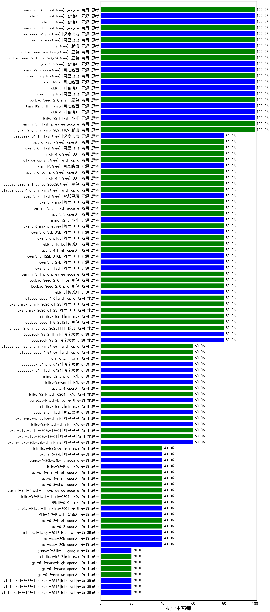

|类别|机构|大模型|【执业中药师】准确率|平均耗时|平均消耗token|花费/千次（元）|排名（准确率）|
|---|---|-----|-------------------|-------|-----------|-----------|-----------|
|商用|阿里巴巴|qwen3.7-plus(new)|100.0%|17s|892|6.8|1|
|开源|小米|MiMo-V2-Flash|100.0%|127s|399|0.0|2|
|商用|豆包|doubao-seed-1-6-251015|100.0%|16s|673|4.8|3|
|商用|anthropic|claude-opus-4.5|100.0%|9s|572|90.7|4|
|开源|月之暗面|kimi-k2.6(new)|100.0%|183s|2599|69.0|5|
|商用|豆包|Doubao-Seed-2.0-mini|100.0%|94s|2075|4.0|6|
|开源|阿里巴巴|qwen3.5-plus|100.0%|45s|3139|14.8|7|
|开源|智谱AI|GLM-5.1(new)|100.0%|140s|1163|26.9|8|
|开源|月之暗面|Kimi-K2.5-Thinking|100.0%|417s|2018|41.4|9|
|开源|智谱AI|GLM-4.7|100.0%|83s|3625|50.1|10|
|商用|腾讯|hunyuan-2.0-thinking-20251109|100.0%|8s|660|2.5|11|
|商用|google|gemini-3-flash-preview|100.0%|86s|900|18.2|12|
|商用|百度|ERNIE-4.5-Turbo-32K|90.0%|22s|536|1.6|13|
|商用|百度|ERNIE-X1-Turbo-32K|90.0%|288s|2551|10.0|14|
|商用|阿里巴巴|qwen3-max-2026-01-23|80.0%|10s|359|3.1|15|
|商用|minimax|MiniMax-M2.1|80.0%|136s|1580|12.7|16|
|开源|深度求索|DeepSeek-V3.2-Think|80.0%|105s|879|2.6|17|
|商用|豆包|doubao-seed-1-8-251215|80.0%|20s|556|3.8|18|
|商用|腾讯|hunyuan-2.0-instruct-20251111|80.0%|3s|366|0.6|19|
|开源|深度求索|DeepSeek-V3.2|80.0%|9s|302|0.9|20|
|商用|阿里巴巴|qwen3-max-2025-09-23|80.0%|15s|373|7.9|21|
|商用|百度|ERNIE-5.0-Thinking-Preview|80.0%|234s|1881|44.3|22|
|商用|百度|ERNIE-X1.1-Preview|80.0%|133s|816|3.1|23|
|开源|月之暗面|kimi-k2-0905|80.0%|94s|279|3.6|24|
|商用|阿里巴巴|qwen3-max-think-2026-01-23|80.0%|287s|2049|20.0|25|
|商用|豆包|Doubao-Seed-2.0-lite|80.0%|224s|1029|3.4|26|
|商用|anthropic|claude-opus-4.6|80.0%|23s|522|80.4|27|
|商用|阿里巴巴|qwen3.6-plus|80.0%|44s|1515|17.6|28|
|商用|阿里巴巴|qwen3.7-max(new)|80.0%|18s|857|29.4|29|
|商用|google|gemini-3.5-flash(new)|80.0%|9s|1515|92.6|30|
|商用|openAI|gpt-5.5(new)|80.0%|19s|423|77.4|31|
|开源|小米|mimo-v2.5(new)|80.0%|16s|947|9.9|32|
|商用|阿里巴巴|qwen3.6-max-preview(new)|80.0%|54s|1534|80.1|33|
|开源|阿里巴巴|Qwen3.6-35B-A3B(new)|80.0%|113s|1661|17.4|34|
|商用|智谱AI|GLM-5-Turbo|80.0%|92s|1375|29.3|35|
|开源|智谱AI|GLM-5|80.0%|97s|2704|47.9|36|
|商用|openAI|gpt-5.4-high|80.0%|21s|1046|104.1|37|
|开源|阿里巴巴|Qwen3.5-122B-A10B|80.0%|191s|3543|22.3|38|
|开源|阿里巴巴|Qwen3.5-27B|80.0%|416s|4430|21.0|39|
|开源|阿里巴巴|qwen3.5-flash|80.0%|209s|2805|5.5|40|
|商用|google|gemini-3.1-pro-preview|80.0%|49s|1619|134.1|41|
|商用|豆包|Doubao-Seed-2.0-pro|80.0%|371s|1625|24.8|42|
|商用|豆包|doubao-seed-1-6-lite-251015|80.0%|41s|892|2.0|43|
|商用|百川智能|Baichuan4-Turbo|80.0%|/|/|/|44|
|商用|腾讯|hunyuan-turbos-20250926|80.0%|9s|416|0.7|45|
|开源|豆包|Seed-OSS-36B-Instruct|80.0%|117s|1630|6.4|46|
|开源|阿里巴巴|qwen3-next-80b-a3b-instruct|80.0%|10s|374|1.3|47|
|开源|阿里巴巴|qwen3-235b-a22b-instruct-2507|80.0%|12s|408|2.9|48|
|商用|阿里巴巴|qwen3-max-preview|80.0%|9s|373|7.9|49|
|开源|深度求索|DeepSeek-R1-0528|80.0%|228s|1820|28.4|50|
|开源|深度求索|DeepSeek-V3.1-Think|80.0%|57s|1060|12.3|51|
|商用|anthropic|claude-4-sonnet|70.0%|46s|521|47.8|52|
|开源|阿里巴巴|Qwen3-32B|70.0%|27s|959|3.6|53|
|开源|阿里巴巴|Qwen3-14B|65.0%|30s|1892|3.7|54|
|商用|google|gemini-2.5-flash|65.0%|11s|1693|29.6|55|
|商用|google|gemini-2.5-pro|65.0%|42s|2112|149.0|56|
|开源|深度求索|deepseek-v4-flash(new)|60.0%|98s|2800|5.5|57|
|开源|阿里巴巴|qwen3-235b-a22b-thinking-2507|60.0%|126s|2281|44.6|58|
|商用|阿里巴巴|qwen3-max-preview-think|60.0%|250s|3519|83.4|59|
|开源|智谱AI|GLM-4.5-Air-nothink|60.0%|15s|908|5.1|60|
|开源|阿里巴巴|Qwen3-30B-A3B-Thinking-2507|60.0%|59s|2357|6.4|61|
|开源|阿里巴巴|Qwen3-30B-A3B-Instruct-2507|60.0%|3s|366|1.0|62|
|商用|anthropic|claude-opus-4.8(new)|60.0%|8s|451|68.2|63|
|商用|minimax|MiniMax-M2.5|60.0%|33s|1545|12.4|64|
|开源|美团|LongCat-Flash-Lite|60.0%|121s|537|0.0|65|
|商用|小米|MiMo-V2-Flash-0204|60.0%|142s|359|0.6|66|
|商用|openAI|gpt-5.4|60.0%|15s|198|15.1|67|
|商用|腾讯|hunyuan-t1-20250711|60.0%|22s|1252|4.7|68|
|开源|小米|mimo-v2.5-pro(new)|60.0%|35s|1945|36.6|69|
|开源|小米|MiMo-V2-Flash-think|60.0%|139s|1644|0.0|70|
|开源|小米|MiMo-V2-Omni|60.0%|35s|2300|28.8|71|
|商用|anthropic|claude-4-sonnet-thinking|60.0%|7s|466|43.9|72|
|商用|百度|ernie-5.1(new)|60.0%|25s|1002|17.3|73|
|开源|阿里巴巴|Qwen3-8B|60.0%|62s|5766|0.0|74|
|开源|深度求索|deepseek-v4-pro(new)|60.0%|47s|701|16.2|75|
|商用|智谱AI|GLM-4.5-Flash-nothink|60.0%|16s|872|0.0|76|
|开源|阶跃星辰|step-3.5-flash|60.0%|15s|1379|2.8|77|
|商用|anthropic|claude-haiku-4.5-thinking|60.0%|35s|1730|59.1|78|
|商用|anthropic|claude-sonnet-4.5-thinking|60.0%|23s|1472|150.7|79|
|开源|阿里巴巴|qwen3-next-80b-a3b-thinking|60.0%|149s|2435|9.6|80|
|商用|阿里巴巴|qwen-turbo-think-2025-07-15|60.0%|/|1746|5.1|81|
|商用|阿里巴巴|qwen-plus-think-2025-12-01|60.0%|63s|2910|22.9|82|
|商用|openAI|gpt-5.1-high|60.0%|155s|1316|89.4|83|
|商用|XAI|grok-4-1-fast-reasoning|60.0%|92s|968|3.0|84|
|商用|阿里巴巴|qwen-plus-2025-12-01|60.0%|21s|724|1.4|85|
|商用|阿里巴巴|qwen-flash-think-2025-07-28|60.0%|20s|1820|2.6|86|
|开源|阿里巴巴|Qwen3-4B|45.0%|31s|2716|8.0|87|
|开源|深度求索|DeepSeek-V3.1|40.0%|29s|534|6.0|88|
|商用|阿里巴巴|qwen-turbo-2025-07-15|40.0%|5s|296|0.2|89|
|商用|google|gemini-3.1-flash-lite-preview|40.0%|2s|253|2.2|90|
|商用|openAI|gpt-5-2025-08-07|40.0%|24s|218|12.0|91|
|商用|openAI|gpt-5.3-chat|40.0%|6s|405|34.0|92|
|开源|阿里巴巴|qwen3.6-27b(new)|40.0%|24s|1498|26.1|93|
|商用|openAI|gpt-5.4-mini|40.0%|8s|172|3.7|94|
|商用|openAI|gpt-5.4-mini-high|40.0%|57s|3480|107.9|95|
|开源|阿里巴巴|Qwen3-4B-nothink|40.0%|13s|342|0.9|96|
|开源|小米|MiMo-V2-Pro|40.0%|136s|1024|17.3|97|
|开源|google|gemma-4-26b-a4b-it|40.0%|35s|486|1.2|98|
|开源|Mistral|mistral-large-2512|40.0%|9s|358|3.3|99|
|开源|阿里巴巴|Qwen3-8B-nothink|40.0%|29s|541|0.0|100|
|开源|月之暗面|Kimi-K2-Thinking|40.0%|161s|1834|28.7|101|
|开源|阿里巴巴|Qwen3-14B-nothink|40.0%|12s|514|0.9|102|
|开源|openAI|gpt-oss-20b|40.0%|15s|1268|1.4|103|
|商用|minimax|MiniMax-M3(new)|40.0%|15s|470|5.1|104|
|开源|openAI|gpt-oss-120b|40.0%|3s|721|2.1|105|
|商用|openAI|gpt-5.2-high|40.0%|16s|640|57.9|106|
|开源|智谱AI|GLM-4.7-Flash|40.0%|1496s|1544|0.0|107|
|开源|美团|LongCat-Flash-Thinking-2601|40.0%|112s|2986|0.0|108|
|商用|百度|ERNIE-5.0|40.0%|108s|2504|59.2|109|
|商用|openAI|gpt-5.2|40.0%|5s|144|8.7|110|
|商用|anthropic|claude-sonnet-4.5|40.0%|9s|525|50.3|111|
|商用|阿里巴巴|qwen-flash-2025-07-28|40.0%|6s|386|0.5|112|
|商用|智谱AI|GLM-4.5-Flash|40.0%|26s|1398|0.0|113|
|开源|meta|Llama-4-Scout-17B-16E-Instruct|40.0%|11s|479|0.9|114|
|商用|openAI|gpt-5.1-medium|40.0%|158s|598|38.4|115|
|商用|小米|MiMo-V2-Flash-think-0204|40.0%|954s|1732|3.5|116|
|开源|阿里巴巴|Qwen3-32B-nothink|40.0%|26s|507|1.8|117|
|开源|智谱AI|GLM-4-9B-0414|25.0%|8s|417|0|118|
|商用|anthropic|claude-haiku-4.5|20.0%|12s|542|17.0|119|
|商用|XAI|grok-4-1-fast-non-reasoning|20.0%|4s|510|1.3|120|
|商用|openAI|gpt-5.1|20.0%|92s|142|6.0|121|
|商用|openAI|o4-mini|20.0%|39s|1301|39.7|122|
|开源|Mistral|Ministral-3-8B-Instruct-2512|20.0%|4s|493|0.5|123|
|开源|google|gemma-4-31b-it|20.0%|106s|430|1.1|124|
|商用|google|gemini-2.5-flash-lite|20.0%|2s|332|0.8|125|
|商用|minimax|MiniMax-M2.7|20.0%|32s|1256|10.0|126|
|商用|openAI|gpt-5.4-nano-high|20.0%|14s|582|4.6|127|
|商用|openAI|gpt-5.4-nano|20.0%|10s|176|1.1|128|
|商用|openAI|gpt-5-mini-high|20.0%|411s|2450|34.7|129|
|商用|openAI|gpt-5-nano-high|20.0%|736s|5647|16.2|130|
|开源|Mistral|Ministral-3-14B-Instruct-2512|20.0%|8s|409|0.6|131|
|开源|Mistral|Ministral-3-3B-Instruct-2512|20.0%|4s|958|0.7|132|
|开源|智谱AI|GLM-4.5-Air|20.0%|28s|1373|7.9|133|
|商用|openAI|gpt-5-nano-2025-08-07|20.0%|19s|2095|5.9|134|
|商用|openAI|gpt-5.2-medium|20.0%|15s|614|55.4|135|
|商用|openAI|gpt-5-mini-2025-08-07|0.0%|46s|1009|13.8|136|

